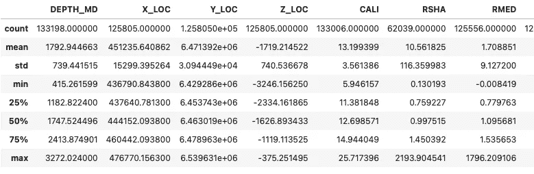
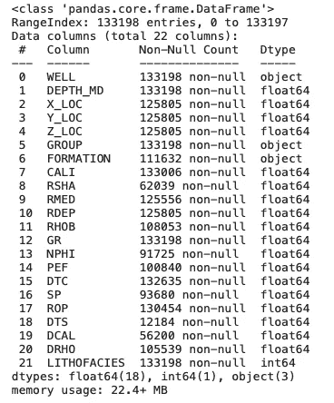
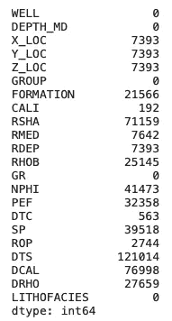
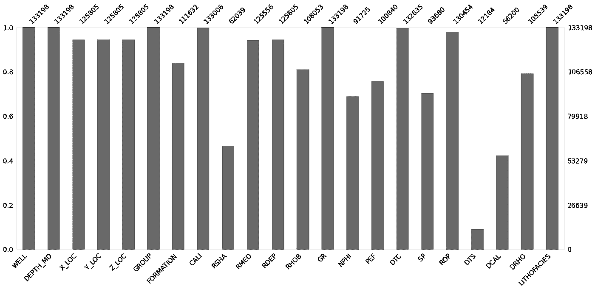
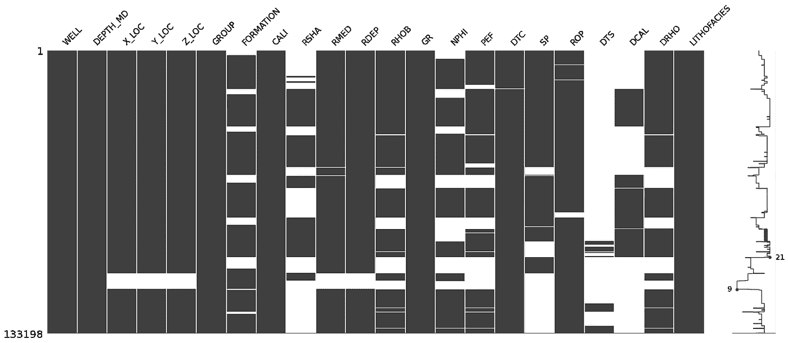
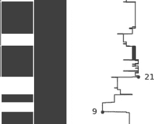
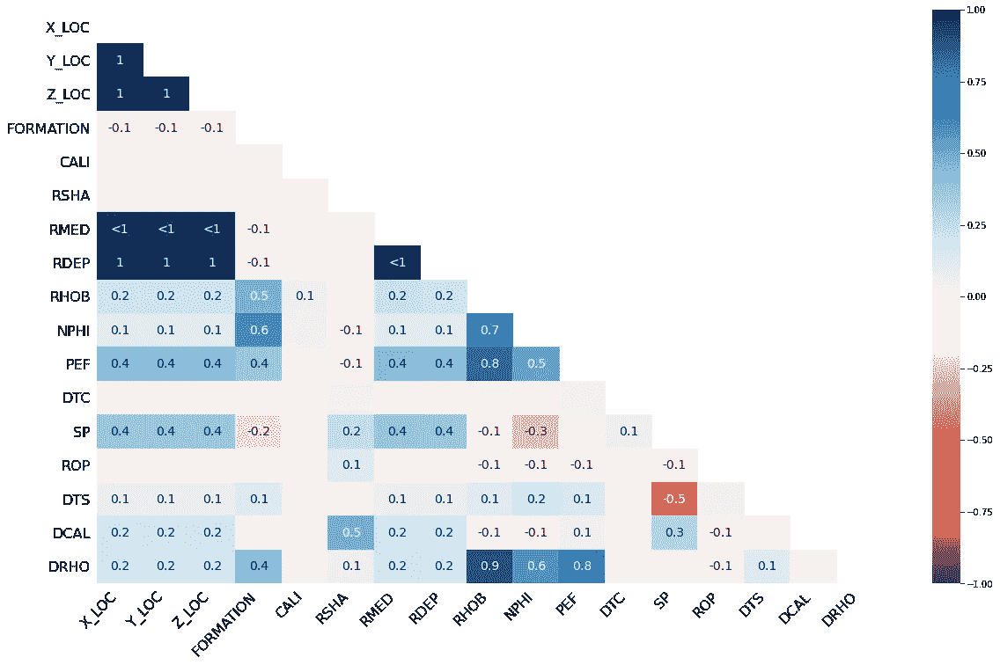
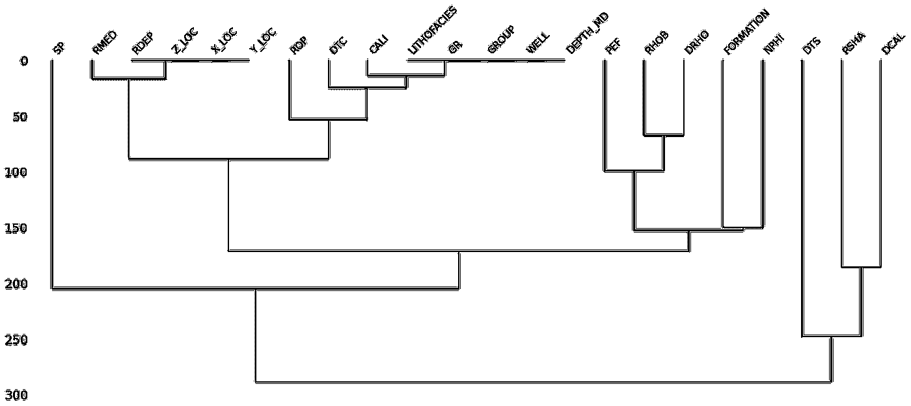

# 在机器学习之前使用缺失数据 Python 库识别和可视化缺失数据

> 原文：<https://towardsdatascience.com/using-the-missingno-python-library-to-identify-and-visualise-missing-data-prior-to-machine-learning-34c8c5b5f009?source=collection_archive---------4----------------------->

## 使用岩石物理测井测量的例子


蒂姆·莫斯霍尔德在 Unsplash[上的照片](https://unsplash.com?utm_source=medium&utm_medium=referral)

数据探索和预处理是任何数据科学或机器学习工作流中的重要步骤。在处理教程或训练数据集时，可能会出现这样的情况，即它们已被设计为易于使用，并允许所讨论的算法成功运行。然而，在现实世界中，数据是杂乱的！它可能有错误的值、不正确的标签，并且它的某些部分可能会丢失。

缺失数据可能是处理真实数据集时最常见的问题之一。数据丢失的原因有很多，包括传感器故障、数据过时、数据管理不当，甚至是人为错误。缺失数据可能是单个值、一个要素中的多个值或整个要素缺失。

重要的是，在进一步的数据分析或机器学习之前，识别并适当处理缺失的数据。许多机器学习算法无法处理缺失数据，需要删除或用新值替换(估算)存在单个缺失值的整行。

根据数据源的不同，缺失值可能以不同的方式表示。最常见的是 NaN(不是数字)，但是，其他变体可以包括“NA”、“None”、“999”、“0”、“0”、“-”。如果丢失的数据在数据帧中由 NaN 以外的东西表示，那么应该使用如下所示的`np.NaN`将其转换为 NaN。

```
df.replace('', np.NaN)
```

本文附有以下视频:

# 失踪的图书馆

Missingno 是一个优秀且简单易用的 Python 库，它提供了一系列可视化功能来理解 pandas 数据帧中缺失数据的存在和分布。这可以是柱状图、矩阵图、热图或树状图的形式。图书馆的原始出版物可以在[这里](https://joss.theoj.org/papers/10.21105/joss.00547)找到。

从这些图中，我们可以确定缺失值出现的位置、缺失的程度以及任何缺失值是否相互关联。通常，丢失的值可能被视为没有提供任何信息，但如果仔细分析，可能有一个潜在的故事。

可以使用 pip 命令安装缺少的库:

```
pip install missingno
```

# 数据集

对于本教程，我们将使用由 [Xeek 和 FORCE 2020](https://doi.org/10.5281/zenodo.4351155) 举办的机器学习竞赛的公开数据集的子集。竞赛的目的是从现有的标记数据中预测岩性。该数据集由挪威海的 118 口井组成。

该数据包含由测井工具获得的一系列电测量值。测量结果用于表征地下地质和识别合适的油气储层。

本文的数据和笔记本可以在我位于 https://github.com/andymcdgeo/missingno_tutorial[的 GitHub 仓库中找到](https://github.com/andymcdgeo/missingno_tutorial)

## 导入库和加载数据

该过程的第一步是导入库。在本文中，我们将使用 [pandas](https://pandas.pydata.org/) 加载和存储我们的数据，使用 [missingno](https://github.com/ResidentMario/missingno) 可视化数据完整性。

```
import pandas as pd
import missingno as msnodf = pd.read_csv('xeek_train_subset.csv')
```

# 熊猫快速分析

在我们使用 missingno 库之前， [pandas](https://pandas.pydata.org/) 库中有几个特性可以让我们初步了解丢失了多少数据。

第一种是使用`.describe()`方法。这将返回一个表，其中包含有关数据帧的汇总统计信息，如平均值、最大值和最小值。在表格的顶部是一个名为计数的行。在下面的示例中，我们可以看到数据帧中的每个特征都有不同的计数。这提供了并非所有值都存在的初始指示。



我们可以更进一步，使用`.info()`方法。这将返回数据帧的摘要以及非空值的计数。



从上面的例子中我们可以看到，我们对数据的状态和数据丢失的程度有了一个更简洁的总结。

我们可以使用的另一个快速方法是:

```
df.isna().sum()
```

这将返回数据帧中包含多少缺失值的摘要。`isna()`部分检测数据帧中缺失的值，并为数据帧中的每个元素返回一个布尔值。`sum()`部分对真值的数量进行求和。

该行返回以下信息。



从这个总结中，我们可以看到许多列，即 WELL、DEPTH_MD、GROUP、GR 和 LITHOFACIES 没有空值。所有其他的都有大量不同程度的缺失值。

# 使用缺失号识别缺失数据

在 missingno 库中，有四种类型的图形用于显示数据完整性:条形图、矩阵图、热图和树状图。每种方法在识别缺失数据方面都有自己的优势。

让我们依次来看一下其中的每一项。

## 条形图

条形图提供了一个简单的绘图，其中每个条形代表数据帧中的一列。条形的高度表示该列的完整程度，即有多少非空值。它可以通过调用以下命令来生成:

```
msno.bar(df)
```



在图的左侧，y 轴刻度范围从 0.0 到 1.0，其中 1.0 表示 100%的数据完整性。如果柱线小于此值，则表明该列中缺少值。

在图的右侧，标度以指数值度量。右上角代表数据帧内的最大行数。

在图的顶部，有一系列数字表示该列中非空值的总数。

在此示例中，我们可以看到许多列(DTS、DCAL 和 RSHA)有大量缺失值。其他列(如 WELL、DEPTH_MD 和 GR)是完整的，并且具有最大数量的值。

## 矩阵图

如果您正在处理与深度相关的数据或时间序列数据，矩阵图是一个很好的工具。它为每一列提供颜色填充。当数据存在时，图以灰色(或您选择的颜色)显示，当数据不存在时，图以白色显示。

可通过调用以下命令生成矩阵图:

```
msno.matrix(df)
```



缺少显示所有 dataframe 列的数据稀疏性的矩阵图。

如结果图所示，DTS、DCAL 和 RSHA 列显示了大部分缺失数据。这已在条形图中指出，但额外的好处是您可以查看丢失的数据在数据帧中的分布情况。



missingno 迷你图的特写视图。图片由作者提供。

图的右侧是一个迷你图，其范围从左侧的 0 到右侧数据框架中的总列数。上面可以看到特写。当一行的每一列都有值时，该行将位于最右边的位置。随着该行中缺失值开始增加，该行将向左移动。

## 热图

热图用于识别每个不同列之间的零相关性。换句话说，它可以用来识别每一列之间是否存在空值关系。

接近正 1 的值表示一列中存在空值与另一列中存在空值相关。

接近负 1 的值表示一列中存在空值与另一列中存在空值是反相关的。换句话说，当一列中存在空值时，另一列中存在数据值，反之亦然。

接近 0 的值表示一列中的空值与另一列中的空值之间几乎没有关系。

有很多值显示为

The heatmap can be generated by the following code:

```
msno.heatmap(df)
```



missingno heatmap plot illustrating the correlation in nullity between data columns. Image by the author.

Here we can see that the ROP column is slightly negatively correlated with the RHOB, NPHI and PEF columns, and slightly positively correlated with RSHA. If we take a look at DRHO, its absence is highly correlated with missing values in the RHOB, NPHI and PEF columns.

The heatmap approach is more suitable for smaller datasets.

## Dendrogram

The dendrogram plot provides a tree-like graph generated through hierarchical clustering and groups together columns that have strong correlations in nullity.

If a number of columns are grouped together at level zero, then the presence of nulls in one of those columns is directly related to the presence or absence of nulls in the others columns. The more separated the columns in the tree, the less likely the null values can be correlated between the columns.

The dendrogram can be generated by:

```
msno.dendrogram(df)
```



mssingno dendrogram illustrating the correlation in nullity between the well log measurements.

In the dendrogram plot above, we can see we have two distinct groups. The first is on the right side (DTS, RSHA, and DCAL) which all have a high degree of null values. The second is on the left, with the remainder of the columns which are more complete.

LITHOFACIES, GR, GROUP, WELL, and DEPTH_MD are all grouped together at zero indicating that they are complete.

RDEP, Z_LOC, X_LOC, and Y_LOC are grouped together close to zero. RMED is in the same larger branch suggesting that some of the missing values present within that column can be correlated with these four columns.

# Summary

Identifying missing prior to applying machine learning is a key component of the data quality workflow. This can be achieved using the missingno library and a series of visualisations to understand how much missing data is present, where it occurs, and how the occurrence of missing values is related between the different data columns.

***感谢阅读！***

*如果你觉得这篇文章有用，请随时查看我的其他文章，这些文章从不同的角度研究了 Python 和测井数据。你也可以在* [*GitHub*](https://github.com/andymcdgeo) *找到我在这篇文章和其他文章中使用的代码。*

如果你想联系我，你可以在 [*LinkedIn*](https://www.linkedin.com/in/andymcdonaldgeo/) *或者我的* [*网站*](http://andymcdonald.scot/) *找到我。*

*有兴趣了解更多关于 python 和测井数据或岩石物理学的知识吗？跟我上* [*中*](https://medium.com/@andymcdonaldgeo) *。*

如果你喜欢这篇文章或任何其他文章，并想表达你的谢意，欢迎你来[给我买杯咖啡](http://buymeacoffee.com/andymcdonaldgeo)

# 参考

比洛古尔(2018)。缺少 no:一个缺少的数据可视化套件。《开源软件杂志》，3 卷 22 期，547 页，[https://doi.org/10.21105/joss.00547](https://doi.org/10.21105/joss.00547)

博尔曼，彼得，奥桑德，彼得，迪里布，法哈德，曼拉尔，投降，&迪辛顿，彼得。(2020).机器学习竞赛 FORCE 2020 井测井和岩相数据集[数据集]。芝诺多。[http://doi.org/10.5281/zenodo.4351156](http://doi.org/10.5281/zenodo.4351156)