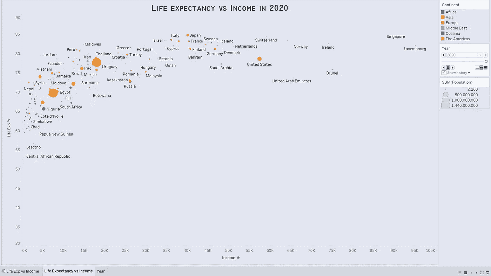
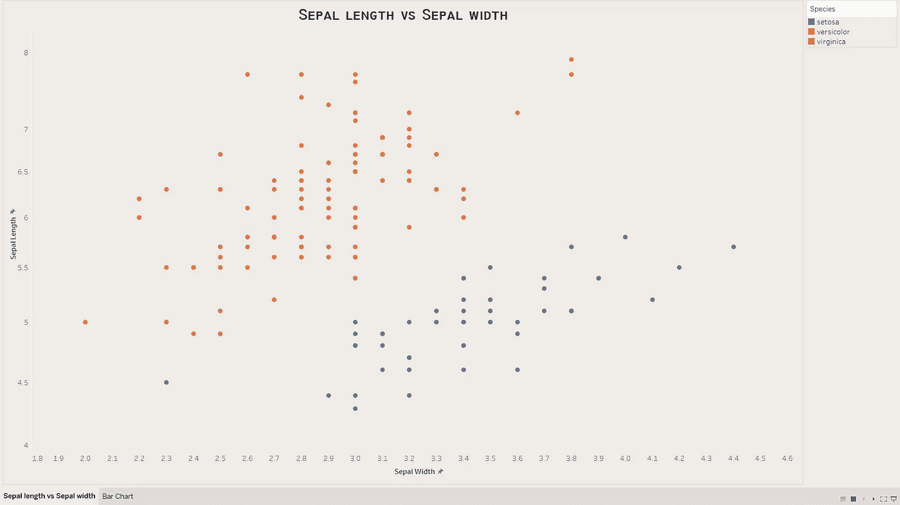
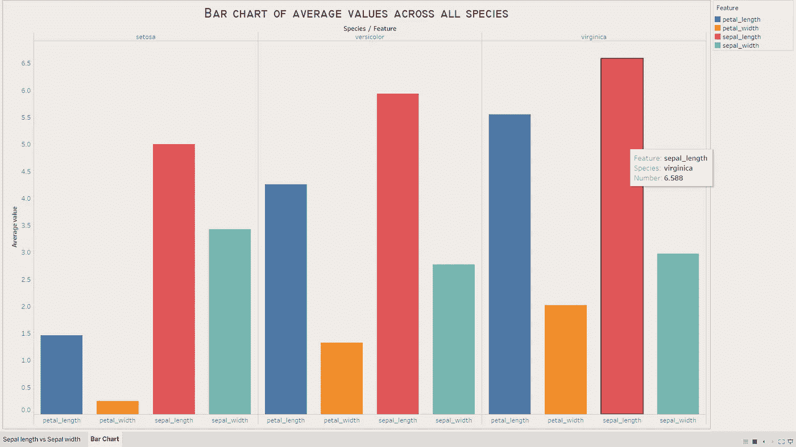
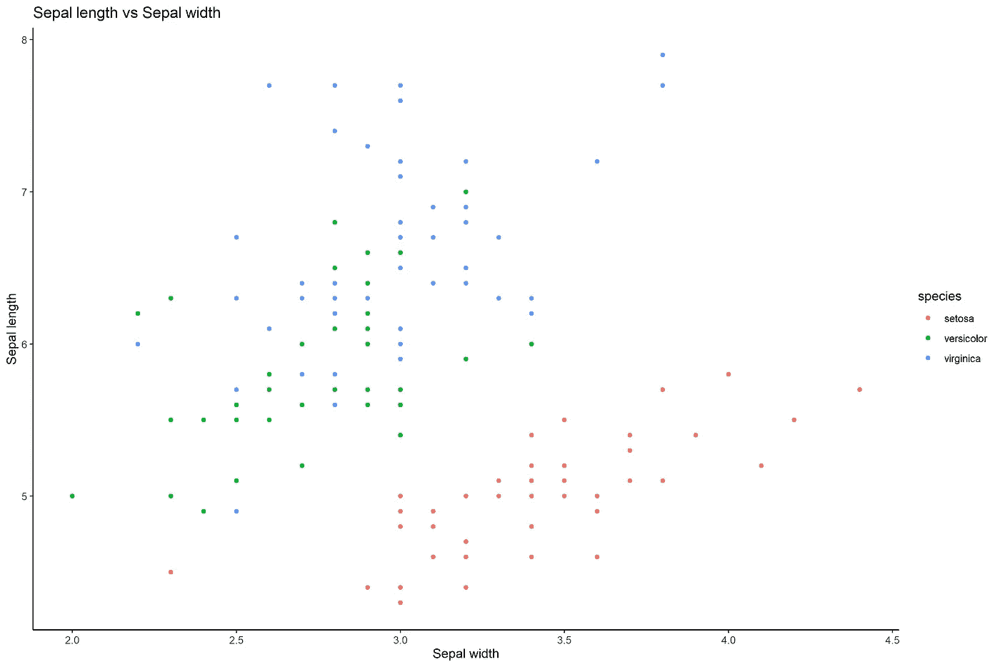
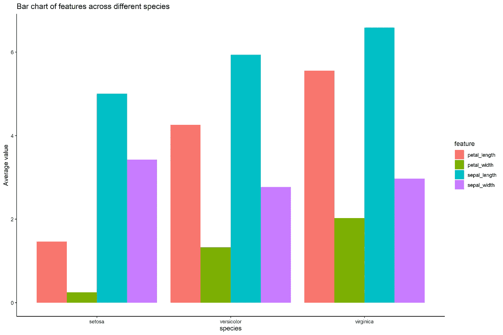
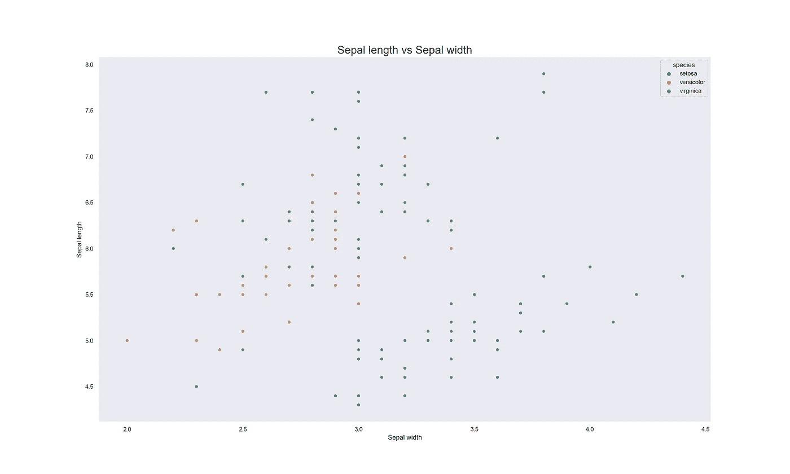
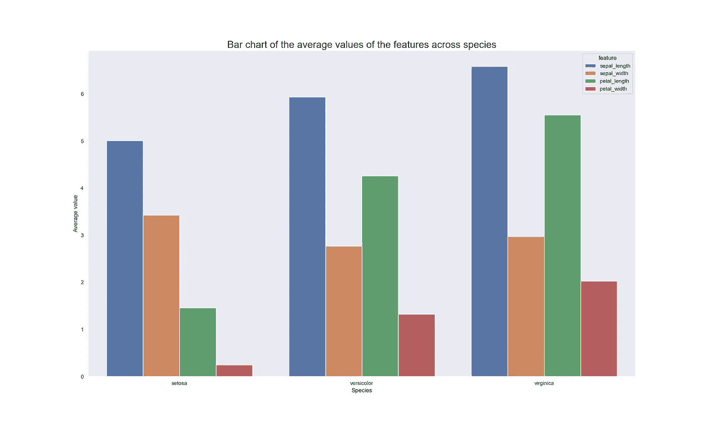

# 使用正确的工具可视化数据

> 原文：<https://towardsdatascience.com/using-the-right-tools-to-visualize-data-20c994f7392f?source=collection_archive---------8----------------------->

## 数据可视化

## Tableau、ggplot2 和 seaborn



图片来源:我

谈到可视化数据，大多数人都有一个简单明了的想法。他们用散点图来显示两个变量之间的关系。箱线图用于比较变量中不同元素的离差。饼图可以用来描绘不同的类作为一个整体对变量的贡献。时间序列图可用于显示某人或某个组织在一段时间内所取得的进展。

除了对使用什么样的图表有一个明确的想法之外，重要的是利用一个软件包来创建图表和开发图表，有多种资源可以用来实现这一点。ggplot2 via R、seaborn via python、Tableau、PowerBI、MS Excel 都是用于构建图表的一些著名平台。

本文将关注在三个包/平台上构建图表的过程:Tableau、seaborn 和 ggplot2。所使用的数据集是广泛使用的 iris 数据集。虹膜数据集有五个变量。其中四个是连续变量:花瓣长度，花瓣宽度，萼片长度和萼片宽度。最后一个是分类变量，叫做物种。它有三个等级:setosa，virginica 和 versicolor。

通过在所有三个平台上构建相同的图表，可以比较图表的质量，并决定在处理数据可视化项目时使用哪一个。生成的两个图表是:

*   比较萼片宽度和萼片长度之间关系的散点图。
*   比较不同物种四个变量平均值的条形图。

iris 数据集在 R-studio 和 Jupyter 笔记本上都是现成的。因此，它很容易被导出用于 Tableau。

# （舞台上由人扮的）静态画面

Tableau 是一个让数据可视化尽可能简单的平台。与 python 和 R 相比，它的巨大优势在于它不需要代码来加载数据集或创建图表。由于其拖放功能，它允许用户修改变量来构建图表，从而有效地向用户呈现信息。它还有其他功能，可以用来美化图表，使它们对观众有吸引力。

一个很好的生动的例子。图表是在一分半钟内完成的。

Tableau 的易用能力在上面的视频中可以见证。本·琼斯(Ben Jones)的《与 Tableau 交流数据:设计、开发和交付数据可视化》是一本可以指导初学者如何掌握使用 Tableau 的艺术的书。使用 Tableau 构建的其他图表可以在下面查看。



Tableau 如何呈现散点图



Tableau 如何呈现条形图

# ggplot2

ggplot2 是 R-studio 提供的一个非常棒的包。与 Tableau 不同，它要求用户导入一个包来构建图表。虽然它需要一些编码，但是编码的语法非常简单。用 ggplot2 构建一个简单的图表包括两个简单的步骤。

第一步是加载 tidyverse 包。ggplot2 包是 tidyverse 包提供的众多包中的一个。通过加载 tidyverse 包，用户还可以在设计图形时访问其他包的功能。加载 tidyverse 的代码可以在下面看到。

```
install.packages("tidyverse")
library(tidyverse)
```

第二步是使用编码语法生成图形。编码语法如下所示。ggplot()调用 ggplot2 包并识别要使用的数据。geom_point()表示带有点的散点图是所需的图形。通过在 geom_point()中使用 aes()命令，可以很容易地绘制出哪些变量应该出现在 x 和 y 轴上，并根据它们的种类对它们进行分组。labs()可用于为图表添加标题，并标记 x 轴和 y 轴。使用 theme_classic()将主题设置为 classic 使得用户可以使用经典主题。

如果用户对绘制不同于下面通过 ggplot2 创建的图表感兴趣，此[链接](https://www.rdocumentation.org/packages/ggplot2/versions/3.3.3)可作为用户的指南。

```
ggplot(data = df_iris) +
  geom_point(aes(x = sepal_width, y = sepal_length, color = species)) +
  labs(title = "Sepal length vs Sepal width", x = "Sepal width", y = "Sepal length") +
  theme_classic()
```



ggplot2 如何渲染散点图



ggplot2 如何渲染条形图

# 海生的

Seaborn 是 python 提供的一个包。它是对 python 提供的另一个数据可视化包 matplotlib 的改进，用于美化图形。Seaborn 的功能就像 ggplot2 一样，它要求用户加载一个包，并使用编码语法来获得所需的绘图。下面是加载 seaborn 包和其他有用的包的代码，这将使设计图表变得容易。

```
import seaborn as sns; sns.set_theme(style = "dark")
%matplotlib inline
import matplotlib.pyplot as plt
```

加载包之后，下一步是使用正确的功能来绘制图表。plt.figure()可以用来决定绘图的大小。sns.barplot()接受要放在 x 和 y 轴上的变量以及要使用的数据集。与 ggplot2 一样，在 sns.barplot()函数中对绘图的外观进行了进一步的更改。plt.title()、plt.xlabel()和 plt.ylabel()用于标注地块。

如果用户有兴趣通过 seaborn 绘制不同于下图的图表，这个[链接](https://seaborn.pydata.org/#)可以作为用户的向导。

```
plt.figure(figsize = (20,12))
sns.barplot(x = "species", y = "number", data = n_iris2, hue = "feature", palette = "deep")
plt.title("Bar chart of the average values of the features across species", fontsize = 20)
plt.xlabel("Species", fontsize = 12)
plt.ylabel("Average value", fontsize = 12)
```



seaborn 如何渲染散点图



seaborn 如何渲染条形图

## 结论

上面讨论的所有三个平台对于设计和构建图形来说都是惊人的。对于对编码不感兴趣的人来说，Tableau 是轻松生成图表的好方法。ggplot2 和 seaborn 是编码平台，为用户提供了一种控制图形外观的开放式方法。当谈到数据可视化时，您的想象力是您唯一的限制。

以下是关于数据可视化的推荐文章列表:

*   [**Tableau:释放视觉分析的力量**](/tableau-unleashing-the-power-of-visual-analytics-3376ccf0c1f8)
*   [**数据可视化是如何工作的！**](/how-data-visualization-works-12c6a4543d52)
*   [**使用 Matplotlib**](/building-bar-charts-using-matplotlib-c7cf6db3e728) 构建条形图
*   [**使用 Matplotlib**](/creating-a-basic-pie-chart-using-matplotlib-16dd3bf540b6) 创建基本饼图

感谢您的阅读！