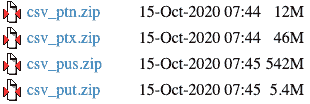
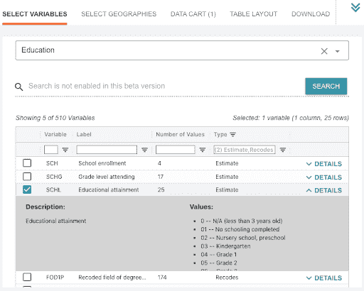
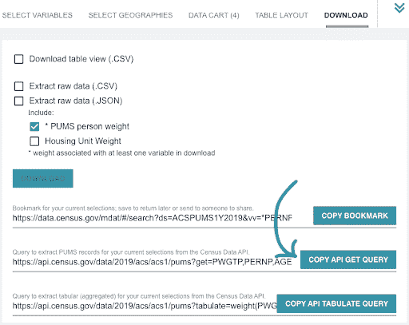
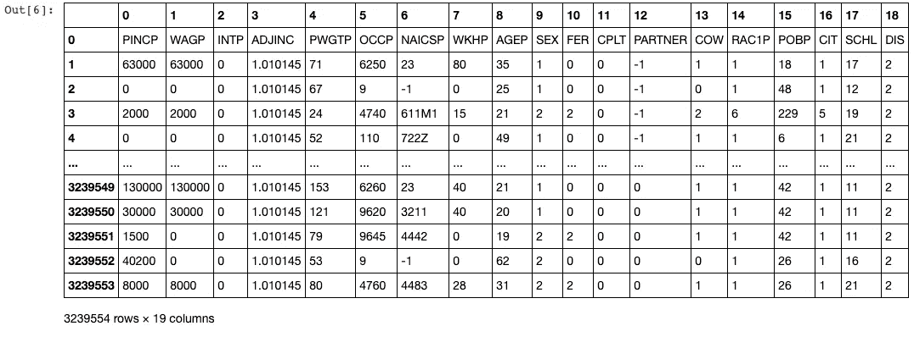
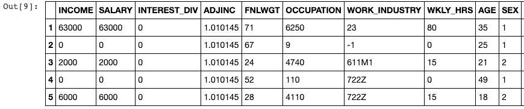
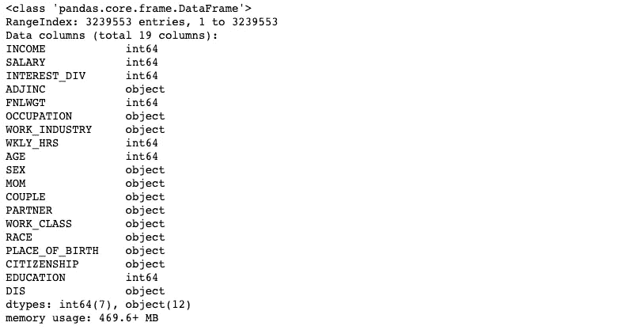

# 使用美国人口普查 API 和 PUMS 进行数据分析

> 原文：<https://towardsdatascience.com/using-the-us-census-api-for-data-analysis-a-beginners-guide-98063791785c?source=collection_archive---------31----------------------->

## 包括 Python 迷你教程的初学者指南。

马库斯·温克勒在 [Unsplash](https://unsplash.com/s/photos/magnifying?utm_source=unsplash&utm_medium=referral&utm_content=creditCopyText) 上的照片

这是熨斗学校数据科学训练营的项目周，我们正在收集美国人口普查数据！

有大约 100 万个网站、链接、资源、网络研讨会和关于人口普查数据的原始数据，你可能要花几天时间才能浏览完。你很幸运，我为你花了那么多时间，并且收集了我最喜欢的资源来帮助你开始！我的目标是使这个过程尽可能简单，这样您就可以得到有用的东西:使用一些数据！

作为一名 Python 编程新手和数据科学学生，我害怕使用 API 来创建和清理自己开发的数据集，所以我花了几天时间在互联网上寻找一个不需要使用 API 的数据集。我知道我想关注什么(边缘化和/或代表性不足的群体，谢谢你的提问)，但我正在寻找的每个包含变量的数据集对我新生的编码大脑来说都太小、太旧、太稀疏或太复杂(阅读:复杂)。

老实说，我很高兴我不能找到一个完美的，因为它让我克服了恐惧，并自学了 API。剧透:它们实际上并不是一个很难的概念。有一次我浏览了几个教程，觉得自己已经有了一些基础知识…我在观看 2020 年 3 月录制的[人口普查网络研讨会](https://www.youtube.com/watch?v=zfXohiWjzzY)时发现了这个神奇的工具。非常感谢美国癌症学会的调查统计学家阿曼达·克里梅克给了我这个金块。她深入地讲述了如何使用人口普查工具和数据，但我为你提取并浓缩了我认为最有用的资源和技巧。

长话短说，美国人口普查局已经推出了一个惊人的工具(在 2021 年出版时仍处于测试阶段，但非常有用)，以帮助用户通过 API 请求获得您想要的信息。

在这次人口普查速成班中，我为你计划了 4 件事:

*   一些关于人口普查局的基本常识，
*   如何在踏入代码之前定制自己的数据集，
*   一段快速的 **Python** 代码让你开始一些分析，并且
*   几个可点击的链接让你在你认为合适的地方加深你的知识

> 附注:本文引用的所有链接也位于页面底部，以便提供快速方便的参考。

# **我们来说说人口普查局**

美国人口普查局是一个政府机构，进行持续的调查，以收集有关美国人民和经济的数据。我喜欢这个组织的几个方面:

*   他们向公众提供无限制的数据访问(如果需要超过 500 次查询，只需使用一个 [API 键](https://www.census.gov/data/developers.html)
*   数据集惊人的全面和完整(这里没有稀疏矩阵！)
*   任何人和任何人都可以完全免费访问。

你可能会问:“你说的持续是什么意思？我以为人口普查 10 年才进行一次呢？”嗯……算是吧。当我们谈论人口普查局时，我们可以谈论两个调查:美国社区调查和十年一次的人口普查。它们都是关于美国人口的调查，但有一些不同之处:

**ACS(美国社区调查)**是“一项正在进行的关于社会、经济、住房和人口数据的全国性调查。这项调查的年度样本量为 350 万个地址，调查信息几乎全年每天都在收集。”这个样本量涵盖了大约 1%的人口。

十年一次的人口普查是一项更短、更基本的调查，每 10 年发送给美国的每个人。在 2020 年的人口普查中，只有 9 个问题，而正在进行的 ACS 有近 70 个问题。与收集全年数据的 ACS 相比，十年一次的人口普查收集美国每个人在单一时间点的数据(在普查年的 4 月 1 日进行)。作为参考，2020 年人口普查有大约 60%的美国人口参与。

# **什么是 PUMS？**

人口普查局的内部统计人员向公众提供了大量的汇总数据和有用的表格。不过，我真正想跟大家说的是 **PUMS(公用微数据样本)**。正如“微观数据”一词所暗示的，在 PUMS 发现的数据是基于个人的答复，而不是带有预定参数的汇总数据。这允许数据爱好者、控制狂和数据科学训练营的学生进行他们自己的分析，以便理解他们自己选择的变量之间的关系。

## **获取想要的数据！**

任何人都可以访问文件传输协议(FTP)网站上的 PUMS 文件，该网站提供 CSV 和 SAS 格式的数据，或者使用 data.census.gov 上的 API 调用。*(使用* [*此链接*](https://www.census.gov/programs-surveys/acs/microdata/access.html) *访问 FTP 和 data.census.gov，详情如下)*

## ***访问 FTP 站点—获取整个 dang 集合***

对于检查整个数据集而言，这是一个很好的选择，无需担心参数。使用下面的语法参考进行选择:

*   ***csv:*** 表示文件类型
*   ***p:*** 表示人口数据(与表示住房信息的“h”相对)
*   接下来的两个字符表示一个州的代码(例如***【tx】***表示德克萨斯州)，或者查找***【US】***表示整个美国的数据。

这么容易…太容易了？

使用这些文件的缺点是什么？542 MB 的 zip 文件变成了 2.28 GB 的内存，如果存储空间或计算能力不足，这并不理想。

## ***访问 data.census.gov—选择您的变量***

一个三年级学生可以使用这个网站(顺便说一下，这是一件好事)。仔细阅读 2019 年 ACS 中的 510 个变量，或者从下拉菜单中选择一个选项，查看按主题分组的小变量列表(如下图，我在“教育”中搜索变量)。我只是喜欢友好的小蓝绿色框，我可以点击它来选择我的变量，以及细节选项卡下每个变量的下拉菜单。

是不是很美？

在窗口顶部，单击“选择地理位置”以选择一个大的地理区域，或者向下钻取到县级。对于我的分析，我选择将这个选项卡选项留空，因为我想查看整个美国的数据。

> 附注:如果您正在寻找一个人口少于 65，000 的特定县，那么当[选择一个数据集](https://data.census.gov/mdat/#/)时，您将需要选择“ACS 5 年估计值”，它代表这些较小县 5 年内收集的数据，而不是 1 年的估计值。更多信息[点击这里](https://www.census.gov/data/developers/data-sets/acs-5year.html)。

在“数据车”中玩滑动和变量，或者直接跳到神奇的“下载”标签(如下图右上方)。今天，我将直接点击“复制 API 获取查询”按钮，将 URL 直接粘贴到我的项目笔记本中。

# 准备好我承诺的 Python 代码了吗？

现在你已经从 data.census.gov 复制了你的链接，我们可以使用**。get()** 方法来请求响应。您还需要运行 **response.status_code** 来检查它是否输出 200(成功)。这表示您的请求已顺利通过，没有任何错误。下面列出了其他响应代码。

> 可能的响应代码列表及其含义:

*   1xx(信息性):传达传输协议级别的信息
*   2xx(成功):客户请求被成功接受(第一次泵送)
*   3xx(重定向):客户端必须采取一些额外动作来完成它们的请求
*   4xx(客户端错误):将矛头指向客户端(检查你的代码！)
*   5xx(服务器错误):服务器对错误负责

接下来，加载并格式化您的数据，看看吧！

嗯…那很好，但是标题需要重新设置，如果能把变量改成更直观的就更好了。通过使用 **df[1:]** 并使用 **df.columns = []** 重命名列，我们可以确定我们的数据帧从哪一行开始。我们开始吧！

在你走得太远之前，一个好的做法是用 **df.info()** 检查你的数据框，检查每一列中的数据类型。人口普查数据将作为对象加载，我希望将我的几个变量转换成整数，以便进行统计分析。很快的，让我们创建一个我想更新为整数的变量列表，然后运行一个 For 循环。

非常好。现在，您已经准备好开始处理您的人口普查数据了！我希望这有助于初学者认识到使用 census API 来运行自己的统计分析是多么容易。

# **资源:**

为了让这个过程尽可能的简单，我列出了所有提到的链接和一些额外的收藏夹。

[**Data.census.gov**](https://data.census.gov/)

[**开发商普查资源**](https://www.census.gov/data/developers.html)

*   在这个页面上，你也可以请求一个 API 密匙，以防你需要 500 个以上的查询
*   加入他们的 Slack 社区——超级友好的人，非常乐于助人。阅读过去的讨论和点击张贴的链接确实帮助我获得了如何使用这个惊人的数据集的感觉。那里的人反应也超级快！虽然可能有其他方式与专家取得联系，但看起来大多数松散的问题和顾虑都会得到相当迅速的回应。

[**访问 PUMS 数据**](https://www.census.gov/programs-surveys/acs/microdata/access.html)

更多关于 [**ASC 五年数据**](https://www.census.gov/data/developers/data-sets/acs-5year.html)

[**PUMS 技术文件**](https://www.census.gov/programs-surveys/acs/technical-documentation/pums/documentation.html)——关于 ACS 上的变量列表，参见“PUMS 数据字典”。(选择。txt 或者。pdf 格式，无需下载即可一窥究竟。)

[**普查术语词汇**](https://www.census.gov/glossary/)

ACS PUMS 手册:[**了解和使用美国社区调查公共使用微数据样本文件:用户需要了解哪些数据**](https://www.census.gov/content/dam/Census/library/publications/2020/acs/acs_pums_handbook_2020.pdf)

网上研讨会(2020 年):[**美国社区调查公众使用微数据样本简介 PUMS 文件**](https://www.youtube.com/watch?v=zfXohiWjzzY)