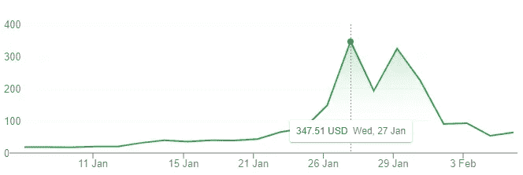
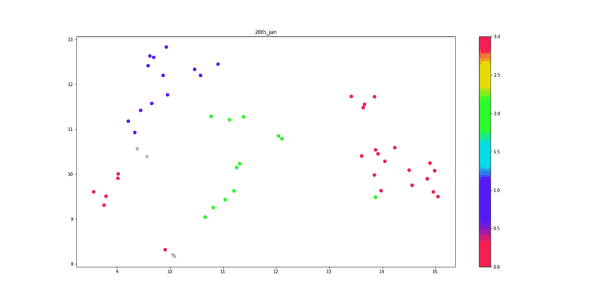
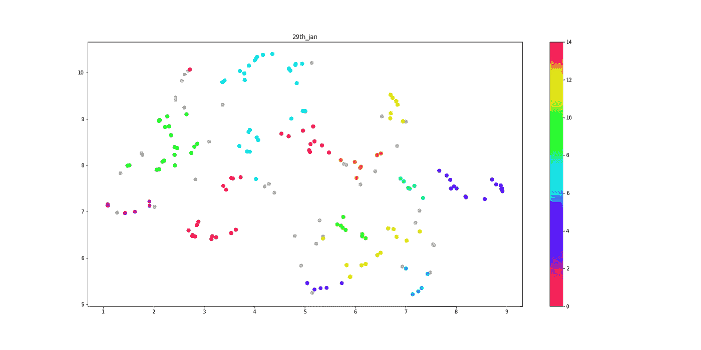
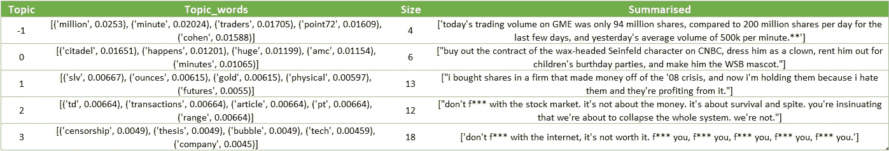
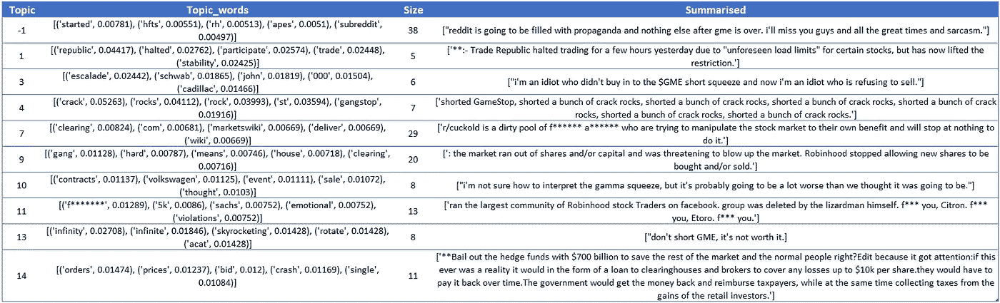

# 使用华尔街赌注子网站获得对历史股票市场趋势的见解

> 原文：<https://towardsdatascience.com/using-the-wallstreetbets-subreddit-to-gain-insights-on-historic-stock-market-trends-9e20ced0bc1d?source=collection_archive---------17----------------------->

## 自然语言理解

## 使用 BERT、HDBSCAN 和 PEGASUS 从文本中自动生成洞察

[记者王](https://unsplash.com/@sodacheese?utm_source=medium&utm_medium=referral)在 [Unsplash](https://unsplash.com?utm_source=medium&utm_medium=referral) 上拍照

# **简介**

当看历史股票市场趋势时，经常需要超越数字。如果你试图理解不寻常的事件，尤其如此。在缺乏内部信息的情况下，分析师通常会使用他们的谷歌搜索引擎，通常依靠头条新闻和媒体报道来了解不寻常的市场运动。

在这篇文章中，我的目标是在一个信息丰富的数据集上应用文本聚类和总结来自动化这个过程。我将关注 1 月 21 日晚些时候 GameStop 股价的上涨，使用华尔街赌注的 subreddit 作为我的数据源。

最终，我的目标是自动化从大量文本中产生洞见的过程。

# **语境**

对于那些不熟悉 GameStop 的人，我将提供一些简单的背景。

2021 年 1 月，GameStop 的股价在短短几天内达到了 347 美元的历史新高。第二天，股价下跌了 44%,第二天又反弹至 325 美元。这一奇怪的事件让这家鲜为人知的公司一跃成为全球新闻媒体的头条。有点像“比特币”,对金融市场不感兴趣的人突然变得非常好奇，有几天 GameStop 成了许多人闲聊的中心。

作者图片

Reddit 被认为是 1 月下旬事件的中心。1 月 29 日的 peek 活动中，明确提到 GameStop 的帖子大约有 3600 条，大约是接下来几天帖子数量的十倍。

# **数据&数据准备**

**数据**:我使用了从 [Reddit 的 WallStreetBets subreddit](https://www.reddit.com/r/wallstreetbets/) 收集的数据。subreddit 是一个论坛，会员在这里讨论股票市场交易和投资。数据集[在 Kaggle](https://www.kaggle.com/gpreda/reddit-wallstreetsbets-posts) 上公开。

**数据准备**:为了形成我的分析群体，我隔离了明确提到 GameStop 或 GME 的帖子。

有许多帖子只是图片或其他网站的链接，我从分析人群中删除了这些。我通过删除多余的空白和任何网址来清理文本。

我将我的数据分成两个池；1 月 28 日和 29 日。这与同一时期 GameStop 的股价波动大致相符。

# **方法— HDBSCAN 和 Google 的 PEGASUS 用于集群和汇总**

在高层次上，我通过将相似的帖子聚集在一起，然后对这些集群进行抽象总结来获得洞察力。

令人印象深刻的是，抽象概括可以提取一篇长文本，并生成捕捉主要思想的简短摘要，而不仅仅是复制文本的元素。基本上就是转述。

> 抽象概括:换句话说，这是什么意思？

在 Reddit 上，用户通过投票给帖子打分，根据他们是否喜欢或同意这个帖子。一个帖子的投票数越高，它在新闻源上的位置就越高。为了减少噪音和提高聚类的性能，我选择了累计占总投票数 90%的帖子。

> 在大约 55000 个帖子中，只有 13%获得了 90%的选票

我的方法背后的基本原理是试图将大量的帖子减少到最相关的。

## **HDBSCAN:带有噪声的应用程序的基于层次密度的空间聚类**

由 Campello、Moulavi 和 Sander 开发的聚类算法。HDBSCAN 是 DBSCAN 的一个更复杂的表亲，因为它结合了分层建模，使其能够识别不同密度的集群，甚至集群内的集群。

这里有一篇关于[hdb scan 机制的优秀文档，供感兴趣的人参考](https://hdbscan.readthedocs.io/en/latest/how_hdbscan_works.html)。

## **谷歌的 PEGASUS:抽象总结的转换器**

变压器是一种深度学习模型，旨在处理顺序数据，使其非常适合 NLP 和 NLU 任务。

我使用了预先训练好的 Google PEGASUS 转换器来完成摘要任务。当谈到抽象概括时，这是最先进的。

[使用 api 自己尝试文本摘要](https://huggingface.co/google/pegasus-reddit_tifu?text=The+tower+is+324+metres+%281%2C063+ft%29+tall%2C+about+the+same+height+as+an+81-storey+building%2C+and+the+tallest+structure+in+Paris.+Its+base+is+square%2C+measuring+125+metres+%28410+ft%29+on+each+side.+During+its+construction%2C+the+Eiffel+Tower+surpassed+the+Washington+Monument+to+become+the+tallest+man-made+structure+in+the+world%2C+a+title+it+held+for+41+years+until+the+Chrysler+Building+in+New+York+City+was+finished+in+1930.+It+was+the+first+structure+to+reach+a+height+of+300+metres.+Due+to+the+addition+of+a+broadcasting+aerial+at+the+top+of+the+tower+in+1957%2C+it+is+now+taller+than+the+Chrysler+Building+by+5.2+metres+%2817+ft%29.+Excluding+transmitters%2C+the+Eiffel+Tower+is+the+second+tallest+free-standing+structure+in+France+after+the+Millau+Viaduct)

如果你想了解引擎盖下的机制，这里有[的研究论文](https://arxiv.org/pdf/1912.08777.pdf)和[的代码文档](https://huggingface.co/transformers/master/model_doc/pegasus.html)。

# **实现**

## **嵌入**

模型和算法不会说英语，而是解释数字。我们在这里处理英语文本，所以第一步是转换我们的文本并创建嵌入。这些是我们文本的高维数字表示。

我使用了 BERT，因为它基于生成 512 维嵌入的单词的上下文提取不同的嵌入。

## **UMAP**

采取这一步骤是为了将我们的 512 维嵌入减少到更低维度的空间。这里可能需要做一些调整，但应该注意的是，降低维度可以提高聚类性能，但代价是信息丢失。

## **HDBSCAN**

执行 HDBSCAN 聚类。

## **绘图**

我们可以通过将它们进一步简化为二维空间并使用标准的 python 绘图库来可视化我们的集群。

作者图片:1 月 28 日 HDBSCAN 星团的 2D 图像

作者图片:1 月 29 日 HDBSCAN 星团的 2D 展示

***注—灰点与异常值有关；它们不属于任何集群。***

## **提取话题**

我尝试在主题级别实现 TF-IDF，试图直观地理解主题。主题标有一个单词和一个相应的数字，代表该单词在主题中相对于其他单词的重要性。

有关 BERT 和主题建模的更多信息，请阅读此

**注意:在这一步中，我还通过聚类**来聚合文本

## **合并主题和正文**

创建将提供给转换器的数据集。

## **跑飞马**

对文本聚类进行抽象概括。

## **把所有的东西放在一起**

从头到尾运行所有内容。**注意*数据*应该是一个包含所有你想要分析的文本的列表。**

# **自动生成的见解**

下表是 Reddit 自动生成的见解。我已经删除了脏话。

如果主题为-1，HDBSCAN 会将这些帖子视为不属于任何组的离群值。对于 1 月 29 日，我删除了返回无意义结果的摘要。这些要么是空白的，要么是隐藏的 URL，我最初无法从文本中解析出来。

*大小*是指每个集群内单个帖子的数量。

> 我不是 GameStop 或金融市场专家，所以我将把摘要的解释留给读者。

作者图片:2021 年 1 月 28 日帖子的见解

作者图片:2021 年 1 月 29 日帖子的见解

# **最终想法**

通过正确的调优、相当大的计算能力和一些耐心，我认为 BERT、HDBSCAN 和 PEGASUS 的组合展示了从大量文本中自动生成有意义摘要的前景。

可以通过增强数据处理、清理和仔细选择数据源来改进结果。调查最小摘要长度和对所生成摘要的理解之间的关系也是令人感兴趣的。

> Reddit 的数据相当混乱，但仍然很有见地

在调整 HDBSCAN 以产生更好的集群时，可以进行更多的实验。

最终，对于这样的任务，最重要的是你试图从中获得洞察力的数据源的质量。

> 俗话说，垃圾进垃圾出。

# 端到端代码

由于 GPU 的限制，我无法提供完整的端到端代码供您运行。不过，我已经创建了一个 GitHub repo 供您查看！

和往常一样，如果你能想到任何改进我所做的事情的方法，请评论。

<https://github.com/john-adeojo/Reddit_WallStreet>  

**关注我在**的链接

<https://www.linkedin.com/in/john-adeojo/> 