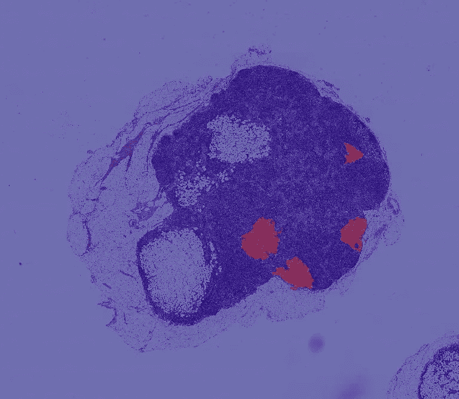
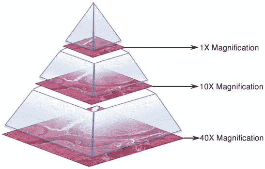
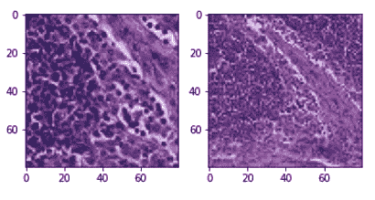
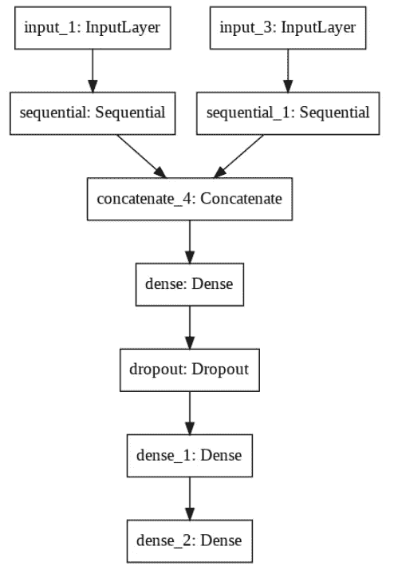
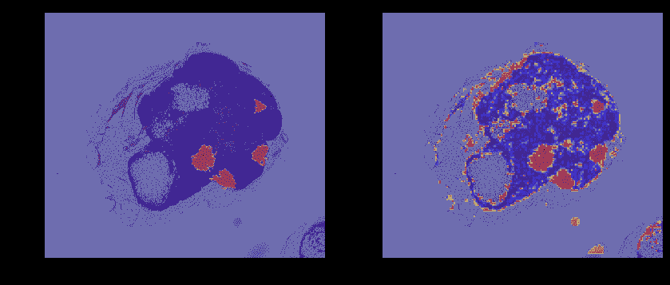
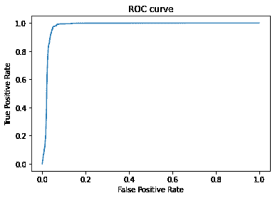

# 使用迁移学习进行乳腺癌检测

> 原文：<https://towardsdatascience.com/using-transfer-learning-for-breast-cancer-detection-2fb3785e2aa?source=collection_archive---------46----------------------->

## 具有高效微调的多尺度 Inception V3 方法

[注有癌性肿瘤细胞的组织切片](https://camelyon16.grand-challenge.org/Data)

# 介绍

> 每年，美国有超过 230，000 名乳腺癌患者取决于癌症是否转移。转移检测由病理学家检查大量的生物组织来进行。这个过程是劳动密集型的并且容易出错。[来源](https://arxiv.org/abs/1703.02442)

在这个项目中，我们旨在实现论文 [**中提出的多尺度转移分类模型，在千兆像素病理图像上检测癌症转移**](https://arxiv.org/abs/1703.02442) 。

# 资料组

我们使用[camelion-16](https://camelyon16.grand-challenge.org/Data/)多千兆像素的幻灯片数据。从主数据集中采样一组 22 个具有显著肿瘤的载玻片。每张载玻片都有一个相应的标记肿瘤区域的遮罩。我们可以访问大约 9 个放大级别。

多倍放大肿瘤图像(。tif 文件)[来源](https://camelyon16.grand-challenge.org/Data/)

每个多尺度图像以一致的坐标系一个接一个地存储，以允许用户访问任何放大倍数的任何图像片段。

我们利用 [OpenSlide](https://openslide.org/) C 库及其 Python 绑定来高效地访问千兆像素大小的压缩文件。

# 数据准备

作为生成标记的训练数据的第一步，我们使用滑动窗口方法在较高的缩放级别上滑动，并创建幻灯片片段的标记图像，稍后我们将使用这些图像进行训练和测试。

我们使用论文中的方法，定义一个中心窗口，如果中心包含至少 1 个标记为肿瘤的像素，我们将图像标记为包含肿瘤细胞。

窗口大小和中心大小分别被选择为 80 和 50。最后，为了使我们的训练数据具有多尺度，我们创建了原始图像片段的类似大小的缩小版本。缩小版本用于向分类模型提供宏观级别的上下文。我们使用**多尺度**方法生成数据，并使用两种不同的放大倍数来准备数据集。

[多尺度图像对](https://camelyon16.grand-challenge.org/Data)

# 数据扩充

我们使用了各种数据扩充技术来补充我们的训练数据，使我们的模型更加稳健。

## 正交旋转和翻转

我们引入了正交扩充来引入旋转不变性，因为载玻片可以在这些方向中的任何方向上被检查

*   随机正交旋转
*   随机水平和垂直翻转

## 颜色扰动

为了使我们的模型对光照和染料强度有鲁棒性，我们对颜色做了如下改动。

*   最大差值为 64/255 的亮度
*   最大增量为 0.25 的饱和度
*   最大差值为 0.04 的色调
*   与最大增量 0.75 形成对比

# 方法学

我们利用多塔 Inception V3 模型来利用多尺度图像进行分类。我们只对顶层进行了微调，因为这些层学习更高级的功能，并且可以通过基于我们的数据集对这些层进行微调来大大改善结果。阅读谷歌人工智能的这篇博文了解更多细节

*   **使用的架构:** Inceptionv3(多尺度)*微调图层> 150*
*   **初始权重:**图像净
*   **损失使用:**二元交叉熵损失
*   **放大倍率:**2 级和 3 级

多尺度模型结构

# 结果

我们最后基于一个新的肿瘤切片测试了我们的模型。在对肿瘤切片进行预处理并进行预测后，我们使用模型输出创建了一个热图。

真实肿瘤掩模与预测肿瘤掩模

1.  **AUC** : 0.97659
2.  **阈值** : 0.48429
3.  **灵敏度** : 0.97478
4.  **特异性** : 0.95004
5.  召回 : 0.97277
6.  **精度** : 0.22275

*   我们看到所有的肿瘤区域都被正确识别。
*   我们可以产生非常高的召回率(这在医学预后的背景下是很重要的)
*   带有微调的迁移学习在通过计算强度较低的训练产生良好结果方面是有效的
*   该模型对边界的预测似乎不太准确。

# 未来的改进

*   通过访问更好的 GPU 和高 RAM 机器，使用更高放大倍数的图像。
*   通过计算每个可能的幻灯片方向上的预测来使用预测平均，以提高准确性并引入旋转不变性。
*   使用更好的前景和背景分离技术来提高边界的性能。

如果你有任何问题，你可以通过[smarth.g@columbia.edu](http://smarth.g@columbia.edu/)联系我。在 [LinkedIn](https://www.linkedin.com/in/smarth-gupta/) 和 [Twitter](https://twitter.com/smurphyxg) 上关注我。

**谢谢！**

# 参考

[1] [Y .刘](https://arxiv.org/search/cs?searchtype=author&query=Liu%2C+Y)， [K .加德帕利](https://arxiv.org/search/cs?searchtype=author&query=Gadepalli%2C+K)，[m .](https://arxiv.org/search/cs?searchtype=author&query=Norouzi%2C+M)， [G. E .达尔](https://arxiv.org/search/cs?searchtype=author&query=Dahl%2C+G+E)， [T .科尔伯格](https://arxiv.org/search/cs?searchtype=author&query=Kohlberger%2C+T)，[a .](https://arxiv.org/search/cs?searchtype=author&query=Boyko%2C+A)， [S .韦努戈帕兰](https://arxiv.org/search/cs?searchtype=author&query=Venugopalan%2C+S)，[a .](https://arxiv.org/search/cs?searchtype=author&query=Timofeev%2C+A)， [P. Q .纳尔逊](https://arxiv.org/search/cs?searchtype=author&query=Nelson%2C+P+Q)， [G](https://arxiv.org/search/cs?searchtype=author&query=Corrado%2C+G+S)

[2]骆驼数据集