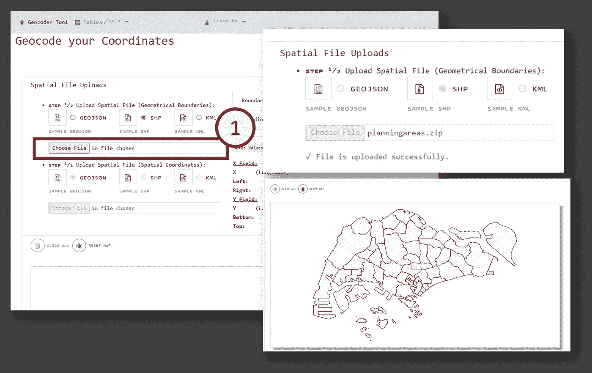
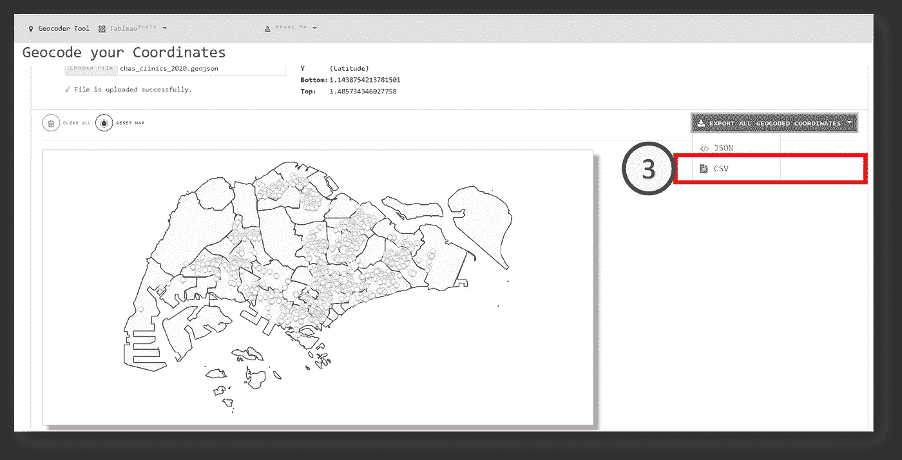
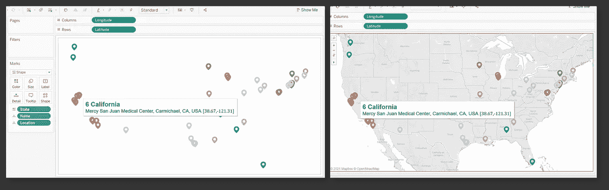

# 使用 Turf.js 通过自定义边界对坐标进行地理编码

> 原文：<https://towardsdatascience.com/using-turf-js-to-geocode-coordinates-with-custom-boundaries-bb843b7150d0?source=collection_archive---------30----------------------->

## 这个位置属于❝Which 地区/区域/区域吗？❞

虽然许多国家的医疗保健工作者继续努力接触和跟踪个人的移动，以识别各种“热点”，即感染病例数量特别多的地区，但这一过程通常需要根据*地区、地带、城市*等对每个识别的位置进行聚类。(取决于实现的边界类型)。

作者图片|新加坡国家的任意示例，感染病例经常出现的位置用地图标记表示

对于我们大多数人来说，当给定任何邮政编码或地址名称时，找到该位置属于哪个地区或区域(例如“位置 A ”)的最本能的方法是搜索更多信息:

作者图片|声称位于“北部地区”和“Z 区”的“位置 A”的任意示例

然而，当您需要每天处理**数十、数百甚至数千个唯一地址**并根据区域边界标记每个位置时，这就变成了一个完全不同的故事。虽然许多地理空间分析师会使用诸如 [ArcGIS](https://www.esri.com/en-us/home) 或 [QGIS](https://qgis.org/en/site/) 之类的软件工具，但我个人更喜欢一种更省事的方法，它不需要安装诸如[turf . js 库](https://turfjs.org/)之类的软件。

> 就短期地理编码而言，我认为这是一种更实际的方法，因为代码片段比桌面软件更容易移植。

为了展示[turf . js 库](https://turfjs.org/)的功能，类似于我以前的一些文章:

*   [利用 D3.js v4 构建 Tableau 的网络图|作者李思欣·楚|走向数据科学](/leverage-on-d3-js-v4-to-build-a-network-graph-for-tableau-with-ease-cc274cba69ce)
*   [被低估的 Tableau 组合功能——点、线串&多边形制图|李思欣·楚|走向数据科学](/underrated-combined-functionalities-of-tableau-point-linestring-polygon-mapping-b4c0568a4de2)
*   [通过不到 3 个步骤从现有空间数据生成十六进制地图|作者李思欣·楚|迈向数据科学](/generate-hex-maps-from-your-existing-spatial-data-in-less-than-3-steps-a6f39d778d84)

我已经将工具部署到与上述教程相同的 [Web 应用程序](https://tableau-data-utility.onrender.com/)上:

图片作者|注意，过去的 3 个 Tableau 实用工具目前位于 [Tableau 数据实用工具](https://tableau-data-utility.onrender.com/)的下拉列表中

为了演示，我将使用 2 个输入空间文件(接受 GeoJSON、SHP 和 KML 格式)—

(1)空间边界([https://github . com/孵育-geek-cc/tableau-data-utility/blob/master/public/data/planning areas . zip](https://github.com/incubated-geek-cc/tableau-data-utility/blob/master/public/data/planningareas.zip))

(2)空间坐标([https://github . com/孵育-geek-cc/tableau-data-utility/blob/master/public/data/chas _ clinics _ 2020 . geo JSON](https://github.com/incubated-geek-cc/tableau-data-utility/blob/master/public/data/chas_clinics_2020.geojson))

图片作者|在 web 应用程序 [Tableau 数据实用程序](https://tableau-data-utility.onrender.com/)上，导航至“地理编码器工具”。步骤(1)选择空间文件输入([空间边界文件](https://github.com/incubated-geek-cc/tableau-data-utility/blob/master/public/data/planningareas.zip)是 SHP 格式的档案)。边界将被渲染到地图容器中。

图片作者|在 web app 上 [Tableau 数据实用程序](https://tableau-data-utility.onrender.com/) |步骤(2)继续选择空间文件输入([空间坐标文件](https://github.com/incubated-geek-cc/tableau-data-utility/blob/master/public/data/chas_clinics_2020.geojson)为 GeoJSON 格式)。坐标将被渲染到地图容器中。 ***注:边界和坐标的唯一编号如图所示。***

图片作者|步骤(3)最后，地理编码输出可以导出为 JSON 或 CSV 格式。

为了进行演示，上述内容已导出为 CSV 格式，并呈现在 Tableau 中，如下所示:

按作者分类的图像|左图:在没有底图的情况下渲染 CSV 输出，并根据边界名称对坐标进行颜色编码|右图:渲染底图以将颜色编码的坐标与实际边界进行对比。**请注意，坐标根据地图的边界进行了不同的颜色编码，这意味着每个位置都已成功进行了地理编码。**

为了说明另一个例子，在下面的演示中使用输入文件(1) [US_States.geojson](https://github.com/incubated-geek-cc/tableau-data-utility/blob/master/public/data/US_States.geojson) (空间边界)&(2)[US _ hospitals . geo JSON](https://github.com/incubated-geek-cc/tableau-data-utility/blob/master/public/data/US_Hospitals.geojson)(空间坐标):

图片由作者提供|步骤(1)两个空间文件[US _ States . geo JSON](https://github.com/incubated-geek-cc/tableau-data-utility/blob/master/public/data/US_States.geojson)&US _ hospitals . geo JSON 都上传到 [Tableau 数据实用程序](https://tableau-data-utility.onrender.com/) |步骤(2)地理编码坐标导出为单个 CSV 文件

Image by Author |前面步骤导出的 CSV 输出在 Tableau 中呈现。根据底图边界，每个美国医院坐标都已成功进行地理编码。

您可以在 [Tableau 数据实用程序](https://tableau-data-utility.onrender.com/)随意访问这个地理空间工具，并通过上传您自己的空间文件:D 来试用它

**边注:** [Turf.js 库](https://turfjs.org/)出人意料地被低估，而且用途惊人。要查看如何将 [Turf.js](https://turfjs.org/) 用于其他用例，也可以随意查看[用不到 3 个步骤从现有空间数据生成十六进制地图|作者李思欣·楚|迈向数据科学](/generate-hex-maps-from-your-existing-spatial-data-in-less-than-3-steps-a6f39d778d84)

感谢阅读，并希望你发现这是有用的！

<https://geek-cc.medium.com/membership> 