# 使用单词嵌入识别公司名称和股票代码

> 原文：<https://towardsdatascience.com/using-word-embeddings-to-identify-company-names-and-stock-tickers-f194e3648a66?source=collection_archive---------16----------------------->

# 介绍

**项目目标:**使用单词嵌入从自然文本中识别公司名称和股票代码。

**假设:**股票行情和公司名称在类似的自然文本中被使用，比如红迪网帖子或推特。

在这种假设下，单词嵌入应该很适合于识别这些目标单词，因为单词嵌入是根据单词所处的语境来训练的。

## 计划:

1.  在股票市场相关的 Reddit 帖子上训练一个 Word2Vec 模型。
2.  创建一个可用于表示目标矢量的矢量(详见下文)。
3.  使用代表向量从红迪帖子中识别目标词。

在这篇文章中，我将跳过描述什么是单词嵌入，以及 Word2Vec 算法是如何工作的。[我已经就同一项目](https://github.com/brianward1428/word-embeddings-for-reddit-extraction/blob/master/project_writeup.pdf) [写了一篇更详细的论文，可以在这里](https://github.com/brianward1428/word-embeddings-for-reddit-extraction/blob/master/project_writeup.pdf)找到。在本文中，我详细解释了什么是单词嵌入，以及 Word2Vec 算法是如何工作的。我还通过朴素贝叶斯进行详细的情感分析。在这篇文章中，我将以节略的形式展示代码。

[完整报告见本页面。](https://github.com/brianward1428/word-embeddings-for-reddit-extraction)

# **数据导入**

使用了两种不同的数据源。这两个都是我在卡格尔网站上找到的来自 r/wallstreetbets 子网站的 Reddit 帖子的集合。

*   Gabriel Preda，“Reddit WallStreetBets 邮报”Kaggle，2021，[https://www.kaggle.com/gpreda/reddit-wallstreetsbets-posts](https://www.kaggle.com/gpreda/reddit-wallstreetsbets-posts/)/
*   拉斐尔·丰特斯，“Reddit-r/wallstreet bets”。卡格尔，2021 年。[https://www.kaggle.com/unanimad/reddit-rwallstreetbets](https://www.kaggle.com/unanimad/reddit-rwallstreetbets)

在第一步中，我们将导入这些数据并提取每个句子。在其中一个数据集上，我们提取了 Reddit 标题，而另一个数据集上，我们提取了文本的正文，并进行拆分分开句子。**注** : Gensim 的 Word2Vec 模型是基于句子进行训练的。

# 字符串处理

下一步是在我们使用文本训练模型之前对其进行预处理。我们将执行以下操作:

*   小写字母
*   删除标点符号、数字和表情符号
*   清除空白
*   标记化
*   找到大人物
*   查找三元组

现在让我们看看我们处理过的一个句子:

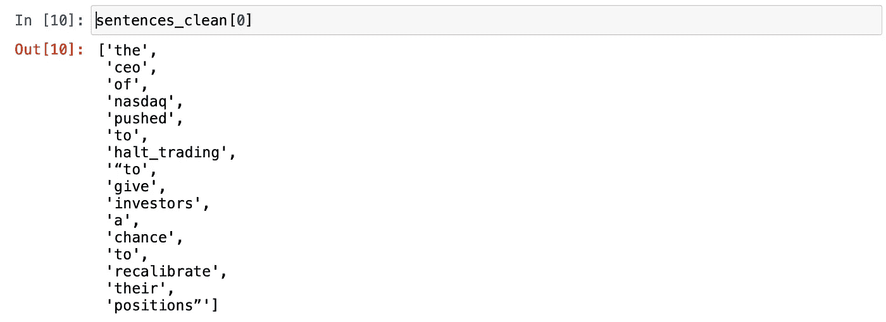

太好了，我们现在大约有 120 万个句子来训练我们的模型。

# 模特培训

现在我们准备训练或 Word2Vec 模型。Text 8 是一个来自维基百科的数据转储，它非常适合标准化单词向量。我鼓励你比较有和没有这些额外训练数据的模型，看看它有多大帮助。[更多关于 text8 的信息可以在这里找到。](http://mattmahoney.net/dc/textdata)

现在，我们可以使用 Gensim 的`most_similar()`功能来查看词汇表中与目标单词(如“gme ”)最相似的单词。

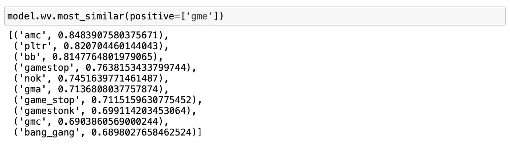

完美，所以我们可以看到，至少前 10 个最相似的词也是公司或股票代号。这给了我们希望，我们的假设是正确的。

## 创建代表性向量

我们需要一个有代表性的向量来和词汇表中的其他单词进行比较。我们可以使用这个向量和一些相似度阈值来识别帖子中的目标词。

不幸的是， [Gensim](https://radimrehurek.com/gensim/models/word2vec.html) 没有从其他向量创建平均向量的方法。所以我从 Gensim 的`most_similar()`函数中提取了一些代码，以获得我正在寻找的功能。我还创建了一个余弦相似度方法，我们将使用它来比较任何两个向量。余弦相似性是一种比较两个非零向量的方法(两个相同的向量的余弦相似性= 1.0)。

太棒了，现在我们可以用它从一些精选的目标单词中创建我们自己的向量。

现在让我们继续使用我们创建的向量，看看我们的模型词汇表中最相似的向量。**注:**数字是项和代表向量的余弦相似度。

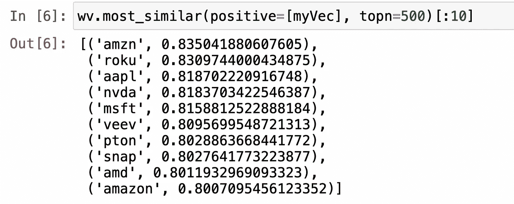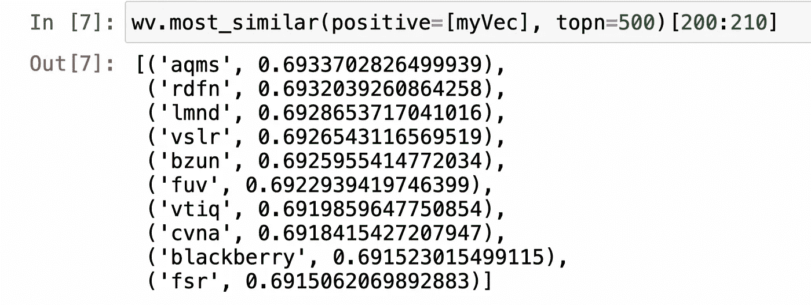

我对这里的结果很满意。如果你跟随你应该探索所有这些 500 强，几乎所有的似乎是股票代号或公司名称。我们还可以看看向量与词汇表中每个单词的相似度的分布。

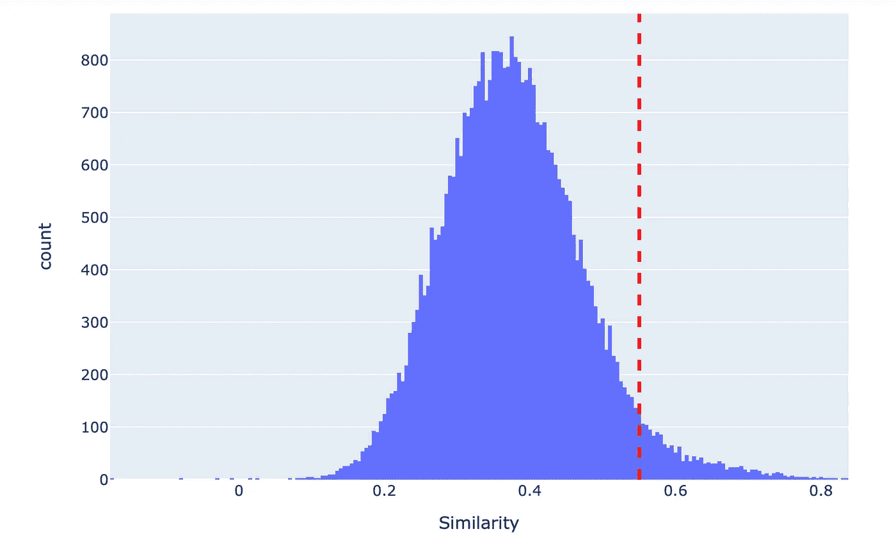

我在 0.55 处添加了一条垂直线，这是我最终选择的相似度阈值。该行右边的任何单词都将被识别为目标。基于这个数字，看起来阈值可能应该大于 0.55。这一选择是参数分析的结果，并有望随着更可靠的地面实况而增加。以下是更多相关信息。

# 模型检验

现在我们需要一些方法来测试我们的模型。我随机选择了 1000 个 Reddit 帖子，然后手动提取任何公司名称或股票代码。它看起来是这样的:

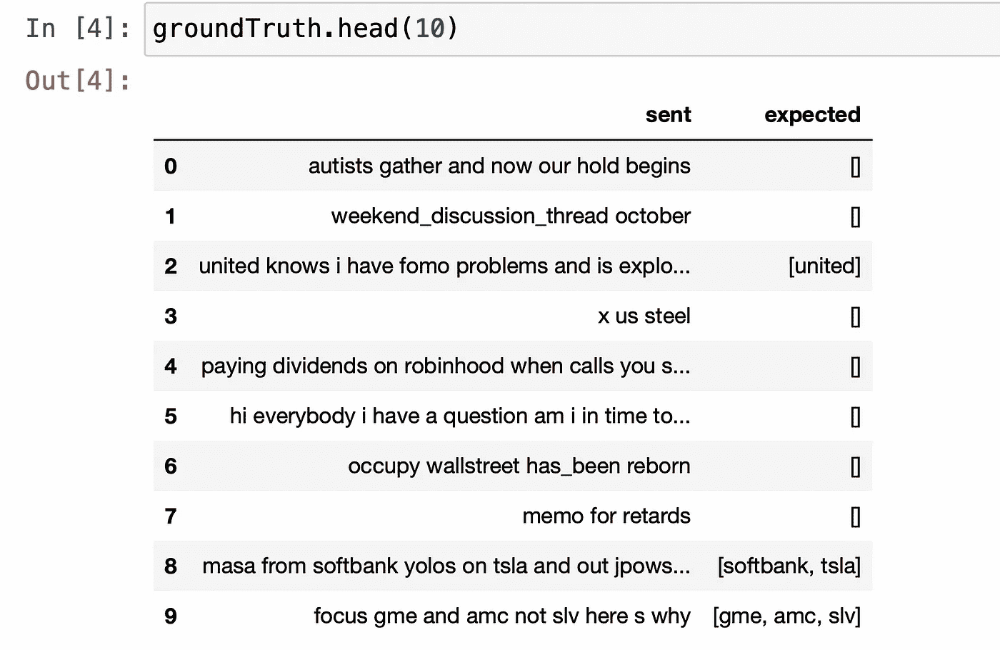

现在让我们继续测试它。有几个不同的方法来评分，我选择了一个简单的方法平均一个错过的分数和一个分数。

太好了，让我们开始工作吧。

# 参数分析

Gensim 的 Word2Vec 模型有几个我有兴趣系统测试的参数。我选择关注 4 个不同的参数:

1.  相似性阈值:[0.5，0.55，0.6，0.65]
2.  n-Gram:[一元，二元，三元]
3.  窗口大小:[1，2，3，4，5]
4.  向量大小:[100，200，300，400]

**注意**:以下是关于这些参数的更多信息。

我们可以迭代所有这些参数，并根据我们的实际情况进行测试。

这显然需要很长时间，因为我们最终不得不训练模型 60 次。我只是让它运行了一夜。让我们来看看结果。

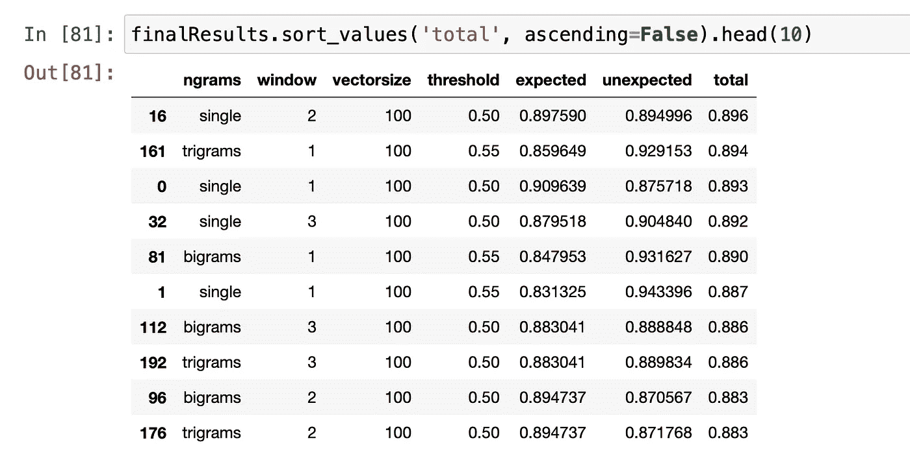

现在，我们可以单独考虑这些参数，看看我们是否发现了任何趋势。

## 相似性阈值

相似性阈值是我们用来确定一个单词是否被提取的阈值:

```
If cosineSimilarity(word, myVector) >= similarity_threshold:
       extract(word)
Else : 
       continue
```

经过反复试验，我选择为这些测试考虑 4 个不同的阈值。在比较其他参数时，我还选择了包括这四个阈值中每个阈值的图形，因为这些参数在不同的阈值下可能会有不同的效果。

## n 元语法

虽然 N-Gram 不是 word2vec 模型的一个参数，但它是对输入模型的数据进行预处理的一个重要步骤，对我们试图完成的任务有很大的影响。

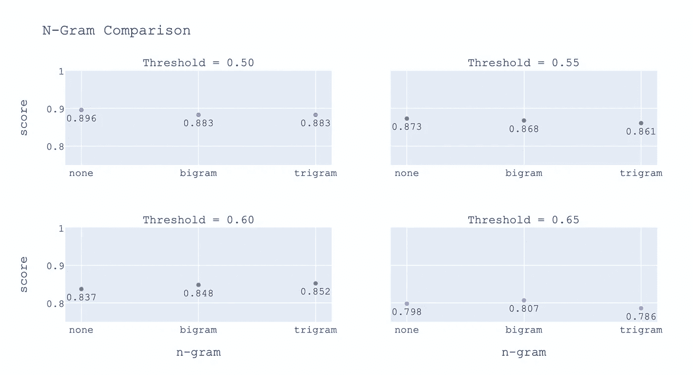

我们看到每个阈值的趋势并不相同。我选择继续使用 bigrams，因为它既是中间立场，也允许我们将 bigram 公司名称放在一起(例如“home_depot”)。

## 窗口大小

窗口大小是 Word2vec 模型的一个参数，它指定了我们将考虑作为上下文单词的目标单词左右的单词数([更多细节可以在项目描述](https://github.com/brianward1428/word-embeddings-for-reddit-extraction/blob/master/project_writeup.pdf)中找到)。这对嵌入有很大的影响，特别是对于像 Reddit 帖子这样的结构化程度较低的文本。

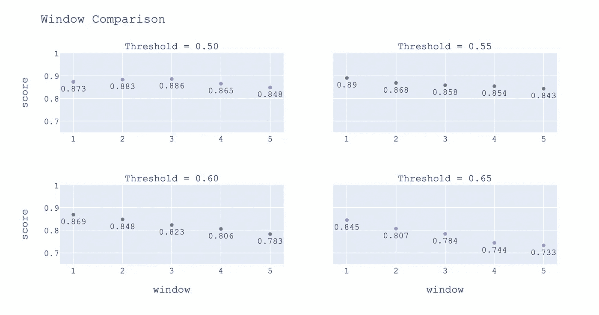

## 向量大小

向量大小是 word2vec 模型的另一个参数。向量大小是我们正在创建的单词嵌入的长度或维度([更多细节可以在项目描述](https://github.com/brianward1428/word-embeddings-for-reddit-extraction/blob/master/project_writeup.pdf)中找到)。选择正确的向量大小确实需要通过测试来完成。我们将考虑 4 个不同的选项。

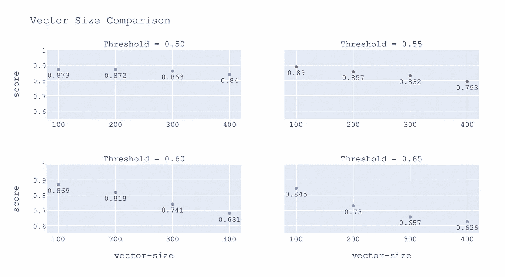

一旦确定了最佳参数:[n-gram=bigrams，window=1，vector-size=100，threshold=5.5]我们就能够在我们的地面真实数据上获得 89%的总体准确率。我对这个简单的参数分析的结果非常满意。现在，我们可以继续使用该模型来提取公司。

# 提取公司和股票代码

提取函数非常简单。我们基本上只需要将每个单词与我们的代表向量进行比较。我们之所以将它包装在 try 语句中，是因为我们模型的库不会有每一个可能的术语(word2vec 模型中的 param:`min_count=25`)。

当用一个`threshold = 0.6`应用于我们的 Reddit 帖子的原始数据集时，这种方法能够从近 30 万个帖子中提取公司。在相同的阈值下，提取了 800 个独特的公司/报价机。以下是一些提取的公司/证券交易所及其数量的子集。

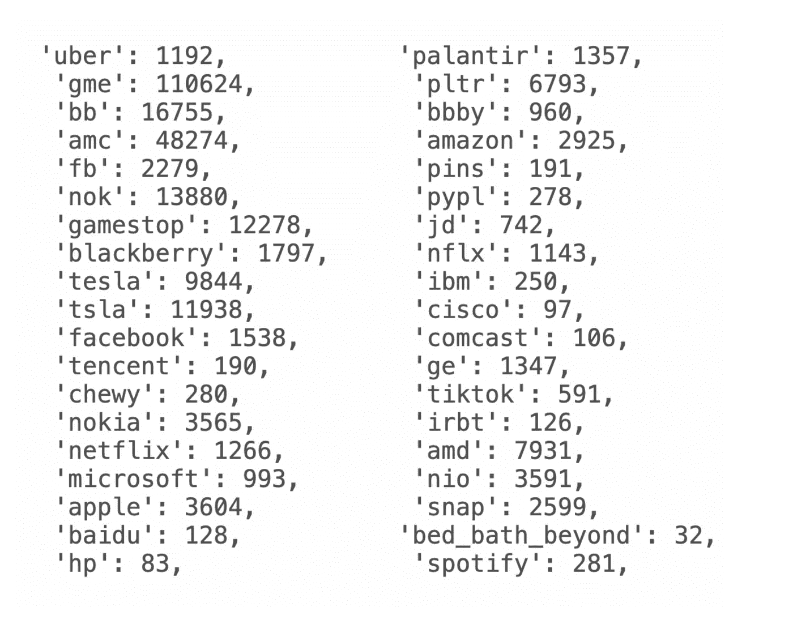

# 后续步骤

我想指出的第一件事是，这个项目中的主要因素，**代表向量**，被掩盖了。这是因为在我做这个项目的时间里，我不认为我能实现一个创建这个向量的系统方法。我认为**有很多**可以让这个算法更加精确。首先需要做的是创建一个更大的地面真相，最好是从 Twitter 或其他形式的社交媒体中获取。有了一个更强大的基础事实来测试，我们可能会想出一些很酷的方法来学习一个更好的代表性向量。几个想法:

*   **简单的方法**:获取公司名称/代码的子集，根据实际情况系统地测试不同的组合。
*   **更高级的方法:**尝试实现某种梯度下降，它可以学习一个向量，这个向量将更好地执行我们现在令人敬畏的地面真理。

我也认为字符串的处理可以做得更多。在这个实现中，我选择删除数字和表情符号。我认为这是在抛出很多丰富的信息，尤其是表情符号。我确信我们的目标词与数字和表情符号都有上下文关系。如果我有任何想法，我一定会更新这篇文章。

# 包裹

如果您有任何建议、问题或意见，请告诉我，我是一名学生，正在学习所有这些工具。在整个项目中，我还使用朴素贝叶斯来确定不同公司/证券交易所的情绪。您可以在[中阅读更多相关内容，完整记录在此处](https://github.com/brianward1428/word-embeddings-for-reddit-extraction/blob/master/project_writeup.pdf)，您也可以在此处查看[完整回购。感谢阅读。](https://github.com/brianward1428/word-embeddings-for-reddit-extraction)