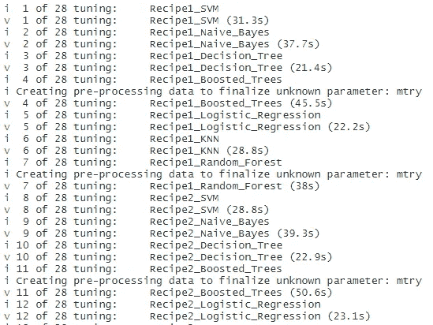
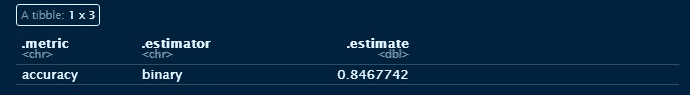

# 使用工作流集筛选和比较银行贷款分类的模型-方法组合

> 原文：<https://towardsdatascience.com/using-workflow-sets-to-screen-and-compare-model-recipe-combinations-for-bank-loan-classification-fcaad2853290?source=collection_archive---------14----------------------->

## 为具有潮汐模型的分类问题筛选一系列模型类型和特征工程步骤

假设您是一家大型银行的数据科学家，您的 CDO 指示您开发一种自动化银行贷款决策的方法。您决定这应该是一个二元分类器，并继续收集数百个数据点。但是你应该从什么样的模型开始，你应该完成什么样的特征工程？为什么不筛选多个组合？

该项目将使用贷款预测数据集来举例说明 Tidymodels 机器学习生态系统中 workflow_sets()的使用。筛选一系列模型和特征工程管道对于避免对特定模型类型的任何内部偏见或“没有免费的午餐”定理非常重要。如果你有兴趣在阅读之前了解更多关于 Tidymodels 生态系统的信息，请查看我的[前一篇文章](/big-sales-mart-regression-revisited-enter-the-tidymodels-a6a432be58d4)。

贷款预测数据摘自[https://Data hack . analyticsvidhya . com/contest/practice-problem-loan-Prediction-iii/](https://datahack.analyticsvidhya.com/contest/practice-problem-loan-prediction-iii/)。


图片由 [Iro Klg](https://unsplash.com/@ssilver_?utm_source=medium&utm_medium=referral) 在 [Unsplash](https://unsplash.com?utm_source=medium&utm_medium=referral) 上拍摄

**加载包和数据**

```
library(tidymodels) **#ML meta packages**
library(themis) **#Recipe functions to deal with class imbalances**
library(discrim) **#Naive Bayes Models**
library(tidyposterior) **#Bayesian Performance Comparison**
library(corrr) **#Correlation Viz**
library(readr) **#Read Tabular Data**
library(magrittr) **#Pipe Operators**
library(stringr) **#Work with Strings**
library(forcats) **#Work with Factors**
library(skimr) **#Data Summary**
library(patchwork) **#ggplot grids**
library(GGally) **#Scatterplot Matrices**train <- read_csv("train_ctrUa4K.csv")train %<>% rename(Applicant_Income = ApplicantIncome,
                  CoApplicant_Income = CoapplicantIncome,
                  Loan_Amount = LoanAmount) 
```

**探索性数据分析**

在我们开始筛选模型之前，用一些基本的探索性数据分析来完成我们的尽职调查。

我们使用 skimr 包来产生下面的输出

```
skim(train)
```


skimr 的输出(图片由作者提供)

此外，我们可以使用以下函数通过适当的可视化来可视化这些结果。

```
**#Automated Exploratory Data Analysis**
viz_by_dtype <- function (x,y) {
  title <- str_replace_all(y,"_"," ") %>% 
           str_to_title()
  if ("factor" %in% class(x)) {
    ggplot(train, aes(x, fill = x)) +
      geom_bar() +
      theme(legend.position = "none",
            axis.text.x = element_text(angle = 45, hjust = 1),
            axis.text = element_text(size = 8)) +
      theme_minimal() +
      scale_fill_viridis_c()+
      labs(title = title, y = "", x = "")
  }
  else if ("numeric" %in% class(x)) {
    ggplot(train, aes(x)) +
      geom_histogram()  +
      theme_minimal() +
      scale_fill_viridis_c()+
      labs(title = title, y = "", x = "")
  } 
  else if ("integer" %in% class(x)) {
    ggplot(train, aes(x)) +
      geom_histogram() +
      theme_minimal() +
      scale_fill_viridis_c()+
      labs(title = title, y = "", x = "")
  }
  else if ("character" %in% class(x)) {
    ggplot(train, aes(x, fill = x)) +
      geom_bar() +
      theme_minimal() +
      scale_fill_viridis_d()+
      theme(legend.position = "none",
            axis.text.x = element_text(angle = 45, hjust = 1),
            axis.text = element_text(size = 8)) +
      labs(title = title, y  ="", x= "")
  }
}variable_plot <- map2(train, colnames(train), viz_by_dtype) %>%
  wrap_plots(ncol = 3,
             nrow = 5)
```


贷款数据集的可视化 EDA(图片由作者提供)

*   性别失衡，男性申请人比例高，有新来港定居人士
*   婚姻状况，几乎 3:2 的已婚申请者对未婚者，有 NAs 在场
*   大多数申请人没有孩子
*   大多数申请人是大学毕业生
*   大多数人不是自营职业者
*   申请人收入向右倾斜
*   共同申请人的收入向右倾斜
*   贷款金额向右倾斜
*   贷款额度期限一般为 360 天
*   大部分申请人都有信用记录，包括 NAs
*   混合物业区域类型
*   大多数申请都获得批准，目标可变贷款状态不平衡，比例为 3:2

**双变量数据分析**

**数量变量**

使用 GGally::ggpairs()，我们为所有数字变量生成一个变量矩阵图，并用 Loan_Status 着色。

```
**#Correlation Matrix Plot**
ggpairs(train %>% select(7:10,13), ggplot2::aes(color = Loan_Status, alpha = 0.3)) + 
  theme_minimal() + 
  scale_fill_viridis_d(aesthetics = c("color", "fill"), begin = 0.15, end = 0.85) +
  labs(title = "Numeric Bivariate Analysis of Loan Data")
```


数值预测和贷款状况的双变量分析(图片由作者提供)

**定性变量**

使用如下生成的汇总数据帧，改变所需的字符变量，迭代生成以下可视化。

```
**#Generate Summary Variables for Qualitative Variables**
summary_train <- 
  train %>% 
  select(where(is.character),
         -Loan_ID) %>% 
  drop_na() %>% 
  mutate(Loan_Status = if_else(Loan_Status == "Y",1,0)) %>% 
  pivot_longer(1:6, names_to = "Variables", values_to = "Values") %>% 
  group_by(Variables, Values) %>% 
    summarise(mean = mean(Loan_Status),
              conf_int = 1.96*sd(Loan_Status)/sqrt(n())) %>% 
  pivot_wider(names_from = Variables, values_from = Values)summary_train %>% select(Married, mean, conf_int) %>% 
  drop_na() %>% 
  ggplot(aes(x=Married, y = mean, color = Married)) +
  geom_point() +
  geom_errorbar(aes(ymin = mean - conf_int, ymax = mean + conf_int), width = 0.1) +
  theme_minimal() +
  theme(legend.position = "none",
        axis.title.x = element_blank(),
        axis.title.y = element_blank()) +
  scale_colour_viridis_d(aesthetics = c("color", "fill"), begin = 0.15, end = 0.85) +
  labs(title="Married")
```


95%置信区间下每个分类变量的成功贷款申请比例(图片由作者提供)

完成上述可视化的好处是，它给出了贷款申请成功的差异大小以及不确定性的理解，通过每个分类变量的 95%置信区间可视化。由此我们注意到以下几点:

*   已婚申请人的申请被批准的可能性更大。
*   研究生申请者成功的机会更大，可能是因为收入更稳定/更高。
*   类似地，为自己工作的申请人的成功差异也大得多，可能是因为收入稳定性的差异
*   孩子的数量似乎对贷款状况没有太大影响
*   女性客户在申请成功上有更大的可变性，男性客户则更加离散。我们需要小心这一点，以免在算法中产生根深蒂固的偏见。
*   半城市或郊区的成功率最高。
*   最后，有信用记录的客户和没有信用记录的客户在成功率上有显著差异。

如果我们愿意，我们可以用方差分析/卡方检验进一步探索这些关系。

**数据拆分— rsamples**

我们将数据按照 Loan_Status 进行了 80:20 的分层。可以通过调用 mc_split 对象上的 training()或 testing()来访问每个拆分表。

```
**#Split Data for Testing and Training**
set.seed(101)
loan_split <- initial_split(train, prop = 0.8, strata = Loan_Status)
```

**模型开发——防风草。**

如上所述，我们希望筛选一系列模型，并锁定几个合适的候选模型。下面我们已经初始化了一系列的标准分类模型。

```
**#Initialise Seven Models for Screening**
nb_loan <- 
  naive_Bayes(smoothness = tune(), Laplace = tune()) %>% 
  set_engine("klaR") %>% 
  set_mode("classification")logistic_loan <- 
  logistic_reg(penalty = tune(), mixture = tune()) %>% 
  set_engine("glmnet") %>% 
  set_mode("classification")dt_loan <- decision_tree(cost_complexity = tune(), tree_depth = tune(), min_n = tune()) %>% 
  set_engine("rpart") %>% 
  set_mode("classification")rf_loan <- 
  rand_forest(mtry = tune(), trees = tune(), min_n = tune()) %>% 
  set_engine("ranger") %>% 
  set_mode("classification")knn_loan <- nearest_neighbor(neighbors = tune(), weight_func = tune(), dist_power = tune()) %>% 
  set_engine("kknn") %>% 
  set_mode("classification")svm_loan <- 
  svm_rbf(cost = tune(), rbf_sigma = tune(), margin = tune()) %>% 
  set_engine("kernlab") %>% 
  set_mode("classification")xgboost_loan <- boost_tree(mtry = tune(), trees = tune(), min_n = tune(), tree_depth = tune(), learn_rate = tune(), loss_reduction = tune(), sample_size = tune())  %>% 
  set_engine("xgboost") %>% 
  set_mode("classification")
```

**特征工程—配方**

以下是一系列配方配置。这两种不同的插补方法如何相互比较，在下面的注释中，我们使用了 impute_mean(代表数字)、impute_mode(代表字符)或使用 impute_bag(使用袋装树的插补),可以对数字和字符变量进行插补。

注意，对于 Credit_History，我们选择不估算这个值，而是将三个结果分配给一个整数值，将未知实例设置为 0。

由于 Loan_Status 不平衡，我们对配方 2 和 4 应用了 SMOTE(合成少数过采样技术)。我们将完成工作流程比较，以了解插补策略之间的准确性差异。

```
**#Initialise Four Recipes**
recipe_1 <- 
  recipe(Loan_Status ~., data = training(loan_split)) %>% 
  step_rm(Loan_ID) %>%
  step_mutate(Credit_History = if_else(Credit_History == 1, 1, -1,0)) %>% 
  step_scale(all_numeric_predictors(), -Credit_History) %>% 
  step_impute_bag(Gender, 
                  Married, 
                  Dependents, 
                  Self_Employed, 
                  Loan_Amount, 
                  Loan_Amount_Term) %>% 
  step_dummy(all_nominal_predictors())recipe_2 <- 
  recipe(Loan_Status ~., data = training(loan_split)) %>% 
  step_rm(Loan_ID) %>%
  step_mutate(Credit_History = if_else(Credit_History == 1, 1, -1,0)) %>% 
  step_scale(all_numeric_predictors(), -Credit_History) %>% 
  step_impute_bag(Gender, 
                  Married, 
                  Dependents, 
                  Self_Employed, 
                  Loan_Amount, 
                  Loan_Amount_Term) %>% 
  step_dummy(all_nominal_predictors()) %>% 
  step_smote(Loan_Status)

recipe_3 <- 
  recipe(Loan_Status ~., data = training(loan_split)) %>% 
  step_rm(Loan_ID) %>%
  step_mutate(Credit_History = if_else(Credit_History == 1, 1, -1,0)) %>%  
  step_scale(all_numeric_predictors(), -Credit_History) %>%  
  step_impute_mean(all_numeric_predictors()) %>%
  step_impute_mode(all_nominal_predictors()) %>% 
  step_dummy(all_nominal_predictors()) %>% 
  step_zv(all_predictors())recipe_4 <- 
  recipe(Loan_Status ~., data = training(loan_split)) %>% 
  step_rm(Loan_ID) %>%
  step_mutate(Credit_History = if_else(Credit_History == 1, 1, -1,0)) %>% 
  step_scale(all_numeric_predictors(), -Credit_History) %>%  
  step_impute_mean(all_numeric_predictors()) %>%
  step_impute_mode(all_nominal_predictors()) %>% 
  step_dummy(all_nominal_predictors()) %>% 
  step_zv(all_predictors()) %>% 
  step_smote(Loan_Status)
```

以 recipe_1 为例，我们可以为每个转换准备训练和测试数据集。

```
**#Prep and Bake Training and Test Datasets**
loan_train <- recipe_1 %>% prep() %>% bake(new_data = NULL)
loan_test <- recipe_1 %>% prep() %>% bake(testing(loan_split))
```

然后利用这些转换后的数据集，可视化变量相关性。

```
**#Generate Correlation Visualisation**
loan_train %>% bind_rows(loan_test) %>% 
  mutate(Loan_Status = if_else(Loan_Status == "Y",1,0)) %>% 
              correlate() %>%
              rearrange() %>% 
              shave() %>% 
              rplot(print_cor = T,.order = "alphabet") +
                theme_minimal() +
                theme(axis.text.x = element_text(angle = 90)) +
                scale_color_viridis_c() +
                labs(title = "Correlation Plot for Trained Loan Dataset")
```


已训练贷款数据集的相关图(图片由作者提供)

从上面我们注意到贷款状态和申请人是否有信用历史之间的密切关系。这是有道理的，银行更倾向于贷款给有信用记录的客户，证明客户有能力偿还贷款。

**迭代 Parnsip 和配方组合—工作流程集**

工作流集合使我们能够筛选配方和 parnsip 模型规格的所有可能组合。如下，我们已经创建了两个命名列表，所有模型和配方。

```
**#Generate List of Recipes**
recipe_list <- 
list(Recipe1 = recipe_1, Recipe2 = recipe_2, Recipe3 = recipe_3, Recipe4 = recipe_4)**#Generate List of Model Types** model_list <- 
list(Random_Forest = rf_loan, SVM = svm_loan, Naive_Bayes = nb_loan, Decision_Tree = dt_loan, Boosted_Trees = xgboost_loan, KNN = knn_loan, Logistic_Regression = logistic_loan)
```

有趣的部分来了，使用 workflow_sets()创建一系列工作流

```
model_set <- workflow_set(preproc = recipe_list, models = model_list, cross = T)
```

设置 cross = T 指示 workflow_set 创建 parsnip 模型和配方规格的所有可能组合。

```
set.seed(2)
train_resamples <- bootstraps(training(loan_split), strata = Loan_Status)doParallel::registerDoParallel(cores = 12)
all_workflows <- 
  model_set %>% workflow_map(resamples = train_resamples, 
                             verbose = TRUE)
```

我们已经初始化了一个助推器重采样程序，这在计算上要求更高，但是总体误差更小。通过重采样过程将 model_set 对象传递给 workflow_map，将启动一个所有防风草配方组合的屏幕，显示如下输出。这是一个要求很高的过程，因此我们启动了并行计算来简化这一过程。

使用重采样过程，workflow_map 将使每个工作流符合训练数据，并计算每个重采样的精度，然后取平均值。此外，由于每个配方都指定应该调整超参数，workflow_map 将执行一些调整以提供最佳结果。



workflow_map 的输出(图片由作者提供)

完成后，我们可以调用 all_workflows 对象，收集在此过程中计算的所有指标，并可视化结果。

名词（noun 的缩写）b .对于 workflow_set 对象，有一个可用的 autoplot()函数，但是我们希望能够比较配方和模型性能，因此必须重新设计以下可视化功能。

```
**#Visualise Performance Comparison of Workflows**
collect_metrics(all_workflows) %>% 
  separate(wflow_id, into = c("Recipe", "Model_Type"), sep = "_", remove = F, extra = "merge") %>% 
  filter(.metric == "accuracy") %>% 
  group_by(wflow_id) %>% 
  filter(mean == max(mean)) %>% 
  group_by(model) %>% 
  select(-.config) %>% 
  distinct() %>%
  ungroup() %>% 
  mutate(Workflow_Rank =  row_number(-mean),
         .metric = str_to_upper(.metric)) %>%
  ggplot(aes(x=Workflow_Rank, y = mean, shape = Recipe, color = Model_Type)) +
    geom_point() +
    geom_errorbar(aes(ymin = mean-std_err, ymax = mean+std_err)) +
    theme_minimal()+
    scale_colour_viridis_d() +
    labs(title = "Performance Comparison of Workflow Sets", x = "Workflow Rank", y = "Accuracy", color = "Model Types", shape = "Recipes")
```


所有工作流的性能比较(图片由作者提供)

从上面我们可以观察到:

*   朴素贝叶斯和 KNN 模型表现最差
*   基于树的方法表现得非常好
*   SMOTE 没有提高更复杂模型类型的性能，决策树模型的配方之间没有变化。

虽然我们已经进行了非常一般的初步观察，但考虑到前 8 个工作流的平均准确性略有不同，我们如何辨别哪些是不同的，或者实际上是相同的？

**重采样的事后分析—潮汐先验**

比较模型的一种方法是检查重采样结果，并询问模型实际上不同吗？
tidyposterior::perf _ mod 函数通过为给定指标生成一组后验分布来比较我们所有的工作流组合，然后可以将这些后验分布相互比较，以实现实际等效性。本质上，我们可以进行工作流之间的比较。

```
doParallel::registerDoParallel(cores = 12)
set.seed(246)
acc_model_eval <- perf_mod(all_workflows, metric = "accuracy", iter = 5000)
```


perf_mod 的示例输出(图片由作者提供)

然后将 perf_mod 的结果传递给 tidy()以提取后验分析的基本发现。它们的分布如下图所示。

```
**#Extract Results from Posterior Analysis and Visualise Distributions** acc_model_eval %>% 
  tidy() %>% 
  mutate(model = fct_inorder(model)) %>% 
  ggplot(aes(x=posterior)) +
   geom_histogram(bins = 50) +
   theme_minimal() +
   facet_wrap(~model, nrow = 7, ncol = 6) +
   labs(title = "Comparison of Posterior Distributions of Model Recipe Combinations", x = expression(paste("Posterior for Mean Accuracy")), y = "")
```


所有工作流的平均准确度的后验分布(按作者分类的图片)

回顾我们的性能比较，我们观察到两个最高等级的模型是提升树和具有 Recipe1 的决策树，这些模型处于基于树的模型的可解释性范围的极端。我们可以通过取它们各自后验分布的差异来寻求进一步的理解。

使用 contrast_models()我们可以进行这种分析。

```
**#Compare Two Models - Difference in Means**
mod_compare <- contrast_models(acc_model_eval,
                            list_1 = "Recipe1_Decision_Tree",
                            list_2 = "Recipe1_Boosted_Trees")a1 <- mod_compare %>% 
  as_tibble() %>% 
  ggplot(aes(x=difference)) +
  geom_histogram(bins = 50, col = "white", fill = "#73D055FF")+
  geom_vline(xintercept = 0, lty = 2) +
  theme_minimal()+
  scale_fill_viridis_b()+
  labs(x= "Posterior for Mean Difference in Accuracy", y="", title = "Posterior Mean Difference Recipe1_Decision_Tree & Recipe3_Boosted_Trees")a2 <- acc_model_eval %>% 
  tidy() %>% mutate(model = fct_inorder(model)) %>% 
  filter(model %in% c("Recipe1_Boosted_Trees", "Recipe1_Decision_Tree")) %>% 
  ggplot(aes(x=posterior)) +
  geom_histogram(bins = 50, col = "white", fill = "#73D055FF") +
  theme_minimal()+
  scale_colour_viridis_b() +
  facet_wrap(~model, nrow = 2, ncol = 1) +
  labs(title = "Comparison of Posterior Distributions of Model Recipe Combinations", x = expression(paste("Posterior for Mean Accuracy")), y = "")a2/a1
```


个体平均准确性后验分布及其差异(图片由作者提供)

通过管道将 mod_compare 对象传递给 summary 会生成以下输出

```
mod_compare %>% summary()
mean
0.001371989 **#Difference in means between posterior distributions**
probability
0.5842 **#Proportion of Posterior of Mean Difference > 0**
```

如平均差异的后验所证明的，平均准确度的各个工作流程后验分布之间的平均差异较小。均值分布的后验差有 58.4%在 0 以上，所以我们可以推断正差是真实存在的(虽然很轻微)。

我们可以用实际等价的概念做进一步的研究。

```
summary(mod_compare, size = 0.02)
pract_equiv
0.9975
```

效应大小是均值后验分布差异两侧的阈值[-0.02，0.02]，pract_equiv 测量差异的大小。in 的意思是邮政。分布在这些阈值内。在我们的比较中，Boosted_Trees 在决策树的后验分布中占 99.75%。

我们可以为以下所有工作流完成此练习。

```
**#Pluck and modify underlying tibble from autoplot()**
autoplot(acc_model_eval, type = "ROPE", size = 0.02) %>% 
  pluck("data") %>% 
  mutate(rank = row_number(-pract_equiv)) %>% 
  arrange(rank) %>% 
  separate(model, into = c("Recipe", "Model_Type"), sep = "_", remove = F, extra = "merge") %>% 
  ggplot(aes(x=rank, y= pract_equiv, color = Model_Type, shape = Recipe)) +
   geom_point(size = 5) +
   theme_minimal() +
   scale_colour_viridis_d() +
   labs(y= "Practical Equivalance", x = "Workflow Rank", size = "Probability of Practical Equivalence", color = "Model Type", title = "Practical Equivalence of Workflow Sets", subtitle = "Calculated Using an Effect Size of 0.02")
```


效果大小为 0.02 的工作流的实际等效性(图片由作者提供)

我们已经获取了支持进行 ROPE(实际等价区域)计算的 autoplot 对象的数据，以便我们可以设计和显示更多的功能。这样，我们可以使用 Recipe1_Decision_Tree 作为基准，轻松地比较每个工作流。有几个工作流的性能可能与 Recipe1_Decision_Tree 一样好。

前两个候选树 Boosted_Trees 和 Decision_Tree 位于可解释性光谱的两端。Boosted Trees 在很大程度上是一种黑盒方法，相反决策树更容易理解，在这种情况下**提供了最佳结果**，因此我们将在使用 Recipe1_Decision_Tree 的基础上完成我们的工作流。

```
**#Pull Best Performing Hyperparameter Set From workflow_map Object**
best_result <- all_workflows %>% 
  pull_workflow_set_result("Recipe1_Decision_Tree") %>% 
  select_best(metric = "accuracy")**#Finalise Workflow Object With Best Parameters**
dt_wf <- all_workflows %>% 
  pull_workflow("Recipe1_Decision_Tree") %>% 
  finalize_workflow(best_result)**#Fit Workflow Object to Training Data and Predict Using Test Dataset**
dt_res <- 
  dt_wf %>%
  fit(training(loan_split)) %>% 
  predict(new_data = testing(loan_split)) %>% 
  bind_cols(loan_test) %>% 
  mutate(.pred_class = fct_infreq(.pred_class),
         Loan_Status = fct_infreq(Loan_Status))**#Calculate Accuracy of Prediction** accuracy(dt_res, truth = Loan_Status, estimate = .pred_class)
```



针对测试数据的模型准确性(图片由作者提供)


预测的混淆矩阵(图片由作者提供)

我们的最终模型已经成功地生成了一个非常强的结果，在测试数据集上的准确率为 84.68%。该模型在预测已批贷款的批准情况方面总体表现良好。然而，模型是批准贷款，由银行决定反对。这是一个奇怪的案例，显然，银行提供的贷款越多，收入潜力就越大，风险敞口也就越大。这表明数据集包含一些模型无法完全区分的不一致，并且根据训练集中的观察结果已经被“混淆”。

这为模型的可解释性提供了一个论据，在这个例子中，我们不能产生更多的数据，那么我们如何知道预测的基础呢？

```
**#Fit and Extract Fit from Workflow Object**
dt_wf_fit <- 
  dt_wf %>% 
  fit(training(loan_split))dt_fit <- 
  dt_wf_fit %>% 
  pull_workflow_fit()**#Generate Decision Tree Plot Using rpart.plot package**
rpart.plot::rpart.plot(dt_fit$fit)
```


模型决策的决策树图(图片由作者提供)

由于我们的模型简单到足以可视化和理解，一个树状图就足够了。

我们立即观察到，该决定完全基于信用历史的存在。该模型还错误地向申请人提供未知的信用历史(= 0)，并拒绝没有信用历史的申请人(信用历史= -1)。上面提到的不一致是显而易见的，并不是每个有信用记录的人都能获得贷款，但这肯定会有帮助。

**结论**

你回到你的 CDO，解释你的发现。他们对准确性结果印象深刻，但现在企业必须权衡允许信用历史未知的应用程序违约的风险，以及否则可能产生的潜在收入。

本文试图解释 Tidymodels 生态系统中 workflow_sets 的强大功能。此外，我们已经探索了“没有免费的午餐”定理，即没有一个模型可以说是更好或最好的，因此为什么筛选许多模型是最佳实践。响应良好的模型类型也取决于所执行的特征工程。

感谢您阅读我的第二本出版物。如果你对 Tidymodels 感兴趣，我发布了一个介绍性项目，解释了构建[回归模型](/big-sales-mart-regression-revisited-enter-the-tidymodels-a6a432be58d4)时的每个核心包。

我要感谢 Julie Slige 和 Max Kuhn 在开发 Tidymodels 生态系统方面所做的出色工作。他们正在写的书可以在 https://www.tmwr.org/[看到，这对我的理解很有帮助。](https://www.tmwr.org/)