# 利用 Azure 文件共享在多台机器之间共享数据集，而无需为每台虚拟机下载

> 原文：<https://towardsdatascience.com/utilizing-azure-file-share-to-share-datasets-between-multiple-machines-without-the-need-to-5dc88628a41a?source=collection_archive---------28----------------------->

还创建了一个健壮的管道，通过使用 Azure Data Factory 将数据从 AWS S3 移动到 Azure 文件共享

洛伦佐·埃雷拉在 [Unsplash](https://unsplash.com/s/photos/computers?utm_source=unsplash&utm_medium=referral&utm_content=creditCopyText) 上的照片

# **动机:**

机器学习领域一直存在一个问题，当我们有多个虚拟机用于训练时，我们必须下载每个虚拟机中的所有文件。这将占用虚拟机中的大量空间，我们必须为驻留在其中的相同数据集连接大型硬盘驱动器。 **Azure 文件共享**通过使用行业标准 **SMB 协议**在多个虚拟机之间共享存储驱动器，克服了这个问题。我还会写如何将数据从 AWS S3 直接移动到 Azure 文件共享中。所以不多说了，让我们开始吧。

> 缺陷 1:在 **Azure Blob 存储**上也支持一个 **NFS 协议**,但它是在预览版中:这意味着你不应该在生产中使用它，但你可以出于测试目的自由使用它。

# **先决条件:**

1.  一个 Azure 账号，启用了 **Azure 存储账号**和 **Azure 虚拟机**等服务。
2.  (可选) **Azure Data Factory** 服务和一个 AWS 账户与 **S3** 服务。

# **Azure 文件共享和虚拟机:**

Azure 中的一切都必须在名为 **Azure Resource Group** 的 Azure 逻辑容器中创建。这些资源组帮助我们将所有内容都包含在一个容器中，以便在工作场所中进行进一步的工作。所以，让我们创建一个 Azure 资源组。搜索资源组，然后单击它。

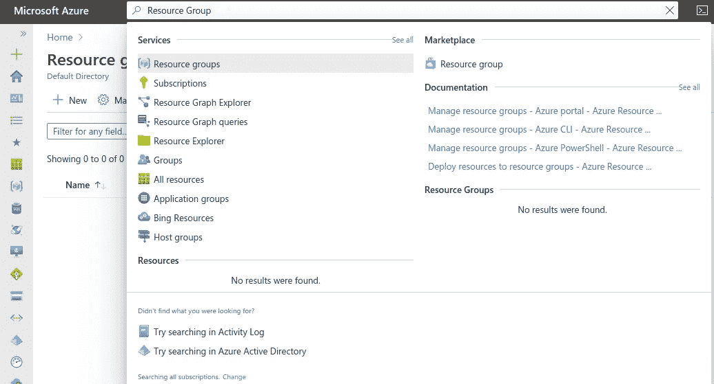

苏拉布什雷斯塔。利用 Azure 文件共享在多台机器之间共享数据集，而无需为每个虚拟机 1 下载。2021.JPEG 文件。

单击“新建”按钮后，您将被重定向到新页面。输入基本信息，然后点击“审核+创建”。

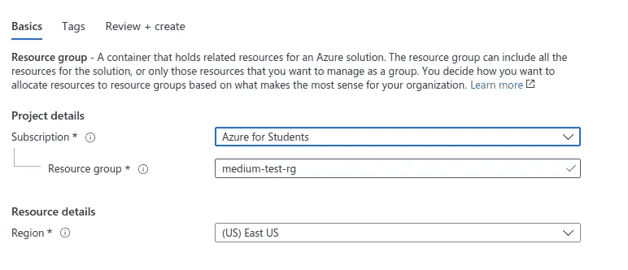

苏拉布什雷斯塔。利用 Azure 文件共享在多台机器之间共享数据集，而无需为每台虚拟机下载 2。2021.JPEG 文件。

您已经创建了一个资源组。现在是时候创建一个包含 **Azure 文件共享**和两个 **Azure 虚拟机的 **Azure 存储帐户**了。**搜索 Azure 存储帐户。

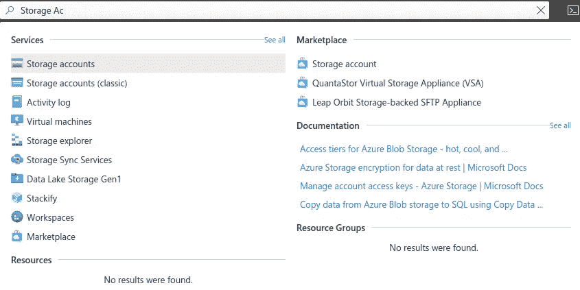

苏拉布什雷斯塔。利用 Azure 文件共享在多台机器之间共享数据集，无需为每台虚拟机下载 3。2021.JPEG 文件。

点击之后，填写基本细节，点击‘审核+创建’。

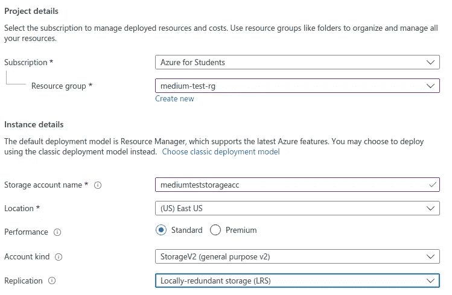

苏拉布什雷斯塔。利用 Azure 文件共享在多台机器之间共享数据集，而不需要为每个虚拟机 4 下载。2021.JPEG 文件。

对虚拟机也做同样的事情。

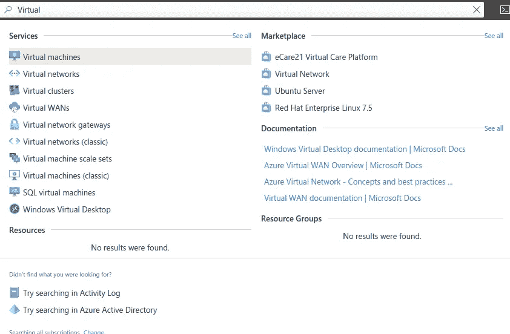

苏拉布什雷斯塔。利用 Azure 文件共享在多台机器之间共享数据集，而无需为每台虚拟机下载 5。2021.JPEG 文件。

如果您想要创建两个虚拟机并测试它们，您需要重复这个过程两次。创建单个虚拟机也很好。输入完基本信息后，点击“查看+创建”

苏拉布什雷斯塔。利用 Azure 文件共享在多台机器之间共享数据集，无需为每台虚拟机下载 6。2021.JPEG 文件。

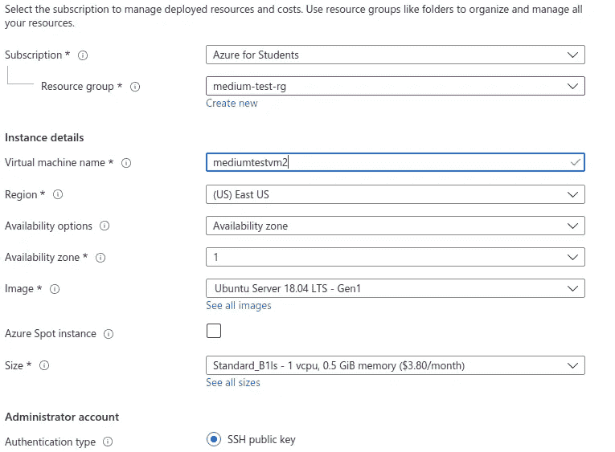

苏拉布什雷斯塔。利用 Azure 文件共享在多台机器之间共享数据集，无需为每台虚拟机下载 7。2021.JPEG 文件。

现在，转到您的存储帐户并选择文件共享。添加这些基本信息，创建一个文件共享，然后点击“创建”。

苏拉布什雷斯塔。利用 Azure 文件共享在多台机器之间共享数据集，无需为每台虚拟机下载 8。2021.JPEG 文件。

出于测试目的，在文件共享中添加一个文件。SMB 协议在端口 **445** 上工作，因此我们需要在我们的虚拟机上打开该端口。让我们转到您刚刚创建的虚拟机，然后选择“Networking”。

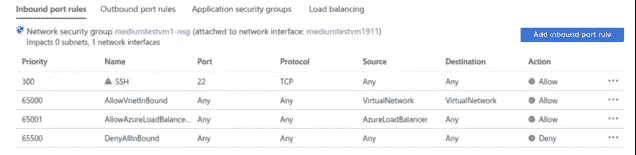

苏拉布什雷斯塔。利用 Azure 文件共享在多台机器之间共享数据集，而无需为每台虚拟机下载 9。2021.JPEG 文件。

点击“添加入站端口文件”，在两个虚拟机上添加入站规则 445。

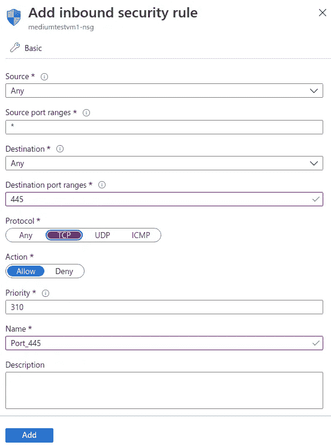

苏拉布什雷斯塔。利用 Azure 文件共享在多台机器之间共享数据集，而无需为每个虚拟机 10 下载。2021.JPEG 文件。

如上填写详细信息，然后点击“添加”。现在，打开虚拟机，因为是时候将文件共享装载到虚拟机中了。

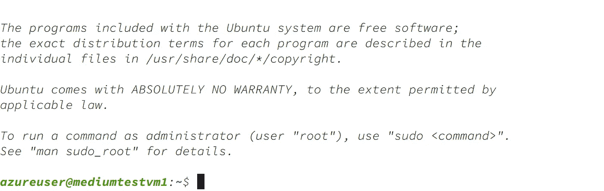

苏拉布什雷斯塔。利用 Azure 文件共享在多台机器之间共享数据集，而无需为每个虚拟机 11 下载。2021.JPEG 文件。

现在将这些命令输入到您的虚拟机中。

苏拉布什雷斯塔。利用 Azure 文件共享在多个机器之间共享数据集，而不需要为每个 VM 12 下载。2021.JPEG 文件。

在“az login”一行，您必须对您的虚拟机进行身份验证，才能访问存储帐户。有许多方法可以做到这一点，但' az 登录'是快速和简单的方法。输入命令后，会出现一个提示符

苏拉布什雷斯塔。利用 Azure 文件共享在多台机器之间共享数据集，而无需为每个虚拟机 13 下载。2021.JPEG 文件。

转到您登录到门户的浏览器，粘贴链接，然后输入代码。

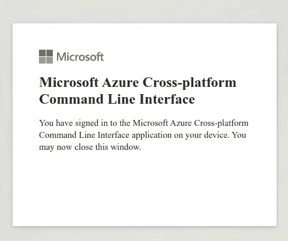

苏拉布什雷斯塔。利用 Azure 文件共享在多个机器之间共享数据集，而不需要为每个 VM 14 下载。2021.JPEG 文件。

完成后，您将通过身份验证，现在可以输入其余的命令了。

苏拉布什雷斯塔。利用 Azure 文件共享在多台机器之间共享数据集，而无需为每个虚拟机 15 下载。2021.JPEG 文件。

如你所见，你有你想要的文件。要测试它，请创建一个文件并检查存储帐户。对于我来说，我将在虚拟机上创建一个名为“能力名称. csv”的 CSV 文件。

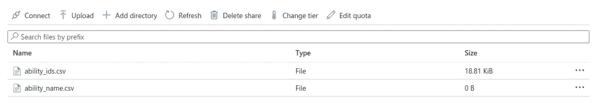

苏拉布什雷斯塔。利用 Azure 文件共享在多个机器之间共享数据集，而不需要为每个虚拟机 16 下载。2021.JPEG 文件。

如您所见，文件已创建并显示在这里。我们做到了。我们创建了一个文件共享，并与我们的两个虚拟机共享。

# **Azure 数据工厂和 AWS S3(可选):**

S3 真的很便宜，所以这就是为什么大多数数据都在那里，但你有你的 Azure 上的生产工作负载。Azure Data Factory 是在他们的两个服务之间创建管道来移动数据的完美工具。因此，让我们通过键入“数据工厂”并创建服务来开始吧。

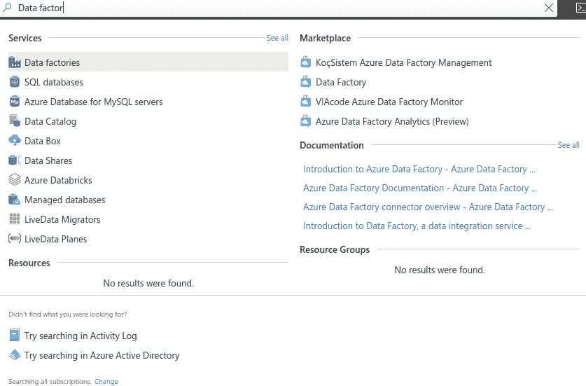

苏拉布什雷斯塔。利用 Azure 文件共享在多台机器之间共享数据集，而无需为每个虚拟机 17 下载。2021.JPEG 文件。

添加这些基本信息，然后点击“查看+创建”。

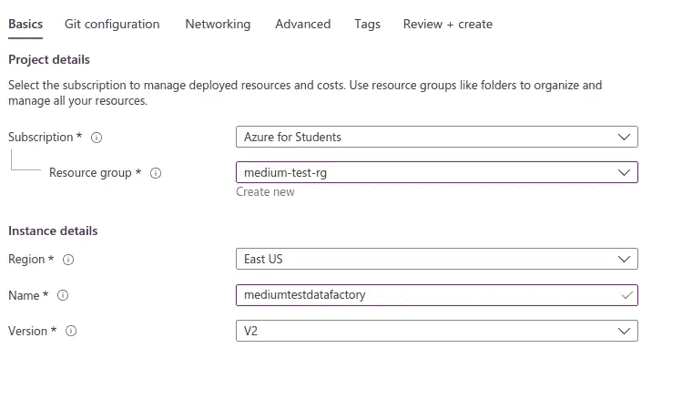

苏拉布什雷斯塔。利用 Azure 文件共享在多个机器之间共享数据集，而不需要为每个 VM 18 下载。2021.JPEG 文件。

转到新创建的服务，点击“作者和监控”

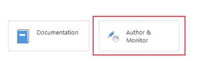

苏拉布什雷斯塔。利用 Azure 文件共享在多台机器之间共享数据集，而无需为每个虚拟机 19 下载。2021.JPEG 文件。

点击“复制数据”

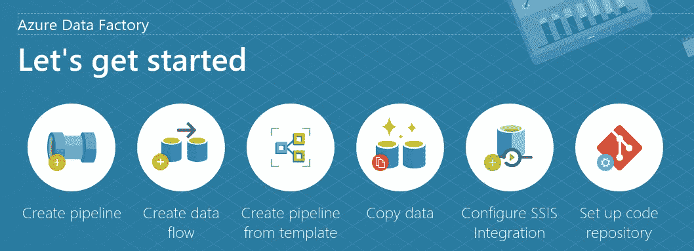

苏拉布什雷斯塔。利用 Azure 文件共享在多个机器之间共享数据集，而不需要为每个虚拟机 20 下载。2021.JPEG 文件。

给它一个名字，其余的作为默认。

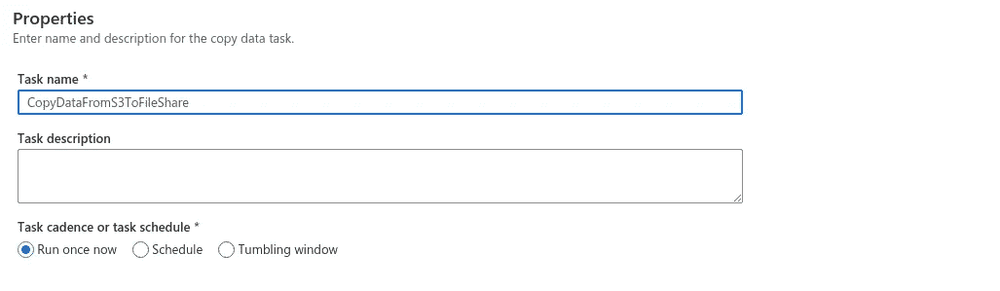

苏拉布什雷斯塔。利用 Azure 文件共享在多个机器之间共享数据集，而不需要为每个虚拟机 21 下载。2021.JPEG 文件。

点击“创建新连接”，然后选择“亚马逊 S3”

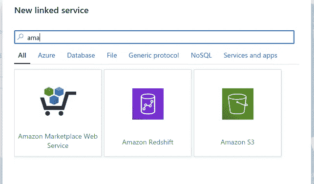

苏拉布什雷斯塔。利用 Azure 文件共享在多个机器之间共享数据集，而不需要为每个 VM 22 下载。2021.JPEG 文件。

现在，让我们去 S3。在单独的选项卡上打开 AWS 管理控制台，然后转到 IAM 用户并添加一个用户。

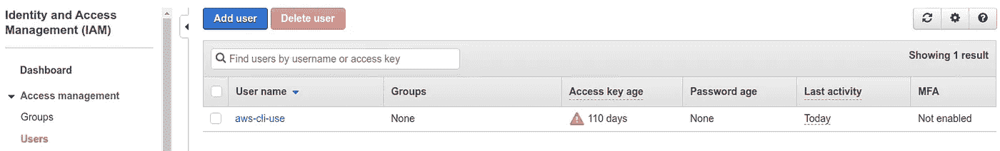

苏拉布什雷斯塔。利用 Azure 文件共享在多台机器之间共享数据集，而不需要为每个虚拟机 23 下载。2021.JPEG 文件。

给它一个名字，并允许编程访问。

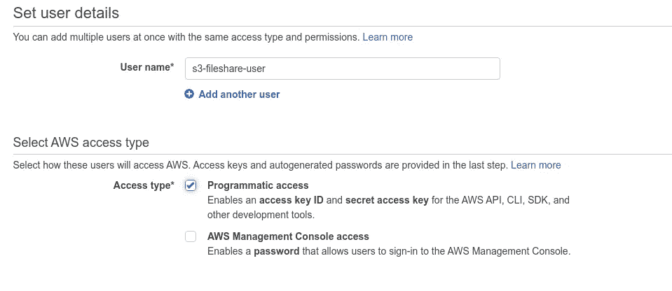

苏拉布什雷斯塔。利用 Azure 文件共享在多个机器之间共享数据集，而不需要为每个虚拟机 24 下载。2021.JPEG 文件。

选择“直接附加现有策略”,然后选择“AmazonS3FullAccess”并创建用户。

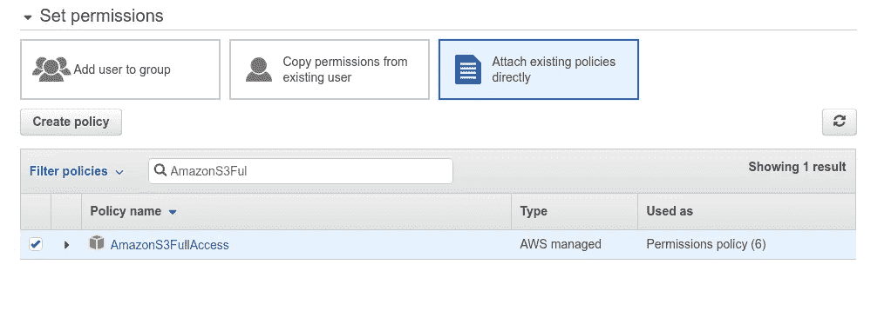

苏拉布什雷斯塔。利用 Azure 文件共享在多台机器之间共享数据集，而无需为每个虚拟机 25 下载。2021.JPEG 文件。

现在，系统会提示您使用您的**访问密钥 ID 和秘密访问密钥进入新页面。将这两把钥匙复制到一个安全的地方，因为这是你唯一能看到它们的时间。**

现在选择一个存储桶，将文件从 S3 复制到文件共享。我已经有了一个名为“copytofileshare”的存储桶，它包含多个 CSV 文件。我们将把这个桶复制到文件共享中。

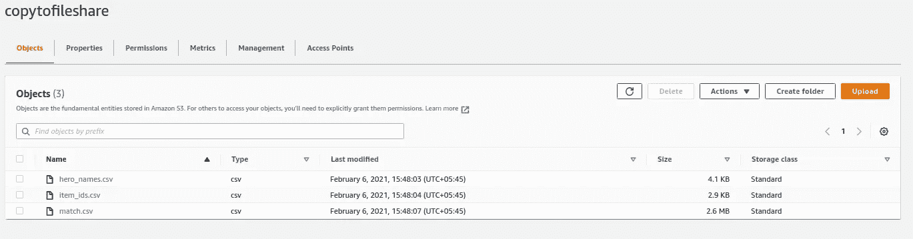

苏拉布什雷斯塔。利用 Azure 文件共享在多个机器之间共享数据集，而不需要为每个虚拟机 26 下载。2021.JPEG 文件。

转到你的 azure 选项卡，然后在空白处添加这些密钥 id 和秘密访问密钥，并点击“测试连接”。您应该可以连接到您的 S3 帐户。

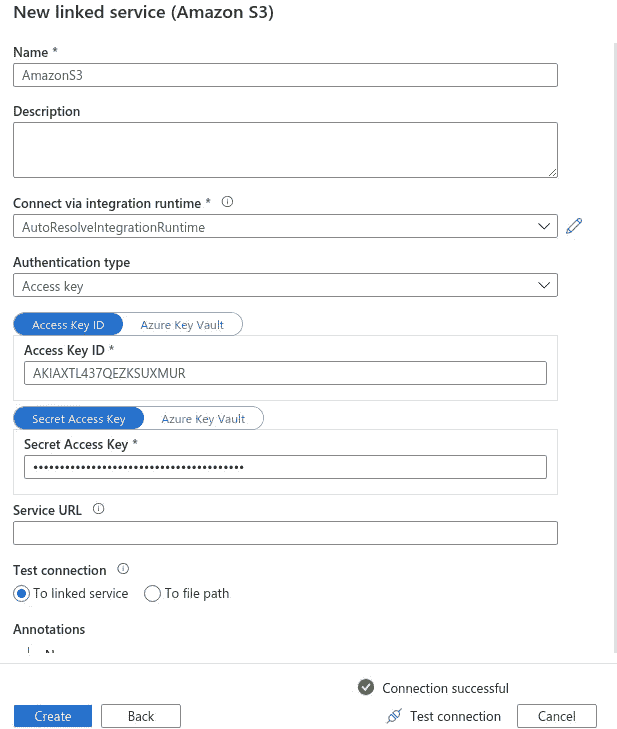

苏拉布什雷斯塔。利用 Azure 文件共享在多台机器之间共享数据集，而不需要为每个虚拟机 27 下载。2021.JPEG 文件。

测试成功后，点击“创建”。现在，在下一个提示中，您选择想要复制的 bucket。

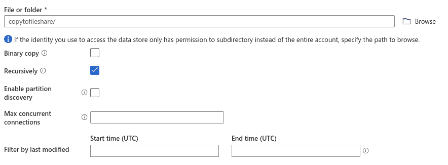

苏拉布什雷斯塔。利用 Azure 文件共享在多个机器之间共享数据集，而不需要为每个虚拟机 28 下载。2021.JPEG 文件。

现在我们必须创建目的地。选择“Azure 文件存储”，然后点击“继续”

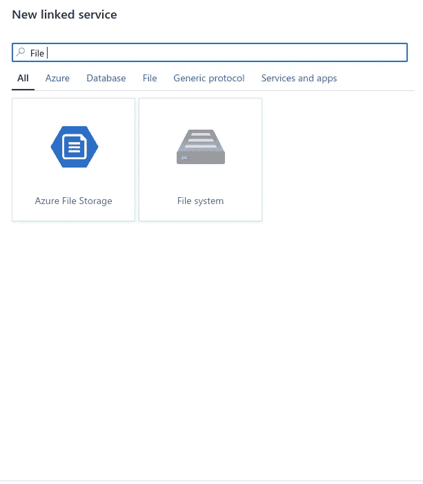

苏拉布什雷斯塔。利用 Azure 文件共享在多台机器之间共享数据集，而无需为每个虚拟机 29 下载。2021.JPEG 文件。

选择您的订阅帐户并测试您的连接。

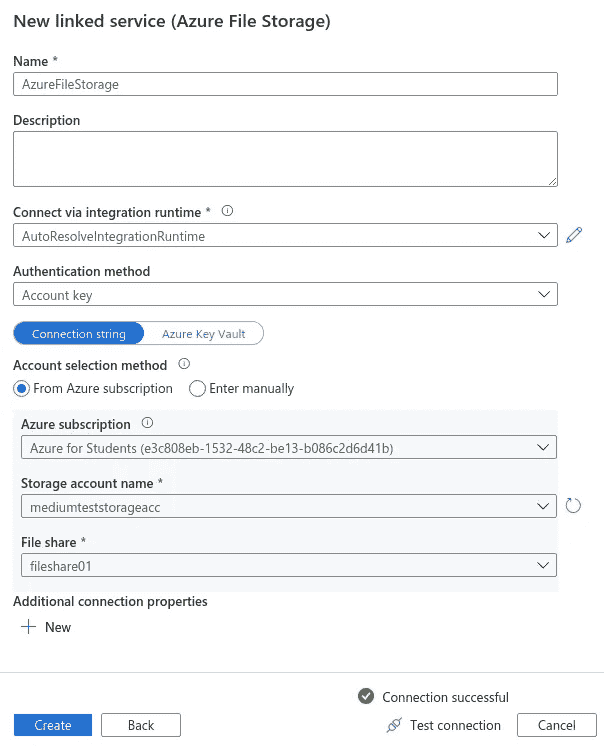

苏拉布什雷斯塔。利用 Azure 文件共享在多个机器之间共享数据集，而不需要为每个虚拟机 30 下载。2021.JPEG 文件。

点击 next，保留默认值，您可以看到管道将立即运行。

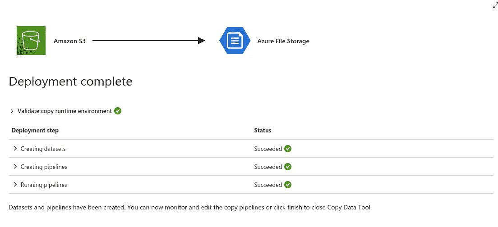

苏拉布什雷斯塔。利用 Azure 文件共享在多个机器之间共享数据集，而不需要为每个虚拟机 31 下载。2021.JPEG 文件。

现在，检查您的存储帐户以及您的虚拟机，看这些文件是否已复制。

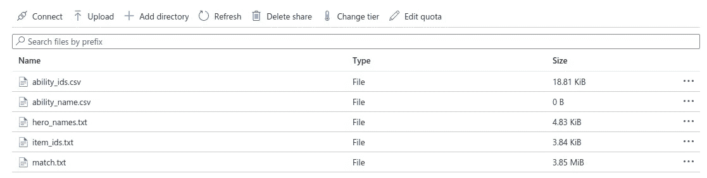

苏拉布什雷斯塔。利用 Azure 文件共享在多个机器之间共享数据集，而不需要为每个 VM 32 下载。2021.JPEG 文件。

苏拉布什雷斯塔。利用 Azure 文件共享在多个机器之间共享数据集，而不需要为每个虚拟机下载 33。2021.JPEG 文件。

# **结论:**

我们做到了。我们成功地将数据从 AWS S3 移动到 Azure 文件共享，并使用该文件共享向 Azure 虚拟机提供文件。现在，这些虚拟机可以利用这些 CSV 数据并在其上进行训练，甚至无需从 Azure 文件共享或 AWS S3 下载。

这只是一个从 S3 加载文件到文件共享的例子。数据工厂有许多服务，您可以从中将数据上传到文件共享。然而，选择是无穷无尽的，你想做什么取决于你自己。如果你遇到任何问题或难以遵循这些步骤，请在下面评论这篇文章或在 tsulabh4@gmail.com 给我发消息。你也可以在 [Linkedin](https://www.linkedin.com/in/sulabhshrestha/) 和 [GitHub](https://github.com/codexponent) 上和我联系。

# **资源:**

[1]挂载文件共享:[https://docs . Microsoft . com/en-us/azure/storage/files/storage-how-to-use-files-Linux](https://docs.microsoft.com/en-us/azure/storage/files/storage-how-to-use-files-linux)

[2] Azure 数据工厂:[https://docs.microsoft.com/en-us/azure/data-factory/](https://docs.microsoft.com/en-us/azure/data-factory/)