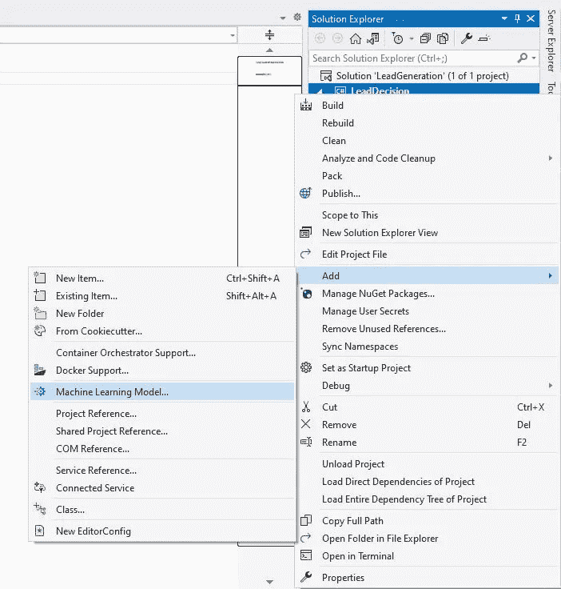
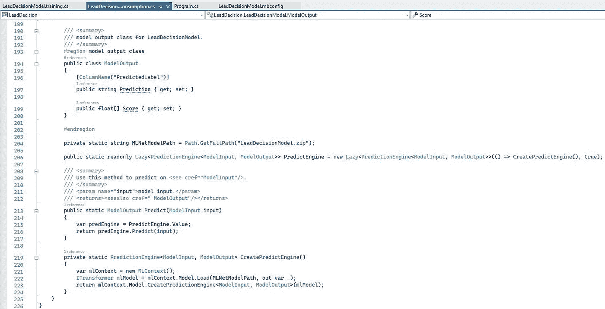
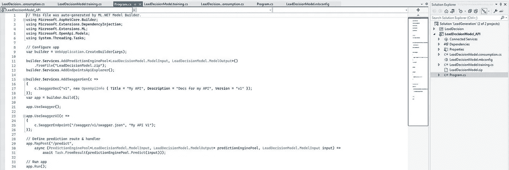

# 使用模型生成器和 AutoML 在 Microsoft ML 中创建销售线索决策和销售线索评分模型。网

> 原文：<https://towardsdatascience.com/utilizing-the-model-builder-and-automl-for-creating-lead-decision-and-lead-scoring-model-in-19888f12d529?source=collection_archive---------14----------------------->

## 创建、训练、评估和使用机器学习模型的逐步指南。网

Rodolfo Clix 摄于 Pexels

最近，我写了一篇文章，解释了 ONNX 格式在将 Scikit-learn 线索评分机器学习模型集成到。网络生态系统。我描述了一种将基于 Python 的回归模型部署为 Microsoft Azure 函数的可能方式。这是一个适用于将经过训练的模型集成为 Web API 或控制台应用程序的一部分的过程。我提到的是有机会使用这种方法来弥合不同数据科学和应用程序开发平台之间的技术差异，在这种情况下，目标是[。NET 跨平台框架](https://dotnet.microsoft.com/)。谈论微软。NET，这是我每天专业使用的技术，在这篇文章中，我想揭示该框架的本机机器学习潜力，更具体地说，是 ML.NET 的[。](https://dotnet.microsoft.com/apps/machinelearning-ai/ml-dotnet)

因为我已经在。NET，我将继续介绍线索决策解决方案的**实现，作为使用 KNIME 平台设计和实现的[线索决策解决方案的延续。正如文章中提到的，它在概念上遵循相同的方法和监督 ML 思想，不同之处仅在于基于分类的预测策略。除此之外，我还将**介绍和利用线索评分的概念**，作为所创建模型的预测评估的一部分。](https://medium.com/@cekikjmiodrag/building-machine-learning-model-for-lead-decision-using-tree-ensemble-learner-in-knime-1217bb17ffcc)**

**注意:本文的解决方案设计和源代码经过了简化，以强调核心概念和集成策略。尽管如此，它仍然是一种功能齐全的方法，用于在真实测试或生产部署的原型和应用环境中培训、构建、评估和实施基于预测决策/监督驱动的模型。*

***注意:我将利用由自动机器学习或 AutoML 支持的 Model 模型生成器，使用直观且用户友好的图形化 Visual Studio 扩展来设计和构建解决方案。关于构建数据处理和转换管道、定制训练和测试数据分割、应用交叉验证的概念以及模型性能和评估的解释的更详细的技术超出了本文的范围，可以通过 ML.NET API 进行参考。*

# 什么是 ML。网？

ML。NET 代表了一个开放源代码和跨平台的机器学习框架，可以合并和使用。NET 相关的应用程序。它提供了对各种流行用例的支持，能够使用已经存储的应用程序数据在不同的业务领域中构建不同的模型。其核心概念是围绕[模型构建器](https://dotnet.microsoft.com/apps/machinelearning-ai/ml-dotnet/model-builder)设计的，这是一种工具机制，指定了将输入数据转换为预测所需的步骤。作为补充，它还使用了自动化 ML，这是一个被称为 [AutoML](https://docs.microsoft.com/en-us/dotnet/machine-learning/how-to-guides/how-to-use-the-automl-api) 的概念，它包装并简化了接口，提供自动生成的代码项目来描述输入数据和消费模型。除此之外，另一个基础模块[ML.NET CLI](https://docs.microsoft.com/en-us/dotnet/machine-learning/automate-training-with-cli)支持机器学习的集成。总的来说，ML.NET 使用 C#和 F#编程语言支持训练、构建和评估机器学习模型。

# 环境准备

跟随最新的微软趋势和公告， [Visual Studio 2022](https://visualstudio.microsoft.com/vs/preview/) 和最终(目前为止)版本[。NET 6](https://dotnet.microsoft.com/download/dotnet/6.0) 将于 2021 年 11 月正式发售。传统上，他们发布预览版本供社区使用，以完善主要版本。在这方面，我很高兴使用 **Microsoft Visual Studio 社区预览版** **(版本 17.0.0，预览版 4.1)** 和当前的**进行实际演示。NET 6 预览版**框架。

作者图片

**注意:使用 ML.NET 模型生成器的先决条件是 Visual Studio 2019 16.10.4 或更高版本/。NET Core 3.1 SDK 或更高版本。*

# 创建解决方案

我将从头开始演示，创建一个新的解决方案**“lead generation”**，由名为**“lead decision”**的单一控制台应用程序组成，在这个过程中，选择**非常重要。NET 6(预览版)作为目标框架**。完成此设置将导致在新的。NET 6 模板。

作者图片

作者图片

作者图片

# ML。净延伸

在 Visual Studio 中安装和启用 Model 模型生成器可以使用 **Visual Studio 安装程序**进行配置，并相应地修改当前版本的安装。一般来说，ML.NET 组件放置在**单个组件**之下，更准确地说是在**中。净截面**。

作者图片

作者图片

此外，[ML.NET 模型构建器 UI 扩展工具](https://marketplace.visualstudio.com/items?itemName=MLNET.07)应该安装在主菜单栏上的扩展管理区域。

作者图片

# 资料组

由于本文将遵循 lead decision predictive ML 模型的设计和实现，因此我将利用我上一篇文章中使用的相同的分析、处理和缩放数据集的优势，使用 KNIME 平台构建模型。在这方面，最初的[线索评分原始数据集在 Kaggle](https://www.kaggle.com/amritachatterjee09/lead-scoring-dataset) 上公开。

# ML。NET 模型生成器安装程序

如前所述，**模型构建器**代表了一个非常**用户友好的图形工具扩展**，用于管理 Visual Studio 中的机器学习过程。它的主要特点是 **mbconfig 配置文件**，它管理当前会话并跟踪 ML 模型构建每个阶段的特定变更。提供完整 ML 体验的模型构建器可以按照下面的步骤添加到创建的项目中。

作者图片

作者图片

添加机器学习支持将实际打开模型构建器细节，我将在其中浏览所有步骤，以便构建和评估销售线索决策模型。

# 场景选择

**Model Builder 即将配备大量** [不同的内置场景用于机器学习应用](https://docs.microsoft.com/en-us/dotnet/machine-learning/resources/tasks)。事实上，每个场景都映射到不同的学习方法，这取决于特定的业务领域用例。由于我正在构建销售线索决策预测模型，我将根据分类相关算法选择**数据分类场景**。

作者图片

# 培训环境

如图所示，数据分类场景只有本地支持的**，这意味着模型训练将在我的本地机器上执行。因此，考虑到目前不支持 **Azure 和 GPU 训练模式**，这里唯一有效的选择仍然是具有 CPU 能力的**本地环境**。**

****

**作者图片**

# **导入数据**

**有两种导入数据集的不同选项，使用文件或通过来自 SQL Server 实例的数据源。考虑到我已经从 Jupyter 笔记本中**导出了 csv 文件，我将浏览本地系统路径来导入它。****

****

**作者图片**

**如屏幕截图所示，成功导入的结果是数据集预览，然后是附加的数据配置选项。就此而言，下一步是选择**‘已转换’**作为**标签或目标列**，同时打开**高级数据选项**以便检查和**配置其他功能**。该配置包括将所有其他列设置为单个数字特征，不包括与模型构建无关的**‘column 1’**(保存与特定行号相关的数字信息)。**

****

**作者图片**

****注:代表****‘未转换’导联*** *，代表****‘转换’导联*** *。在数据处理过程中，* ***【已转换】列也可以作为分类*** *对齐，这样分类描述就可以发生，而不是处理整数(转换成字符串)。***

# **火车模型**

**下一步是训练配置，我将配置训练模型的时间。事实上，这是一个自动化的过程，模型构建者利用 AutoML 的优势和灵活性来研究和应用许多具有各种参数的不同模型。因此，通过指定**更多的训练时间来覆盖 10 秒的默认时间间隔，将揭示探索更多模型的可能性，从而最大化检索更准确的最终模型**的机会。据此，我将时间间隔设置为 900 秒(15 分钟)。这里值得一提的是，[官方的微软指南根据数据集的大小给出了推荐的时间间隔](https://docs.microsoft.com/en-us/dotnet/machine-learning/automate-training-with-model-builder#how-do-i-understand-my-model-performance)。**

****

**作者图片**

**训练过程和不同模型的选择在**输出窗口**中可用，在这里每**个模型选择以及迭代精度都被呈现**。**

****

**作者图片**

****

**作者图片**

**最后，当训练过程成功完成时，模型构建器是一个完整的生成**实验结果摘要**，其格式如下图所示。**

****

**作者图片**

**此外，我可以在**列车区域**查看流程的输出，在这里**最佳性能模型被呈现**。**

****

**作者图片**

**在此特定场景中，[LightGbmMulti(lightgbmmultistrainer 类)](https://docs.microsoft.com/en-us/dotnet/api/microsoft.ml.trainers.lightgbm.lightgbmmulticlasstrainer?view=ml-dotnet)被评估为提供最佳模型准确性的最佳算法。**

# **评估模型**

**再往前走，我有机会**评估最佳模型精度**。此外，值得强调的是，我有与模型交互的**可能性，这意味着我可以提供一些迄今为止尚未看到的数据，并立即查看预测。****

****

**作者图片**

# **消费模型**

**完成评估流程后，我将继续进入消费模型屏幕。如下图所示，在感兴趣的最终应用程序中，有一个**代码片段用于显式模型集成和完善。最终应用程序可以是我已经创建的**控制台应用程序**，但是我还将展示如何将模型集成到生成的 **Web API** 中(使用添加 Web API 解决方案选项)。****

****

**作者图片**

**我将在名为**leaddositionmodel _ API**的解决方案中生成 Web API 应用程序作为单独的项目。**

****

**作者图片**

****

**作者图片**

# **后续步骤**

**作为模型构建之旅的总结，还有两个额外的可能性，即[“部署您的模型”](https://docs.microsoft.com/en-us/dotnet/machine-learning/how-to-guides/serve-model-web-api-ml-net)和[“改进模型”](https://docs.microsoft.com/en-us/dotnet/machine-learning/resources/improve-machine-learning-model-ml-net)部分。事实上，它们目前被实现为一个重定向按钮，用于处理官方文档，在那里可以找到与模型改进和部署相关的更多细节。**

****

**作者图片**

# **控制台应用程序触摸**

**考虑到在**模型构建器的消费步骤**中集成和消费模型所生成的代码片段，我将**将其复制到 Program.cs 文件**中。**

****注意:即使在 UI 工具关闭后，也可以访问 mbconfig 配置文件。***

**在注释了预定义的控制台应用程序模板代码并粘贴了从模型构建器生成的代码之后，我只需要引用生成实际模型输入类的 LeadDecision 名称空间。**

****

**作者图片**

**在这种情况下，利用 **Visual Studio 内置调试器**，我将启动应用程序并检查结果输出对象的类型和内容。**

****

**作者图片**

**因此，可以看出，结果输出表示**模型输出对象**，包括**预测和成功或不成功的线索转换的分数或概率**。这明确意味着我们可以**使用这种方法来创建和分析机器学习模型，用于预测性线索决策和线索评分系统**。**

****

**作者图片**

**在将模型集成到之前生成的 Web API 之前，我想展示并解释一下**leaddocisionmodel . MB config**结构。**

****

**作者图片**

****leadecisionmodel . training . cs 文件**由**生成的机器学习模型**组成，包括选择的算法及其配置参数、**输入特征集**和**对预测标签的配置**。如下面的屏幕截图所示，一切都被包装在管道转换中，该转换在执行管道和拟合模型的方法中引用。**

****

**作者图片**

**另一方面，**leaddositionmodel . cons option . cs**文件由描述输入特征的 ModelInput 类、 **ModelOutput** 类(包含预测输出结果(预测和得分)以及覆盖模型预测功能的**预测引擎**组成。最后一个是使用 **MLContext 类**和**it transformer 接口**生成的，它可以[用于更高级的定制 ML 解决方案](https://docs.microsoft.com/en-us/dotnet/machine-learning/how-to-guides/train-machine-learning-model-cross-validation-ml-net)。**

****

**作者图片**

****

**作者图片**

**最后，**leadecisionmodel . zip 档案**包含创建和训练机器学习模型所需的所有文件**。从前面的屏幕截图可以看出，预测引擎构造中引用了 zip 存档的路径，基于监督的预测就是从这里进行的。****

****

**作者图片**

# **Web API 触摸**

**让我们回忆一下，Web API 项目是使用**模型构建器 UI 工具**中的**添加到解决方案**选项自动生成的。因此，它被创建为 **LeadGeneration solution** 中的一个独立项目，自动合并相同的文件以支持所创建模型的集成。一般来说，用于销售线索决策和**销售线索评分**的 **ML 模型现在是 API 项目**的**组成部分。考虑到。NET 目标框架，Web API 现在**遵循新的轻量级最小设计**，由下面截图中的**ML.NET 模型生成器**生成。****

****

**作者图片**

**我将启动 API 项目并尝试调用预测端点，因为 **MapPost** 功能正在定义一个暴露其路由和处理程序的。就此而言，我将继续使用 [Postman API 平台](https://www.postman.com/)来准备端点 url 和 POST 请求主体。**

****注意:绑定 url 和端口是 launchSettings.json 配置文件中 iisSettings 配置部分的一部分。***

****

**作者图片**

****

**作者图片**

**predict API 调用成功，检索回了潜在客户模型的预测/决策和分数。**

# **最后的话**

**在这篇文章中，我介绍了一个详细的逐步过程**，该过程利用 ML.NET 框架**内的模型构建器 AutoML 的优势来构建线索决策和线索评分预测机器学习模型。这个机器学习框架是。NET 生态系统，并且可以非常容易地用于构建与特定业务领域任务和数据相关的不同用例场景。如参考文章中所述，**该策略是处理和解释营销和销售数据的最广泛系统方法的一部分，旨在建立更具洞察力和实用性的销售线索挖掘流程**。**

**在中本机工作。NET 生态系统，使用 ML.NET 和自动化模型生成器 UI 工具，对于热衷于将机器学习集成到应用程序中的应用程序开发人员来说，可能是一个优势。此外，ML.NET 为在机器学习和人工智能方面经验丰富的软件开发人员提供了一个完整的设计框架。**

**我将 ML.NET 与基于 Python 的 Scikit-learn ML 库、R Studio 和 KNIME 平台结合使用，并尝试最大化所有不同可能性和内置算法的全部潜力和灵活性。从我的角度来看，没有一个单一的和最好的环境或库，但一切都取决于具体的业务用例和领域。**

**— — — — — — — — — — — —**

**感谢您阅读文章。我相信它在涵盖使用微软 ML.NET 框架构建和评估机器学习模型的所有方面方面是有建设性的和全面的。**

**目前，我正致力于在生物信息学中利用机器学习算法，更准确地说，是理解微生物组在癌症诊断和治疗中的作用。因此，我将前面提到的所有平台的潜力结合起来，探索数据和知识的全部潜力及其背后的洞察力。**

**欢迎随时开始讨论，分享你在这方面的想法和经验。**

**如果您能花时间评论、分享文章并联系我们进行进一步的讨论和潜在的合作，我将不胜感激。**

**【https://www.linkedin.com】最初发表于<https://www.linkedin.com/pulse/utilizing-model-builder-automl-creating-lead-decision-miodrag-cekikj/>**。****