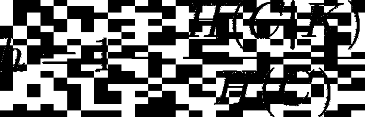
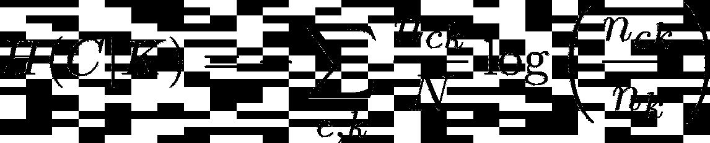
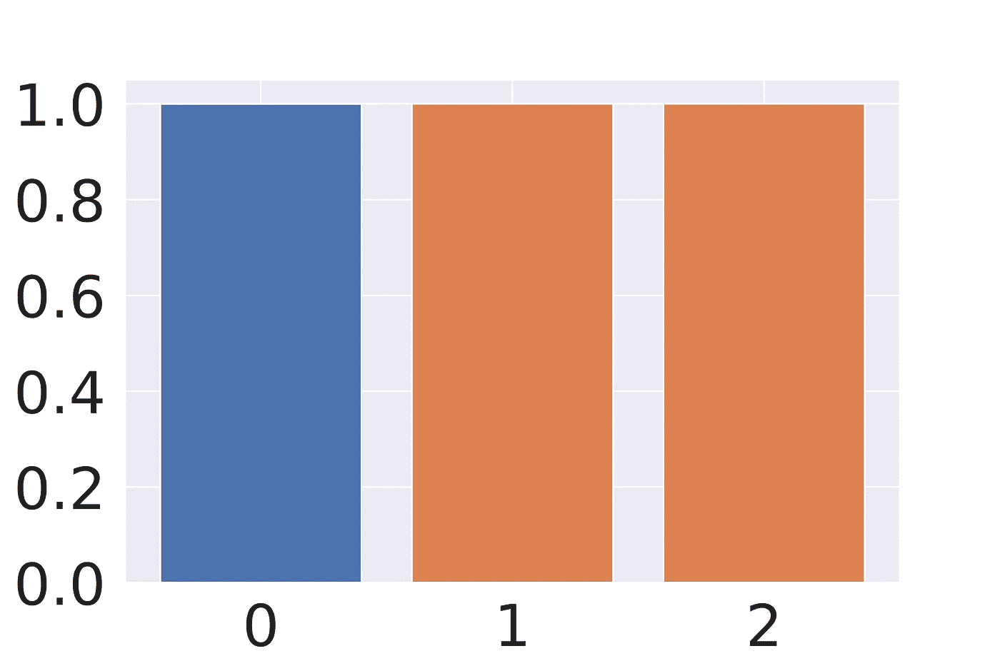
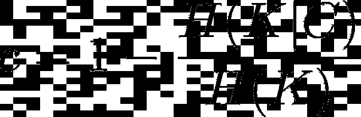
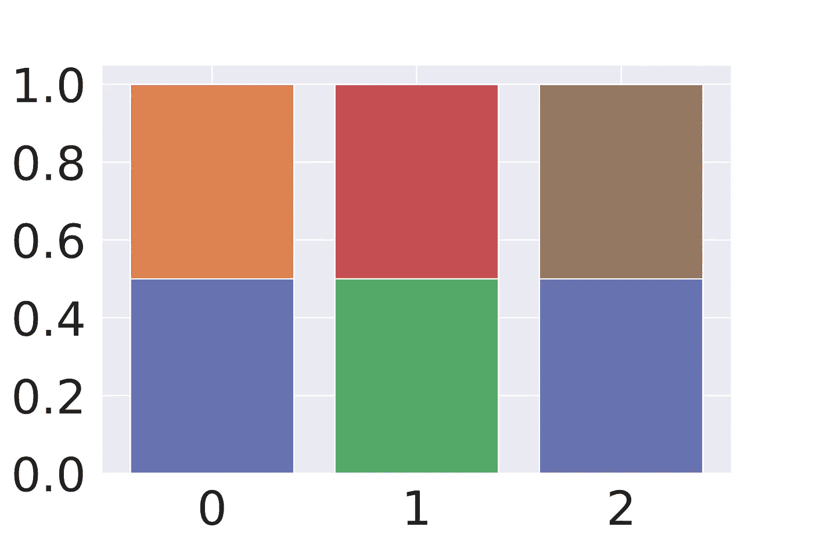
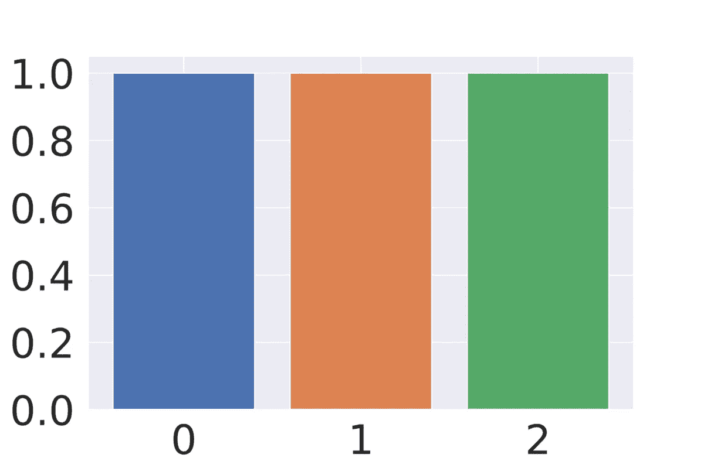
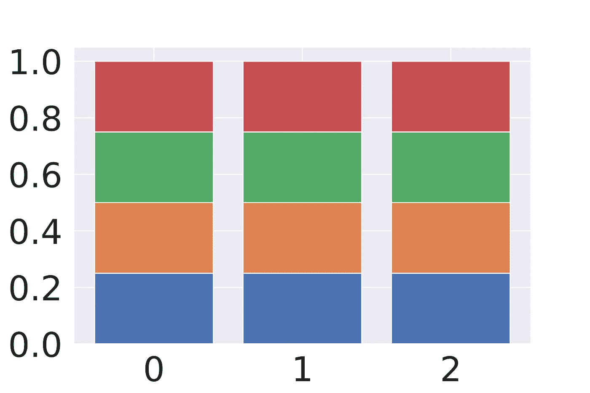
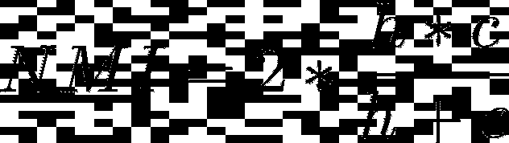

# v 测度:同质的完全聚类

> 原文：<https://towardsdatascience.com/v-measure-an-homogeneous-and-complete-clustering-ab5b1823d0ad?source=collection_archive---------6----------------------->


萨姆·穆卡达姆在 [Unsplash](https://unsplash.com?utm_source=medium&utm_medium=referral) 上拍摄的照片

## 有意义的分数

**聚类**是一种机器学习技术，涉及数据点的分组。给定一组数据点，我们可以使用聚类算法将每个数据样本分类到特定的组(簇)中。

聚类是**无监督学习**的一种方法，是许多领域使用的统计数据分析的常用技术。数据科学家希望同一聚类中的样本具有相似的属性、特征或行为。例如，可以对癌症样本进行聚类，希望同一组中的样本属于同一癌症亚型[2]。

一旦聚类运行，人们必须定性地评估输出的**优度。首先，验证分组是否真的**有意义**，而且有分数可以作为**评估不同模型**并选择**最佳模型**的代理。**

有许多不同的分数，每一个都有它的优点和缺点。

<https://scikit-learn.org/stable/modules/clustering.html#clustering-evaluation>  

其中一个度量是所谓的 **V-measure(或归一化互信息)得分**。这种方法的一个优点是它可以分解成两个容易可视化的指标。

# 标准化互信息

这个分数可以解释为另外两个测量值的平均值:**同质性**和**完整性**。

## 同种

同质性衡量一个聚类中样本的相似程度。它是用[香农熵](https://en.wikipedia.org/wiki/Entropy_(information_theory))定义的。



同质性。图片作者。

给定 H(C|K)公式。



很容易理解为什么会这样。如果观察项 H(C|K ),它包含 n𝒸ₖ / nₖ，其代表在聚类*k*t31】中标记为 *c* 的样本数量**与聚类*k*t35】中样本总数**之间的**比率**。****

当聚类*k*中的所有**样本都具有**相同标号*c*时，**同质性**等于 **1** 。****

注意，在 **c** 和 **k** ，**上有一个和，哪个是包含特定标签的聚类**并不重要，至少有一个就足够了。这在运行输出与标注无关的无监督方法时非常有用。

这是一个同构集群的例子。所有三个聚类只包含一种颜色(特征)，换句话说，同一聚类中的所有样本共享它们的标签。



同构集群的示例。图片作者。

无论如何，这种情况不是最佳的，因为橙色样本被分成不同的群。在本例中，特征是不完整的。

## 完全

尽管完整性度量了聚类算法将多少相似的样本放在一起。



图片作者。

很容易理解为什么会这样。如果观察术语 H(K|C ),它包含 n𝒸ₖ / n𝒸，其代表在聚类*k*中标记为 *c* 的样本数量**与标记为*c*t29】的样本总数**之间的**比率**。****

当所有种类为*c*的**样本都被分配到**同一个聚类*k*时，**完整性**等于 **1。******

这是一个完整聚类的例子。每种颜色只存在于一组中。在这种情况下，具有相同属性的所有**点被分类在一起**。请注意，完整并不意味着同质，事实上在每个集群中有多种颜色。



完整聚类示例。图片作者。

现在我们已经了解了这两个指标，很明显，一个最佳算法将能够获得一个既**同质**又**完全**的分区。在这种情况下，具有特定颜色的所有样本被放在一个聚类中，并且该聚类仅包含它们。如果算法是无监督的，那么很明显，利用这个输出，它已经正确地学习了特征。



最佳聚类的示例。图片作者。

否则，最差的聚类可能是**既不是同质的**也不是**完全的**。在这种情况下，每个聚类包含多个标签，并且每个标签被分配给多个聚类。在这种情况下，两个测量值都是**零**。



不良聚类的示例。图片作者。

## 标准化互信息

最后，为了获得我们的聚类算法的良好性的度量，我们可以考虑在**同质性**和**完备性**之间的**调和平均值**，并且获得 **V 度量**或**归一化互信息**(NMI)【1】。



标准化互信息。图片作者。

这个分数是一个介于 0-1 之间的度量值，它实际上量化了聚类分区的好坏。实际上，它要求**同时最大化**同质性 **h** 和完备性 **c** (当 h 和 c 都为 1 时，NMI 为 1)。此外，如果聚类**不满足两个条件**中的任何一个，NMI 将为**零**。

这种度量有很多，但是由于它在同质性和完备性两个度量中的分解，它的**可解释性**是**清晰**和**直观**。

# sklearn

现在，您已经执行了聚类，并希望估计 NMI。Sci-kit learn 已经实现了**,所以估计它真的很容易。**

**<https://scikit-learn.org/stable/modules/generated/sklearn.metrics.v_measure_score.html>  

这里有一个简单的例子。从这个例子中还可以清楚地看出，分数不依赖于标签的名称，正如前面所讨论的，对于每个标签排列都是一样的。

```
**from** **sklearn.metrics.cluster** **import** v_measure_score
>>> v_measure_score([0, 0, 1, 1], [0, 0, 1, 1])
1.0
**>>>** v_measure_score([0, 0, 1, 1], [1, 1, 0, 0])
1.0
``` 

# **参考**

1.  **赫希伯格；V-Measure:一种基于条件熵的外部聚类评估。 (2007 年)，《欧洲自然语言文学会议录》。**
2.  **瓦莱，f；奥塞拉，m；Caselle，m .[TCGA 乳腺癌和肺癌转录组数据的主题建模分析](https://www.mdpi.com/2072-6694/12/12/3799)。(2020)癌症**