# 疫苗功效(以新冠肺炎为例)—贝叶斯后验 VE/CI 计算

> 原文：<https://towardsdatascience.com/vaccine-efficacies-with-covid-19-examples-bayesian-posterior-ve-ci-calculations-91b3f489423?source=collection_archive---------57----------------------->

## 疫苗效力的贝叶斯统计分析和选定新冠肺炎疫苗的计算概述。

有趣的是，辉瑞/BioNTech 对其新冠肺炎疫苗的主要终点进行了贝叶斯分析。去年已经有一些关于这方面的文章了(参见下面的参考资料部分)，所以我不会重复所有的内容。这篇文章的目的是提供(1)用于评估疫苗效力的方法的概述，(2)贝叶斯统计分析的更多细节，包括为了完整性和完全概括报告的结果而对监测时间进行的调整(虽然很小，但在辉瑞/BioNTech 研究中使用了),以及(3)采用这种方法分析其他选择的新冠肺炎疫苗(最初使用 frequentist 方法)。

# 疫苗效力

我们测量疫苗效力的方法定义如下:

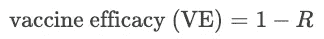

R 可以是风险比(RR，风险比)；比率(IRR，发病率比率)；或危害(HR，危害比)。由于这些比率，我们认为疫苗效力是一个相对的衡量标准——与未接种组相比，接种组的感染或疾病相对减少了多少。VE 为 90%意味着接种疫苗组的病例比安慰剂组少 90%。我们将使用下标 *v* 和 *p* 分别表示接种疫苗组和安慰剂组；但是很明显，这个讨论适用于任何两个治疗组之间的比较——不一定是安慰剂。

**带 RR**

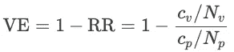

其中 *Nv* 和 *Np* 分别是接种疫苗组和安慰剂组的参与者总数。

**内含内部收益率**

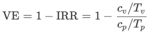

其中 *Tᵥ* 和 *Tₚ* 分别为接种疫苗组和安慰剂组的时间-人年。

**带 HR**

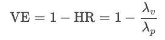

其中 *λᵥ* 和 *λₚ* 分别是接种疫苗组和安慰剂组的风险率。这衡量了感染风险的相对减少。风险比可以通过例如 Cox 回归模型来估计。

# 选择新冠肺炎疫苗

考虑到上述措施，我们将简要强调选定的新冠肺炎疫苗及其方案特征。我们不会详细讨论纳入/排除标准(请参考实际方案)——以下信息仅用于强调每种疫苗的关键参数。作为参考，请注意世卫组织和 FDA 对 VE 的建议是，中期分析调整 VE 的置信区间的下限应大于 30%，VE 的点估计值至少为 50% [1]。

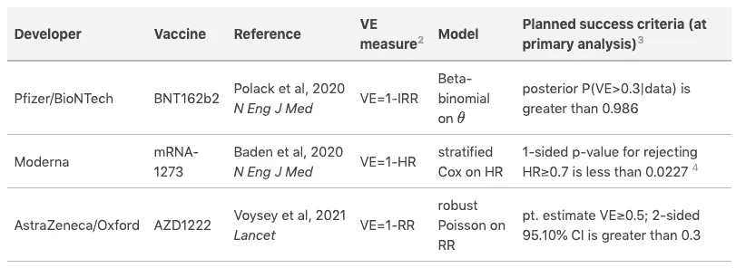

新冠肺炎疫苗试验选择方案特点。按作者分类的表格。

新冠肺炎确诊病例的构成，包括监测的开始时间，在不同的试验中是不同的。最值得注意的是，

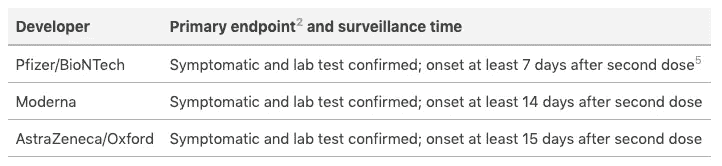

新冠肺炎疫苗试验主要终点定义。按作者分类的表格

# 贝叶斯统计分析

**定义**

虽然疫苗效力是我们感兴趣的衡量标准，但我们在统计分析中关注的参数是 *θ* ，定义为病例率——接种疫苗组中总病例的比例。

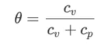

从 VE = 1-(c*ᵥ*/*tᵥ*)(c*ₚ*/*tₚ*)，我们可以推导出 *θ* 的表达式，以及 ve 关于 *θ* 的表达式，

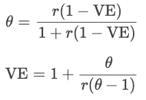

其中 *r = Tᵥ* / *Tₚ* ，接种组与安慰剂组的人次比。

如果 *Tᵥ* 和 *Tₚ* 相等(即两组之间的随访次数和大小相等)，我们看到上面的等式简化为:

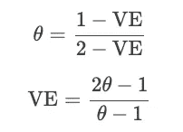

因此，我们看到 *r* 是两组间监测时间差异的调整因子。我们还可以看到 *θ* 与 VE 的关系，

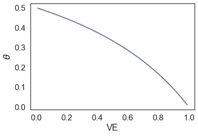

VE 与 *θ的关系。图片作者。*

当我们的疫苗效力为零时， *θ* 为 0.5，这意味着接种疫苗组的病例数并不比安慰剂组好(实际上两者是相同的病例数)。

**后验计算**

在贝叶斯框架中，我们想知道后验 P(VE>0.3| *x* ，其中 *x* 是观测数据(即 c *ᵥ* 和 c *ₚ* )。然而，实际上我们并没有直接对虚拟企业建模。相反，根据我们上面的定义，我们将基于案例率 *θ* 进行建模。这部分是因为 *θ* 是一个比例，范围从 0 到 1，因此我们可以很容易地放置一个基于 beta 分布的先验，它也限制为(0，1)。从我们上面的定义，我们很容易看到，通过知道 *θ* ，我们也知道 ve，反之亦然。因此，后验 P(VE > 0.3| *x* )等价于 P(*θ*<(1–0.3)/(2–0.3)|*x*)，或者 P(*θ*<0.4117647 |*x【T57)，假设 1:1 设计，监测次数相等。*

记住，根据贝叶斯法则，

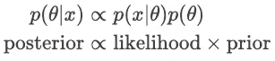

数据 *x* 遵循二项式分布，因为我们正在询问接种组的病例数，总共有 *n* 个病例，接种组中此类病例的概率为 *θ* 。我们可以将 *θ* 的先验定义为遵循贝塔分布。因此，

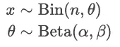

我们可以扩展后验概率的表达式，基于可能性和先验分布，

但最后一个表达式只是另一个贝塔分布，所以后验可以表示为，

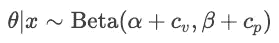

这也是为什么β是二项分布的共轭先验，因为后验也是β分布。我们不会在这里讨论更多的细节，但是后验预测分布是一个β-二项式分布。

我们可以选择什么样的先验？如果我们对检验后验 P(*θ*<0.4117647 |*x*)感兴趣，我们可以设置先验贝塔分布，使得平均值就是这个值。这正是辉瑞/BioNTech 所做的——之前使用的是 Beta(0.700102，1)，因此平均值为 0.700102/(0.700102+1) ≈ 0.4118。

现在来计算后验 P(*θ*<0.4117647 |*x*)，这简单来说就是后验 beta 分布的 CDF 高达 0.4117647。在实际的临床试验结果中(与临床设计相反)，接种疫苗组和安慰剂组之间的监测时间可能有轻微差异，这是可以解释的。即 P(VE > 0.3| *x* )等价于 P(*θ*<(*r*(1–0.3))/(1+*r*(1–0.3))|*x*)。

通过计算第 2.5 和 97.5 百分位的后验概率，可以得到 95%可信区间。下限/上限 *θ* 可用于导出上限/下限 ve 值(使用 *r* 进行监视时间调整)。

在进入下一部分之前，我们将使用我们讨论过的先验知识，探索不同的 *θ* 值对可能性和后验概率的影响。例如，我们将设置总共 150 个病例，并改变接种组中观察到的病例数。

我们看到以下内容，

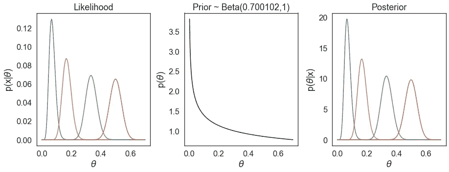

不同ᵥ.的可能性、先验性和后验性信息最少的先验。图片作者。

我们没有观察到先验对 *θ* 的估计有很大影响。另一方面，如果我们选择另一个非常不同的先验，例如 Beta(20，0.5)，我们会看到我们的后验估计受先验的影响要大得多。

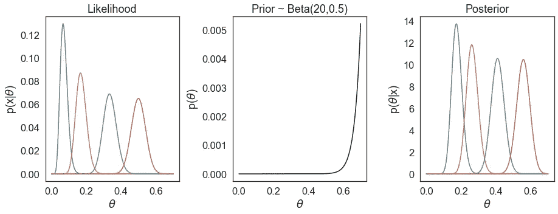

在不同的 c ᵥ.的可能性、先验和后验信息丰富的先验。图片作者。

事实上，所选的先验β值(0.700102，1)是辉瑞/BioNTech 所称的信息最少的先验值，因为它对我们的估计没有大的影响。该先验定义为平均值对应于 VE=0.3，这是 VE 的低期望值，而先验中的 *θ* 的不确定性仍然非常大。如果我们检查β的 95%可信区间(0.700102，1)，则对于 *θ* ，该范围为(0.0052，0.9645)，对应于 VE 的 95%可信区间(-26.16，0.9948)——这基本上涵盖了我们之前认为的 VE 的整个范围。

**成功的边界**

一旦我们计算出 P(VE > 0.3 |数据)，我们仍然需要知道在什么阈值我们认为我们的结果是成功的。如果 VE > 30%的概率只有 50%，显然我们对自己声称的疫苗效力没有信心。

因为要进行中期分析，所以我们需要考虑这一点，以便将总体 I 型误差保持在预定义的水平(例如 2.5%)。从技术上讲，这是一个频率主义的概念，因为我们有一个零假设和相应的测试统计，其中我们拒绝在预定义的阿尔法水平。对于中期研究，传统上在频率主义方法中，我们使用阿尔法支出函数(如 Lan-DeMets O'Brien-Fleming ),该函数描述了我们在每次中期分析中“支出”多少阿尔法，因此总体阿尔法保持在(受保护的)例如 2.5%。实际上，这定义了 alpha 在任何给定的中期分析中接受/拒绝零假设。在贝叶斯试验设计中，可以通过确定后验概率的阈值(即 P(VE>0.3|data))来引入这种频率主义特征，从而将总体 I 型误差控制在期望的水平——因此有点像混合频率主义/贝叶斯策略。

在辉瑞/BioNTech 的研究中，中期分析和主要分析的成功界限分别定义为 P(VE > 0.3 |数据)> 0.995 和> 0.986。界限可以基于模拟和/或敏感性分析得出(尚不清楚辉瑞/BioNTech 研究中使用的确切方法)。从给定的边界，我们也可以推导出设计运行特性。这本身就是一个帖子，我们不会在这里深究。

# 新冠肺炎 VE 计算

报道的新冠肺炎功效结果如下，

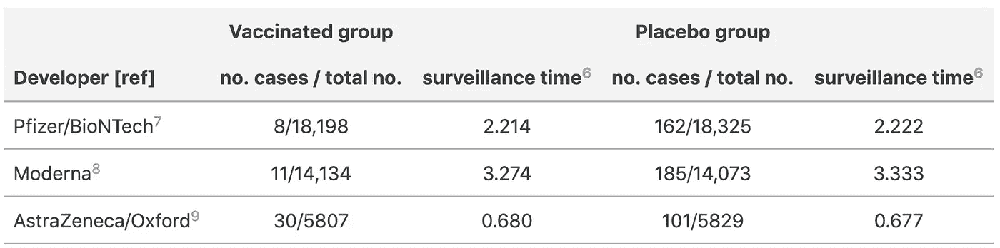

报告结果表(见参考文献)。按作者分类的表格。

而只有辉瑞/BioNTech 试验使用了贝叶斯分析。我们的目标是将相同的贝叶斯方法应用于所有三个试验结果。我们可以将 VE 计算为 1-IRR，并使用β-二项式模型计算 95%可信区间和 P(VE > 30% |数据),以β(0.700102，1)作为先验，并对监测时间进行调整。

我们的计算结果如下:

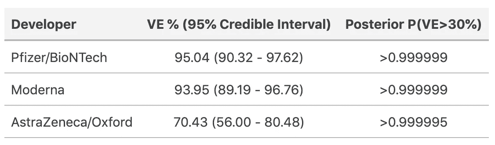

使用贝叶斯方法估计不同新冠肺炎疫苗的 ve。按作者分类的表格。

毫不奇怪，VE 和后验概率的计算与辉瑞/BioNTech 研究[7]的表 2 中报告的结果完全匹配。由于我们在这里使用了贝叶斯估计，我们预期会观察到 Moderna 和阿斯利康/牛津研究值的细微差异。我们还可以根据辉瑞/BioNTech 研究的实际报告病例，了解潜在的可能性、先验和后验分布。

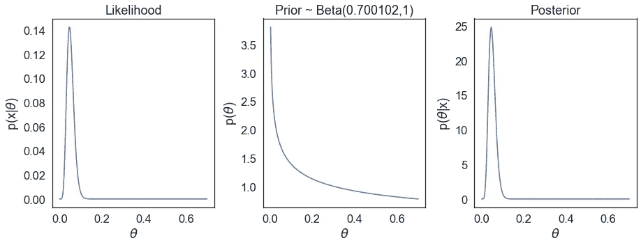

辉瑞/BioNTech 新冠肺炎研究的贝叶斯分布，分别基于接种疫苗组和安慰剂组的 8 个和 162 个报告病例。图片作者。

值得注意的是，这些试验之间还存在其他差异，例如确定新冠肺炎确诊病例的标准，因此这里的比较仅用于教学目的。此外，新型冠状病毒突变变异体的出现意味着更多最近和/或即将到来的临床试验是在不同病毒遗传变异体群体的背景下进行的(如强生公司在南非的 3 期试验，其中 B.1.351 突变体最为普遍)。这进一步混淆了现实世界中疫苗效力和有效性的比较。

*原载于 2021 年 1 月 26 日*[*https://boyangzhao . github . io*](https://boyangzhao.github.io/posts/vaccine_efficacy_bayesian)*。*

# 相关员额和资源

-[https://Twitter . com/nataliexdean/status/1307067685310730241？s = 20](https://twitter.com/nataliexdean/status/1307067685310730241?s=20)
-[http://skranz . github . io/r/2020/11/11/11/covidvaccinebayesian . html](http://skranz.github.io/r/2020/11/11/CovidVaccineBayesian.html)
-[https://medium . com/swlh/the-smincing-math-power-the-新冠肺炎-vaccine-trials-930 a5 e 97 c9c 9](https://medium.com/swlh/the-fascinating-math-powering-the-covid-19-vaccine-trials-930a5e97c9c9)
-[https://IBE CAV . net lify . app/post/post](https://ibecav.netlify.app/post/warspeed-5-priors-and-models-continued/)

# 参考文献/脚注

1.  FDA，预防新冠肺炎病毒疫苗的开发和许可，工业指南。2020 年 6 月。[链接](https://www.fda.gov/regulatory-information/search-fda-guidance-documents/development-and-licensure-vaccines-prevent-covid-19)
2.  一些主要终点也包括安全性，因为一些临床试验是 1/2/3 期试验的组合。方案中进一步描述了确诊 COVID 病例的确切标准。提供的表格仅关注疗效终点的测量。
3.  由于所有研究都有中期分析，因此成功标准被定义为总体 I 型错误被保护在预定水平(BNT162b2 和 mRNA-1273 为 2.5%；AZD1222 为 5%)。这里的成功界限仅详细描述了计划的主要分析。一些试验已经通过了中期研究的成功界限。
4.  研究方案中计划的成功界限。Baden 等人报告的实际分析基于一项中期研究，其中 p 值的相关成功阈值为 0.0049(在 FDA 关于现代新冠肺炎疫苗的简报文件第 23 页中陈述)，这是基于首次中期分析时的 O'Brien Fleming 界限。发现 p 值为<0.0001, surpassing the threshold.
5.  The trial is a phase 1/2/3 trial with efficacy as primary endpoints in the pivotal phase 2/3 trial. There were two primary endpoints, one with vaccinated group consisting of participants without evidence of infection prior to vaccination; and other of participants with and without evidence of infection prior to vaccination. We will only focus on the former in this post.
6.  Total time in 1000 person-years. The surveillance time in Pfizer/BioNTech was provided. The surveillance times in Moderna and Astrazeneca studies we have calculated (as cases/incidence rate), given they have provided the incidence rate and the number of cases.
7.  Polack et al. 2020 *N 工程医学* 383(27)，2603–2615[链接](https://www.nejm.org/doi/full/10.1056/NEJMoa2034577)
8.  巴登等人 2020*N Eng J Med*链接
9.  Voysey 等人 2021 *柳叶刀*9；397(10269)，99–111[链接](https://www.thelancet.com/journals/lancet/article/PIIS0140-6736(20)32661-1/fulltext)