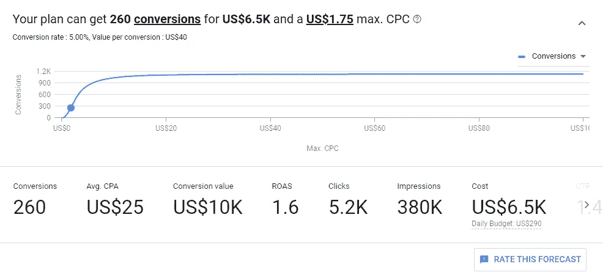
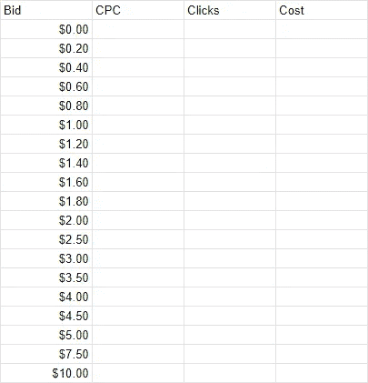
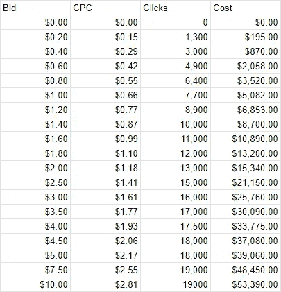
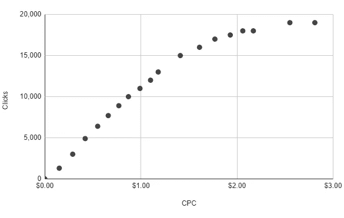
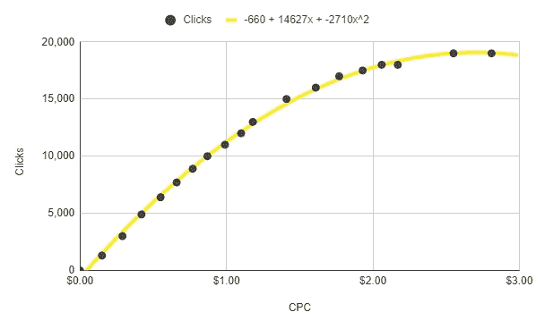
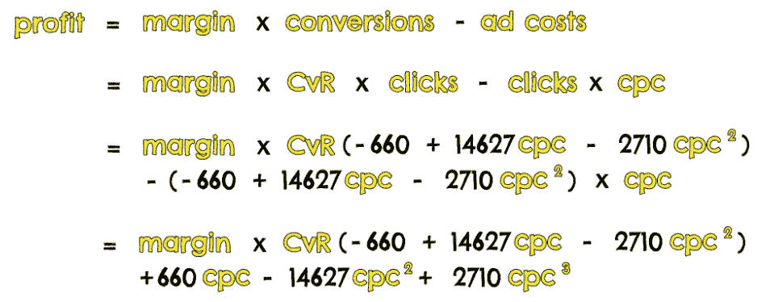
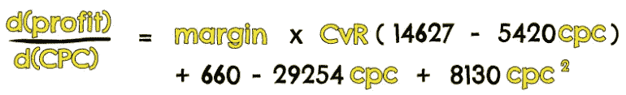
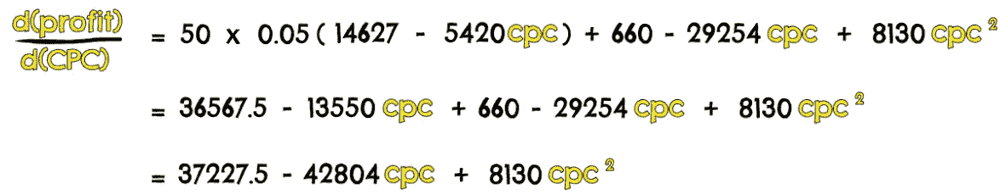
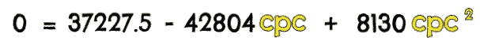

# 用微积分验证付费搜索的想法

> 原文：<https://towardsdatascience.com/validating-paid-search-ideas-with-calculus-1a551a6345ec?source=collection_archive---------20----------------------->

## 通过抓取关键字规划器的数据，你可以使用微积分计算出付费搜索活动的最大可能利润。

比方说，你正在寻求推出一个新的付费搜索活动。这可能是一个现有品牌的新活动，或者你可能是第一次在付费搜索上推出一个品牌。更好的是，你可能还没有一个品牌，只是想了解搜索市场对某个特定想法的看法。

如果你处于这些情况中的任何一种，有一种方法可以让你在开始之前验证你的策略。这并不明显——我从来没有看到它被写下来——但它可以给你一个相当好的主意，告诉你如何有效地开展你的活动。

为了理解这种方法，我们必须说几句关于关键字规划。

# 关键词规划器

如果你还不熟悉 Keyword Planner，它是 Google Ads 中的一个免费工具，可以让你获取任何你喜欢的关键词的搜索数据。

一旦你导航到关键字规划，你会想要创建一个计划，其中包含所有的关键字，你打算竞标。

你可以通过输入一个初始的关键词想法(例如*跑鞋*)或者通过输入一个相关的网站(例如【nike.com/running】T2)来找到这些关键词。无论你走哪条路，你都会看到一个流行关键词的列表。你可以挑选你想添加到你的计划中的关键词，但是你应该只添加你真正想要竞价的关键词。

一旦你建立了你的计划，你会想去关键字规划器的**关键字**部分。您应该会看到类似这样的内容:

这本质上告诉你的是，基于 1.75 美元的每次点击竞价，你可以通过对这些关键词竞价来达到一定的指标。您可以单击出价来更改它，并查看指标如何响应变化。

现在，这些数据真正有趣的不是数据本身。知道一组输入出价的输出指标是很好的，但这没什么特别的。

有趣的是，当我们试图理解数据背后的方程式时。为了做到这一点，我们将从这个工具中有效地收集一些数据点，并尝试重建这个等式。

我这样做的方法是创建一个带有不同出价级别的 Google 表单，如下所示:

然后，我们将这些出价输入到关键字规划器中，并记下实际的每次点击费用和点击预测。然后我们可以将这些相乘得到成本。

将这些都粘贴进来是一个稍微费力的过程，但是当你完成后，你应该会得到类似下面的东西。

需要注意的是:

*   平凡的是，0.00 美元的出价根本不会给你带来任何点击。
*   出价之间的间隔随着出价的增加而变大。这仅仅是因为随着你出价的增加，点击数的差异会逐渐变小；你的数量不再受出价的限制，而是受总搜索量的限制。因此，我们不需要在更高的出价水平上有同样多的粒度。

现在我们有了这个，我们可以画一个点击数和点击费用的散点图。它应该看起来像这样。

为了理解点击量和点击费之间的关系，我们可以进行回归分析/在散点图中添加一条趋势线。这里我选择使用二阶多项式(即二次方程):

趋势线的方程式显示在图表的顶部。

在我们继续之前，我应该澄清绘制这种趋势线的两个局限性:

*   **CPC 接近 0 美元时不准确**您可以在图表上看到，x 轴截距(直线与 x 轴相交的位置)位于略高于 0 美元的 CPC 处。我们知道在现实中，图表应该通过原点，因为 0.00 美元的点击费会给你带来 0 次点击。因此，我们知道不要相信 CPC 值非常接近 0.00 美元的等式。
*   **趋势线没有延伸到超过 2.70 美元的 CPC 上**在图表的右侧，我们可以看到当 CPC 接近 3 美元时，趋势线开始下降。我们将忽略图表的这一部分，假设我们的等式仅适用于 0.00 美元(但不要太接近 0.00 美元)到 2.70 美元之间的 CPC。

那么，我们有什么？我们有一个公式，描述了在 0.00 美元到 2.70 美元的范围内，不同的 CPC 可以获得多少点击量。

这为什么有用？好吧，如果我们知道一个特定的点击费我们能得到多少点击量，只要我们有一个转换率的估计，我们也能估计一个特定的点击费我们能得到多少转换率。

如果我们知道我们的利润(即利润)每转换，我们也知道多少利润，我们可以在一个特定的点击费。

我们可以将之前的等式写成:

在这里，我们用之前等式中第三行的**点击**来代替。请记住，我们的利润(我们每次转换的利润)和我们的 CvR(我们的转换率)被假定为常数。

现在让我们问一个问题，我们能产生的最大利润是多少？

# 微积分

为了回答这个问题，我们将尝试计算出给我们带来最大利润的 **cpc** 的值。我们可以通过相对于 **cpc** 对上述方程求微分，并找到相关的*驻点来实现。*

这是一个 **cpc** 的值，在该值下，任何一方的微小变化(即增加或减少 **cpc** )都不会导致利润发生变化。这使得它成为利润最大的点。

我们可以将前面的利润等式区分如下:

我们将为**利润**和 **CvR** 插入一些值，只是为了使事情更简单。假设它们分别是 50 美元和 5%。我们可以简化如下:

现在，为了找到稳定点，即利润最大的点，我们简单地将等式的左侧设置为零。这相当于说我们在寻找上面等式给出的图的峰值。

如果我们仔细检查并求解这个方程，我们发现有两个值的 **cpc** 满足上述方程:

我们有两个解决方案，即两个 **cpc** 值，这显然使我们的利润最大化。实际上，我们可以放弃第二个值，因为正如我们前面所说，我们绘制的趋势线只对低于 2.70 美元左右的 **cpc** 值有效。任何高于这个数字的数据我们都会忽略。

所以，这就是说，我们可以通过达到 1.10 美元的点击费来产生最大可能的利润。看一下上面的出价图，可以看出这相当于 1.80 美元的出价。

# 计算利润

如果我们想了解这实际上会产生多少利润，我们可以将 1.10 美元的 cpc 值代入前面的利润等式:

如果我们把所有的值加在一起，然后算一算，我们会得到:

请记住，因为我们最初的关键字规划数据是每月的，上面代表了我们可以产生的最大*每月*利润(每点击 1.10 美元，每次转换 50 美元的利润，5%的 CvR)。

# 概括起来

本质上，这就是你如何验证付费搜索策略。

概括地说，我们:

*   使用与我们产品相关的搜索词，在关键字规划中建立一个计划。
*   在不同的出价水平范围内提取点击费和点击率数据，并使用这些数据计算出点击费和点击率之间的关系。
*   我们将此纳入利润方程，并对其进行微分，以了解利润如何随每次点击费用而变化。
*   我们将这种差异设置为零，并求解，以找到利润最大化时的 CPC 值。

*原载于*[*https://mackgrenfell.com*](https://mackgrenfell.com/blog/validating-paid-search-ideas-with-calculus)*。*