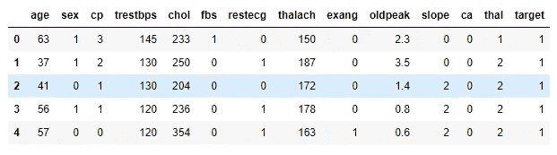
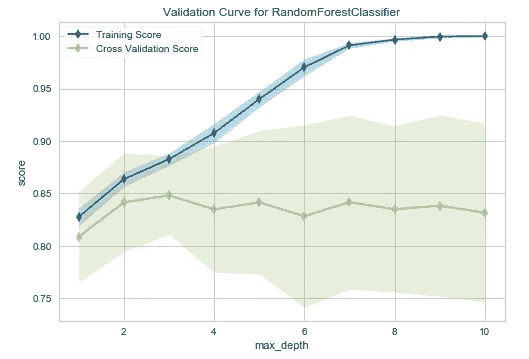

# 解释验证曲线—绘制单个超参数的影响

> 原文：<https://towardsdatascience.com/validation-curve-explained-plot-the-influence-of-a-single-hyperparameter-1ac4864deaf8?source=collection_archive---------10----------------------->

## 少代码出图！省点时间解读吧！


由 [Unsplash](https://unsplash.com/) 上的 [CHUTTERSNAP](https://unsplash.com/@chuttersnap?utm_source=unsplash&utm_medium=referral&utm_content=creditCopyText) 拍摄

在机器学习(ML)中，模型验证用于衡量 ML 模型的有效性。一个好的 ML 模型不仅非常适合训练数据，而且可以推广到新的输入数据。

模型超参数在确定 ML 模型的有效性中起着重要的作用。通过网格搜索或随机搜索，我们可以找到 ML 模型的最佳超参数组合。然而，在不进行网格搜索或随机搜索的情况下，找出单个超参数对训练和测试数据的影响有时是有用的。这是你绘制验证曲线的地方。验证曲线是一种图形技术，可用于测量单个超参数的影响。通过查看该曲线，您可以确定模型对于某些范围的超参数值是欠拟合、过拟合还是刚好合适。

## 先决条件

要理解今天的内容，你应该对交叉验证有很好的了解。如果你还没有，请阅读我写的下面这篇文章的“使用 k-fold 交叉验证评估模型的性能”部分。

[***k 重交叉验证***](/k-fold-cross-validation-explained-in-plain-english-659e33c0bc0) 通俗地解释

如果您正在寻找一些关于超参数调优的内容，请阅读上述文章的“使用 k-fold 交叉验证进行超参数调优”一节。这是完全可选的，不一定要掌握该部分的知识才能理解今天的内容。

除此之外，有随机森林算法的知识是首选。这是因为，今天，我们建立了一个随机森林模型，并在此基础上绘制验证曲线。看看下面这篇用简单的英语解释随机森林的文章。

[***随机森林——决策树的集合***](/random-forests-an-ensemble-of-decision-trees-37a003084c6c)

介绍够了。让我们进入主题。

## 获取数据

我们使用“心脏病”数据集。点击[此链接](https://drive.google.com/file/d/19s5qMRjssBoohFb2NY4FFYQ3YW2eCxP4/view?usp=sharing)即可下载。数据集的前几行是:



“心脏病”数据集的前 5 行(图片由作者提供)

该数据集包含 303 个样本和 13 个特征。最后一列是目标列，包含 0(没有心脏病)和 1(有心脏病)。

## 该方法

我们在上面的数据上建立一个随机森林分类器。然后，我们特别考虑那个分类器的 **max_depth** 超参数。 **max_depth** 值决定集合中每棵树分裂的次数，在此之后，它停止分支。通过将 **max_depth** 超参数的值范围从 1 到 10，我们绘制了交叉验证的训练和测试分数。然后，我们决定**最大深度**超参数的最佳值。

## 让我们编码

在建立模型之后，我只用了 1 行代码(更少的代码)来创建验证曲线。我利用 **Yellowbrick** 机器学习可视化库。但是，它没有附带 Anaconda 安装程序。您需要手动安装它。打开 Anaconda 提示符，运行下面的命令。

```
pip install yellowbrick
```

如果那对你不起作用，用 ***用户*** 标签试试下面的。

```
pip install yellowbrick --user
```

或者用**康达锻造**频道试试。

```
conda install -c conda-forge yellowbrick
```

或者用 **DistrictDataLabs** 频道试试。

```
conda install -c districtdatalabs yellowbrick
```

现在，请看下面的代码。

等到加载 Python 代码！(作者代码)

输出是:



**max_depth** 超参数的验证曲线(图片由作者提供)

## 让我们解释一下

当我们执行 **validation_curve()** 函数时，很多工作都是在幕后进行的。这个函数的第一个参数应该是 Scikit-learn 估计器(这里是一个随机森林分类器)。第二个和第三个应该是 **X** (特征矩阵)和 **y** (目标向量)。 **param_name** 包含我们想要测量影响的超参数的名称。**“n _ jobs =-1”**是指我们在做交叉验证程序时，使用计算机处理器的所有内核进行并行计算。 **"param_range"** 包含可能的参数值的一维 numpy 数组。在我们的例子中，这些值应该是从 1 开始的整数。对于 **max_depth** 来说，零和负数是不可接受的值。**“cv”**定义了交叉验证的折叠次数。标准值为 3、5 和 10。**评分**参数包含模型的评分方法。在分类上，最优选**【准确性】****【roc _ AUC】**。回归中常用**【R2】****【负均方误差】**。除此之外，还有许多评估指标。你可以通过访问[这个链接](https://scikit-learn.org/stable/modules/model_evaluation.html)找到它们。

当我们执行 **validation_curve()** 函数时，交叉验证过程在后台发生。正因为如此，我们才输入 **X** 和 **y** 。我们不需要把数据集拆分为 **X_train** 、 **y_train** 、 **X_test** 、 **y_test** 。在交叉验证中，分割是基于我们在 **cv** 中指定的折叠数在内部完成的。在这里使用交叉验证可以保证模型的准确性分数不会受到随机数据分割过程的太大影响。如果您只是使用 **train_test_split()** 函数*而没有进行* t 交叉验证，那么根据您在 **train_test_split()** 函数中提供的 **random_state** ，准确性得分会有很大的不同。在交叉验证中，使用 10 次(cv=10)这样迭代的平均值来计算精确度！

在 k-fold 交叉验证中，我们假设数据集中的所有观察值都以数据没有偏差的方式很好地分布。这就是为什么我们首先使用**混洗**函数混洗数据集。

**注意:**使用 **ValidationCurve()** 类可以实现 **validation_curve()** 函数的相同功能。在这里，首先创建一个可视化器(一个 **ValidationCurve()** 类的对象)，然后使用公共的**。fit(X，y)** 范式。这是代码。

等到加载 Python 代码！(作者代码)

## 让我们来解释验证曲线

现在，我们解释之前绘制的验证曲线。通过查看曲线，我们可以确定对于 **max_depth** 的某个超参数值范围，模型是欠拟合、过拟合还是刚好合适。注意，在图中，训练集的准确度分数被标记为“训练分数”，测试集的准确度分数被标记为“交叉验证分数”。

*   **拟合不足:**训练集和测试集的精度分数都很低。这表明该模型过于简单或过于正则化。在 **max_depth** 值为 1 和 2 时，随机森林模型欠拟合。
*   **过拟合:**训练准确率分数很高，测试集准确率分数低。该模型非常适合训练数据，但它无法推广到新的输入数据。对于**最大深度**值为 4，5，…，10，模型高度过度拟合。
*   **恰到好处:**没有过拟合或欠拟合。在 **max_depth** 值为 3 时，模型刚刚好。该模型非常适合训练数据，并且也可推广到新的输入数据。这就是我们想要的！

**小心:**当你使用 MSE 这样的评价指标时，当训练 MSE 很低(不高)而测试集的 MSE 很高(不低)时，就会发生过拟合的情况。这是因为这里我们考虑了一个误差(均方误差)。

**小心:**这里，你得到了最优的 **max_depth** 超参数值 3。请记住，这是我们仅考虑 **max_depth** 超参数时得到的结果。当我们在网格搜索或随机搜索中一次考虑几个超参数时，最佳的 **max_depth** 超参数值不会是 3。

# 摘要

验证曲线是一个很好的工具，你应该把它放在你的机器学习工具包里。它可用于绘制单个超参数的影响。它不应该用于调整模型。请改用网格搜索或随机搜索。创建曲线时，应考虑交叉验证方法。根据您选择的评估指标，解释会有所不同。我建议您在创建验证曲线时使用 Yellobrick Python 库。它很容易使用，节省了大量的编码时间。那就用那段时间去解读吧！

感谢阅读！

本教程由 [*鲁克山·普拉莫迪塔*](https://www.linkedin.com/in/rukshan-manorathna-700a3916b/)*[数据科学 365 博客](https://medium.com/data-science-365)作者设计创作。*

*在 https://rukshanpramoditha.medium.com[阅读我的其他文章](https://rukshanpramoditha.medium.com/)*

*2021–03–13*