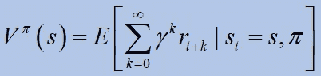

# 深度强化学习中基于值的方法

> 原文：<https://towardsdatascience.com/value-based-methods-in-deep-reinforcement-learning-d40ca1086e1?source=collection_archive---------3----------------------->

## 深度强化学习在过去几年中已经成为一个新兴领域。一个好的开始方法是基于值的方法，其中学习状态(或状态-动作)值。在本帖中，我们提供了一个全面的综述，重点是 Q-learning 及其扩展。

不溅

# 强化学习简介

有三种常见的机器学习方法:1)监督学习，其中学习系统基于标记的示例学习潜在的地图，2)非监督学习，其中学习系统基于未标记的示例建立数据分布的模型，以及 3)强化学习，其中**决策系统被训练以做出最佳决策。**从设计者的角度来看，各种学习都是由一个损失函数来监督的。监督的来源必须由人来定义。一种方法是利用损失函数。

作者图片

在监督学习中，提供了基础事实标签。但是，在 RL 中，我们通过探索环境来教导代理。我们应该设计一个代理人试图解决任务的世界。这个设计和 RL 有关。正式的 RL 框架定义由[1]给出

> 一个在**环境**中表演的**特工**。在每个时间点，代理观察环境的**状态**，并决定改变状态的**动作**。对于每个这样的动作，代理被给予一个**奖励**信号。代理人的角色是最大化收到的总报酬。

RL 图(图片由作者提供)

## **那么，它是如何工作的呢？**

RL 是一个在一个提供偶然回报的世界中，通过试错来学习解决顺序决策问题的框架。这是根据经验决定在不确定的环境中为实现某些目标而采取的行动顺序的任务。受行为心理学的启发，强化学习(RL)为这个问题提出了一个形式化的框架。人工智能体可以通过与其环境的互动来学习。利用收集的经验，人工智能体可以优化通过累积奖励给出的一些目标。这种方法原则上适用于任何依赖于过去经验的顺序决策问题。环境可能是随机的，代理可能只观察到关于当前状态的部分信息，等等。

**为什么要深入？**

在过去的几年里，强化学习因其在解决具有挑战性的顺序决策问题上的成功而变得越来越受欢迎。这些成就中的一些是由于 RL 与深度学习技术的结合。例如，深度 RL 代理可以成功地从由数千个像素组成的视觉感知输入中学习(Mnih 等人，2015 / 2013)。

正如莱克斯·弗里德曼所说:

> “人工智能中最激动人心的领域之一。它融合了深度神经网络的力量和能力，以行动和理解世界的能力来代表和理解世界”。

它解决了一系列复杂的决策任务，这些任务在以前是机器无法完成的。Deep RL 在医疗保健、机器人、智能电网、金融等领域开辟了许多新的应用。

**RL 类型**

**基于价值的**:学习状态或状态行为价值。通过选择状态中的最佳动作来行动。探索是必要的。**基于策略的**:直接学习将状态映射到行动的随机策略函数。按照抽样政策行事。**基于模型**:学习世界的模型，然后利用模型进行规划。经常更新和重新规划模型。

# **数学背景**

我们现在关注基于值的方法，它属于“无模型”方法，更具体地说，我们将讨论 DQN 方法，它属于 Q 学习。为此，我们快速回顾一些必要的数学背景。

[开启人工智能](https://spinningup.openai.com/en/latest/spinningup/rl_intro2.html)

让我们定义一些数学量:

1.  **预期收益**

RL 代理的目标是找到一个策略，使其优化预期回报(V 值函数):

其中 ***E*** 是期望值运算符，gamma 是贴现因子， **pi** 是一个策略。**最优预期收益**定义为:

最优 V 值函数是在给定状态 ***s*** 时的期望贴现报酬，此后代理遵循策略****pi ****。*

*2. **Q 值***

*还有更多感兴趣的功能。其中之一是质量价值函数:*

**

*与 V 函数类似，最佳 ***Q*** 值由下式给出:*

**

*最优***【Q】***-值是在给定状态 s 下，对于给定动作， ***a，*** 之后，代理遵循策略***【pi ****。最佳策略可以直接从这个最佳值获得:*

**

*3.**优势功能***

*我们可以将最后两个功能联系起来:*

**

*它描述了**的行动相对于跟随直接政策 **pi** 时的预期收益“有多好”。***

***4.**贝尔曼方程*****

***为了学习 ***Q*** 值，使用贝尔曼方程。它承诺了一个独特的解决方案 ***Q**** :***

****

**其中 ***B*** 是行李员:**

****

**为了保证最优值:状态-动作对被离散地表示，并且所有动作在所有状态下被重复采样。**

# **q 学习**

**Q 学习在一个脱离政策的方法中学习在一个状态中采取行动的价值和学习 ***Q*** 价值和选择如何在世界中行动。我们定义了状态-动作值函数:在**执行 ***a*** 和跟随 ***pi*** 时的期望收益。用表格的形式表示。根据 ***Q*** 学习，代理使用任何策略来估计使未来报酬最大化的 ***Q*** 。 ***Q*** 直接逼近 ***Q**** ，当代理不断更新每个状态-动作对时。****

****

**对于非深度学习方法，这个 Q 函数只是一个表:**

****

**作者图片**

**在该表中，每个元素是一个奖励值，该值在训练期间被更新，使得在稳态下，它应该达到带有折扣因子的奖励的期望值，该期望值相当于 ***Q**** 值。在现实场景中，值迭代是不切实际的；**

****

**图片由谷歌提供**

***突围游戏中，*状态为屏幕像素:图像大小:84x84，连续:4 张图像，灰度:256。因此，***Q***-表中的行数为:**

****

**只是提一下，在宇宙中，有 10⁸原子。这就是为什么我们应该在深度强化学习中解决像*突破游戏*这样的问题的好理由…**

# **DQN:深度 Q 网络**

**我们用神经网络来近似 ***Q*** 的函数:**

****

**神经网络是很好的函数逼近器。DQN 在雅达利运动会上被使用。损失函数有两个 Qs 函数:**

****

****目标**:在特定状态下采取行动的预测 Q 值。**预测**:实际采取行动时得到的值(计算下一步的值，选择总损失最小的一步)。**

****参数更新:****

****

**当更新权重时，也改变了目标。由于神经网络的泛化/外推，在状态-动作空间中建立了大的误差。因此，贝尔曼方程不收敛于 w1。错误可能会随着此更新规则传播(缓慢/不稳定/等等。).**

**DQN 算法可以在各种 ATARI 游戏的在线设置中获得强大的性能，并直接从**像素**中学习。限制不稳定性的两种试探法:1 .目标***Q***-网络的参数仅每 N 次迭代更新一次。这防止了不稳定性快速传播，并最小化发散的风险。2 .可以使用体验重放记忆技巧。**

****

**DQN 建筑(MDPI:深度强化学习方法及其在经济学中的应用综述)**

# **DQN 诡计:经验重放和ε贪婪**

## **体验回放**

**在 DQN，使用 CNN 架构。使用非线性函数的 Q 值近似值不稳定。根据经验重放技巧:所有经验都存储在重放存储器中。训练网络时，使用重放存储器中的随机样本，而不是最近的动作。换句话说:代理收集记忆\存储经验(状态转换、动作和奖励)并为训练创建小批量。**

## **ε贪婪探索**

**当 ***Q*** 函数收敛到 ***Q**** 时，它实际上以它找到的第一个有效策略结算。因此，探索是贪婪的。一种有效的探索方式是选择一个概率为“ε”的随机动作，否则(1-ε)，选择贪婪的动作(Q 值最高)。经验是由ε-贪婪政策收集的。**

# **DDQN:双重深度 Q 网络**

*****Q*** -learning 中的 max 运算符使用相同的值来选择和评估动作。这使得更有可能选择高估的值(在有噪声或不准确的情况下)，导致过于乐观的值估计。在 DDQN 中，每个*q 都有一个单独的网络，因此有两个神经网络。它有助于减少仍然根据当前权重获得的值来选择政策的偏差。***

***两个神经网络，分别具有*功能:****

************

***现在，损失函数由下式提供:***

******

# ***决斗深度 Q-网络***

******Q*** 包含**优势**(*)**价值除了处于那种状态的价值( ***V*** )。 ***A*** 早先被定义为在状态 ***s*** 中采取动作*的优势以及所有其他可能的动作和状态。如果你打算采取的所有行动都“相当好”，我们想知道:它有多好？*******

**********

*****决斗网络代表两个独立的估计器:一个用于状态值函数，一个用于状态相关的动作优势函数。要进一步阅读代码示例，我们可以参考由 [Chris Yoon](https://medium.com/u/b24112d01863?source=post_page-----d40ca1086e1--------------------------------) 发布的[决斗深度 q 网络](/dueling-deep-q-networks-81ffab672751)。*****

# *****摘要*****

*****我们提出了基于价值的方法中的 Q-learning，并对强化学习和将其置于深度学习环境中的动机进行了一般性介绍。一个数学背景，DQN，DDQN，一些技巧，决斗 DQN 已被探讨。*****

# *****关于作者*****

*****Barak 获得了以色列理工学院的航空工程学士学位(2016 年)、硕士学位(2018 年)以及经济和管理学士学位(2016 年，成绩优异)。他曾在高通工作(2019-2020)，在那里他主要研究机器学习和信号处理算法。巴拉克目前正在海法大学攻读博士学位。他的研究兴趣包括传感器融合、导航、机器学习和估计理论。*****

*****[www.Barakor.com](http://www.barakor.com/)|[https://www.linkedin.com/in/barakor/](https://www.linkedin.com/in/barakor/)*****

# *****参考*****

*****[1]萨顿，理查德和安德鲁巴尔托。强化学习:简介。麻省理工学院出版社，2018。*****

*****[2]通过深度强化学习实现人级控制，Volodymyr Mnih 等，2015。关于自然。*****

*****[3] Mosavi，Amirhosein 等，“深度强化学习方法及其在经济学中的应用综述。”*数学* 8.10 (2020): 1640。*****

****[4]贝尔德，李蒙。"残差算法:函数逼近强化学习."*机器学习会议录 1995* 。摩根·考夫曼，1995 年。30–37.****