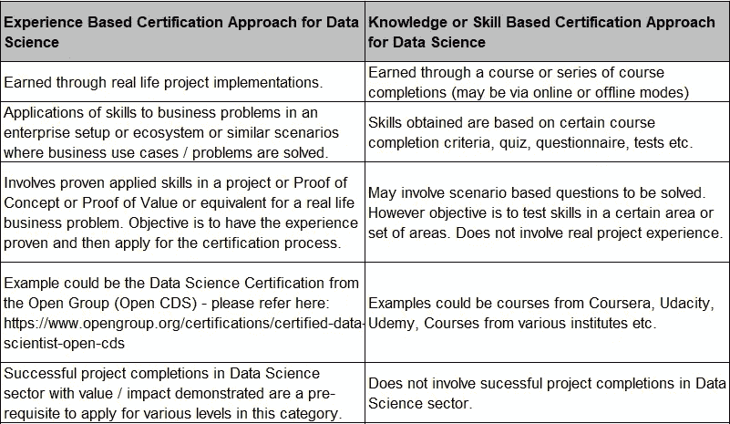
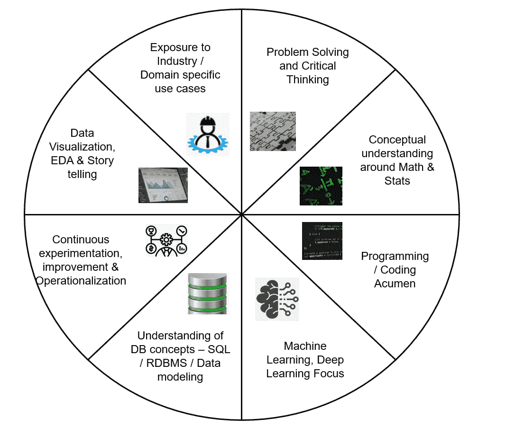
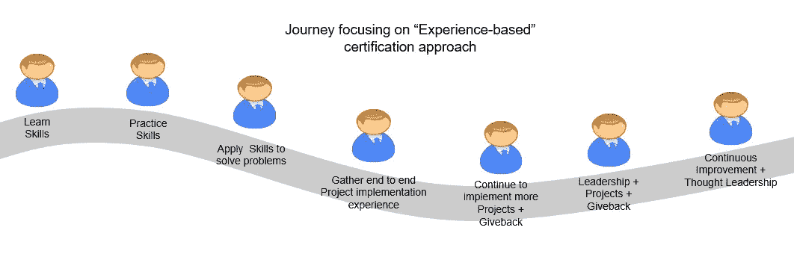

# “基于经验”的认证方法在数据科学中的价值

> 原文：<https://towardsdatascience.com/value-of-experience-based-certification-approach-in-data-science-32912ba8fd78?source=collection_archive---------30----------------------->

## 意见

## 看看数据科学和人工智能领域基于经验的认证/公开徽章，以及它们如何带来价值

作为过去几年一直在讨论、建议、倡导、辅导/指导、实施某些战略来帮助企业为未来做准备的人，这是我感兴趣的话题。我强烈地感觉到，证据不仅有助于那些实践它的人建立信心，也有助于那些接受结果和影响的人建立信心。因此，数据科学和人工智能中基于经验的认证方法非常重要，因为它涉及现实生活场景中经过验证的项目实施经验。

**“查看“基于经验”和“基于技能”的认证之间的区别”:**数据科学领域更接近于领域/行业、解决问题和讲故事方面，因此，除了技能之外，这方面的经验更为重要，这是一个“显而易见”的问题。数据科学从业者需要理解和欣赏它，当然也要计划投入时间在这些成就上，为他们带来价值和增长潜力。

图片由 Kamal Mishra 提供

如果我们在这里看一下[排名前 15 的数据科学认证，我们会注意到这些认证的重要性。与此同时，围绕“基于经验的认证”的问题也很关键。“开放认证数据科学家(Open CDS)”是一种基于经验的认证。我们可以去他们的网站](https://www.cio.com/article/3222879/15-data-science-certifications-that-will-pay-off.html)[这里](https://www.opengroup.org/certifications/certified-data-scientist-open-cds)了解详情。它也有多个级别，以认可不同级别的数据科学家的旅程。打开 CD 的详细步骤可以在[这里](https://certification.opengroup.org/opencds)找到。围绕专业发展、专业交流、基于经验档案的评估维度的参数是有价值的。

**“理解的框架”:**让我们探索一下这个框架，它反映了数据科学从业者应该熟悉的各个方面。以下框架列出了真正关键的参数(如果不是详尽的话):

图片由 Kamal Mishra 提供——数据科学从业者维度框架

a)解决问题和批判性思维技能
b)围绕数学和统计学的概念理解和基础知识
c)编程或编码敏锐度
d)专注于机器学习和深度学习
e)理解数据库概念，如 SQL、RDBMS、数据建模等。
f)数据可视化/探索性数据分析技能和讲故事
g)领域/行业知识和对行业相关用例的理解，以及数据科学/ AI / ML 如何帮助解决这些问题
h)方法，对持续实验、改进和运营方面的理解

如果上述参数是关键的，那么一个人应该有布丁的证明，以显示结果，通过解决现实生活中的问题经历这样的场景。因此，当我们在行业的特定环境或场景中执行端到端问题或用例时，经验是非常重要的。

**“基于经验的”认证方法的要素**:要素可以是各种因素的组合，而不仅仅是显示已经执行的项目经验。基于不同的成熟度和指导原则，期望可能会有所不同。然而，总而言之，下面的一些参数可能是有用的。所有这些都有助于反映真正意义上的“应用数据科学从业者”，因为它不仅仅是技能。

a) *项目体验* —首先当然是项目体验，更重要的是“端到端体验”。这应该包括典型 CRISP-DM 框架的所有生命周期阶段。理想情况下，它应该至少包含两个最佳实践和两个经验教训等。(例如，我们如何在给定数据的情况下以独特的方式更好地进行数据探索，从而实现更好的功能，在预测的情况下更有效地影响目标变量，我们如何在“游戏”的早期与利益相关者进行互动和合作，以有效地引导对话和期望，我们如何在实验中进行概括，以衡量给定环境下的最佳可能解决方案， 这如何有助于回答作为业务目标的一部分而提出的假设和问题，我们如何通过根据当前的经验在未来更好地进行数据清理或数据转换来缩短“价值实现时间”等。 )在起草这份文件时，可能需要展示在作为项目工作的一部分实施解决方案后实现的最终结果、价值和影响。这不仅有助于阐明整体技术解决方案，而且有助于展示你所拥有的“讲故事”艺术！！

b) *对社区的贡献* —贡献的形式可以是可重用组件、资产、对开源社区的贡献、与各个级别的指导工作和构建生态系统相关的贡献、与创新或知识产权创造相关的贡献等等。

c) *思想领导力* —在宣传“下一个关键因素”、未来路线图、博客、“保持现状”场景、如何借助成果、出版物、专利等更好地推动创新方面对数据科学的贡献。

图片由 Kamal Mishra 提供

数据科学职业是一个非常热门的职业，许多人试图冒充数据科学家，但他们不具备这一关键职位所需的适当技能或专业知识。因此，基于经验的认证方法有助于识别真正的数据科学从业者。它帮助公司同时解决几个问题——a)获得他们正在寻找的“正确”候选人来解决他们的计划，b)创建一个具有实际生活经验的从业者库，这些从业者反过来可以在一段时间内帮助他们的团队建立和培养类似的人才。

***免责声明*** *:这里的帖子是来自我的经验、想法和各种来源的阅读的个人观点，不一定代表任何公司的立场、策略或观点。*