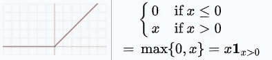
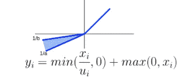
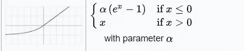

# 你的模型火车太慢了吗？

> 原文：<https://towardsdatascience.com/vanishing-exploding-gradient-problem-b5b78c142bb7?source=collection_archive---------27----------------------->

## 使用梯度下降算法训练神经网络时，探索遇到消失或爆炸梯度问题的各种方法的快速指南


克林特·王茂林在 [Unsplash](https://unsplash.com?utm_source=medium&utm_medium=referral) 上拍摄的照片

# 介绍

对于一个非常深的神经网络，当训练一个模型变得越来越慢时，你肯定遇到过这个问题。这种现象在 DNNs 的反向传播训练(使用梯度下降)期间显著发生，其中，每个参数的梯度误差沿其路径传播到网络的较低层。 ***为什么？这通常是因为梯度通常会变得越来越小。结果，较低层的权重永远不会改变，训练永远不会收敛到好的解决方案。***

> 这篇文章分类讨论了在训练 DNNs 时减轻消失梯度(或爆炸梯度)问题的方法

有各种方法来克服这个挑战—

*   **权重初始化** —选择初始权重，使其在训练反向传播时不随网络层衰减。
*   **激活功能** —激活功能的选择可以解决问题。我们将详细研究这方面的选项。
*   **权重归一化** —使用归一化技术克服消失/爆炸梯度问题。

*让我们详细了解一下所有这些……*

## 重量初始化

我们知道，当在反向传播过程中偏导数出现时，当输入非常高(或太低)时，使用激活函数如 *sigmoid 函数*将导致*接近零导数*。在计算导数时，由于*链式法则*，这导致较低阶层的梯度消失(饱和)。

在他们由 [Xavier Glorot 和 Yoshua Bengio](http://proceedings.mlr.press/v9/glorot10a/glorot10a.pdf) 发表的论文中，他们建议，如果我们希望梯度既不饱和也不爆炸，那么我们需要使每一层的输出的*方差等于其输入的方差，*和*梯度在以相反方向流过一个层之前和之后也具有相等的方差。*为了达到这个条件——输入层的神经元数量应该等于输出层的神经元数量(*即等于* *一层的扇入扇出)*。*这种解决方案不实用。*

因此，需要初始化技术来补偿这一基本要求——一个这样的选项是基于 ***fan-avg=(扇入+扇出)/2 使*随机 ***-*** 初始化。**** *这一理论引出了以下实际选项:——*

*   ****Xavier 初始化*** *或* ***Glorot 初始化:****

*带`mean 0`和`variance: *σ2 = 1/fan-avg*`的正态分布。
或者，r 和+ r 之间的均匀分布，带有`*r = sqrt(3/fan-avg)*`*

*这种重量初始化最适合使用激活功能: *tanh，logistic，softmax**

*   ***乐存初始化***

*将`fan-avg`替换为`fan-in`以上数值将变为:
均值为 0 且方差为:σ2 = `1/fan-in`
或者 r 和+ r 之间的均匀分布，带有`r = sqrt(3/fan-in)`*

*当使用`fan-in = fan-out`
SELU*激活功能时，LeCun 初始化相当于 Glorot 初始化。**

*   ***何初始化***

*适用于激活功能: *Relu 及其变体**

***Keras 实现***

*默认情况下，Keras 使用正态分布的 Glorot 初始化。我们可以显式地将`kernel-initializer`参数定义为值，例如`he_normal`或`he-uniform`:*

```
*keras.layers.Dense(10, activation="relu", kernel_initializer="he_normal")*
```

## *激活功能*

*激活函数的选择是饱和梯度的另一个原因，如前所述，当使用激活函数如 *sigmoid* 或 *tanh 时，问题更加突出。*主要原因是梯度趋向于*零*对于高阶权重，这些函数有时也被称为饱和激活函数。克服这个问题的可能选择是通过使用其他类型的激活函数，这些激活函数对于它们的导数来说是不饱和的，几个选项是:*

*   ***ReLU:整流线性单元***

**

***ReLU** 。来源:[维基百科](https://en.wikipedia.org/wiki/Activation_function)*

*优势—它不会在`x>0`(正值)内饱和*

*缺点—坡度完全*为`x<0`。使这些神经元在训练中失去能力。**

```
**# Keras implementation
keras.layers.Dense(10, activation="relu")**
```

*   ****漏泄继电器****

****

****漏热路**。来源:[维基百科](https://en.wikipedia.org/wiki/Activation_function)**

**优点——它确保`x<0`神经元不会“*死亡”。***

```
**#Keras implementation
keras.layers.LeakyReLU()**
```

*   ****RReLU:随机泄漏 ReLU****

**RReLU 是 ReLU 的变体，其中α在训练期间从给定范围中随机选择，并在测试期间固定为平均值。**

****

**在范围内。[来源](https://github.com/JGuillaumin/one_week_one_paper/tree/master/week_46_drop_activation#comparision-relu-drop-activation-and-randomized-relu)**

*   ****PReLU:参数化泄漏 ReLU****

**“α”在训练期间被学习，并且它是将在反向传播期间被修改的参数之一。**

****

**PReLU。来源:[维基百科](https://en.wikipedia.org/wiki/Activation_function)**

**缺点-对于使用小数据集的训练，它很容易过度拟合。**

```
**#Keras implementation
keras.layers.PReLU()**
```

*   ****ELU:指数线性单位****

****

****ELU。**来源:[维基百科](https://en.wikipedia.org/wiki/Activation_function)**

**从激活方程本身可以明显看出，对于`x<0`,它减轻了死神经元问题和消失梯度问题，此外，函数的导数在`x=0`处极其平滑*,因此它收敛得相当快。***

```
***#Keras implementation
keras.layers.Dense(10, activation="elu")***
```

*   *****SELU:比例指数线性单位*****

***对于仅由一堆密集层组成的神经网络，SELU 激活函数通常明显优于其他激活函数。这允许网络 ***自标准化*** 更快地收敛，同时解决梯度问题。这对于具有某些前提条件的网络是有效的——网络架构必须是*顺序的*和*密集的*和`kernel_initializer="lecun_normal"`。***

```
**#Keras implementation
keras.layers.Dense(10, activation=”selu”, kernel_initializer=”lecun_normal”)**
```

## **批量标准化**

**这种技术现在在训练模型处理*消失* ( *爆炸)渐变*的问题时无处不在。该操作仅在激活功能之后(有时之前)应用。本质上，这个操作:——I .零中心，ii .正常化，三。音阶& iv。移动应用于它的每个输入。总之，该操作将有助于找到给定输入要素集的最佳均值和比例。**

```
**.....
#Keras implementation
keras.layers.Dense(300, activation="relu"),
keras.layers.**BatchNormalization(),**
keras.layers.Dense(100, activation="relu"), 
keras.layers.**BatchNormalization()** .....**
```

**BatchNormalization()层的 *Keras* 实现学习 4-vectors:
1。γ:比例矢量
2。β:偏移(移位)向量
3。μ:平均向量
4。σ:标准偏差向量**

**批处理标准化向量在训练期间被估计/学习，并在测试期间被原样应用。**

**这项技术非常成功，以至于在训练大型数据集时，我们甚至可以使用*饱和激活函数*，如 *sigmoid* 或 *tanh。*在某处，它还克服了重量初始化的训练挑战*。*最后，这是一个很好的正则化选项，类似于 *l1 或 l2 正则化子*或者与其他*退出*方法一样好。**

# **结论**

**在这篇文章中，我粗略地介绍了一些概念，以帮助你缓解在训练神经网络时最突出的消失和爆炸梯度问题。你曾经面临过这些问题吗？你是怎么解决的？一定要让我知道你实践中遇到的解决问题的其他各种技巧。**

> **在 [**LinkedIn**](https://www.linkedin.com/in/p-jainani/) 上与我联系，进一步讨论**