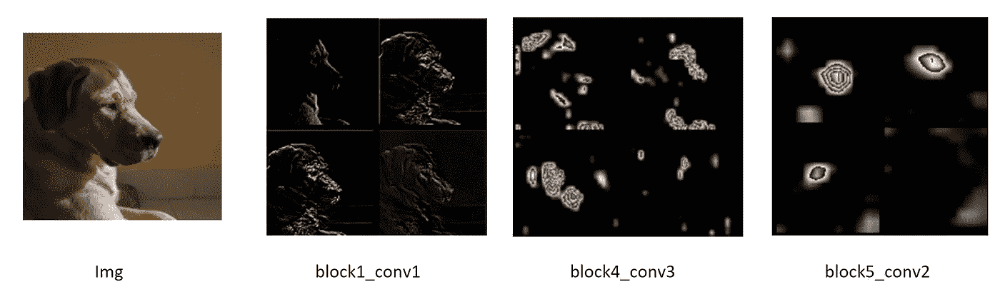
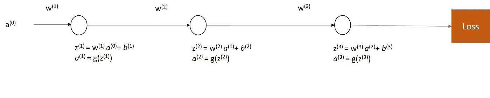
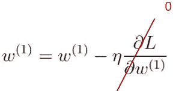
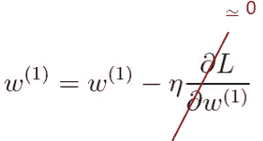
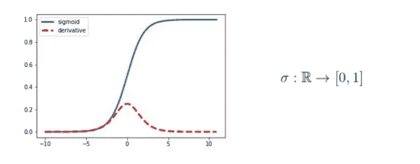
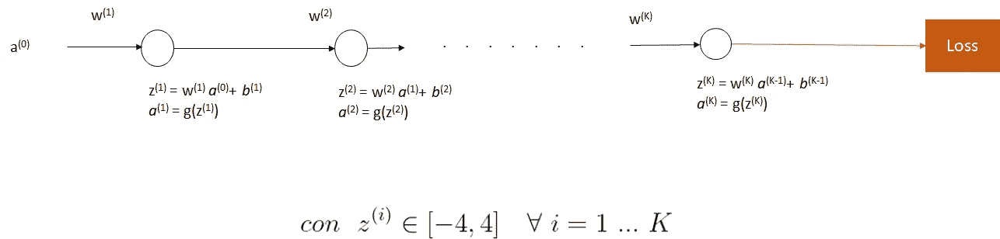
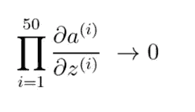
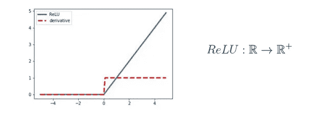

# 深度神经网络中的消失梯度

> 原文：<https://towardsdatascience.com/vanishing-gradient-in-deep-neural-network-83953217c59f?source=collection_archive---------14----------------------->

照片由 [JJ 英](https://unsplash.com/@jjying?utm_source=medium&utm_medium=referral)在 [Unsplash](https://unsplash.com?utm_source=medium&utm_medium=referral)

## 原因和可能的解决方案

如今，用于图像分析的网络由许多层一层接一层堆叠而成，形成所谓的*深层网络*。训练这些架构的最大问题之一是**消失梯度:**梯度假设为零或渐近值，阻止权重被更新。

在本文中，我们将分析这种现象的原因，提出第一种可能的解决方案，并在后续文章中为进一步的技术留下更多细节。在开始之前，将涉及的例子将是使治疗更容易的基础。显然，同样的概念可以应用于更复杂的架构。

# 注释

*   **w:** 重量
*   ***z:*** 神经元输入的线性和
*   ***g:*** 激活功能
*   ***一个*** *:* 激活功能的输出
*   ***顶点*** :层 *l-* th
*   **L:** 损失函数

# 1.什么是消失渐变？

图 1:该图显示了 FCNN VGG-16 网络不同层获得的特征图(来源:图片由我提供)

在深度卷积网络中，输入附近的层从图像中提取**空间特征**:轮廓的*方向*，角度*的存在*，纹理的存在*，*颜色*信息。接近输出层，**语义特征**将被提取:出现*嘴*、*鼻子*等等。图 1 显示了一个例子，其中有一些在 VGG-16 的不同层提取的特征图。一般来说，通过增加网络的深度，每一层将能够学习如何提取更多的*一般*和*复杂特征*。*

然而，深层网络很难训练。我们可以看到的一个问题是**消失渐变**。在反向传递过程中，靠近输入的图层的权重保持不变或更新非常缓慢，这与靠近输出的图层的情况相反。

图 2:有三个神经元的简单网络(来源:图片由我提供)

让我们考虑图 2 中神经元的顺序。我们通过计算损失函数相对于它的导数来更新权重 w^(1。为简单起见，我们假设每个神经元的偏置项 *b* 为零。应用*链规则*【1】并将激活函数的导数分组，我们得到:

我们来问一下，有什么可以阻止或者减缓梯度？我们分析产品∂ *一/∂z.*

**情况 1:** 假设每次迭代只有第*个*为空(*例如* ∂ *a^(2)* /∂z^(2)).)在这种情况下，∂L /∂w^(1)将呈现一个空值，阻止 w^(1)的更新，该值将保持**不变**。事实上，应用*德尔塔法则*【2】*我们得到:*

**

***情况 2:** 现在假设每一项∂ *和* ^(i)/∂z^(i)在每次迭代中都有渐近零值。这样，∂L /∂w^(1)也将渐近于零，w^(1)将非常缓慢地更新**(*我们每次都将接近零的值相加*)。应用 *delta 规则*:***

******

# ***2.输出范围有限的激活功能***

******

***图 3:带共域[0，1]的 sigmoid 函数用蓝色表示。它的导数用红色表示。输入 z 的值表示在横坐标轴上，而相应导数的值表示在纵坐标轴上(来源:图片由 me 提供)***

***从上一段的例子中，我们了解了激活函数 *g* 的选择是如何发挥重要作用的。消失梯度的主要原因之一是由于使用了*激活功能*和*有限输出范围:****

*   ***对于落在*有效区域*内的输入值 *z* ，导数∂*a*/∂z**将仅是非零的*****
*   ***在显著区域，导数呈现相对较小的值**。考虑到大量的层和乘以∂a/∂z 的值，我们可以降低渐变速度*****

***这两点完美地反映了案例 1 和案例 2 的内容。让我们通过将图 3 所示的 sigmoid (σ)视为有限输出范围激活函数来分析它们。考虑到导数*，*，对于落在区间[-4.4]内的输入值 *z* ，出现*显著区域*。对于该区间之外的值，导数将为零*(情况 1)。****

******

***图 4:具有 K 个神经元的平面网络(来源:图片由我提供)***

***现在假设我们有一个 K 层的网络，其中，对于每个神经元， *z* 在重要区域中取值。计算关于层 K、K-1、K-2 和 1 的梯度，我们得到:***

******

***通过乘以红色值，我们注意到随着我们远离输出层 k，乘积∂ *a* / ∂z 是如何减小的。如果 *K* 等于 50 层，我们将得到*情况 2* :***

******

# ***3.整流线性单位(ReLU)***

******

***图 5:带有 codomain [0，+inf]的 ReLU 函数用蓝色表示。它的导数用红色表示。输入 z 的值表示在横坐标轴上，而相应导数的值表示在纵坐标上(来源:图片由 me 提供)***

***图 5 所示的 ReLU 激活函数可以通过 *max(0，z)来形式化。*这个促成了消失渐变的分辨率(*至少部分)*。观察图 6 中的导数，我们注意到对于 R^+中的 *z* 的值，导数是单一的，因此允许梯度通过。当输入值为负时出现问题，从而得到*情况 1* 。存在整流线性单元的变体，例如 LeakyReLU 和 eLU，其被创建来减轻对于 *z* < 0 的零导数的问题。***

# ***结论***

***训练具有大量层的网络并不容易。在这篇文章中，我们探讨了*消失梯度*问题识别激活函数选择中的一个可能原因。建议的解决方案是使用校正的线性单位，对于正值，它不会阻碍梯度的通过。但是… ReLU 并没有完全解决问题。另一个问题是**权重的初始化。**如果多层的导数∂z /∂ *a* 为零或接近零，会发生什么？可以重复刚才讨论的关于激活函数的考虑和例子来回答这个问题。***

***如果一方面我们有*消失* *渐变*，另一方面我们必须考虑完全相反的问题，即*爆炸渐变*:渐变呈现高值，从而阻止优化。***

***对深度网络训练的一个重要贡献是引入了**跳过连接**，我们将在另一篇文章**中讨论。*****

# ***参考***

***【1】[微分学:链式法则](https://en.wikipedia.org/wiki/Chain_rule)***

***[2] [梯度下降学习规则:Delta 规则](https://en.wikipedia.org/wiki/Delta_rule)***