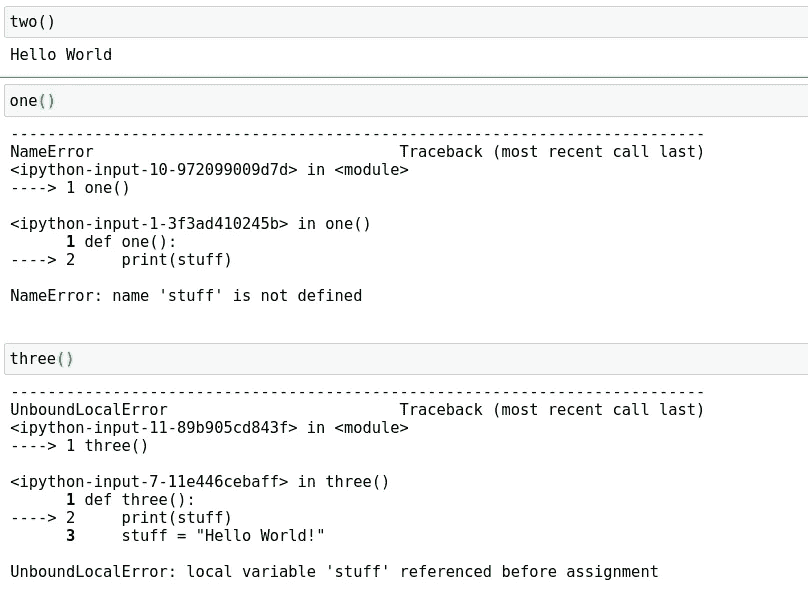
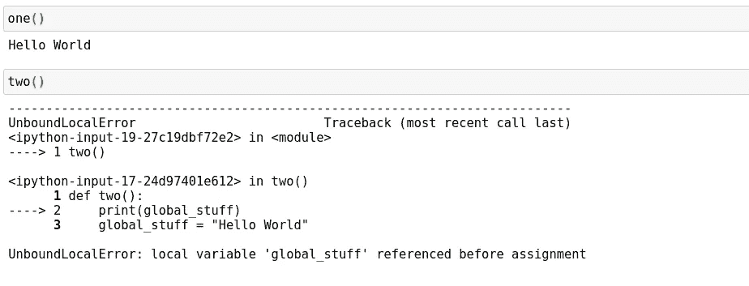

# Python 中的可变范围古怪

> 原文：<https://towardsdatascience.com/variable-scope-oddity-in-python-d1405b956266?source=collection_archive---------27----------------------->

## Python 编程语言中与变量相关的一些奇怪现象


(src =[https://pixabay.com/images/id-2312548/](https://pixabay.com/images/id-2312548/)

# 介绍

Python 是世界上最流行的编程语言。这是有充分理由的，因为这种语言在很多方面都比它的竞争对手有更大的优势。首先，它是可读和可写的，就像编写常规语言一样。许多 Python 代码最终读起来很像英语，所以很容易理解为什么这是初学者友好的，并且通常非常容易理解。其次，该语言具有用户想要的范式特征。这种语言是面向对象的，但是支持大量的泛型编程概念，这使得这种范式对于通用应用程序来说更加可行。最后，该语言的解释器是用 C 编写的，通过 Python.h 头文件与 C 紧密集成，使得 Python 可以在低端相对快速地运行，同时保持前端代码非常简洁易懂。然而，没有一种语言是完美的——行为也不总是如你所愿。Python 是一种充满了一些相当有趣的怪癖的语言。

Python 也是一种动态类型语言。这意味着在程序执行过程中可以改变不同的类型。当涉及到变量、范围和类型时，这一点和 Python 的解释器的结合培养了一些相当有趣的怪癖。今天，我想谈谈 Python 处理变量和作用域的一种奇怪方式。我还擅自将我用来演示这些怪癖的笔记本上传到 Github，所以如果你想亲自尝试这个项目，你可以在这里:

<https://github.com/emmettgb/Emmetts-DS-NoteBooks/blob/master/Python3/Python%20variable%20oddities.ipynb>  

# №1:范围古怪

范围是编程中嵌套层的一个非常重要的属性。作用域允许我们用相同的别名将应用程序的组件组织成更小的部分，并私下和公开地使用它们。Python 中的第一级作用域是全局作用域。在数据科学中，在这个范围内工作是很常见的，但是当在全局范围内工作并试图进入私有范围时，会出现一些问题。

也就是说，Python 的解释器确实有一些有趣的方式来处理语言中对象和方法的属性。让我们看一个 Python 中有两个函数的例子。第一个函数是调用从未在全局范围或函数范围内定义的变量的函数:

```
def one():
    print(stuff)
```

第二个打印了一个现在在全局范围内定义的变量:

```
global global_stuff
global_stuff = "Hello World"
def two():
    print(global_stuff)
```

我在这里使用了全局关键字来声明这个变量的范围。然而，这是不必要的，因为当我们在这个笔记本中工作时，我们已经在全局范围内了。当我们想要从私有范围定义全局变量时，通常使用这个关键字。也就是说，我仍然喜欢使用关键字，因为这是让其他程序员提前了解全局变量的好方法。继续，这是另一个函数，它执行与第一个函数完全相同的算法，但是在调用它之后定义了我们的填充变量:

```
def three():
    print(stuff)
    stuff = "Hello World!"
```

现在我将调用所有这些函数，然后我们将从第二个全局函数开始比较结果:

```
two()one()three()
```



*   两个函数，这个函数是我们的全局函数。因为变量 global_stuff 是在它上面的作用域中声明的，所以我们的函数可以访问这个变量并按预期打印出来。
*   one 函数——这个函数是我们从未定义过“stuff”的函数，但尝试用 print()方法调用它的别名。这个抛出了一个名字异常，因为名字的东西没有被定义。
*   三个函数——这个函数是我们定义“东西”的函数，但是只有在我们尝试调用它之后。

你注意到发生了什么吗？这里有趣的是 three()和 one()函数中返回的异常之间的差异。这两个函数之间唯一的区别是变量的定义，只有在我们试图打印它之后才会发生。记住，很明显抛出发生在代码运行之前，那么为什么会发生这种情况呢？尤其是在动态类型编程语言的上下文中，这看起来不像是我们在这个场景中可以得到的结果。这里的一个重要区别是，作用域及其变量总是在编译时定义，而不是在运行时定义。然而，它们不是在编译时分配的，而是在运行时分配的，这就是动态部分的来源，因为类型在代码执行时会发生变化。

注意，第一个函数 one()也试图在全局范围内找到我们的“stuff”变量。嵌套层总是会这样做，这是一件重要的跟踪。如果我们的变量没有在函数范围内定义，它将检查全局范围。此外，如果变量没有在循环范围内定义，例如，它将在检查全局范围之前检查函数范围。范围对于包含在其中的私有范围总是公共的。记住这一点，现在让我们看看另一个使用更多全局变量的类似示例:

```
def one():
    print(global_stuff)
```

第一个函数是前一个例子中第二个函数的模板副本。另一方面，第二个函数执行同样的运算，但是它在函数的私有范围内添加了 global_stuff 的定义:

```
def two():
    print(global_stuff)
    global_stuff = "Hello World!"
```

让我们像以前一样运行这两个函数，然后分析结果:

```
one()two()
```



正如所料，我们看到第一个函数为我们提供了与前一个示例中的第二个函数相同的回报。然而，每当我们运行第二个函数时，我们看到这个函数返回一个异常。这个异常与前一个例子中的第三个函数相同，我们试图在一个定义的别名被赋予类型或值之前引用它。为什么会这样？

正如我们前面提到的，Python 决定了什么变量在什么范围内定义，而不是在编译时定义，而不是在运行时定义。作用域也总是在引用它们上面的作用域之前检查自己。也就是说，这个函数试图自己检查 global_stuff 的定义。然后，它找到一个匹配项，但该匹配项尚未定义。结果，我们得到了这个错误！

# 结论

Python 有时会让人有点困惑，有时理解编译器和该语言的某些属性对编写优秀的软件大有帮助。从这个演示中得到的重要信息是 Python 在编译时定义了所有变量，而不是在运行时。这意味着当你的程序启动时，包含在你的软件的每个范围内的每个变量都已经被解释器定义了。我认为这肯定揭示了试图使用公共范围的一些问题，因为它会导致很多冲突。例如，如果该全局名称在函数中被回收，那么就很难判断实际的错误来自哪里。感谢您的阅读，我希望这是对 Python 编程语言中一个怪异小怪癖的有趣观察！