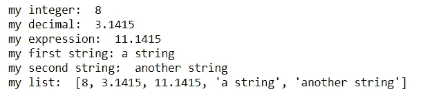

# 变量、数据类型和打印语句天哪！

> 原文：<https://towardsdatascience.com/variables-data-types-and-print-statements-oh-my-13d92d4249ae?source=collection_archive---------21----------------------->

## 深入编程基础，开始学习 Python！

克里斯蒂安·威迪格在 [Unsplash](https://unsplash.com/s/photos/computer?utm_source=unsplash&utm_medium=referral&utm_content=creditCopyText) 上拍摄的照片

智者可能会说，1000 个脚本的旅程从一行代码开始。学习编程是一项艰巨的任务，每当我学习新的框架或不同的编程语言时，我自己都是初学者。根据我的经验，我已经能够让许多以前没有或几乎没有经验的人开始他们自己的编程之旅。这是我自己对每个程序员每天都需要牢记的一些基本 Python 概念的看法。我将介绍变量、数据类型和打印语句的概念(天哪！)之前先展示一些例子帮你入门！

变量对日常编程极其重要，就像在你的数学课程中，它允许我们指定一个像“x”或“var”这样的变量来表示一个更复杂的东西。假设我想在代码中多次引用一个很大的数字，例如，光速是 299，792，458 米每秒。如果我想对这个值做不同的事情，比如用其他数字乘或除，我可以在每次想用它的时候把它写出来，或者我可以把这个值赋给一个变量，这样我可以节省时间，让我的代码更可读。这很容易做到，想出一个变量名，用一个等号，让我们做物理学家做的，选择' c '代表光速。

作者的光速数学

对于任何感兴趣的人，这是输出！

现在让我们讨论数据类型。我们的变量代表的东西是一个数据，这个数据可以是各种类型的。数据类型很重要，因为它告诉我们可以对某些数据做什么。例如，两个数字的加法就不同于像名称或标签这样的数据。最基本和最流行的数据类型包括整数、浮点、字符串和列表。

整数是没有小数部分的数字，像-6，-1，0，3，876 都是整数。浮点数是带小数部分的数字，像-6.0，-1.1 0.9238，3.1415，876.000001 都是浮点数。字符串是用单引号或双引号括起来的字符或字符组合，' h '、'再见'、' 42 '、'我爱编程'都是字符串。所有这些类型的数据中最复杂的是列表，它是由逗号分隔并用括号括起来的其他数据的集合。水果名称的 python 列表的一个例子是，['apple '，' orange '，' strawberry" ]。

我们可以用任何类型的数据制作变量！

按作者分类的变量和数据类型

所以现在我们可以创造变量，也可以用其他变量创造新的变量。有时候当我写很多代码的时候，我想看看我在一个变量中存储了什么，而不需要去我最初给它赋值的地方。查看变量的最佳方式是使用可能是最基本的 python 函数，即 print 函数。

我们可以使用 print 语句将东西打印到我们的输出或控制台。这让我们可以从计算中得到结果(就像之前光速中使用的那样)，调试有问题的代码部分，并且通常深入我们的代码，看看在某些步骤和部分中发生了什么。要使用打印功能，我们只需键入 print()并将我想要打印的内容放在括号内。

按作者打印声明

我喜欢清理我的打印语句来创建漂亮的输出，在这种情况下，我将一个字符串放在我想作为标签打印出来的变量之前，然后用逗号分隔它。看一看清晰的输出！

按作者打印

这为我们想要看到的数据提供了一个非常清晰和格式良好的表示。为故障诊断代码编写有用的打印语句是我日常工作流程中不可或缺的一部分，这也是您在编写更大的项目之前需要首先学习的事情之一。

非常感谢你阅读我的文章，我希望你有一些工具和新的勇气来学习 Python 甚至另一种编程语言！

你可以在[媒体](https://abdulahamer97.medium.com/)上找到更多我的文章，在那里你可以看到我的[最受欢迎的关于量子计算的文章](/what-is-quantum-entanglement-anyway-4ea97df4bb0e)。此外，在 [Linkedin](https://www.linkedin.com/in/abdulah-amer/) 上与我联系，并在我的 [GitHub](https://github.com/AbdulahAmer) 上查看我的所有代码。