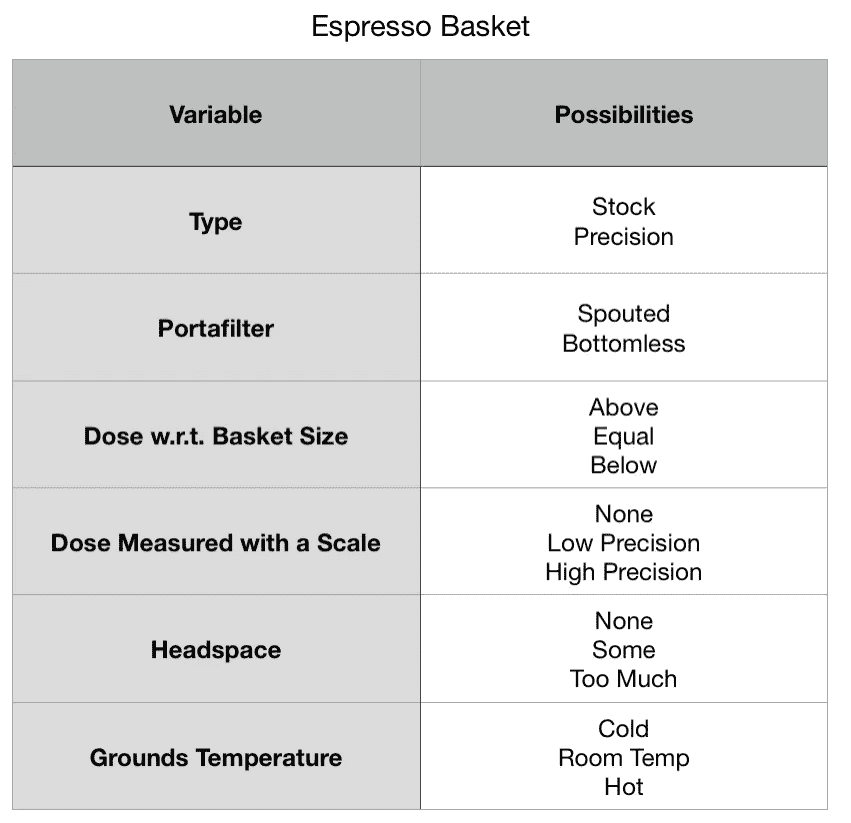

# 浓缩咖啡的变量

> 原文：<https://towardsdatascience.com/variables-of-espresso-a53cd5ffba92?source=collection_archive---------19----------------------->

## 咖啡数据科学

## 制作饮料的清单

我一直在进行一些探索浓缩咖啡变量的基础实验，在这个过程中，我想我应该列一个清单。我原以为会很简单，但是名单变得很快。我对列表进行了更好的分类，我将把它分成几个类别。这并不是为了吓唬新来的人，而是为了展示这个过程的复杂性，这也是我喜欢浓缩咖啡的原因。

# 2018 年我的意式浓缩咖啡

几年前，我制定了制作浓缩咖啡的所有要素，当时我认为这很复杂。

所有图片由作者提供

# 咖啡豆

烘焙咖啡豆的变量是非常巨大的。从青豆到烘焙设备，这些变量中的每一个都会对味道产生很大的影响。

# 基本硬件

几乎同等重要的是研磨机和咖啡机。两者都有大量的变量来混淆什么是最佳配置。

# 浓缩咖啡篮/准备

尽管准备冰球看起来很简单，但它是浓缩咖啡中较为敏感的步骤。

# 这一枪

这些变量需要提前考虑，因为它们更难即时调整，尤其是对新手而言。

# 咖啡

这种液体黄金是咖啡最浓缩的形式，然而，即使在最终结果中，也有许多次要的事情需要考虑。

# 数据

对于像我这样的数据科学家，我收集一些拍摄后的数据，这是拍摄的一半乐趣，因为这些变量允许通过所有其他变量改进迭代。

在一天结束时，这些变量中的大多数从一个镜头到下一个镜头都是不变的。有相当多的因素融入到背景中，幸运的是，我们生活在一个社会中，我们可以尽可能多或尽可能少地钻研这些变量，随心所欲地享用美味的浓缩咖啡。

如果你愿意，可以在 Twitter 和 YouTube 上关注我，我会在那里发布不同机器上的浓缩咖啡视频和浓缩咖啡相关的东西。你也可以在 [LinkedIn](https://www.linkedin.com/in/robert-mckeon-aloe-01581595?source=post_page---------------------------) 上找到我。也可以关注我[中](https://towardsdatascience.com/@rmckeon/follow)。

# [我的进一步阅读](https://rmckeon.medium.com/story-collection-splash-page-e15025710347):

[浓缩咖啡系列文章](https://rmckeon.medium.com/a-collection-of-espresso-articles-de8a3abf9917?postPublishedType=repub)

[工作和学校故事集](https://rmckeon.medium.com/a-collection-of-work-and-school-stories-6b7ca5a58318?source=your_stories_page-------------------------------------)

[个人故事和关注点](https://rmckeon.medium.com/personal-stories-and-concerns-51bd8b3e63e6?source=your_stories_page-------------------------------------)

[乐高故事首页](https://rmckeon.medium.com/lego-story-splash-page-b91ba4f56bc7?source=your_stories_page-------------------------------------)

[摄影启动页面](https://rmckeon.medium.com/photography-splash-page-fe93297abc06?source=your_stories_page-------------------------------------)

[使用图像处理测量咖啡研磨颗粒分布](https://link.medium.com/9Az9gAfWXdb)

[改善浓缩咖啡](https://rmckeon.medium.com/improving-espresso-splash-page-576c70e64d0d?source=your_stories_page-------------------------------------)

[断奏生活方式概述](https://rmckeon.medium.com/a-summary-of-the-staccato-lifestyle-dd1dc6d4b861?source=your_stories_page-------------------------------------)

[测量咖啡磨粒分布](https://rmckeon.medium.com/measuring-coffee-grind-distribution-d37a39ffc215?source=your_stories_page-------------------------------------)

[咖啡萃取](https://rmckeon.medium.com/coffee-extraction-splash-page-3e568df003ac?source=your_stories_page-------------------------------------)

[咖啡烘焙](https://rmckeon.medium.com/coffee-roasting-splash-page-780b0c3242ea?source=your_stories_page-------------------------------------)

[咖啡豆](https://rmckeon.medium.com/coffee-beans-splash-page-e52e1993274f?source=your_stories_page-------------------------------------)

[浓缩咖啡滤纸](https://rmckeon.medium.com/paper-filters-for-espresso-splash-page-f55fc553e98?source=your_stories_page-------------------------------------)

[浓缩咖啡篮及相关主题](https://rmckeon.medium.com/espresso-baskets-and-related-topics-splash-page-ff10f690a738?source=your_stories_page-------------------------------------)

[意式咖啡观点](https://rmckeon.medium.com/espresso-opinions-splash-page-5a89856d74da?source=your_stories_page-------------------------------------)

[透明 Portafilter 实验](https://rmckeon.medium.com/transparent-portafilter-experiments-splash-page-8fd3ae3a286d?source=your_stories_page-------------------------------------)

[杠杆机维修](https://rmckeon.medium.com/lever-machine-maintenance-splash-page-72c1e3102ff?source=your_stories_page-------------------------------------)

[咖啡评论和想法](https://rmckeon.medium.com/coffee-reviews-and-thoughts-splash-page-ca6840eb04f7?source=your_stories_page-------------------------------------)

[咖啡实验](https://rmckeon.medium.com/coffee-experiments-splash-page-671a77ba4d42?source=your_stories_page-------------------------------------)