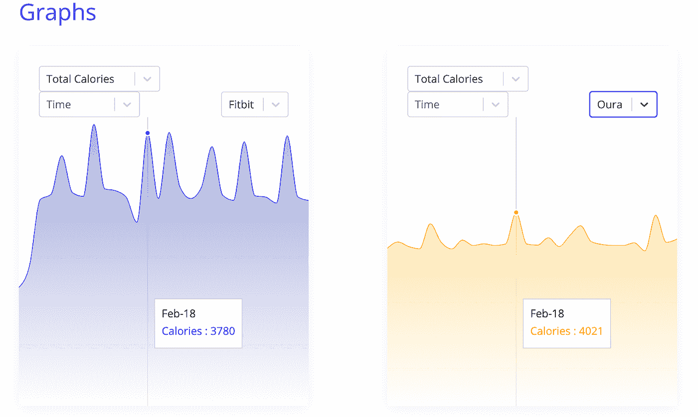
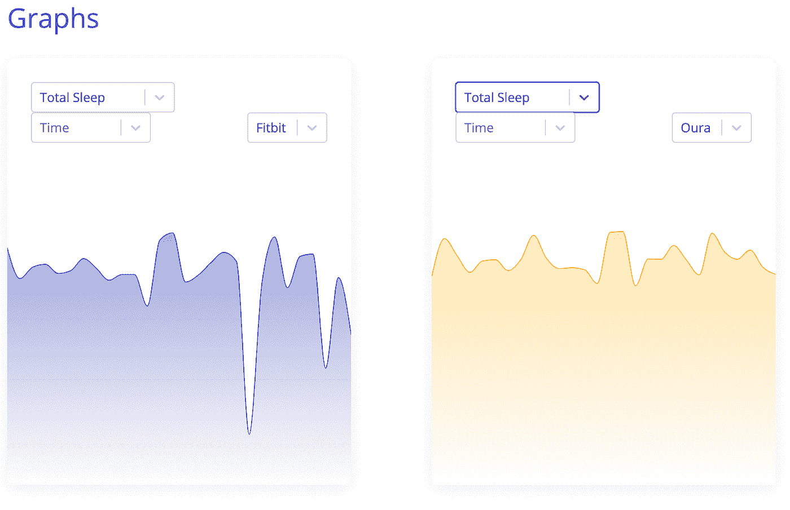

# 来自 Oura Ring 和 FitBit 的数据差异——谁是对的？

> 原文：<https://towardsdatascience.com/variance-in-data-from-oura-ring-and-fitbit-whos-right-4e4b8861c78a?source=collection_archive---------46----------------------->

## 结合像 Oura 和 Fitbit 这样的个人数据源，我们得出如何处理错误、差异和补充的结论

使用 Prifina 上的图形工具，我们可以查看用户的可穿戴设备数据，比较相同时间间隔内的不同数据点，探索数据本身的相关性和变化。对于不同的可穿戴设备，我们可以在相同的时间间隔(天、周、月)内探索来自同一用户的数据。

图片来自 Drobotdean (Freepik)

除了玩有趣的数据和从中获得潜在见解的娱乐价值之外，我们还发现了相同数据点中的差异，并提出了我们的应用程序应该信任哪些数据点的问题，以及如何处理大量个人设备和传感器之间的总体差异。

设备之间的比较使几个方面变得非常清楚:

1.  对于同一时期的相同数据点，不同设备之间存在差异。
2.  不同的可穿戴设备各有优缺点。

在本帖中，我们将探讨这些变化，如何处理它们，以及如何为不同类型的应用程序选择不同级别的数据。

图片由[普里菲娜](http://www.prifina.com)提供

Oura 和 Fitbit 设备都可以跟踪卡路里和新陈代谢。用户通过 Fitbit 和 Oura ring 设备测量的同一时期的总卡路里显示在上面的图表中。方差是<10% for 23% of the time period, <15% for 80% of the time period and 7% had a variation of ca. 50%.

Image courtesy of [普里菲娜](http://www.prifina.com)

在此期间，这两款可穿戴设备还记录了总的睡眠时间。总睡眠与卡路里的变化类型相似，其中 53%的观察数据点在该时间段内的变化小于 10%，83%的总数据点的变化小于 20%。

值得注意的是，虽然两个设备之间有几个(确切地说是 14 个)数据对象是“共享的”(意味着两个设备跟踪相同的数据点，尽管有自己的测量和方法)，但上面这两个是差异最小的。

所以，如果我们想要对方差下结论，我们可以假设它在统计学上是显著的。这对于特定的用例或应用是否重要，取决于实际的应用。

## 不同的设备有不同的优势

用锤子去拧钉子看起来很傻，然而我们假设同样的传感器装备在我们扔给它们的所有任务上。事实并非如此。Oura 戒指主要作为一种睡眠可穿戴设备进行营销，而 Fitbit 主要是一种个人运动可穿戴设备。能够有选择地比较来自更好器件的数据点与所讨论的数据点，可以产生一些有趣的见解，而且能够使用更强的器件最终将为应用提供最佳精度和价值。

抛开营销的立场，我们怎么知道什么是真的？我们当然可以跟着数据走。然而，为了确定哪些设备是最准确的，两个设备是不够的。幸运的是，通过 Prifina 的软件，用户可以将不同的可穿戴设备数据收集到自己的个人云中，应用程序可以利用该框架获得最准确和全面的数据点。

## 用软件补充硬件

类似于您的变焦视频质量在很大程度上不是由于您的设备摄像头，而是由于根据可用带宽优化质量的软件，我们不仅需要组合数据，还需要利用软件来优化和校正传感器数据本身。

这是我们和 Prifina 一起建造的。我们允许应用程序有选择地、明智地利用数据点，最终为最终用户提供最佳价值。睡眠即服务即业务可以使用来自 Oura 或 Apple Watch 的睡眠数据点，以及来自其他可穿戴设备的运动数据。

想看看你的[自己的个人数据图表](http://www.prifina.com)？