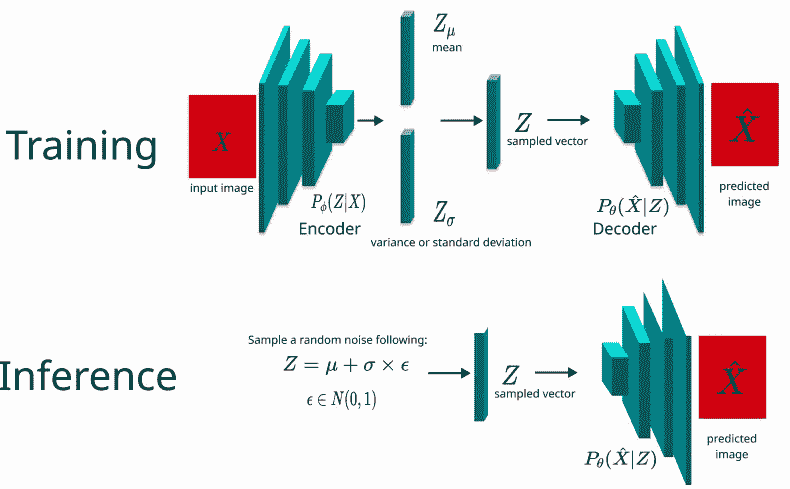
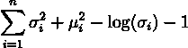
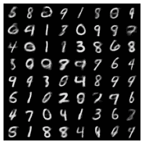

# 变分自动编码器:介绍和例子

> 原文：<https://towardsdatascience.com/variational-autoencoder-55b288f2e2e0?source=collection_archive---------19----------------------->

## 使用变分自动编码器生成看不见的图像

你可能已经知道，经典的自动编码器被广泛用于通过图像重建进行表征学习。然而，有许多其他类型的自动编码器用于各种任务。这篇文章的主题是变分自动编码器(VAE)。如下图所示，VAE 也试图重建输入图像；然而，与传统的自动编码器不同，编码器现在产生两个矢量，解码器使用这两个矢量来重建图像。因此，给定分布，我们可以对随机噪声进行采样并生成逼真的图像。

可变自动编码器。图片作者。

# VAE 原则

VAE 的目标是给定一个从预定义的分布生成的随机向量，生成一个逼真的图像。这对于我上次提到的简单的自动编码器是不可能的，因为我们没有指定生成图像的数据的分布。因此，战略如下:

1.  编码器获取图像并输出两个向量，其中每个向量代表平均值和标准偏差。
2.  我们把均值向量和标准差向量相加，先乘以一个随机的小值作为噪声，得到一个修正向量，这个向量和 is 大小一样。
3.  解码器采用修改后的矢量，并尝试重建图像。
4.  我们试图优化的损失值是 L2 距离和 KL 散度的组合，KL 散度测量平均值和标准偏差向量的分布分别从 0 和 1 的偏差。

因此，我们鼓励我们的平均向量具有以 0 为中心的分布，而后一个向量应该以 1 为中心(高斯分布)。最后，我们的解码器将能够从均值为 0、标准差为 1 的随机噪声(向量)中生成逼真的图像。

# KL 散度

我们使用 KL 散度来计算我们的特征向量与平均值为 0 且标准分布为 1 的值的期望分布有多不同。损失计算如下:

KL 发散。图片作者。

其中σ和μ分别代表标准差和平均值。如图所示，目标是使平均值(μ)尽可能接近 0(通过平方该值)。而等式的其余部分确保标准偏差(σ)接近 1。请注意，我们使用对数来确保标准差不为负。

**例子**

我将使用的模型如下所示:

正如所见，我们的编码器输出的是方差的对数，而不是标准偏差向量，所以这里要小心。该示例在 MNIST 数字数据集上运行。最后，损失函数如下:

**瞧！仅经过 10 个时期的训练，我们的解码器就能够产生非常逼真的随机噪声图像，其均值为 0，标准差为 1(可以使用 torch.randn 函数生成)。**

VAE 生成图像。图片作者。

# 一些遗言

变分自动编码器是一个非常简单而有趣的算法。我希望这对你来说很容易理解，但是不要着急，确保你理解了我们讨论的所有内容。除了 VAE 之外，还有许多类型的自动编码器。通过下面的链接，你可以随意学习其他的自动编码器。谢谢大家！

 [## 自动编码器:介绍和实际应用

### 当我们想到无监督学习时，自动编码器可能是第一个想到的神经网络…

towardsdatascience.com](/autoencoders-introduction-and-practical-applications-3eb7b5c1c7fd)  [## 从自动编码器到贝塔 VAE

### 自动编码器是一组神经网络模型，旨在学习高维数据的压缩潜变量…

lilianweng.github.io](https://lilianweng.github.io/lil-log/2018/08/12/from-autoencoder-to-beta-vae.html)