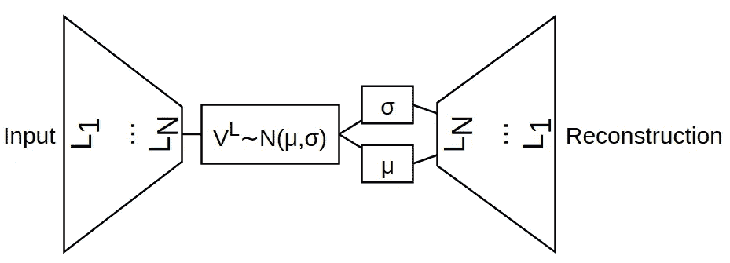
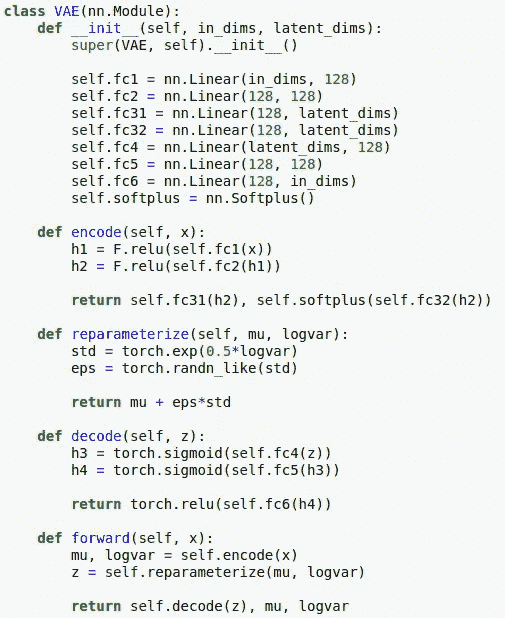
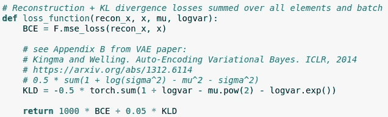
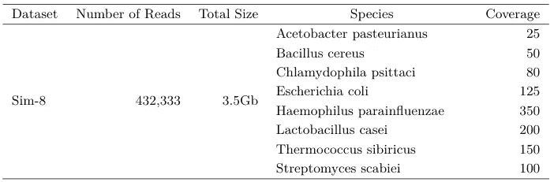
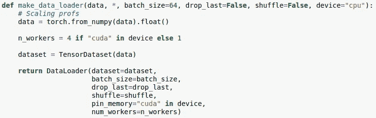
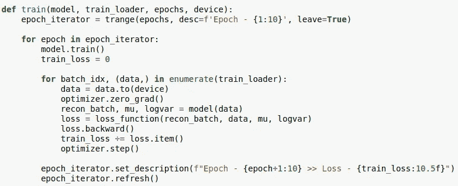
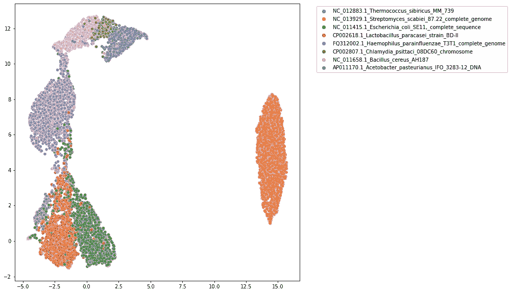

# 变分自动编码器和生物信息学

> 原文：<https://towardsdatascience.com/variational-autoencoders-and-bioinformatics-8a1828170031?source=collection_archive---------20----------------------->

## 变分自动编码器及其应用简介生物信息学/宏基因组学分析

一般来说，自动编码器旨在学习数据的低维表示。自动编码器的主要优势之一是它们能够学习复杂得多的低维，而 PCA 类分解受到其线性性质的限制。请随意看看我关于自动编码器的文章。


照片由 [Hitesh Choudhary](https://unsplash.com/@hiteshchoudhary?utm_source=unsplash&utm_medium=referral&utm_content=creditCopyText) 在 [Unsplash](https://unsplash.com/s/photos/python?utm_source=unsplash&utm_medium=referral&utm_content=creditCopyText) 上拍摄

</machine-learning-autoencoders-712337a07c71>  

> 像往常一样，我将谈论生物信息学中的一个应用。

# 可变自动编码器

与传统的自动编码器(AEs)相比，变分自动编码器(VAEs)属于生成模型家族。这是因为 VAEs 学习输入数据的潜在分布。因此，在给定这些分布中的新点的情况下，它们能够重建新的数据点。然而，VAEs 的生成方面并不经常使用，因为 gan 在这方面做得更好。

VAEs 的一个主要重要性是能够学习数据中的不同分布(类似于高斯混合)。这有助于对展示不同基础分布的数据进行聚类。

# Python 中的必要导入

为了让您的下一个代码脚本工作，我们将需要以下导入。

```
import torch
from torch.nn import functional as F
from torch import nn, optim
from torch.utils.data import DataLoader
from torch.utils.data.dataset import TensorDataset
import numpy as np
from tqdm import tqdm, trange
import seaborn as sns
import umap
import matplotlib.pyplot as plt
```

# VAE 的建筑



作者图表

与 AE 类似，我们有一个瓶颈阶段，随后是重建阶段。更正式地说，我们有一个编码器和一个解码器。注意潜在表示`VL`和下面的`sigma`和`mu`变量。从这些分布参数生成重建**。我们完整的 VAE 类如下所示。**



作者图片

# 重新参数化技巧

注意，我们有`sigma`和`mu`来传递渐变。换句话说，我们将设置 VAE 来学习给定输入数据集的适当的`sigma`和`mu`。我们使用重新参数化技巧来实现这一点。也就是；

```
decoder_input = mu + epsilon * e ^ std
```

注意，当我们选择使用`e^std`时，我们正在讨论对数方差。因此出现了代码`logvar`中的术语。

# 激活和损失函数

请注意，我们在许多地方使用 RELU 激活。但是，我们在`logvar`潜变量选择了`softplus`。这是因为对数方差总是大于零。在最终重建中，我们使用`sigmoid`，因为我们的输入数据维数范围在 0 和 1 之间。



作者图片

我们的损失函数由两部分组成。重建损失(RL)和 KL 散度(KLD)。我们特别使用 KLD，以确保学习到的分布尽可能接近正态分布(或高斯分布，或我们喜欢的一些分布)。你可以在这里阅读更多。

重建是一个很好的旧的均方误差。根据应用的不同，这可能会有所不同。例如，黑白图像(MNIST)可以使用二进制交叉熵。

最后，我们可以为支持最佳聚类(或宁滨等)的 RL 和 KLD 搜索适当的权重超参数。

# 使用 PyTorch 运行示例

让我们考虑一下我最近的一篇论文中的宏基因组数据集。使用 [**SimLoRD**](https://academic.oup.com/bioinformatics/article/32/17/2704/2450740) 应用程序模拟长读取。



LRBinner 数据集(许可证抄送)

现在，数据集使用以下工具进行了矢量化；

<https://github.com/anuradhawick/seq2vec>  

数据加载器可以设计如下:



作者图片

训练 VAE 的功能；



作者图片

初始化；

```
data = LOAD DATA
truth = LOAD GROUND TRUTH # for visualizationdevice = "cuda" if torch.cuda.is_available() else "cpu"model = VAE(data.shape[1], 8).to(device)
optimizer = optim.Adam(model.parameters(), lr=1e-2200)
```

培训；

```
train_loader = make_data_loader(data, batch_size=1024, drop_last=True, shuffle=True, device=device)epochs = 50train(model, train_loader, epochs, device)
```

获得潜在表征；

```
with torch.no_grad():
    model.eval()
    data = LOAD DATA
    data = torch.from_numpy(data).float().to(device)
    em, _ = model.encode(data)
```

可视化；

```
import randomsidx = random.sample(range(len(data)), 10000) # just use 10000
em_2d = umap.UMAP().fit_transform(em.cpu().numpy()[sidx])plt.figure(figsize=(10,10))
sns.scatterplot(x=em_2d.T[0], y=em_2d.T[1], hue=truth[sidx])
plt.legend(bbox_to_anchor=(1.05, 1))
```

# 宁滨宏基因组学

一旦 VAE 被训练，我们就能获得潜在的表象。在这个例子中，我使用 UMAP 将 10000 个读数的样本投射到 2D 进行可视化。它看起来像下面这样。



作者图片

就像它看起来的那样，我们可以到处看到大量的数据点。人们可以很容易地使用像 [**HDBSCAN**](https://hdbscan.readthedocs.io/en/latest/how_hdbscan_works.html) 这样的工具从中提取密集的簇。

# 结论性的评论

最初用 VAE 代表宁滨的想法是由 VAMB 代表宁滨议会提出的。VAMB 通常要求高重叠群计数(> 10000 左右)。这是因为你总是需要更多的数据才能在深度学习中表现得更好。考虑到所有这些挑战和机遇，我们开发了自己的工具 [LRBinner](https://github.com/anuradhawick/LRBinner/) 来绑定宏基因组学读数。在那里我们总是有数百万的阅读量。完整的 LRBinner 工具比我在本文中介绍的要复杂得多。但是直觉和想法保持不变。我们也使用了不同的聚类算法。如果你感兴趣，看看下面。

<https://github.com/anuradhawick/LRBinner/>  

在这里找到完整的 Jupyter 笔记本。原 PyTorch 示例代码为[此处为](https://github.com/pytorch/examples/blob/master/vae/main.py)。

我希望你喜欢阅读这篇文章。祝您愉快！