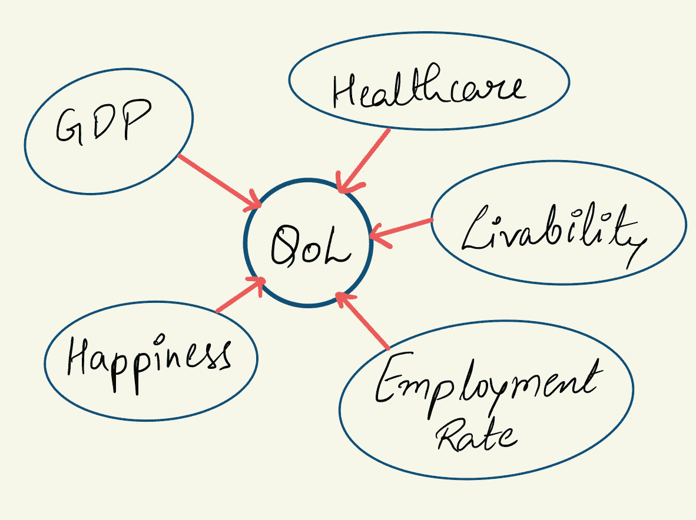
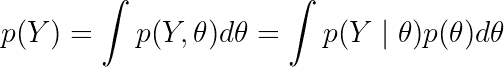
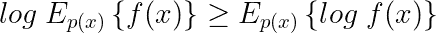
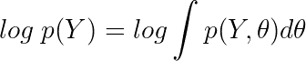
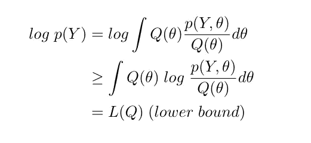
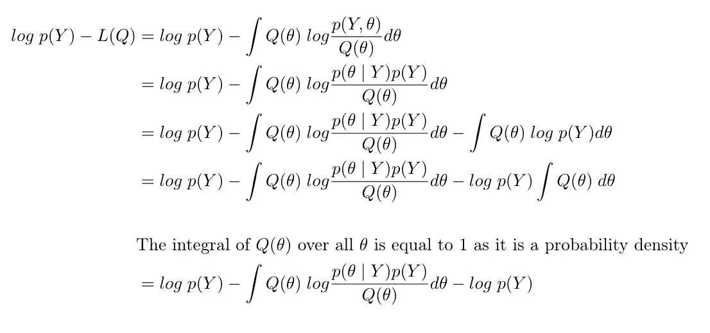
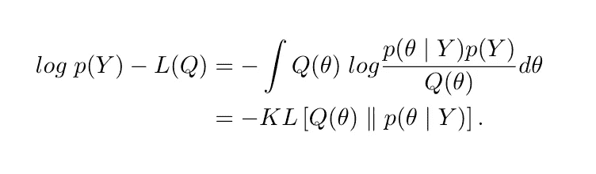
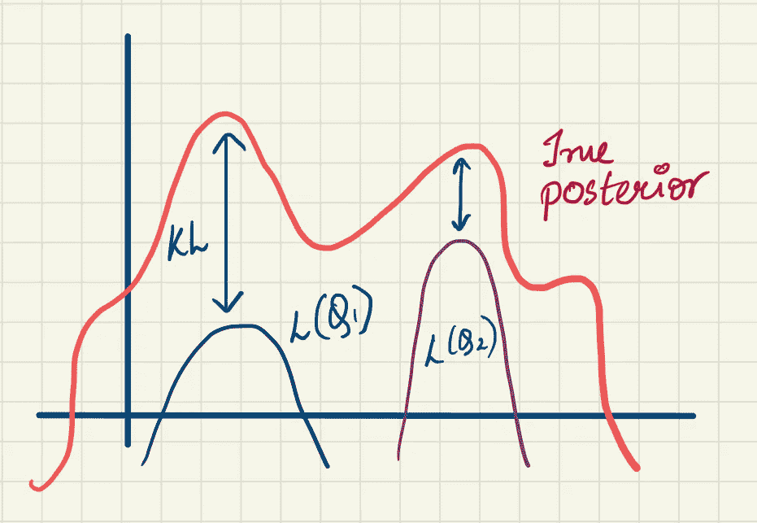

# 变分贝叶斯:变分自动编码器背后的直觉

> 原文：<https://towardsdatascience.com/variational-bayes-4abdd9eb5c12?source=collection_archive---------4----------------------->

从一个复杂且通常难以处理的**‘真实后验分布’**中进行推断的高计算成本一直是贝叶斯框架中的绊脚石。然而(谢天谢地)，有一些特定的推理技术，能够用某种……*易处理的东西来合理地逼近这个棘手的后验问题。看到我在那里做了什么吗？*

照片由[安托万·道特里](https://unsplash.com/@antoine1003?utm_source=medium&utm_medium=referral)在 [Unsplash](https://unsplash.com?utm_source=medium&utm_medium=referral) 上拍摄

最近流行的一种近似推理技术是**变分贝叶斯(VB)。**相对**较低的计算成本**和**良好的经验近似**推动其驱动成功模型背后的直觉，如**变分自动编码器**等等。在本文中，我试图在变分贝叶斯背后建立一个直觉，作为一个潜在变量模型，通过优化一个叫做 **Kullback-Leibler 散度的统计度量，寻找接近*“真实后验分布”*。**

> 有趣的事实:虽然我们正在用 VB 构建一个后验分布的近似值，但这不是它的主要动机。当试图最大化对数边际似然时，后验近似思想出现了。你会看到的！—西蒙·罗杰斯和马克·吉罗拉米的第一门机器学习课程。

在我们继续之前，让我们举一个简单的(玩具)例子，为潜在变量的概念打下一些基础(并可能理解潜在变量和模型参数之间的区别)。

## **玩具示例:**

*生活质量(QoL)* 是世卫组织用来描述特定地理区域生活状况的常用指标。它通常被定义为一个人健康、舒适、能够参与或享受生活事件的程度[1]。尽管量化这些抽象的量通常很困难，但基于一般的理解，我们可以提出一些(简单的)指标来影响这种 QoL 测量。例如，该地区的人均国内生产总值，就业率，教育质量，医疗保健，宜居性，幸福指数都是相当容易控制的特征，可能会影响生活质量。(见图)

一个简单的(完全虚构的)潜在变量模型。*图片作者。*

谈到我们的组合模型，我们可以看到有多种因素(无论是直接观察到的还是其他的)可能会影响我们的兴趣量，即 QoL 测量。由于我们无法单独测量这个抽象值，我们使用了多个替代(可观察)变量*来量化它。这样的量被称为**潜变量**。潜在变量的值可以从可能影响它的可观察变量的测量中推断出来。许多现实场景都是这样，这也是潜变量模型有用的地方。*

> 即使当我们(错误地)假设知道我们可以观察到的量和我们希望观察到的量之间的关系时，也可能有一些未知或隐藏的变量在起作用，但没有被解释。

但是，在使用潜变量模型时，会考虑这些未解释或隐藏的量。否则，这些量可能会在我们的模型中出现错误。关于有意建模错误的一些直觉，请看本文:

 [## 生成性思维

### 在最小化我们的 ML 模型中的错误时，有意将错误或噪声合并到我们的模型中的好处…

medium.com](https://medium.com/swlh/thinking-generatively-c0bce13dd3e6) 

## 变异推理:贝叶斯方法

在消化了我们关于潜在变量概念的简短示例之后，让我们通过考虑具有一些可观察数据 ***Y、*** 以及由 ***θ*** *定义的模型参数和/或潜在变量的一般建模场景，将我们的变分推理的主要思想置于上下文中。*在贝叶斯域中，我们通常将模型参数和潜在变量都作为随机变量来定义，并将其集合在 ***θ*** 项中。换句话说，我们把在给定场景中我们不知道的一切都看作是这个 ***θ*** 变量*的一部分。*敬那些关注的人，现在就关注最大化对数边际可能性吧！边缘看起来像这样，

***p(Y，θ)*** 的关节密度可分解为 ***p(Y|θ)p(θ)。*** *作者塑造的形象。*

其中，我们对参数***【θ】***的所有可能值的可能性 ***p(Y|θ)*** 进行求和，并通过先验的***【p(θ)***进行加权，我们希望最大化这个量。然而，由于在整个参数空间上潜在的高维积分，我们将不能实现这个表达式的精确评估；这就是为什么我们会利用**简森不等式**来给我们的 ***边缘项*** 的 ***log*** (是凸函数)下一个下界。

简森不等式允许我们设置一个下限。图片作者。

取边际可能性的对数，我们得到如下结果:

图片作者。

在应用简森不等式之前，我们先介绍一下 ***Q(θ)，*** ，它是在***【θ，*** 上的一个任意分布，通过在右侧将其相乘和相除。再看上面我们提到的不等式表达式，我们右边的项可以认为是对 ***p(Y，θ)/Q(θ)*** 项 w.r.t ***Q(θ)的一个期望。现在应用简森不等式，我们可以得到对数边际的一个下界。***

我们根据**和* ***得到一个下界的后验。*** 图片作者。*

> *假设我们已经任意选择了这个分布***【Q(θ)***，这是一个我们可以微调的变量旋钮，这个事实将会是一个非常重要的启示，你将会看到。*

*现在，让我们计算我们的对数边际似然项和我们刚刚找到的下界***【Q】***之间的差。*

**

*求差: ***log p(Y) — L(Q)。*** *图片作者**

*积分项看起来熟悉吗？让我们清理一下，像这样:*

**

*边际和下限之间的差异(我们使用简森不等式发现的)等于负 KL 散度！*图片作者。**

*积分下的表达式算出(相当精确地)是我们真实的后验概率***【θ| Y】***和任意选择的 ***Q(θ)之间的 **Kullback-Leibler (KL)散度**。*** 有趣的是，KL 散度是一种常用于量化两个概率分布之间差异的度量，在我们的例子中，后验(我们希望近似)和任意选择的 ***Q(θ)*** 是那些两个分布。这个 KL 散度项在我们的变分贝叶斯练习的推导中的出现不仅仅是一个巧合；我们确实在努力寻找一种近似的分布，这种分布最接近我们真实的后验概率，瞧！ ***Q(θ)*** 是一个变分旋钮，它允许我们调整 ***L(Q)*** 项，并且相应地最大化 ***L(Q)*** 将允许***【Q(θ)***到变得更类似于真实的后验概率***(θ| Y)****

> ***注** : **KL 散度**作为一个度量，一般**小于或等于零**，当两个分布相等时，其最大值即零出现**。**所以，万一我们找到真后验，那么 **KL 散度**项将为零，界限 **L *(Q)*** 将等于**对数边际似然**！*

**

*观想 ***Q(θ)*** *的变化，企图近似真实的后验。图片作者。**

*基本上，我们已经用一个下限代替一个整体分布来近似真实的后验分布，这样更容易优化。从上图可以看出，这个想法是试图使用任意分布 ***Q(θ)找到真实的后验概率。******Q(θ)***的这种优化作为后验概率的最佳近似， ***p(θ|Y)*** 通常通过类似于**期望最大化** (EM)算法的迭代优化过程来实现。 [Ravi Charan](https://medium.com/u/393ce2bbf82c?source=post_page-----4abdd9eb5c12--------------------------------) 关于 EM 算法的文章是一篇很好的读物(非常数学化):*

* [## 解释期望最大化

### 用于聚类、NLP 等的通用算法

towardsdatascience.com](/expectation-maximization-explained-c82f5ed438e5) 

这就结束了(潜在地)理解驱动最先进模型的强大思想的推理之旅，如*变分自动编码器*和*生成对抗网络。约瑟夫·罗卡的这篇文章对 VAEs 进行了详尽的概念化，非常值得一读。*

 [## 了解变分自动编码器(VAEs)

### 逐步建立导致 VAEs 的推理。

towardsdatascience.com](/understanding-variational-autoencoders-vaes-f70510919f73) 

感谢您的宝贵时间！如果你喜欢这篇文章，请喜欢或分享内容以示支持，让我知道你的兴趣。在[媒体](https://anweshrm.medium.com/)上关注我或者通过 [LinkedIn](http://www.linkedin.com/in/anwesh-marwade-87172211b) 联系我。

下次见！

参考资料:

1.  *维基百科生活质量文章(https://en.wikipedia.org/wiki/Quality_of_life)*
2.  *西蒙·罗杰斯和马克·吉罗拉米。2016.机器学习初级教程，第二版(2nd。由…编辑).查普曼&霍尔/CRC。**