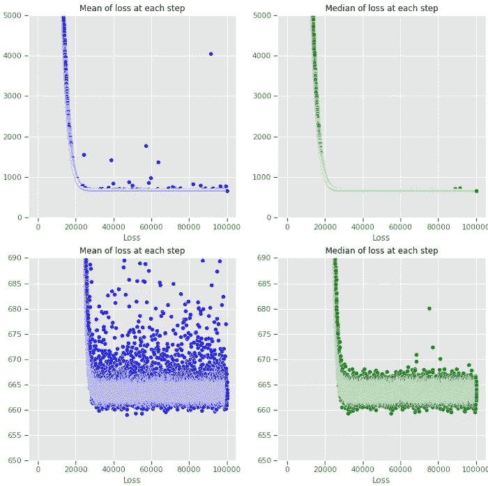
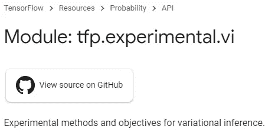
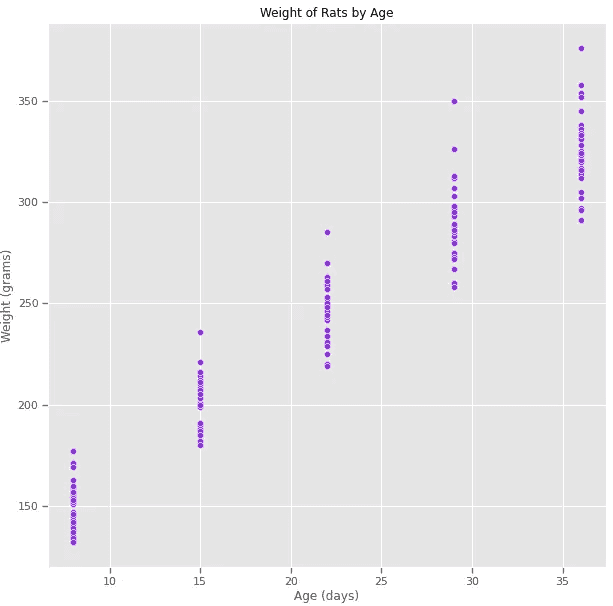
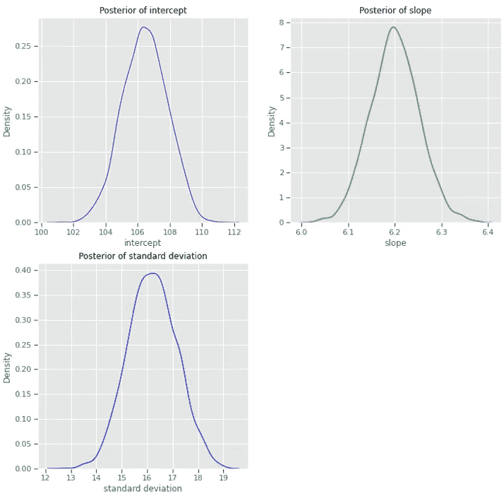
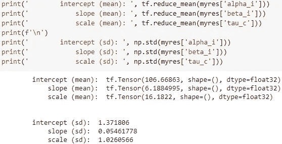
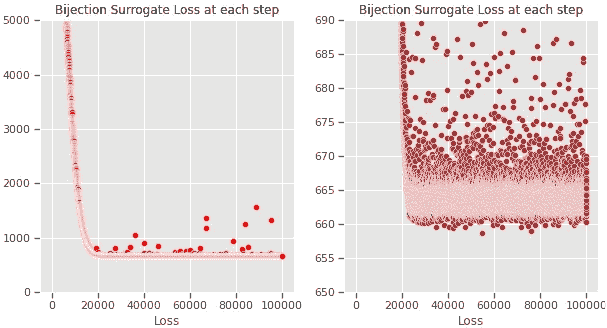
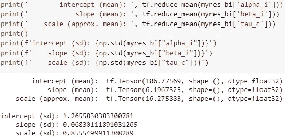
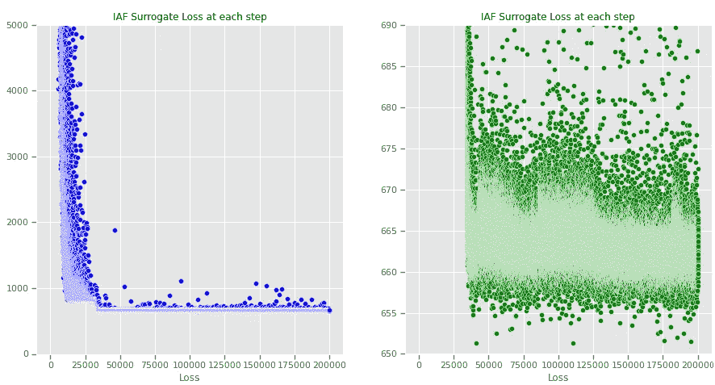
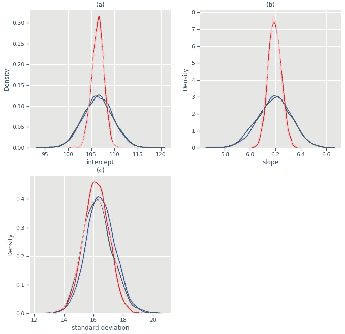

# 具有正常化流的变分贝叶斯推断:一个简单的例子

> 原文：<https://towardsdatascience.com/variational-bayesian-inference-with-normalizing-flows-a-simple-example-1db109d91062?source=collection_archive---------8----------------------->

## [思想和理论](https://towardsdatascience.com/tagged/thoughts-and-theory)

## 使用张量流概率的基本介绍

# 1.0 简介

变分推理(VI)是一种值得关注的方法论。对于大型或复杂的贝叶斯建模，VI 有可能成为首选方法，尤其是因为在计算上 VI 自然适合机器学习的领域。本文展示了标准化流程——这是简要介绍的——如何极大地提高 VI 的性能，即使对于非常简单的模型也是如此。Tensorflow Probability (TFP)中提供了标准化流，样板代码借用了 TFP 文档。VI 和规范化流程的结合为推理建模创建了一个强大的工具。

图一。具有变换高斯替代后验的线性回归模型 TFP 的变分损失。图片作者。

# 1.1 为什么要贝叶斯推断？

近年来，贝叶斯建模已经成为许多科学和技术领域的主流。贝叶斯建模的一个定义特征是能力——实际上也是需求——指定关于要估计的模型参数的先验信念。在一些应用中，这种先验知识的整合是选择贝叶斯方法的关键驱动因素，例如，弥补可用数据的不足。在其他应用程序中，采用贝叶斯方法更多的是一个实用的模型设计问题；随着高质量贝叶斯计算库的可用性，例如[【JAGS】](https://mcmc-jags.sourceforge.io/)、[斯坦](https://mc-stan.org/)、 [R-nimble](https://r-nimble.org/) 、 [PyMC3](https://docs.pymc.io/) 、 [Tensorflow Probability](https://www.tensorflow.org/probability) 、 [R-INLA](https://www.r-inla.org/home) ，有可能快速创建几乎任意复杂度的定制概率模型。

贝叶斯模型构建的灵活性带来了额外的风险和责任，例如，模型实际上有意义吗？先验信念的影响是什么？计算估计稳健吗？—诸如此类。对于贝叶斯模型构建艺术的专家观点，我们强烈推荐阅读 James Berger 教授的一些文章。 [Stan 用户指南](https://mc-stan.org/docs/2_27/stan-users-guide/index.html)也是范例和良好实践的宝贵来源。

# 1.2 计算挑战

贝叶斯推理在很大程度上与有效地近似难以解决的积分有关。迄今为止最常见的方法是[马尔可夫链蒙特卡罗](https://en.wikipedia.org/wiki/Markov_chain_Monte_Carlo) (MCMC)抽样，它通过从后验分布生成实现来避免计算积分的需要。有多种不同的取样器可用，这是一个有大量文献的活跃研究领域。BUGS——使用吉布斯抽样的贝叶斯推理——项目始于 1989 年，产生于 1997 年推出的 WinBUGS。通过消除建模者编写自己的采样器的需要，这是使贝叶斯推理和模型构建对非专家来说是可访问的第一个重要步骤。

MCMC 采样的一种替代方法是对难以求解的积分使用[解析近似法](https://rss.onlinelibrary.wiley.com/doi/10.1111/j.1467-9868.2008.00700.x)。这是 [R-INLA](https://www.r-inla.org/home) 采用的方法，它使用集成嵌套拉普拉斯近似。这种方法非常快，R-INLA 在地理空间统计建模中特别受欢迎，尽管这种方法不如 MCMC 普遍适用。

MCMC 的另一种替代方法是<https://en.wikipedia.org/wiki/Variational_Bayesian_methods>****(VI)变分推理，这种方法的应用，使用张量流概率，是本文的重点。一篇优秀的关于 VI 的概括性介绍和评论在[这里](https://arxiv.org/abs/1601.00670)有[stand](https://mc-stan.org/)具体文章[这里](https://arxiv.org/abs/1506.03431)。变分推理试图找到一个尽可能接近后验分布的(已知)概率分布。使用已知的分布避免了计算难以解决的积分的需要。变分推理通过最大化通常被称为 ELBO 的证据下限来实现这一点，ELBO 与[kull back-lei bler-divergence](https://en.wikipedia.org/wiki/Kullback%E2%80%93Leibler_divergence)(KL-divergence)密切相关，后者是一种量化两种概率分布彼此相似程度的指标。最大化 ELBO 使真实后验分布和替代分布之间的 KL 偏差最小化。****

# ****1.3 机器学习****

****近年来，变分推理变得越来越流行，并且在[标准](https://mc-stan.org/docs/2_19/reference-manual/vi-algorithms-chapter.html)和[张量流概率](https://www.tensorflow.org/probability)中都可用。****

********

****TPF API 的截图。图片作者。****

****原因可能是多方面的，但最重要的是因为 **VI 自然地适合于机器学习(ML)** ，而 MCMC 可能不适合。变分推理需要数值优化，而不是数值积分。机器学习建模通常需要数值优化——最小化一些 ML 模型和数据之间的损失函数。这意味着使用 VI 的**贝叶斯建模可以利用最新的专门构建的 ML 框架、软件和硬件**，例如跨 CPU 的快速并行化、高性能多 GPU 和其他高性能计算基础设施，如谷歌的 [TPUs](https://en.wikipedia.org/wiki/Tensor_Processing_Unit) 。这开启了一个令人兴奋的可能性，即在未来，VI 可能成为大型或复杂贝叶斯模型的首选计算方法，而使用 MCMC 在计算上是不可行的。因此，变分推理是一个值得关注的领域。****

# ****1.4 双喷射器和标准化流程****

****使用 VI 进行贝叶斯推理的一个主要实际挑战是**确定后验**的候选分布——替代分布。我们需要足够灵活的分布，以紧密匹配真实的后验分布，同时在分析上易于处理，以避免那些难以解决的积分。多元高斯分布，通常经过一些变量的变换，可以说是最常见的选择。例如，Stan 中使用的方法(参见[第 3 页，此处为](https://arxiv.org/pdf/1506.03431.pdf))是首先将模型中的所有潜在变量转换到真实线上，例如，转换约束变量，如方差参数(必须严格为正)。然后为这些变换的变量以及那些已经在真实线上的变量设定多元高斯分布。****

****使用高斯代理分布的一个已知问题是，即使在必要的变换之后，模型参数的**边际后验估计可能是欠分散的**。这是因为高斯分布不够灵活，不能完全捕捉真实后验分布的形状。一个实际的例子在[的张量流概率教程](https://www.tensorflow.org/probability/examples/Variational_Inference_and_Joint_Distributions)中给出。当与来自 MCMC 抽样的结果相比时，高斯替代不是真实后验的好估计，后者被假定为金标准。在本文的后面，我们将看到一个类似的分散不足的问题，使用一个不同的数据集和一个更简单的贝叶斯模型。所以这不仅仅是一个复杂模型的问题。****

****定位高斯代理的替代方法是采用上述张量流[教程](https://www.tensorflow.org/probability/examples/Variational_Inference_and_Joint_Distributions)中使用的方法；使用一个**可训练代理分布** **，它是通过使用** [**归一化流**](https://arxiv.org/pdf/1908.09257.pdf) **(NF)** ，特别是[反向自回归流](https://arxiv.org/pdf/1606.04934.pdf) (IAF)导出的。从概念上讲，标准化流程通过一系列双射变换将概率分布转换为不同的概率分布。双投影是应用于概率分布的变换，它确保变换产生有效的概率分布。概率密度必须整合为一，因此，如果变换拉伸或压缩参数，则必须相应地调整其密度，以在该密度下保持相同的体积。IAF 方法使用神经网络将双射体变换链接在一起，这些变换具有可训练的参数，因此 IAF 有效地针对后验分布训练代理分布。**与高斯替代相比，这可以更好地估计后验参数**。****

# ****2.0 建模****

****本文的其余部分是对 Colab/Jupyter 笔记本的概述——完整版本可从 GitHub [这里](https://github.com/fraseriainlewis/towardsdatascience.git)获得。我们只展示了足够的代码来提供关键步骤的概念。完整的代码有点长，但有相当多的重复，是现有 Tensorflow 概率教程加上对最新 TFP API 的额外调用的混合和匹配。TFP API 是一个移动的目标，因此笔记本使用硬编码版本(Tensorflow=2.6.0rc0，Tensorflow Probability=0.13.0)来避免以后的更改破坏代码，但也使用足够新的版本，因此它们包括*。实验 API 函数。带有 GPU 运行时的 Google Colab 工作簿用于所有建模。****

# ****2.1 数据****

****我们使用来自经典的 [WinBUGS Rats 示例](http://www.medicine.mcgill.ca/epidemiology/Joseph/courses/common/rats.pdf)的数据，这是一个广泛使用的数据集，用于演示贝叶斯推理中的正常层次模型。数据集包括来自 n=30 只大鼠的观察结果，并且在 36 天的时间内测量每只大鼠的重量 m=5 次。这里我们不使用层次模型(排除先验)，而是使用一个简单的线性回归模型，具有固定的效应截距和斜率。对于这些数据来说，这可能不是最好的方法，但选择这种方法是为了给出一个尽可能简单的例子来证明变分推断和标准化流。不难扩展所提供的代码，以将必要的层次结构/随机效应包括到似然函数中。****

********

****图二。Rats 数据来自 WinBUGS 示例手册。图片作者。****

# ****2.2 模型定义****

****下面是贝叶斯模型，我们将使用 BUGS 语言中定义的 rats 数据，稍后我们还将使用 [JAGS](https://mcmc-jags.sourceforge.io/) 来拟合该模型(下面的代码与 JAGS 兼容)。****

****要点 1。bug 中定义的模型 1。****

****张量流概率(TPF)中定义相同可能性和先验的等效代码如下(要点 2)。这使用了对[**JointDistributionNamedAutoBatched**](https://www.tensorflow.org/probability/api_docs/python/tfp/distributions/JointDistributionNamedAutoBatched)的调用，这意味着组件是字典。代码可读性很强，但是使用 TFP API 构建一个联合分布可能有点复杂，因为有许多不同的形状参数。使用“自动匹配”调用变体有助于降低复杂性。有关有用的代码片段和 API 文档，请参见官方 TFP 教程。****

****要点 2。TFP 中定义的模型 1。****

****我们已经定义了要拟合的模型，接下来需要的是定义模型 1 中参数的后验密度的替代分布。VI 拟合过程将估计该替代中的参数，以便在给定可用数据的情况下给出最佳拟合。****

****要点三。模型 1 的高斯代理。****

****上述要点显示了替代密度的定义。模型 1 中的每个参数都在代理中定义。范围受限的参数，例如 tau _ alpha——它是一个方差参数，因此必须严格为正——具有应用于高斯密度的[软加变换](https://en.wikipedia.org/wiki/Rectifier_(neural_networks)#Softplus)。这个代理是一组独立的高斯密度(在任何变换之前)。****

# ****2.3 模型拟合****

****我们已经定义了模型和代理，所以剩下的就是进行拟合——最小化负变分证据下限(ELBO)。简而言之，如果我们查看下面的拟合代码片段(要点 4)，我们可以看到两个分布**target _ model 1 . un normalized _ log _ prob**和 **surrogate_posterior** (其中前者只是要点 2 中定义的 **model1** 分布，稍加修改使其成为 **target_model1，**详见 Jupyter 工作簿)。这里执行的优化是试图最小化这两个分布之间的差异(其中差异由 ELBO 度量的负值描述)。****

****要点 4。优化器代码。****

****上述要点基本上是不言自明的。将拟合过程包装到一个 **tf.function** 中极大地改善了计算时间，这也得益于 **jit_compile=True** 。 [tf.function](https://www.tensorflow.org/guide/function) 将代码编译成图形，而不是在 eager 模式下执行(TF v2 中的默认模式)。****

# ****2.4 使用高斯替代的虚拟仪器的结果****

****与任何数值优化一样，跟踪模型拟合过程的进度以评估收敛性是很重要的。下图 3 显示了拟合过程中的损失函数(负 ELBO)。****

********

****图三。模型 1 的损失。图片作者。****

****损失图显示了每次迭代中负 ELBO 的均值和中值估计。其中每一个都基于调用 tfp.vi.fit_surrogate_posterior 时的 4 个数据点(我们选择 sample_size=4)。默认值为 sample_size=1。最小化似乎在大约 30K 次迭代后稳定下来。损失估计是相当嘈杂的，这并不奇怪，因为它是基于蒙特卡罗样本的变分散度估计。增加 sample_size(例如从 4 增加到 20)似乎对损失轨迹中的噪声只有很小的影响。**该模型的 ELBO 估计为 ELBO=-663.5，**我们希望最大化该值(图中显示为负 ELBO)。****

****图 4 显示了截距、斜率和标准偏差的边际后验密度估计值(分别为 Gist 2 中的参数αI、βI 和τc)。这些是在拟合过程之后使用从替代密度提取的实现来计算的。后验点估计值和标准差如图 5 所示。****

********

****图 4。模型 1 的边际后验概率。图片作者。****

********

****图五。模型 1 的后验点估计。图片作者。****

# ****3.0 基于双投影器的多元正态替代****

****上面使用的代理分布是通过使用**JointDistributionNamedAutoBatched**独立定义每个组件的密度(=模型 1 中的参数)创建的。对于更复杂的替代，例如，允许模型参数之间的协方差的多元正态，则需要使用 TFP 的双投影器功能的更灵活的方法。我们在这里简单地讨论这一点，因为它是通向更复杂的标准化流程方法的自然跳板。****

****下面的代码片段(要点 5)并不完整——缺少了一些基本的样板文件——但是展示了该方法的总体思想。定义了一个基本分布，这里是一组标准的独立法线。还定义了协方差结构，虽然这里使用的编码为简单起见假设了对角协方差矩阵(因此这与上面使用的代理没有很大的不同)，但是这种方法可以使用更复杂的依赖结构。参见[这里的](https://www.tensorflow.org/probability/examples/Variational_Inference_and_Joint_Distributions)一个更复杂的使用双投射器的块结构协方差的例子(这超出了本文的范围)。****

****最后一步是将一系列双投影变换链接到基本分布，其中一个是协方差矩阵变换，一个是位置参数，一个是确保先验的域匹配(例如，对于一些参数被约束为严格正的)。这种通用方法允许构建多元正态替代分布，该分布被约束到由模型定义的先验支持区域。这种方法当然不限于高斯分布，因为可以使用其他类型的基本分布。****

****要点 5。用双投影公式定义协方差矩阵。****

****下图类似于图 3，但这一次使用 bijector 转换构建了代理。该模型的 ELBO 估计为 **ELBO=-663.9，在 ELBO 估计值**周围的噪声容限给定的情况下，实际上与之前的模型相同(例如，参见图 6 中的右图)。鉴于代孕配方如此相似，这是意料之中的。****

********

****图六。使用双射体的多元正态替代模型 1 的损失函数。图片作者。****

****图 7 中的点估计也与图 5 中的类似，这并不意外，尽管标准差不太相似。****

********

****图 7。基于双投影的多元正态替代的点估计。图片作者。****

# ****使用规范化流程构建的 4.0 代理****

****为了建立在 3.0 节的基础上，我们现在使用一个通过规范化流程创建的代理。简而言之，虽然在技术上相当复杂，但是规范化流程允许我们做的是创建定制的概率分布，并针对手边的问题进行训练。要了解更多关于标准化流量的信息，这在密度估计中也有应用，参见参考文献[这里](https://www.tensorflow.org/probability/api_docs/python/tfp/bijectors/MaskedAutoregressiveFlow)。****

****我们再次使用来自 TFP 的一些样板代码，其中一部分与第 3.0 节中用于基于双对象的代理的代码相同。这里的关键区别在于，一种新的双投影变换——反向自回归流(IAF)——被应用于基本分布(同样是一组高斯分布)。根据 TFP 文档，“反向自回归流(IAF)是使用神经网络捕捉分布成分之间复杂的非线性依赖关系的正常化流”。****

****下面的代码片段(要点 6)展示了一个用于实现 IAF 以构建代理发行版的代码示例。这段代码大量借鉴了现有的 TFP 教程。感兴趣的主要部分在第 8–12 行，特别是要使用的 IAF 变换的数量，以及在 hidden_units 参数和激活函数的选择中定义的每个变换的参数化(第 12 行)。尝试了不同的 IAF 变换数、隐藏单元数和激活函数值。下面的方法似乎对当前数据集很有效，给出了可靠的损失函数行为(并不总是如此，对这些参数的每个选择进行检查是很重要的)。****

****要点 6。标准化流程模型定义。****

****为了根据数据训练 IAF 代理，所需的代码(要点 7)遵循与其他代理相同的形式，唯一的区别是引用新的 IAF 代理密度。****

****要点 7。优化器代码。****

****损失函数在性质上类似于前面的替代函数，但是请注意图 8 右侧面板中的不同范围和方差。与图 6 相比——图 6 是直接可比的，因为两者都使用 sample_size=1 来计算损耗，较大的值不稳定——我们可以看到损耗的噪声更大，而且分布略低于图 6 中的分布。****

********

****图 8。使用正常化流的代理损失函数。图片作者。****

****该型号的 ELBO 估计为 **ELBO=-662.6** ，如果与之前的损失数字进行比较，那么 ELBO 应该略低似乎是合理的，但差异非常小，实际上可以忽略不计。****

# ****5.0 规范化流程在 VI 中表现更好吗？****

****我们使用了一个非常简单的模型——带截距和斜率的线性回归——并使用 VI 将该模型拟合到数据中，使用和不使用标准化的基于流量的替代密度。确定替代密度表现如何的一个度量是 ELBO 值。在之前的 TFP [教程](https://www.tensorflow.org/probability/examples/Variational_Inference_and_Joint_Distributions)中，显示了标准化流的替代密度具有更好的(2 倍)ELBO 值。从我们上面的结果来看，这里显然不是这种情况；IAF 代理的 ELBO 稍微好一点，但这很难成为支持更复杂的流量标准化方法的令人信服的证据。****

****为了更深入地了解标准化流动是否真的有助于解决我们当前的建模问题，我们将来自 VI IAF 模型的密度估计值与来自 JAGS(使用 MCMC)的密度估计值进行了比较。马尔可夫链蒙特卡罗抽样可以说是这里的黄金标准方法，因为它不使用任何替代密度。图 9 显示了从 MCMC (JAGS)获得的结果与使用第 3.0 节中的高斯代理和 IAF 代理从 VI 获得的结果之间的比较。****

********

****图九。使用不同方法的边缘后验密度。MCMC——绿色，标准化流——蓝色，变换高斯——粉红色，使用双投影器的约束高斯——红色。图片作者。****

****从图 9 中可以明显看出，标准化流模型比任何一种高斯替代模型都更接近 MCMC 的结果，实际上，对于截距和斜率参数，IAF 几乎与 MCMC 相同。因此，对于这个几乎是最简单的可能模型和数据的例子，当使用变分推断时，使用标准化流替代给出了实质上更好的参数估计。高斯代理明显遭受分散不足，这类似于在一些 TPF 教程中看到的情况(也使用具有更复杂协方差结构的高斯代理，我们在这里使用简单的对角矩阵)。然而，与 TPF 教程相比，有趣的是，在这个例子中，如果我们只使用了 ELBO 指标，考虑到所涉及的额外复杂性，我们可能会选择不使用标准化流程方法。这表明了检查参数估计的密度图的重要性。****

****这个简单的例子表明，当使用变分推断时，规范化流可以提供相当大的额外灵活性和可靠性。也就是说，基于 MCMC 的推理仍然可以为当前的许多问题提供最佳的实际解决方案，例如，这里使用的模型可以用 Gist 1 中的代码来拟合，只需增加几行代码来配置采样器，实际采样只需要几秒钟的计算时间。与任何基于 MCMC 的建模一样，需要执行各种诊断检查，但总的来说，对于许多问题，这仍然是一种非常有效的方法。****

# ****6.0 结论****

****本文提供了关于如何在 TPF 中应用变分推理，以及如何使用其规范化流功能来改进建模结果的简要顶级指南。GitHub [这里](https://github.com/fraseriainlewis/towardsdatascience.git)提供了一个独立的 Colab/Juptyer 笔记本，其中包含生成所示结果所需的所有代码。同一个存储库中还提供了通过 MCMC 适应相同模型所需的 JAGS 代码/文件。****

****规范化流程的变分推理是一个令人兴奋的领域，值得关注新的方法发展，尤其是涉及真实世界建模挑战的新用例。****

# ****关于作者****

****这是[我](https://www.linkedin.com/in/fraser-lewis-819a5080/)，我在[达能](https://www.danone.com/)的研发数据科学部门工作，在那里我管理着一个庞大的数据科学家团队，我也很幸运地做了一些建模工作。****