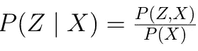
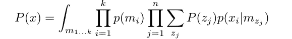
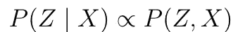
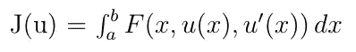
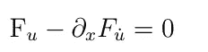
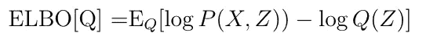
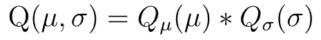

# 变分推理——旧物理学解决新的贝叶斯问题

> 原文：<https://towardsdatascience.com/variational-inference-c896668707aa?source=collection_archive---------29----------------------->

## 一种新的分析方法

[https://unsplash.com/photos/fBMpqsBYc3A](https://unsplash.com/photos/fBMpqsBYc3A)

# 什么是 VI？

变分推理是一种解决最常见的贝叶斯问题的方法:给定一个观察到的数据，找到控制它生成的概率函数。虽然问题及其解决方案似乎很常见，但当 VI 首次出现时，它被认为是极具创新性的，因为它是针对 Bayes 问题的第一个分析性解决方案，而不是传统的采样方法。在这篇文章中，我将介绍虚拟仪器的早期出现，描述它的数学基础，并展示这个框架的前科学链接。

# 问题是

我们首先描述 VI 旨在以一致的方式解决的问题。我们正在处理统计数据，因此期待数据样本是合理的。让我们举个例子:

x，x，x..，x ⁰⁰..也就是我们**观察到的数据。**问题是一般性的，即样本可以是任何类型的数据:图像、语音话语、数字、比特或向量。

假设这个样本是由一个随机的机器生成的，这是非常简单的。作为研究人员，我们希望揭示这台机器的统计方式。在数学上，我们假设我们的观察数据是由控制样本 X 生成的隐藏变量 Z，Z …生成的。因此，我们要找到生成这些 Z 的函数。即找到 P(Z|X)。

下面是贝叶斯公式:

作者

LHS 被称为**后验分布。我们希望在观察到的数据上找到这个函数。我们能使用 RHS 吗？**

提名者可以写成我们的先验知识和获得的可能性的产物，因此它是已知的。因此，我们的问题集中在分母上。在某些情况下，这是容易处理的。然而，考虑从 K 高斯 GMM 驱动的数据。我们的隐藏变量是高斯参数和它们的权重以及分配的聚类。分母中的概率如下:

作者

很“优雅”不是吗？这种积分通常是难以处理的。人们需要一种方法来克服这一点。然而也有好消息: **P(X)独立于 z。**我们可以以不同的方式观察贝叶斯公式

作者

棘手的术语不再是障碍。我们仍然需要巧妙地处理 RHS。

直到 1999 年，解决这类问题的常用方法是使用抽样方法，如大都会、T2、黑斯廷斯、T4、吉布斯、HMC。

这些算法是无偏差的，但却患有采样的常规“疾病”:它们被赋予了巨大的方差。

1999 年，著名的迈克尔·乔丹退役了。同年，不太出名的迈克尔·乔丹发表了一篇论文，其中他提出了一种解决贝叶斯问题的新方法。这个想法是开发一个依赖于分析方法的解决方案。通过预先决定分布族(这一步增加了过程的偏差),我们可以构建一个对采样障碍有弹性的解决方案。在 2003 年，随着 Blei 发表了关于主题抽取的论文并将这种方法用于 LDA 过程，这种方法得到了极大的发展。然后他声称最佳的工作方式是“在等待 Gibbs 收敛的同时使用 VI”。

在接下来的几节课中，我将简要描述导致这种方法发展的数学步骤。

## 寻找最佳函数

为了提供后验分布的解析近似，我们需要两个工具:

*   测量两个分布函数之间距离的度量
*   在这些函数的空间上寻找极值的分析工具。

上面的子句非常明显，我们将使用 **KL-Divergence。**寻找函数空间的极值需要使用**变分法中的工具。**该领域处理诸如通过分析表示寻找点之间的最短路径等问题。我相信读者可以猜到这就是“**变分推理**这个术语的由来。这个领域的一个基本工具是欧拉- [拉格朗日](https://en.wikipedia.org/wiki/Euler%E2%80%93Lagrange_equation) [方程](https://mathworld.wolfram.com/Euler-LagrangeDifferentialEquation.htm)

作者

对于 **F** 实值函数、 **x** 自变量和**u**x 的一个可微函数，我们可以找到使 J 最小的 u 如下:

作者

现在，当我们有了这个工具，我们可以开始逼近后验函数。

因为我们希望逼近 P(Z|X ),所以我们搜索一个函数 **Q** (Z ),使其与真实后验概率的 KL 散度最小化。显然，当我们说“最小化 Q”时，这意味着我们搜索优化参数 **Q** ，因此我们必须定义我们将使用哪个分布族。在大多数应用任务中，我们用指数函数来表示 Q，

我们可以将 P(Z|X)和 **Q** (z)之间的 KL 散度写成如下

作者

其中，LHS 中的第二个术语表示为:

作者

ELBO 代表**证据下限:**最小化 KL 散度等价于最大化 ELBO，因为 P(X)独立于 z。

读者中的物理学家可能会发现这个公式类似于 [**亥姆霍兹自由能**](https://en.wikipedia.org/wiki/Helmholtz_free_energy)

# 解决 ELBO 技术

为了最大化 ELBO，我们需要一些假设和数值工具。

## 平均场定理

MFT 的想法来自于磁自旋的[伊辛](https://www.intechopen.com/chapters/71210)模型。这个模型过于严格，超出了本文的范围。然而，总的想法是，我们有一个观察到的序列 r.v X，X …接收值 1 和-1。我们的目标是估计一个依赖于这些观察变量的函数。它由线性和成对乘积项组成。从可以看出:**如果我们假设 r.v 不相关，我们可以使用它们的平均值来估计值。**

我们可以将这种想法移植到 VI:考虑不相关的对，我们将假设独立性，例如，考虑从高斯分布中抽取的数据，我们的 Z 是对的均值和方差。我们将假设这些参数是独立的，因此 **Q** 可以写成如下:

作者

将 Q 写成独立函数的乘积的想法简化了 ELBO 优化过程。

## 数字食谱

求解 ELBO 有两种常用方法:

**坐标上升 VI(CAVI)——**这个算法在[这里](https://arxiv.org/pdf/1601.00670.pdf)和[这里](https://brunomaga.github.io/Variational-Inference-GMM)有详细描述。这个想法是在每一步 j 中计算 ELBO 的 P 部分，以所有不是 j 的 Z 为条件。(也就是说，每一步我们只更新一个 Z，而其他的 Z 都是已知的)。每一步的解与 P 项的过对数的平均值的指数(ELBO 中的互概率)成正比。

**随机 VI —** 这个[算法](https://jmlr.org/papers/volume14/hoffman13a/hoffman13a.pdf)使用随机优化(Robbins 和 Monro)来求解 VI。它允许一些在 CAVI 不存在的批处理方式，从而使它更实用，并使用关于 VI 参数的 ELBO 的衍生物。

# 摘要

我们介绍了虚拟仪器的数学基础。有一些应用已经使用了这种算法，最著名的有:

*   **GMM**
*   **主题建模**

当然，这是 VAE 发展过程中必不可少的一部分

对动手项目感兴趣的读者可以在 [Edward](http://edwardlib.org/) ，在 [his implementation](https://zhiyzuo.github.io/VI/#python-implementation) 和 [Pyro](https://pyro.ai/) ，以及 [PyM](https://docs.pymc.io/) C3 中搜索。

关于数字逻辑，已经有一些数字逻辑应用程序用于解决虚拟仪器问题的例子(例如，使用神经网络在数据上寻找虚拟仪器参数)，但是，我相信(这也是我写这篇文章的主要动机)贝叶斯推理和数字逻辑的结合可能会提供大量的问题、机会和数学难题。我认为由 DL 训练高阶交换子的不太常见的分布问题非常有趣。