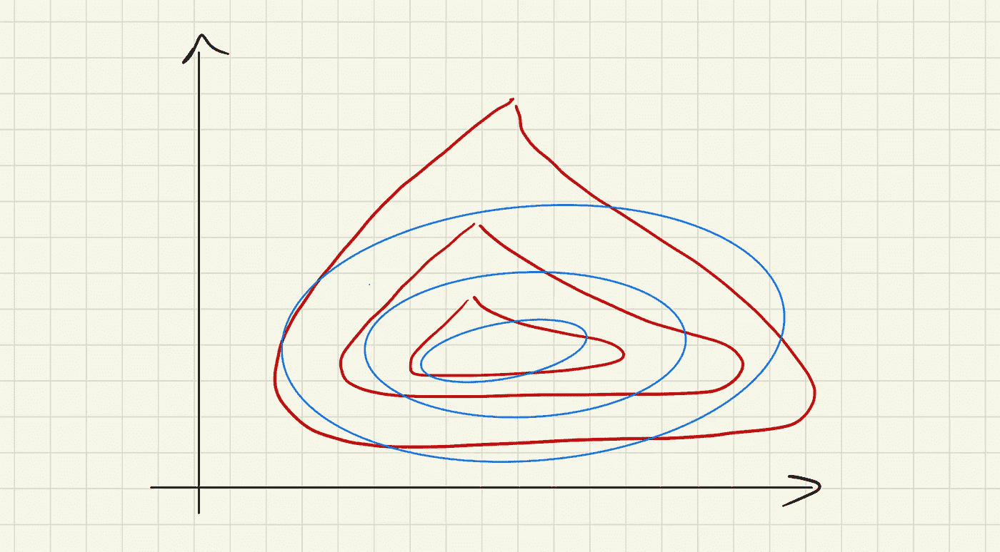
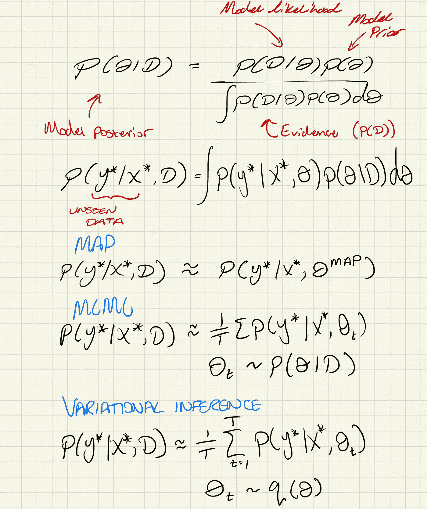
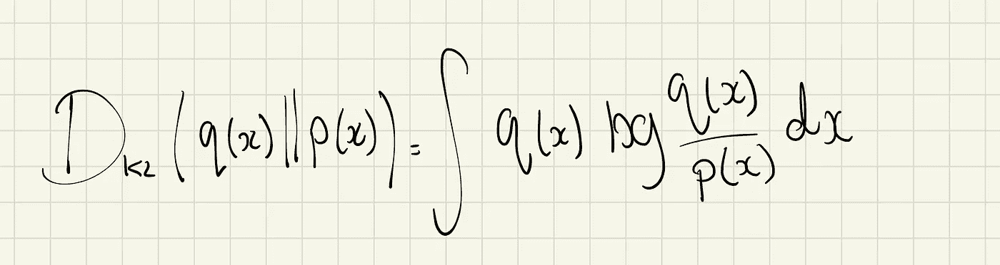
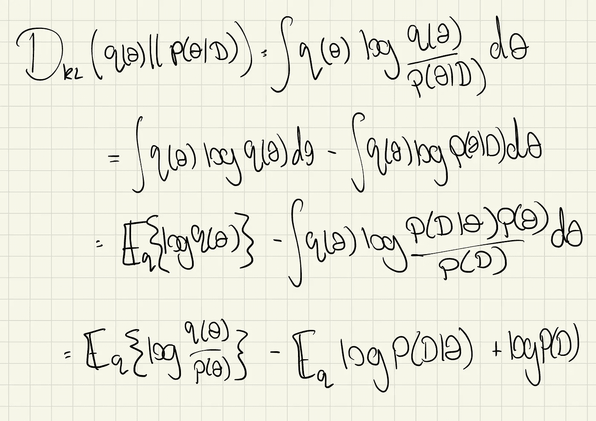
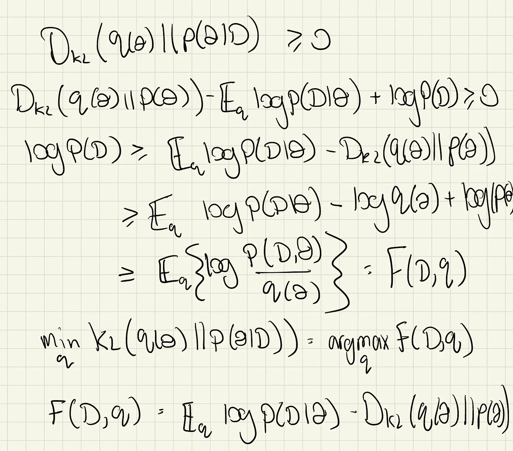
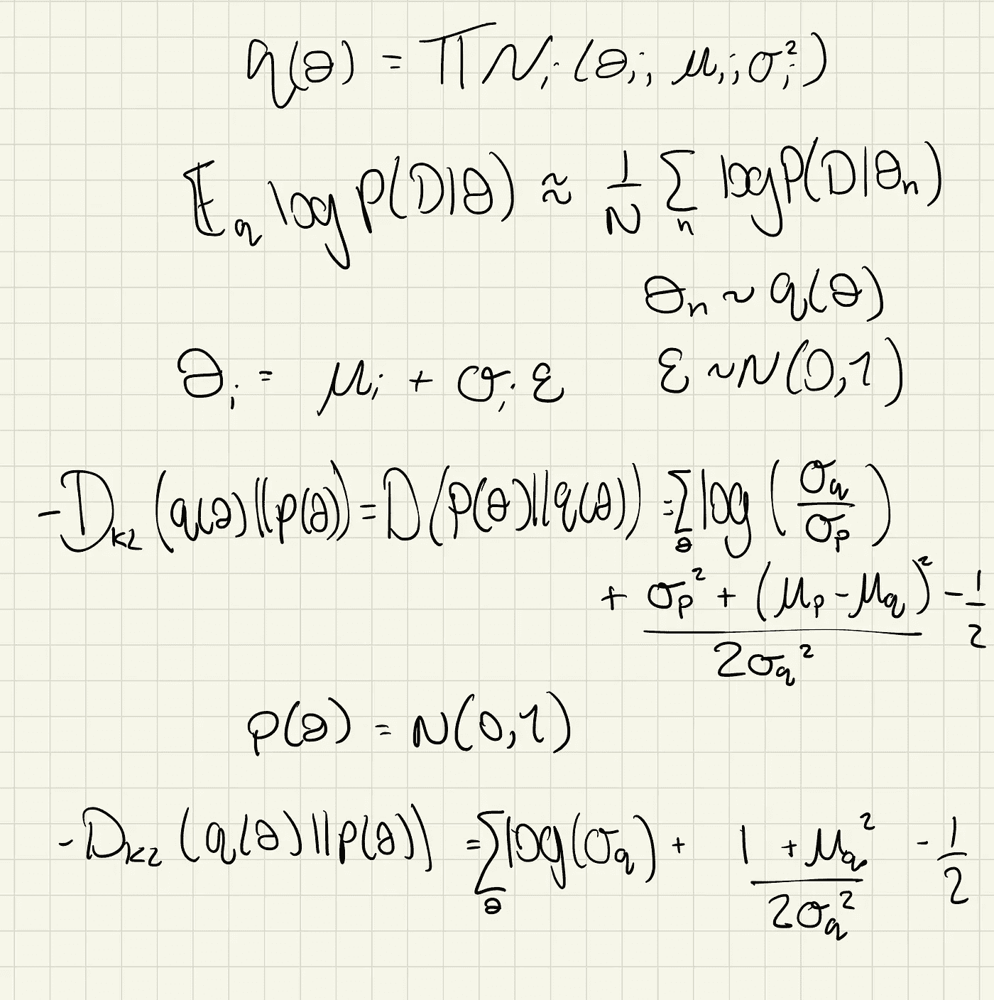
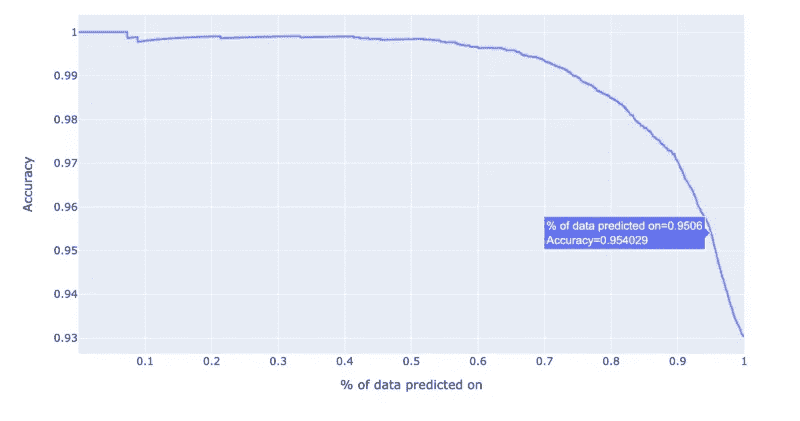
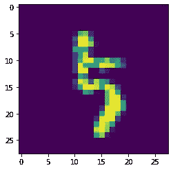

# 神经网络的变分推理

> 原文：<https://towardsdatascience.com/variational-inference-for-neural-networks-a4b5cf72b24?source=collection_archive---------22----------------------->

## [实践教程](https://towardsdatascience.com/tagged/hands-on-tutorials)

## 神经网络的贝叶斯近似介绍

变分推理图解。作者图片

贝叶斯分析是量化模型预测的不确定性的好方法。

大多数常规的机器学习建模任务涉及在给定模型及其参数的情况下为数据定义似然函数。目标是在称为最大似然估计(MLE)的过程中最大化关于参数的似然性。最大似然估计是模型参数的点估计，这意味着只进行一次预测。最大似然估计参数用于推断。

在贝叶斯建模中，除了似然函数，我们还必须定义模型参数的先验分布。我们使用贝叶斯规则来寻找后验参数分布。后验分布和模型可用于生成预测的概率分布(如下所示)。这使得我们在使用贝叶斯建模方法时能够量化不确定性。如果我们不再局限于点估计，我们可以选择是否信任基于分布范围的模型预测。

贝叶斯规则和贝叶斯推理。作者图片

这很好，但有什么问题呢？贝叶斯推理通常是一项非常昂贵的工作。计算后验分布通常要么很难，要么在分析上极其困难。此外，即使后验概率有一个封闭的解析形式，对任何合理复杂的模型来说，计算所有参数的积分基本上是不可能的。

有一些方法可以减轻这一困难:

1.  最大后验估计(MAP)找到后验分布的峰值，并将其用作模型的点估计(这通常比仅使用可能性要好，但不能为我们的预测提供不确定性的度量)。
2.  马尔可夫链蒙特卡罗(MCMC)允许我们从后验样本中抽取样本。然而，它可能会非常慢，特别是对于大型模型和数据集，并且它不能很好地处理高度多峰的后验分布。
3.  变分推断(VI)用一个更简单的“行为良好”的分布来近似后验概率。这就是我们在本文剩余部分要探讨的内容。

</introduction-to-mcmc-1c8e3ea88cc9>  

## 什么是变异推理(VI)？

变分推理的目的是用一个“行为良好”的分布来逼近后验概率。这意味着积分的计算使得估计越好，近似推断就越准确。让我们来看看一些数学知识，然后我们会看到这如何应用于神经网络。

首先，我们需要定义概率分布之间的距离度量，我们可以使用它来最小化。为此，我们选择了一种称为 Kullback-Liebler (KL)散度的距离度量。我们选择 KL 散度而不是其他距离度量的原因将在一会儿变得清楚，但这基本上是因为它与对数似然性密切相关。

KL 具有以下形式:

KL 定义。作者图片

如果我们用 p(x)项代替后验概率，并做一点重新排列，我们得到…

操纵 KL。作者图片

现在我们可以用下面的方式利用 KL 散度总是正的这个事实…

自由能定义。作者图片

F(D，q)项称为变分自由能或证据下界(ELBo)。重要的是，最大化 ELBo 使近似后验概率和真实后验概率之间的 KL 偏差最小化。最后一行的自由能形式，是对我们最优化最有用的形式。

我们之前讨论过一个细节，我说过我们需要用一个“表现良好”的分布来近似后验概率，但是什么是“表现良好”呢？一种流行的选择是将所有参数的联合后验概率近似为独立分布(通常是高斯分布)的乘积。独立性条件允许使用多种优化方法来最大化 ELBo，包括坐标上升和梯度上升。选择高斯分布有许多原因，包括它们是一个[共轭先验](https://en.wikipedia.org/wiki/Conjugate_prior)以及高斯分布之间的 KL 具有清晰的闭合形式。

高斯之间的 KL。作者图片

## 这如何应用于神经网络？

那么，我们如何将 VI 和平均场近似法应用于神经网络呢？

从非贝叶斯网络到变分贝叶斯网络的过渡是相当平滑的。通常我们会创建一个带有权重的密集图层，但这些只是点估计，现在我们想将每个权重建模为一个近似的后验分布。假设每个权重都有一个均值为μ、标准差为σ的高斯后验概率。

为了最大化 ELBo，我们需要两个东西，近似后验(q)的平均似然性和 q 与先验之间的 KL。为了计算平均似然性，我们从 q 中抽取蒙特卡罗样本，并通过向前传递一个小批次来估计平均似然性(就像我们通常做的那样)。q 和先验之间的 KL 有一个很好的封闭形式，因为我们选择一切都是高斯的。

那么我们可以用梯度下降法，对吗？不完全是，有一个小的微妙之处，你不能对随机的东西求梯度，这是没有意义的。这是选择高斯函数的另一个原因，您可以通过以下方式参数化高斯函数:

重新参数化技巧。作者图片

现在我们可以对μ和σ求梯度了！

值得注意的是，我们将模型中的参数数量增加了一倍，因为我们现在对每个模型参数的均值和标准差有了单独的权重。这大大增加了模型的复杂性，却没有提高模型的预测能力。

## 在 PyTorch 看起来像什么？

嗯，看起来是这样的…

对于这个实现，有一些重要的事情需要注意。首先，我们不直接为方差创建权重。相反，我们创建权重使得`σ = log(1+exp(w))`。我们这样做是为了优化过程中的数值稳定性。第二件事是，我们累计每一层的 KL 损耗，稍后你会看到，我们将损耗传递给下一层。我们可以这样做，因为 KL 项不依赖于数据，它有助于我们保持对总 KL 损失的标签，如果我们只是把它加起来。

现在让我们把它放到一个模型中:

## 理论上很可爱，但实际可行吗？

很棒的问题！让我们来了解一下！让我们以 MNIST 为例，训练一个模型对手写数字进行分类，看看结果是什么样的。我没有在这里包括训练循环代码，因为这都是相当样板，没有什么花哨的，只是在 MNIST 上训练一个模型大约 5 个时代。

值得注意的一点是，当我们使用该模型进行预测时，我们希望使用来自 q 的样本进行多次预测。这样，我们就释放了贝叶斯网络的真正力量，即预测不确定性的能力。知道您的模型何时对预测有信心可以帮助我们将人包括在循环中，并通过只接受模型有信心的预测来提高我们的整体准确性。

准确性是用于验证的数据百分比的函数。作者图片

为了创建该图，基于预测中的不确定性对所有点进行排序。然后，我们基于预测的不确定性迭代地放弃预测，并评估新模型的准确性。如果我们对所有的数据进行预测，不考虑我们的确定性，我们可以预期验证的准确性约为 93%。通过只标记 5%的数据，我们可以将模型准确性提高 2%以上！一般来说，我们标记以供审查的预测比例越高，模型实现的准确性就越高。我们可以使用这种方法来计算阈值不确定性，该阈值不确定性应该用于决定是否应该标记某个预测以供审查。

我们还可以看看模型不确定的一些样本…

不太可能的例子 3。作者图片

在这种情况下，我们预测 3，但标签是 5…老实说，我不知道你，但我可以看到混乱来自哪里！

## 我们学到了什么？

我们希望在这篇文章中实现两个主要目标。首先，我们了解什么是变分推理以及它为什么有用，其次，我们知道如何实现和训练利用 VI 的深度神经网络。所以下次当你设计一个用于分类或回归的普通神经网络时，考虑把它变成贝叶斯网络！