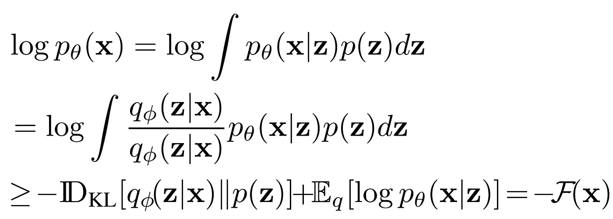
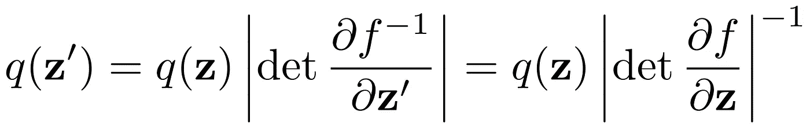
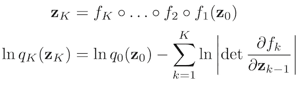
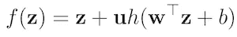
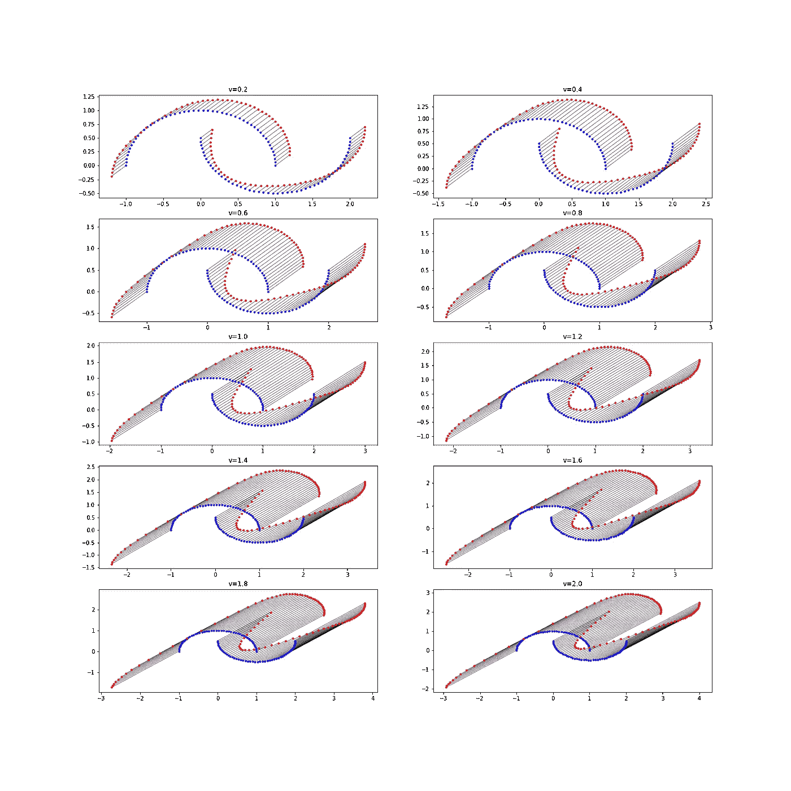
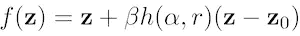
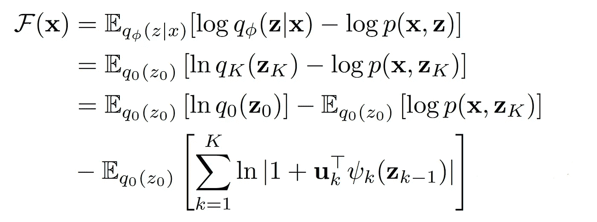
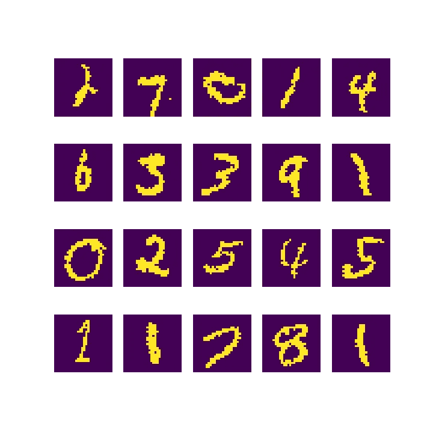

# MNIST 上带正规流的变分推断

> 原文：<https://towardsdatascience.com/variational-inference-with-normalizing-flows-on-mnist-9258bbcf8810?source=collection_archive---------9----------------------->

## [思想和理论](https://towardsdatascience.com/tagged/thoughts-and-theory)

## 了解规范化流程以及如何在创成式建模中使用它们

# 介绍

在这篇文章中，我将解释什么是规范化流程，以及如何在变分推理和设计生成模型中使用它们。本文的材料多来自【Rezende and Mohamed，2015】，我相信这是第一篇引入基于流的模型概念的论文(本文标题与论文标题几乎相同)。有许多其他有趣的论文跟进了这篇论文，并使用基于流的模型来解决其他有趣的任务。然而，在这篇文章中，我的重点仅仅是第一篇论文和最基本的概念。

我试图一步一步地解释这些模型是如何工作的，每一步都有 PyTorch 代码片段。模型的代码和可视化都可以在[这个 Github repo](https://github.com/mrsalehi/stupid-simple-norm-flow) 中获得。

在开始规范化流程之前，回顾一下什么是变分推理以及规范化流程与它的关系是有帮助的。

# 什么是变分推理？

假设我们有一组观测值 *x* *，x* *，…，x* ⁿ，其中它们是我们不知道的分布 p(x)的独立同分布样本(这些样本不一定在一维空间，可以是多维的)*。*同样，假设有一组假设变量*z*t14】，zt16】，…，z ⁿ在后面生成这些数据样本。事实上，为了生成数据样本，首先从分布 *p(z)* 中抽取一个潜在变量，然后用它来计算我们观察到的数据样本 *x* 。由于 z 在现实世界中是不可观测的，它们被称为潜在变量。

注:这只是我们自己的世界模型，潜在的变量仅仅存在于我们自己的想象中！最有可能的是，z's 和上述生成数据样本的过程在现实世界中是不存在的。

我们可以用 *x* 和 *z，*的联合分布，即 *P(x，z)* 来数学地指定我们的模型。这是我们模型的一个充分的表示，人们可以从这个联合分布中计算出 *P(x)* 和 *P(z)* 。我们通常喜欢用一些参数 *θ* 来参数化分布，其中大多数时候 *θ* 是神经网络的参数。因此，我们可以通过将分布写成 *P(x，z；θ)* 。现在，类似于机器学习中的大多数问题，我们的目标是学习模型的参数。最常见的方法是在我们的模型下最大化观察数据的对数似然性(即 *x* )。为了实现这一点，我们需要能够计算边际可能性*P(x；θ)* 为此，我们必须通过对潜在变量的所有可能值求和/积分来边缘化潜在变量。但是大多数时候这是难以想象的昂贵，因为有很多 z ！嗯嗯…..如果不可能计算一个简单的可能性，那么我们如何进行最大可能性训练呢？

这个问题有一个可能的答案:

1)引入一个辅助分布，比如*q(z | x；ϕ)* ，我们可以很容易地计算和工作。这种分布用作难以处理的后验概率 p(z | x；θ) 因而称为*近似后验*或*变分分布*。

2)我们不是直接最大化对数似然，而是最大化它的一个称为 ELBO 的下限，它由下面的公式给出:

情商。[1]第 15 页

ELBO 在上式中为 *-F(x)* 。很容易证明，最大化 ELBO 等价于最大化对数似然(或者最小化负对数似然等价于最小化负 ELBO)。因此，我们的新目标是:

> 学习模型的参数，即θ，和变分分布的参数，即通过最大化 ELBO 联合学习。

换句话说，变化的参数也使我们能够学习模型的参数。一种优雅的方法是使用可变自动编码器。然而，如果你熟悉 VAEs，你就会知道它们有一个缺点:变分族在大多数情况下过于简单，表达能力不够(通常是多元高斯分布)，不能逼近任意复杂的分布。这就是正常化流程帮助我们解决这个问题的原因。

# 什么是正常化流程？

标准化流是可以从简单分布开始并逼近复杂分布的模型。他们通过用一些函数多次变换初始分布，直到分布变得足够复杂。为了转换分布，我们可以使用可逆函数 *f* 。从变量变换公式中，我们知道变换变量的 pdf 可以计算如下(等式)。第 5 页，共 1 页):

现在，如果我们顺序地堆叠 *k* 这样的可逆变换，最后一个变量的密度可以导出如下(等式)。[1]的 6 和 7):

情商。[1]的第 6 和第 7 页

我们将在稍后为生成模型定义的损失中看到最后一个变量的对数概率。

这里需要注意的一点是，这些变换必须高效且易于计算，特别是考虑到密度公式中有一项包含行列式(行列式通常很难计算)。幸运的是，[1]提出了两类变换，它们的行列式很容易计算。它们也足够强大，我们可以从一个简单的发行版开始，仅仅使用这两个转换就可以创建一个非常复杂的发行版。

1.  **平面流**:该变换的公式如下:

该变换采用一个 D 维向量，并在垂直于由权重 *W* 和偏移 *b* 指定的超平面的方向上扩展/收缩该向量。平面流转换可以在 PyTorch 中实现，如下所示:

为了更好地理解这一层的表现，我在 2D 空间中用十个不同的|u|值可视化了一个简单流层的输入和输出。以下是可视化的代码:

结果如下图所示，其中蓝点代表初始分布，红点是它们的变换版本。此外，每个点都用实线连接到其变换后的对应点。我们可以很容易地看到，这些线都是平行的，并且垂直于超平面 *w.x+b=0* ，它就是直线 *x+y=0* 。

不同向量的平面流输出的可视化

2.**径向流**:第二类变换称为径向流，可用以下公式描述:

该变换围绕空间中的单个点扩展或收缩初始分布，并且可以在 PyTorch 中实现如下:

同样，我们可以用不同的值 *β* 和原点(0，0)作为变换的中心，在 2-D 空间中绘制该变换的可视化。与前面的可视化类似，蓝点表示初始分布，红点表示应用变换后的点(注意，这些线在变换中心的原点相交):

不同β值径向流输出的可视化

我们可以使用这两层的序列，并将简单的初始分布(例如多元高斯分布)转换为复杂的分布(例如多峰分布)。

# 基于流程的生成模型的实现

为了实现基于规范化流程的生成模型，我们可以使用本文提出的以下架构(图 2，共[1]):

基于流程的生成模型的架构(图 2，共[1])

这个模型由以下三个模块组成，我们将在 PyTorch 中逐一实现它们。

1.  **编码器**:首先有一个编码器，得到观察输入 *x* ，输出随机变量流中第一个变量的均值(如 *μ* )和 log-std(如 *log(σ)* )，即 *Z₀* 。值得注意的是，这个编码器类似于变型自动编码器的编码器。

2. **Flow-model** :编码器后有一堆流层，将第一次分布的样本(即 *Z₀* 来自分布 *q₀* 的样本)转换为复杂分布 *qₖ* 的样本 *Zₖ* 。请注意， *Zₖ* 是生成数据的主要潜在变量，我们已经使用了所有编码器+流层来推断 *Zₖ* 。因此，如架构图所示，我们可以将这两个模块合称为*推理网络*。以下是流模型的实现:

从上面的代码中可以看出，我们在流模型的实现中利用了重新参数化的技巧，其中我们将随机性移动到来自另一个标准高斯分布的样本，例如ε，然后使用 *σ*ε+μ* 作为初始样本 *Z₀* 。有了这个技巧，我们就能够将梯度传递给编码器网络，并对其进行训练。

此外，我们在 *log_det* 变量中累积每层计算的对数行列式。该模型输出该变量，该变量将在以后用于计算损失。同样的论点也适用于 *Z₀* 和 *Zₖ* 的对数概率，它们也出现在我们计算的损失中。

3.**解码器**:最后，解码器取潜变量 *Zₖ* 和模型 *P(x|zₖ)* (或者它的非规格化版本，有时叫做 logits)。同样，它类似于变分自动编码器的解码器，并且可以实现为完全连接的网络:

现在，让我们指定这里的θ和ϕ。θ是我们的真实世界模型的参数，它由先验的参数 *p(z)* 和参数 *P(x|zₖ)* 组成。我们的先验是标准的多元高斯，没有参数。因此，我们的模型的唯一参数是我们的解码器*【p(x|zₖ】*的参数。ϕ是变分参数，它由帮助我们从数据 *x* 中近似真实后验分布的所有参数组成。因此，它包括编码器和流模型的参数。

# 失败

训练任何机器学习模型的最重要的部分之一是损失函数。如论文所述，我们将优化负 ELBO 作为我们的目标，其通过以下公式(等式)计算。[1]的第 15 页):

第一期望值内的项*在 q₀(z₀)* 是初始变化样本的对数概率，它是流量模型的输出之一。第二个期望中的项， *log p(x，zₖ)* ，也可以写成
*logp(x|zₖ)+logp(zₖ)*。在这个等效表达式中，第一项是解码器的归一化输出(我们将使用 sigmoid 函数归一化解码器的输出)，第二项是作为流模型的另一个输出的 *zₖ* 的对数概率。最后，第三个期望中的项是流模型的 *log_det* 输出。注意，我们可以通过取小批量的平均值来随机估计期望值。下面是 PyTorch 中最终损失的计算(D 是随机变量的维数):

# 在二值化的 MNIST 数据集上训练模型

最后，我们可以在二值化的 MNIST 数据集上训练具有上面定义的目标的生成模型。以下是该数据集中的一些示例:

二值化 MNIST 数据集

我们唯一要做的事情是定义一个模型，将数据作为小批量加载，定义一个优化器(为此我们使用 Adam ),并编写一个训练循环:

搞定了。这是 PyTorch 中从 0 到 100 的一个简单的基于流的生成模型的实现！

# 承认

[1] [*Rezende 和 Mohamed 2015，用归一化流量进行变分推断*](https://arxiv.org/pdf/1505.05770.pdf) *。*

[https://github.com/tonyduan/normalizing-flows](https://github.com/tonyduan/normalizing-flows)

[https://github.com/karpathy/pytorch-normalizing-flows](https://github.com/karpathy/pytorch-normalizing-flows)