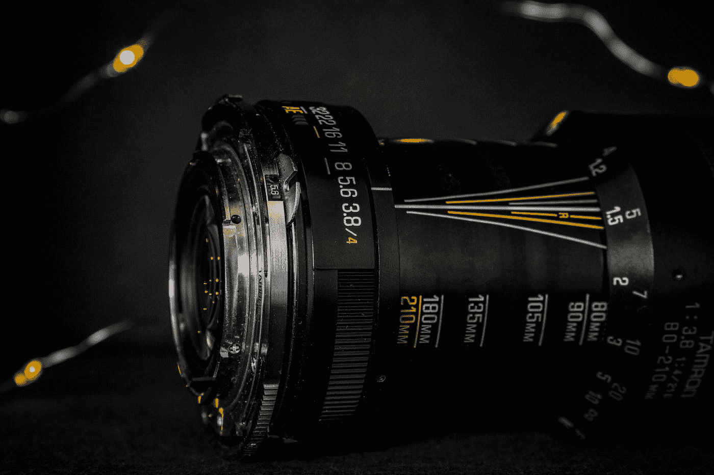

# VarifocalNet (VF-Net):最新的物体探测网络

> 原文：<https://towardsdatascience.com/varifocalnet-vf-net-new-state-of-the-art-object-detection-network-a1d54e0f7c1e?source=collection_archive---------17----------------------->

## 引入 IoU 感知和变焦损失，提高 SOTA 物体检测分数

[阳光摄影](https://unsplash.com/@sstoppo?utm_source=medium&utm_medium=referral)在 [Unsplash](https://unsplash.com?utm_source=medium&utm_medium=referral) 拍摄的照片

> *在 COCO 女士上的大量实验表明，我们的 VFNet 在不同主干上持续超越强基线*∩*2.0 AP。我们最好的型号 VFNet-X-1200 和 Res2Net-101-DCN 在 COCO test-dev 上实现了 55.1 的单模型单尺度 AP，这是各种对象检测器中最先进的。代码可在:*[*https://github.com/hyz-xmaster/VarifocalNet.*](https://github.com/hyz-xmaster/VarifocalNet.)获得

来源: [VarifocalNet](https://arxiv.org/abs/2008.13367)

几周前，当我在做一个物体探测 Kaggle 比赛时，我偶然发现了 VarifocalNet。我很惊讶地看到它匹配许多 SOTA 对象检测模型，如 YoloV5 和 EfficientDet，在某些情况下甚至超过他们。我亲自检查了这篇论文，我非常喜欢它。它引入了许多我感兴趣的新概念，比如变焦距损耗、IoU 感知分类分数等等。

该论文着重于精确地挑选出所产生的包围盒、优化它们的精度以及过滤它们的挑战，这是对象检测的本质。在一个小区域内存在多个对象的**密集对象检测**任务中，对象检测模型通常表现不佳。在这些情况下，挑选出正确的边界框变得困难，并且简单的损失函数(例如交集/并集)通常表现不佳(因为框重叠太多，即使它们是正确的)。

VarifocalNet 使用变焦距损失来预测每幅图像的 IoU 感知分类得分。变焦损失是由聚焦损失引起的。如果你对此感兴趣，那就继续读下去吧！

## **变焦损失介绍:**

在我们开始解释变焦距损失之前，我们需要看一下它的前身，焦距损失。焦点损失是经典交叉熵损失的升级。它试图通过向困难的数据点分配更多的权重来优化类别不平衡问题。你可能会想，是什么带来了阶级不平衡的问题。典型的对象检测网络评估每个图像的非常大量的候选框位置，但是这些候选框位置中只有一小部分实际上包含有效对象，这模拟了类别不平衡问题。

焦点损失本质上是在交叉熵中引入了一个“调制因子”,它减少了损失贡献[1]简单的例子，并增加了假阴性/阳性的重要性(这使得网络更加精确)。

这里要注意的一件重要事情是，在典型的对象检测任务中，正样本比负样本少得多(特别是在密集对象检测任务中)。在这里停下来想一想如何利用这个提示来改善聚焦损失可能是值得的。

变焦距损失不对称地对待正例和负例[1],不同于焦距损失平等地对待它们。这意味着正面例子的损失减少量与负面例子的减少量不同。

> 我们用训练目标 q 来衡量正面例子。如果正面例子具有高 gt IoU，则其对损失的贡献将因此相对较大。这就把训练的重点放在了那些高质量的正面例子上，这些例子对于获得更高的 AP 比那些低质量的例子更重要。
> 
> 为了平衡正例和负例之间的损耗，我们在负损耗项中增加了一个可调的比例因子α。

来源: [VarifocalNet](https://arxiv.org/abs/2008.13367)

我总是喜欢强调我所解释的任何新模型的不同之处。我认为损失函数可能是 ML 模型中最重要的事情之一(如果不是最重要的话)。因此，了解新模型中损失函数的变化非常重要。

## IACS 和星形盒要素制图表达

照片由[米卡·鲍梅斯特](https://unsplash.com/@mbaumi?utm_source=medium&utm_medium=referral)在 [Unsplash](https://unsplash.com?utm_source=medium&utm_medium=referral) 上拍摄

在我们解释 VFNet 为每个图像预测的新分数之前，我们必须探索 FCOS+ATSS(具有自适应训练样本选择的全卷积单级)架构，因为这是 VFNet 所基于的。许多对象检测网络是基于锚点的，这意味着预测的框依赖于平铺在图像上的预设锚点。然而，FCOS 试图摆脱锚，提供无锚网络(不需要 IoU 匹配)，无提议(使检测只发生在一个阶段)，并最终只使用卷积(使它更简单)。

> 自适应训练样本选择，或 ATSS，是一种根据对象的统计特征自动选择正样本和负样本的方法。它弥补了基于锚和无锚检测器之间的差距。

来源: [Arxiv](https://arxiv.org/abs/1912.02424)

如果你有兴趣了解更多关于 FCOS 的信息，我建议你看看这篇文章:

 [## FCOS 演练:物体探测的完全卷积方法

### 无锚目标检测

medium.com](https://medium.com/swlh/fcos-walkthrough-the-fully-convolutional-approach-to-object-detection-777f614268c) 

我知道我们很快引入了很多概念，但是请耐心听我说。新 SOTA 模型的美妙之处在于，它们几乎总是建立在几种新颖技术的基础上，了解每种技术以及它们是如何组合成一个单一模型的，这是优秀的数据科学家与众不同的地方(当然是在我看来)。这篇文章不足以深入每个概念，所以我将尽力简要地解释它们，如果您需要，只需查看整篇文章中列出的附加资源来增强您的理解。

FCOS 网络预测每个图像的分类分数(除了边界框坐标之外)。VFNet 的作者发现，用预测的边界框和地面真实值之间的 IoU[1](gt _ IoU)替换这个分类分数可以大大提高性能(COCO 上的 74.7 AP vs 56.1 AP)。这主要是因为高质量对象检测的主要秘密是从大量的预测框中选择正确的边界框，而 gt_IoU 在这方面比传统的分类得分更有帮助。

作者还设计了一个更不同的边界框，一个更符合 IACS 分数的星形框。这个星形盒子有 9 个固定的采样点[1]，可以更准确地捕捉上下文信息。该星形框还允许在最终预测之前进行更加有效和准确的边界框细化阶段。VFNet 还在最后的边界框细化阶段使用 NMS(非最大抑制)来进一步消除冗余框。

最后要注意的一点是，我喜欢的是，在他们的结果部分，他们有一个名为“单个组件贡献”的部分。本质上，他们把他们引入的每个组件与他们的标准组件互换，并显示结果的差异。这使我们能够看到每个组件对性能改进的贡献有多大。

**结论**

请随意检查论文的最终实验和结果，显示它如何优于其他 SOTA 模型。我觉得在这里复制和粘贴一个巨大的结果表没有意义，我对网络如何工作更感兴趣。我希望您现在对整个网络的工作原理有了一个更全面的了解。总而言之，VFNet 建立在 3 个主要组件之上。第一个是 FPN(特征提议网络)，第二个是主干 CNN，第三个是 VFNet 头(使用上面讨论的变焦损失和 IACS)。如果您对编写 VFNet 比深入理论部分更感兴趣，我建议查看我的关于在自定义数据集上实现 VFNet 的 MMdetection 文章:

 [## MMDetection 教程——最先进的对象检测库

### MMDetection 为使用许多 SOTA 物体检测模型提供了巨大的潜力，例如 FasterRCNN，DETR，VFNet…

towardsdatascience.com](/mmdetection-tutorial-an-end2end-state-of-the-art-object-detection-library-59064deeada3) 

# 谢谢你

感谢您阅读本文:)如果您喜欢这篇文章，请考虑在这里给我买杯咖啡(咖啡有助于我写作):

 [## mostafaibrahim

### 嘿，你好👋谢谢你考虑给我买一杯咖啡，☕️，说清楚一点，你的钱不会帮我付账单，我…

www.buymeacoffee.com](https://www.buymeacoffee.com/mostafaibrahim) 

如果你想定期收到关于人工智能和机器学习的最新论文的评论，请在这里添加你的电子邮件并订阅！

[https://artisanal-motivator-8249.ck.page/5524b8f934](https://artisanal-motivator-8249.ck.page/5524b8f934)

**参考文献:**

[1] [变焦镜头](https://arxiv.org/abs/2008.13367)