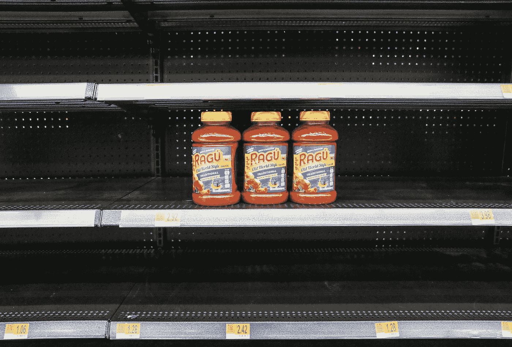

# 在医疗保健中应用机器学习的各种挑战

> 原文：<https://towardsdatascience.com/various-ways-at-which-machine-learning-could-be-used-in-medical-diagnosis-338c65393509?source=collection_archive---------20----------------------->

比尔·牛津在 [Unsplash](https://unsplash.com?utm_source=medium&utm_medium=referral) 上的照片

## *了解机器学习和数据科学在医疗诊断中使用的各种方式和方法，并了解一些挫折和挑战*

**机器学习**正被用于汽车、制造、零售等多个行业。随着机器学习和深度学习算法的发展，出现了大量有用的预测，如预测**股价**、**房价**和**贷款违约预测**。此外，有不同格式的数据可用于机器学习预测。随着数据的不断增长，机器学习领域有很大的发展空间，未来的预测会越来越好。

[freestocks](https://unsplash.com/@freestocks?utm_source=medium&utm_medium=referral) 在 [Unsplash](https://unsplash.com?utm_source=medium&utm_medium=referral) 上拍摄的照片

机器学习的一个有趣应用是在**医疗保健**领域。我们在互联网上看过一些电影，在这些电影中，机器人分别执行医生的工作和做出正确的诊断。像《安德的游戏》这样的电影展示了机器人是如何用于医疗诊断的。在医疗诊断领域，机器学习有许多新的应用。因此，该领域有很大的发展空间和改进空间。

在机器学习和数据科学的帮助下，越来越多复杂的算法正在开发中。机器学习在医疗保健中的一些很酷的应用是预测癌症发生的几率和阿尔茨海默氏症。看看这些应用，我们可以得出一个结论，机器学习仍在增长，未来对它的需求也会增加。现在，有越来越多的复杂算法正在开发中，用于机器学习，以进行稳健的预测。

在**放射学**中实现了机器学习模型，其中机器正在进行预测，这将确保我们在测试集上也得到了最好的结果。

# **在医疗保健领域使用机器学习的挑战**

尽管机器学习有可能被用于许多行业，尤其是医疗保健行业，但当数据科学家和机器学习工程师试图将这些算法用于**医疗诊断**时，他们仍然面临一些挑战。了解这些挑战是有益的，以便人们可以收集资源和工具来解决它们，并利用人工智能产生更好的结果。

照片由[瓦尔德马·布兰德](https://unsplash.com/@waldemarbrandt67w?utm_source=medium&utm_medium=referral)在 [Unsplash](https://unsplash.com?utm_source=medium&utm_medium=referral) 拍摄

尝试为医疗保健数据实施机器学习模型可能会面临挑战。处理医疗保健数据时的一个挑战是，对于机器学习模型来说，这些数据可能是**因果**。**因果关系**的意思是，当有数据时，如果一个特征导致另一个特征的出现，则可以说该关系具有高度因果关系。在大多数算法的机器学习中，我们假设特征彼此独立，没有一个特征导致另一个特征出现，反之亦然。因此，当特征之间分别存在高因果关系时，该假设将被削弱。

## **数据科学家和机器学习工程师短缺**

Mick Haupt 在 [Unsplash](https://unsplash.com?utm_source=medium&utm_medium=referral) 上拍摄的照片

到目前为止，我们已经讨论了数据和机器学习算法，这些是在医疗保健中使用数据科学的限制。然而，如果缺少使用这些算法的人，那么在**医疗行业**实施人工智能也将是一个重大挑战。由于机构中机器学习和数据科学课程的数量增加，有才华的专业人士进入该领域并取得成功的机会更高。

## **机器学习中会出现偏差**

Alex Padurariu 在 [Unsplash](https://unsplash.com?utm_source=medium&utm_medium=referral) 上拍摄的照片

当执行机器学习任务时，会存在**偏差**，这可能导致机器学习模型分别在未知或测试集上表现不佳。机器学习模型中存在的偏差可能是由于提供给机器学习模型的数据类型造成的。例如，如果提供给模型的数据包含关于特定类别的大量信息和关于少数类别的较少信息，而没有考虑不同的场景，则机器学习模型将对反映包含偏差的训练集的结果的测试集进行预测。结果，模型实现了主导类(多数类)的非常高的准确性，而在少数类上表现不佳。

## **缺乏质量数据**

由[拍摄的亚历山大·辛恩](https://unsplash.com/@swimstaralex?utm_source=medium&utm_medium=referral)在 [Unsplash](https://unsplash.com?utm_source=medium&utm_medium=referral)

尽管机器学习算法投入使用的可能性很大，但在医学领域仍需要大量数据来充分利用它。以医学图像的形式呈现的数据在数量上非常少，不能有效地用于测试。此外，存在的数据没有被标记，因此它可以用于机器学习目的。为机器学习标注大量数据确实需要很长时间。

## **数据标注必须准确无误**

JOSHUA COLEMAN 在 [Unsplash](https://unsplash.com?utm_source=medium&utm_medium=referral) 上拍摄的照片

**数据**以医学图像和其他有用信息的形式无处不在。尽管存在大量的数据，但没有注释的例子或预测的输出标签。因为当有输出类标签时，一些最好的机器学习算法在监督下会工作得很好，所以我们需要提供带注释的数据。这将确保带注释的示例将有助于机器学习模型拟合，并确保分别有准确的预测。在医疗数据中，需要对数据进行注释，这是一个耗时的过程。因此，这是在医学中使用机器学习的挑战之一。

## 需要超参数调谐

[JT](https://unsplash.com/es/@visionbyjt?utm_source=medium&utm_medium=referral) 在 [Unsplash](https://unsplash.com?utm_source=medium&utm_medium=referral) 上拍照

有许多复杂的 **ML 模型**正在开发中，其中一些是随机森林、决策树和神经网络(深度学习)。这些算法的一些挫折是能够调整(改变)超参数，以便它们在测试数据(看不见的数据)上产生非常好的性能。为了让它们更好地工作，这些超参数需要**改变**和**持续监控**，以便提高它们的性能。然而，这可能是一项单调乏味的任务，尤其是当有如此多的参数需要调整和监控以获得最佳结果时。因此，设置正确的超参数并改变它们以获得最佳结果也是将机器学习应用于医疗保健的挑战之一。

# **结论**

总而言之，我们已经讨论了机器学习和数据科学如何用于在医疗数据中进行预测。我们还看到，我们拥有的数据越多，模型就越有可能很好地了解基础数据并做出正确的预测。然而，当涉及到将机器学习应用于医疗数据时，我们已经看到了机器学习领域的一些挑战。希望我能够给出一个关于机器学习模型在医疗保健中的使用的好主意。请随意分享你的想法和主意。谢谢！

如果你想进一步了解我的工作，下面是我们可以联系的细节，你也可以查看我的工作。谢了。

**GitHub:**[https://github.com/suhasmaddali](https://github.com/suhasmaddali)

**领英:**[https://www.linkedin.com/in/suhas-maddali/](https://www.linkedin.com/in/suhas-maddali/)

**https://www.facebook.com/suhas.maddali**脸书