# NumPy 数组上的向量化移动窗口网格操作

> 原文：<https://towardsdatascience.com/vectorize-moving-window-grid-operations-on-numpy-arrays-7bb195f5e7ea?source=collection_archive---------38----------------------->

## 无论是摄影、地形学还是其他，都可以通过滑动窗口进行分析


[宾·福什](https://unsplash.com/@fochs?utm_source=medium&utm_medium=referral)在 [Unsplash](https://unsplash.com?utm_source=medium&utm_medium=referral) 上的照片

很有可能你今天做了一些使用滑动窗口(也称为移动窗口)的事情，而你甚至不知道。你做过照片编辑吗？许多编辑算法都是基于移动窗口的。你在 GIS 里做地形分析吗？大多数地形栅格度量(坡度、坡向、山体阴影等。)是基于滑动窗口的。任何时候你对格式化为二维数组的数据进行分析时，很有可能会涉及到滑动窗口。

滑动窗口操作非常普遍并且非常有用。它们也很容易用 Python 实现。学习如何实现移动窗口将把你的数据分析和辩论技巧提高到一个新的水平。

# 什么是滑动窗口？

下面的例子显示了一个 3×3(3x 3)的滑动窗口。红色轮廓的数组元素是目标元素。这是滑动窗口将为其计算新度量的数组位置。例如，在下图中，我们可以计算灰色窗口中 9 个元素的平均值(剧透警报，平均值也是 8)，并将其分配给红色轮廓的目标元素。除了平均值，您还可以计算最小值(0)、最大值(16)或许多其他指标。对数组中的每个元素都要这样做。

就是这样。这就是推拉窗的基础。当然，事情可能会变得更加复杂。有限差分方法可用于时间和空间数据。逻辑可以实现。可以使用更大的窗口尺寸或非正方形的窗口。你明白了。但其核心是，移动窗口分析可以简单地总结为相邻元素的平均值。

需要注意的是，必须为边元素提供特殊的容纳，因为它们没有 9 个邻居。因此，许多分析排除了边缘元素。为了简单起见，我们将在本文中排除边缘元素。

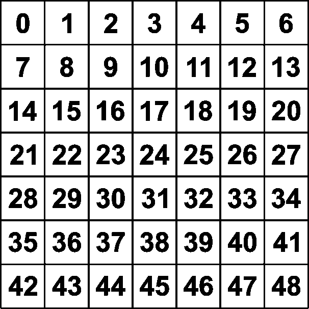

示例数组

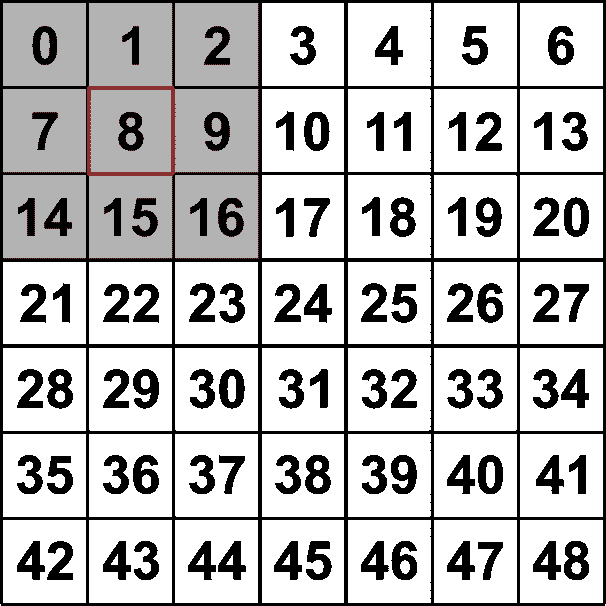

3 乘 3 推拉窗

# 创建 NumPy 数组

为了实现一些简单的例子，让我们创建如上所示的数组。首先，导入`numpy`。

```
import numpy as np
```

然后使用`arange`创建一个 7×7 的数组，其值的范围从 1 到 48。另外，创建另一个填充了无数据值的数组，该数组与初始数组具有相同的形状和数据类型。在这个例子中，我使用-1 作为无数据值。关于填充 NumPy 数组的[完整指南，你可以查看我以前关于这个主题的](https://opensourceoptions.com/blog/fill-numpy-arrays-with-numpy-fill-and-numpy-full/)[文章](https://opensourceoptions.com/blog/fill-numpy-arrays-with-numpy-fill-and-numpy-full/)。

```
a = np.arange(49).reshape((7, 7)) b = np.full(a.shape, -1.0)
```

我们将使用这些数组来开发下面的滑动窗口示例。

# 带循环的滑动窗口

毫无疑问，你听说过 Python 中的循环很慢，应该尽可能避免。尤其是在处理大型 NumPy 数组时。你所听到的非常正确。尽管如此，我们还是先来看一个使用循环的例子，因为这是一个概念化移动窗口操作中发生的事情的简单方法。在您掌握了循环示例的概念之后，我们将转向更有效的矢量化方法。

要实现移动窗口，只需遍历所有内部数组元素，确定所有相邻元素的值，并在特定的计算中使用这些值。

通过行和列的偏移量很容易识别相邻值。3×3 窗口的偏移量如下所示。

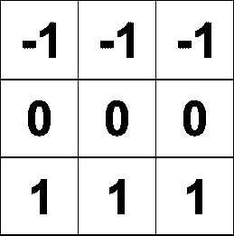

行偏移量

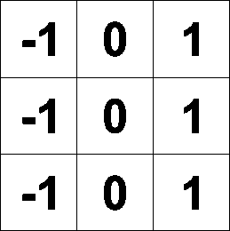

列偏移量

## 循环中 NumPy 移动窗口的 Python 代码

我们可以用三行代码实现一个移动窗口。此示例计算滑动窗口内的平均值。首先，遍历数组的内部行。第二，遍历数组的内部列。第三，计算滑动窗口内的平均值，并将值赋给输出数组中相应的数组元素。

```
for i in range(1, a.shape[0]-1):
    for j in range(1, a.shape[1]-1): 
        b[i, j] = (a[i-1, j-1] + a[i-1, j] + a[i-1, j+1] + a[i, j-1] + a[i, j] + a[i, j+1] + a[i+1, j-1] + a[i+1, j] + a[i+1, j+1]) / 9.0
```

## 滑动窗口循环结果

您会注意到结果与输入数组具有相同的值，但是外部元素没有分配数据值，因为它们不包含 9 个相邻元素。

```
[[-1\. -1\. -1\. -1\. -1\. -1\. -1.]
 [-1\. 8\. 9\. 10\. 11\. 12\. -1.]
 [-1\. 15\. 16\. 17\. 18\. 19\. -1.]
 [-1\. 22\. 23\. 24\. 25\. 26\. -1.]
 [-1\. 29\. 30\. 31\. 32\. 33\. -1.] 
 [-1\. 36\. 37\. 38\. 39\. 40\. -1.]
 [-1\. -1\. -1\. -1\. -1\. -1\. -1.]]
```

# 矢量化滑动窗口

众所周知，Python 中的数组循环通常计算效率很低。通过对通常在循环中完成的操作进行矢量化，可以提高效率。移动窗口矢量化可以通过同时偏移数组的所有内部元素来实现。

下图展示了这一点。每幅图像都配有相应的索引。您会注意到最后一个图像索引了所有的内部元素，以及每个相邻元素的相应图像索引偏移量。

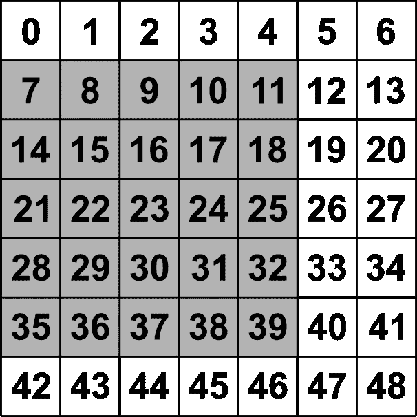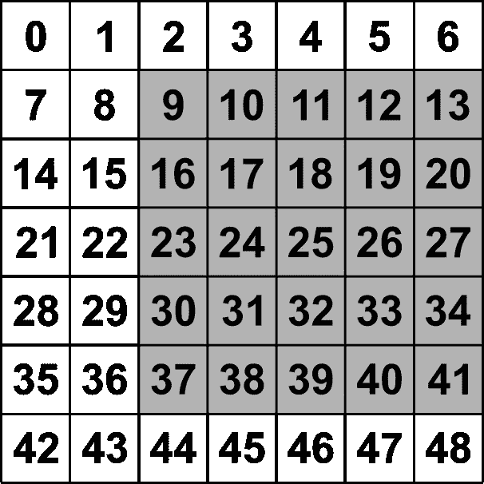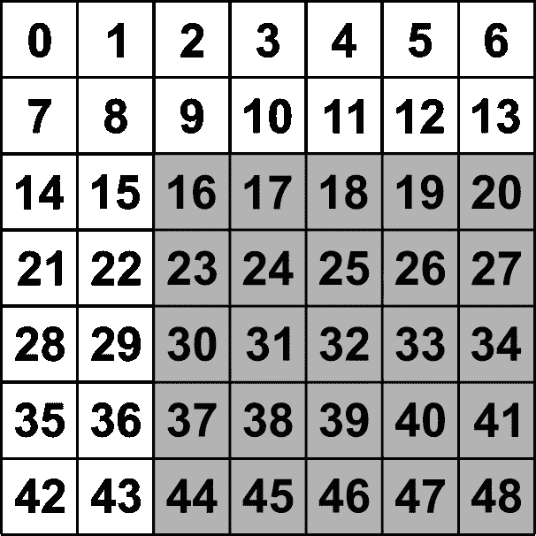

从左到右的偏移索引:[1:-1，:-2]，[1:-1，2:]，[2:，2:]

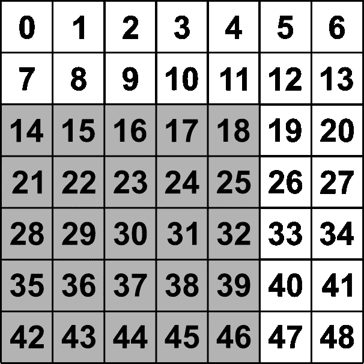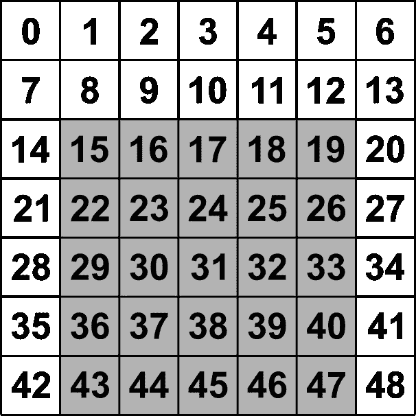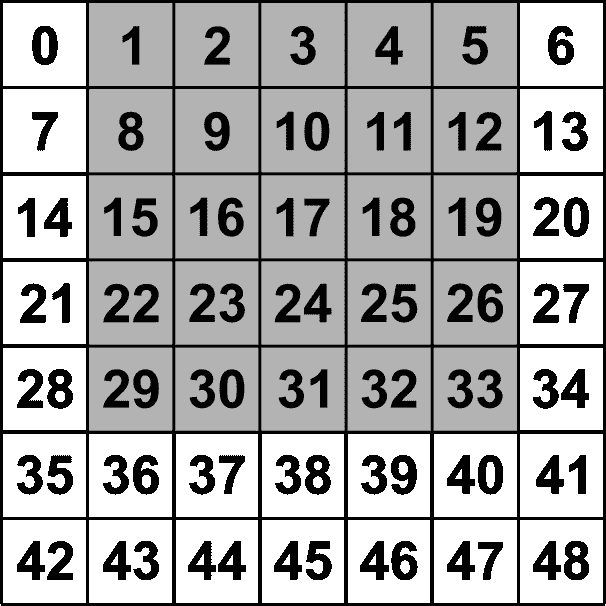

从左到右的偏移索引:[2:，-2]，[2:1:-1]，[:-2，1:-1]

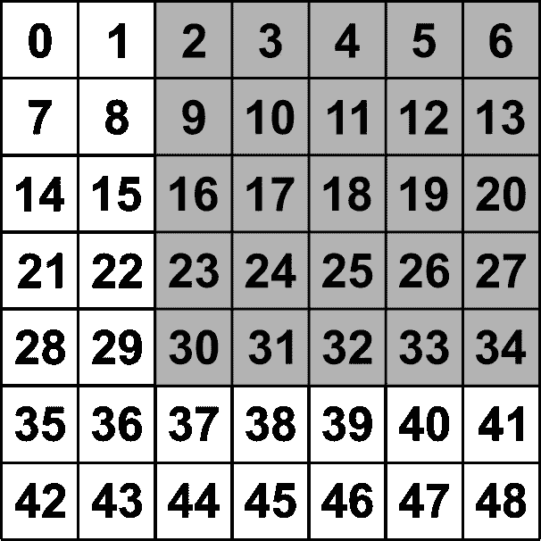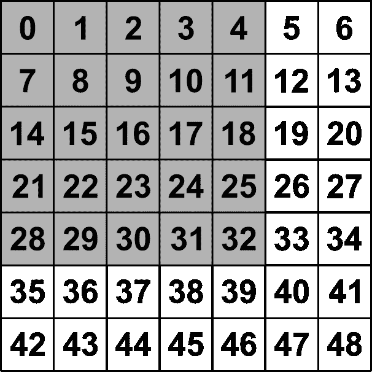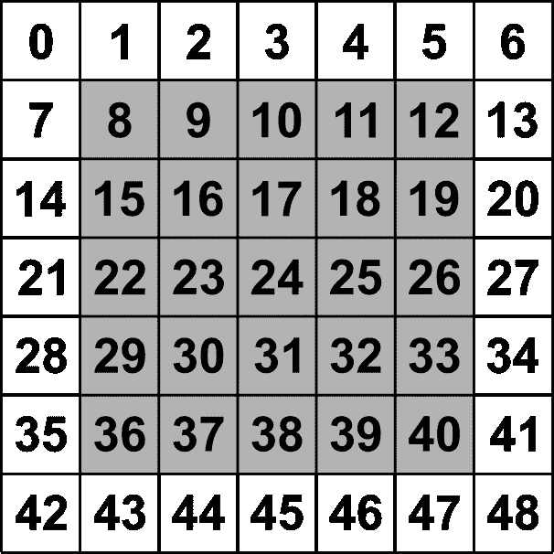

从左到右的偏移索引:[:-2，2:]，[:-2，:-2]，[1:-1，1:-1]

## 用于 Numpy 数组上的矢量化移动窗口的 Python 代码

有了上面描述的偏移量，我们现在可以在一行代码中轻松实现滑动窗口。只需将输出数组的所有内部元素设置为您的函数，该函数根据相邻元素计算所需的输出。

```
b[1:-1, 1:-1] = (a[1:-1, 1:-1] + a[:-2, 1:-1] + a[2:, 1:-1] + a[1:-1, :-2] + a[1:-1, 2:] + a[2:, 2:] + a[:-2, :-2] + a[2:, :-2] + a[:-2, 2:]) / 9.0
```

## 矢量化滑动窗口结果

如您所见，这给出了与循环相同的结果。

```
[[-1\. -1\. -1\. -1\. -1\. -1\. -1.]
 [-1\. 8\. 9\. 10\. 11\. 12\. -1.]
 [-1\. 15\. 16\. 17\. 18\. 19\. -1.]
 [-1\. 22\. 23\. 24\. 25\. 26\. -1.]
 [-1\. 29\. 30\. 31\. 32\. 33\. -1.]
 [-1\. 36\. 37\. 38\. 39\. 40\. -1.]
 [-1\. -1\. -1\. -1\. -1\. -1\. -1.]]
```

# 速度比较

上面演示的两种方法产生相同的结果，但是哪一种更有效呢？我计算了从 5 行和 5 列到 100 列数组的每种方法的速度。每种方法对每个阵列测试 100 次。每种方法的平均时间如下图所示。


很明显，矢量化方法更有效。随着数组大小的增加，循环的效率呈指数下降。另外，请注意，包含 10，000 个元素(100 行和 100 列)的数组非常小。例如，来自智能手机相机的全分辨率图像将超过 2000 行和 2000 列。

# 结论

移动窗口计算在许多数据分析工作流中极为常见。这些计算非常有用，也非常容易实现。然而，用循环实现滑动窗口操作效率极低。矢量化移动窗口实现不仅效率更高，而且使用的代码行也更少。一旦您掌握了实现滑动窗口的矢量化方法，您就可以轻松有效地提高工作流速度。

*最初发表于*[*【https://opensourceoptions.com】*](https://opensourceoptions.com/blog/vectorize-moving-window-grid-operations-on-numpy-arrays/)*。*