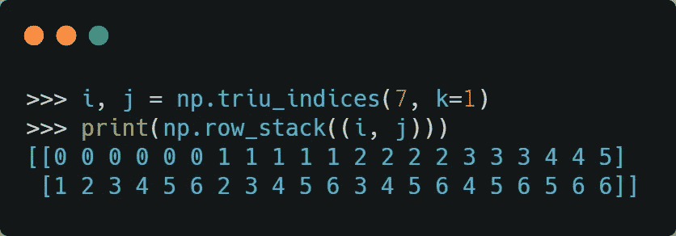

# 对 nd 数组中的元素对进行矢量化计算

> 原文：<https://towardsdatascience.com/vectorizing-computations-on-pairs-of-elements-in-an-nd-array-326b5a648ad6?source=collection_archive---------25----------------------->

## 在 Python 中使用 NumPy



作者提供的图片

考虑下面一个非常简单的人为问题。你有一组数字:

```
import numpy as np
a = np.array([0, 10, -3, 5, 7, 20, -9])
```

你想计算每对数字之间的平均绝对差值。设 n 为`a`中元素的个数。那么对数就是`n(n-1)/2`。因此，一个简单的方法是遍历所有可能的对，计算每对的绝对差，然后求它们的平均值。代码如下:

如果我们在上面的阵列上运行它，我们会得到:

```
>>> mean_absolute_difference(a)
11.428571428571429
```

这段代码中两个 for 循环的存在表明效率低下。理想情况下，我们应该通过对算法进行矢量化，尽可能避免数字代码中的 Python for 循环。我们如何做到这一点？

关键的挑战是找出一种不使用任何`for` 循环的方法来获取`a` 中的每一对元素。NumPy 能帮我们吗？确实是的。感谢一个漂亮的函数[triu _ indexes](https://numpy.org/doc/stable/reference/generated/numpy.triu_indices.html)。

让我们看看它能做什么:

```
>>> i, j = np.triu_indices(7, k=1)
>>> print(np.row_stack((i, j)))
[[0 0 0 0 0 0 1 1 1 1 1 2 2 2 2 3 3 3 4 4 5]
 [1 2 3 4 5 6 2 3 4 5 6 3 4 5 6 4 5 6 5 6 6]]
```

如果我们仔细观察输出，我们会看到每一列都给出了`a`中每一对元素的索引。总共有 21 对这样的线对。

现在让我们对平均绝对差函数进行矢量化。

for 循环消失了。我们正好形成 n(n-1)/2 对，所以没有多余的计算。

我在一台 MacBook 上对比了两个版本的性能。

```
a = np.random.randn(1000)
%timeit mean_absolute_difference(a)
500 ms ± 1.62 ms per loop (mean ± std. dev. of 7 runs, 1 loop each)
%timeit vectorized_mad(a)
8.78 ms ± 42.2 µs per loop (mean ± std. dev. of 7 runs, 100 loops each)
```

我们可以看到性能的显著提升。

虽然有可能为这个特定的问题提出一个更智能、更快速的解决方案，但我在这里的目标是说明构建元素对并对每对元素执行一些计算的技术。

## 向量数组中的对

让我们举一个更具挑战性的例子，计算向量数组之间的成对欧几里德距离:

这与 SciPy 中的`[pdist](https://docs.scipy.org/doc/scipy/reference/generated/scipy.spatial.distance.pdist.html)`函数针对欧几里德度量执行完全相同的计算。

```
a = np.random.randn(100, 3)
from scipy.spatial.distance import pdist
assert np.allclose(pdist(a, 'euclidean'), pairwise_distance(a))
```

SciPy 版本确实更快，因为它是用 C/C++编写的。但是，我们的纯 Python 矢量化版本还不错(特别是对于小数组)。

如果您想要矩阵`d` 形式的成对距离结果，使得`d[i, j]`表示`i-th`和`j-th`向量之间的距离，该怎么办？这是这样的:

这是一个使用 3 个向量数组的例子，其中每个向量来自 R⁵.

```
>>> a = np.arange(15).reshape((3,5))
>>> pairwise_distance2(a)
array([[ 0\.        , 11.18033989, 22.36067977],
       [11.18033989,  0\.        , 11.18033989],
       [22.36067977, 11.18033989,  0\.        ]])
```

以下是该实施的一些要点:

*   不需要计算`result`的对角元素，因为我们知道一个点与其自身的距离为 0。
*   由于欧几里德距离是对称的，我们只需要计算`result`的上三角形部分，并在下三角形部分复制相同的部分。
*   一开始计算的索引`i,j`稍后被重新使用，以将距离向量放回到`result`矩阵中。

## 矩阵阵列中的对

我们还可以继续计算矩阵数组中的矩阵对。这是一个有点复杂的例子，对矩阵对进行了相当复杂的计算。

一个[格拉斯曼](https://en.wikipedia.org/wiki/Grassmannian)是一个参数化 n 维向量空间的所有 k 维子空间的空间。这样的子空间也被称为 [k 平面](https://en.wikipedia.org/wiki/Flat_(geometry))。每个平面都可以用一个标准正交基(ONB)来表示。k-平坦的 ONB 只不过是一个(n，k)大小的酉矩阵。平面内直线间的角度概念可以推广到[平面间的角度](https://en.wikipedia.org/wiki/Angles_between_flats)。这些角叫做主角。

事实证明，计算主角度并不难。如果你有两个子空间的 ONBs A 和 b，那么你只需要计算它们的乘积 M = A^H B，并找出它的奇异值。主角度由奇异值的反余弦给出。特别地，两个这样的子空间之间的最小主角度由 m 的最大奇异值的反余弦给出。

现在让我们说，你有一个 n 个子空间的 ONBs 数组，你希望计算每一对子空间之间的最小主角度。由于 SVD 是一个开销很大的操作，所以不希望对超过 n(n-1)/2 对进行 SVD。下面是实现。

快乐矢量化！