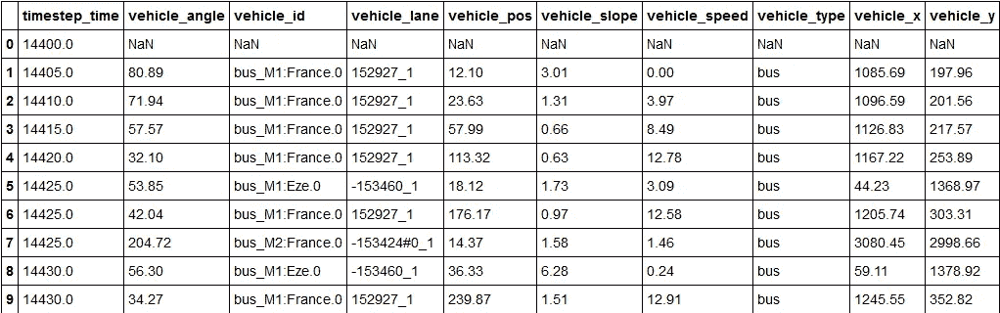
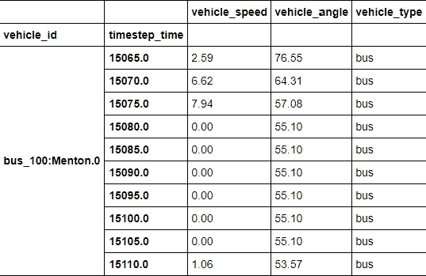
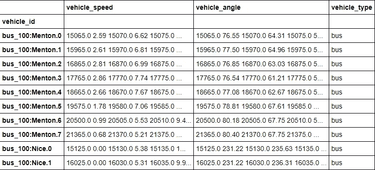
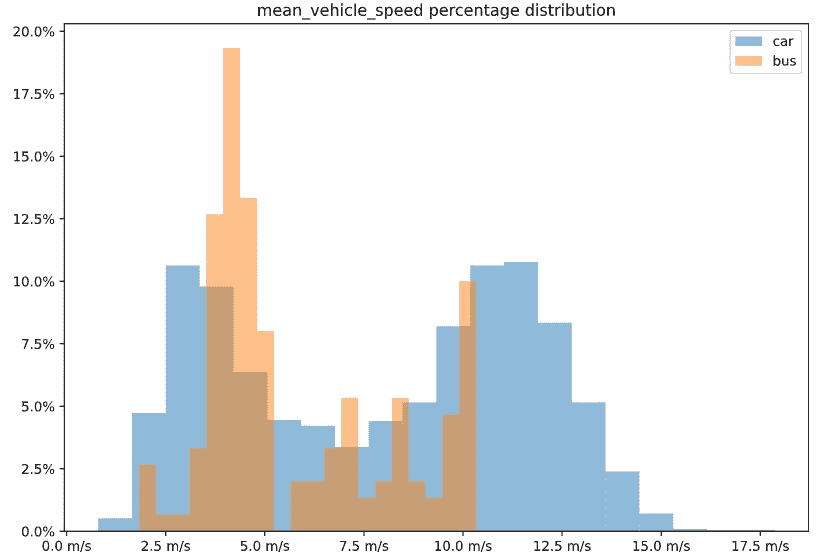
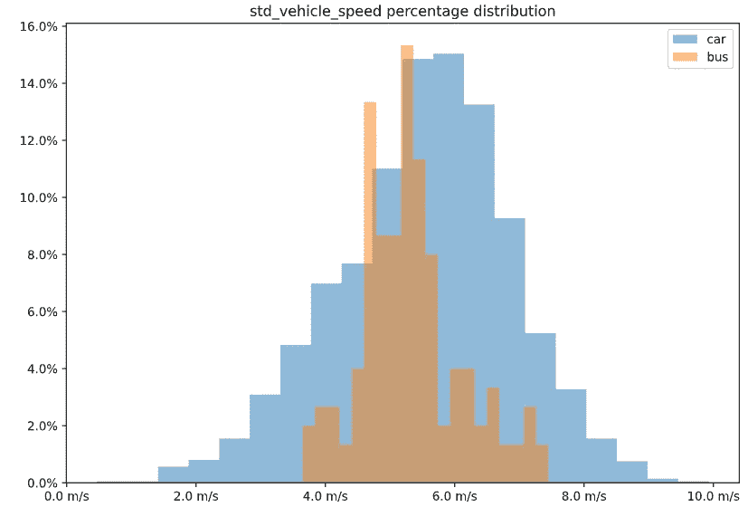
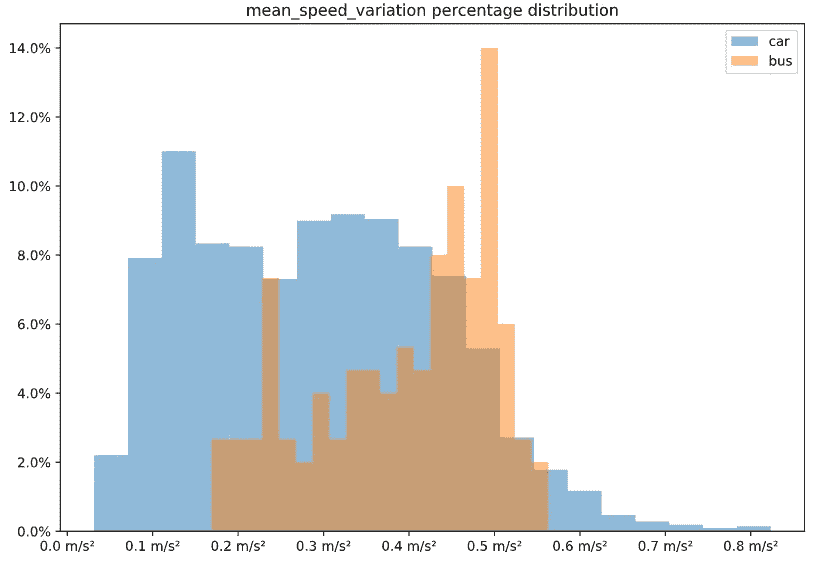
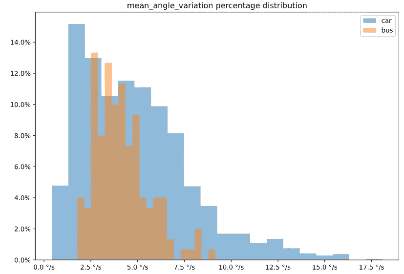
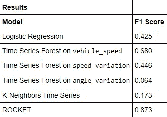
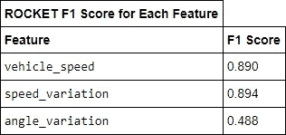
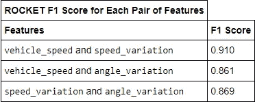

# 使用模拟轨迹数据的车辆类型预测

> 原文：<https://towardsdatascience.com/vehicle-type-prediction-using-simulated-trajectory-data-59a522e30003?source=collection_archive---------37----------------------->

## [实践教程](https://towardsdatascience.com/tagged/hands-on-tutorials)

## 我们能通过轨迹数据区分公共汽车和小汽车吗？


作者图片

这是一个[数据科学项目](https://github.com/Pedrohgv/standard-traffic-data/blob/main/knowledge/Vehicle_Type_Prediction.ipynb)的总结，该项目旨在使用机器学习模型和模拟的**时间序列**数据来预测车辆是轿车还是公交车。

该项目基于这个[存储库](https://github.com/pgrandinetti/standard-traffic-data)中包含的数据。作者采用了由法国索菲亚安蒂波利斯通信系统部门制作的作品，该作品已经开源，并使其易于访问和复制，从而使该项目得以实现。特别感谢他们！这是与他们合作完成的几个附带项目之一，我真诚地鼓励任何阅读这篇文章的人去看看它们。

为了避免文章篇幅过长，大部分代码将不会在这里显示，除非是一些重要的内容(如果您好奇或者不知道一些事情是如何完成的，请继续查看[笔记本](https://github.com/Pedrohgv/standard-traffic-data/blob/main/knowledge/Vehicle_Type_Prediction.ipynb))。

## 取得的成果

最佳模型能够在训练过程看不到的数据上获得 F1 分数 **0.873** 。

## 关于数据

数据来源于使用 [SUMO](https://www.eclipse.org/sumo/) (城市流动性模拟)软件的模拟。该场景名为 [MoST](https://render.githubusercontent.com/view/Monaco%20SUMO%20Traffic) ，由摩纳哥公国的交通模拟组成，覆盖大约 70 公里的大都市区域，时间跨度从早上 4 点到下午 2 点。它包含车辆、行人和自行车的交通数据，如速度、地点坐标、坡度、方向角、车辆类型等。这些数据被聚合成几个以 5 秒为间隔采样的时间序列，形成了我们将在这个项目中操作的主要对象。

更详细的描述和分析可以在本项目的[其他笔记本](https://github.com/pgrandinetti/standard-traffic-data/blob/main/knowledge/Urban_Traffic_Data_Exploratory_Analysis.ipynb)中找到。

因为生成的交通数据非常广泛和庞大，所以我们将只使用其中的一小部分:凌晨 4 点到 6:30 之间的模拟交通。

## 要求和设置

要复制这项工作，您需要安装资源库中的`requirements.txt` 文件上列出的所有必要的库以及`sktime` 包。幸运的是，所有必需的命令都已经在笔记本上了，你只需要运行相应的单元，你就可以开始了。还建议在安装软件包之前创建一个新的虚拟环境。

## 数据预处理

下一步是下载、选择和预处理我们的数据。最后，你会有一个名为`cleaned_data.cs`的新文件。

下载数据集(并将其加载到 pandas 数据框架中)后，我们可以大致了解它是如何组织的(请注意，并未显示所有列):



作者图片

查看上面的输出，我们可以了解数据是如何组织的:每一行都包含一个条目，一个特定时间戳上的特定车辆的读数，显示与该时间该车辆对应的特征值。我们将只保留其中的一些功能；`vehicle_speed`是一个显而易见的例子，但我们假设汽车的方向变化可能比公共汽车小，因为前者往往从城市的一个地方到另一个地方，而后者必须更多地改变方向，以便覆盖特定的区域让人们上下车，所以我们也保留了`vehicle_angle`。因此，最后，我们将维护`vehicle_id`、`timestep_time`(我们的实例标识符)、前面提到的特性和我们的目标标签`vehicle_type`。

现在让我们来处理目标标签中的一些不一致。根据[文档](https://sumo.dlr.de/docs/Definition_of_Vehicles,_Vehicle_Types,_and_Routes.html#abstract_vehicle_class)，所有以`passenger`开头的车型都是汽车的一个子类。所以在我们把既不是轿车也不是公交车的所有品类都掉之后，我们会统一这些标签。

为了使用来自`sktime`包的时序算法，有必要将我们的数据集转换成一个*嵌套的*数据集。由于我们不能保存嵌套数据集，我们将把数据帧转换成多索引的数据帧，并保存到磁盘上。通过使用`sktime`包中的`from_multi_index_to_nested`方法，多索引数据帧可以变成嵌套的。

完成后，我们准备将数据集保存到磁盘中。

## 数据处理

因为我们不能保存一个嵌套的数据集，所以我们需要加载预处理过的数据集，并在每次与我们的项目交互时进行必要的转换。在这一点上，如果您在本节之前已经运行了代码，您可以从运行，而无需重复前面的步骤。现在我们来看看数据。



作者图片

我们的数据框架现在是多索引的，如上所述，我们需要它是一个嵌套的数据框架；一个数据集，其中每行包含一个实例(车辆 ID)，每列包含一个要素，每个像元是一个完整的时间序列。函数`[from_multi_index_to_nested](https://www.sktime.org/en/latest/examples/loading_data.html#Using-multi-indexed-pandas-DataFrames)`将把我们的结构转换成一个嵌套框架。因为该函数重置了转换后的数据帧中的索引，所以我们需要保存我们想要的索引(列`vehicle_id`减少为唯一值),并在调用该函数后将其重新分配给我们的帧。



作者图片

我们现在将根据车辆的速度和方向创建一些新的要素。`speed_variation`和`angle_variation`将是分别描述速度和方向如何随时间变化的时间序列。`mean_vehicle_speed`和`std_vehicle_speed`都是从原来的`vehicle_speed`派生的一维特征，`mean_speed_variation`和`mean_angle_variation`也是从新创建的`speed_variation`和`angle_variation`计算的一维值。我们将看到这些特征如何帮助我们预测目标变量。然后，我们将使用`sample`方法，通过制作`frac=1`来随机化数据帧的顺序，指定随机采样过程来保持整个数据集。

我们现在将根据车辆的速度和方向创建一些新的要素。`speed_variation`和`angle_variation`将是分别描述速度和方向如何随时间变化的时间序列。`mean_vehicle_speed`和`std_vehicle_speed`都是从原来的`vehicle_speed`派生出来的一维特征，`mean_speed_variation`和`mean_angle_variation`也是从新创建的`speed_variation`和`angle_variation`计算出来的一维值。我们将看到这些特征如何帮助我们预测目标变量。然后，我们将使用`sample`方法，通过制作`frac=1`来随机化数据帧的顺序，指定随机采样过程来保持整个数据集。

接下来，我们需要清除一些由速度和方向的微分产生的空值；我们将删除数据集中所有时间序列的第一个值。之后，为了使用`sktime`库中的算法，我们所有的时间序列对于给定的特征需要有相同的长度。我们将对每个时间序列的随机间隔进行采样(所有条目对所有特征具有相同的时间戳选择)，但不会在移除元素数量少于确定的间隔大小的任何样本之前进行采样。为了保持过程的可重复性，我们将在每次分割数据集中的时间序列时设置一个新的随机种子。

将数据集分为训练数据集和测试数据集后，我们将在训练数据中绘制两个标注上的标量要素分布。请注意，代表时间变化的变量(平均速度变化和平均角度变化)除以 5，因为这是我们的采样周期。



作者图片



作者图片



作者图片



作者图片

根据上面的图表，似乎仅以表格方式查看数据(即不考虑*时间*方面)并不是正确区分公共汽车和小汽车的好方法。然而，我们将安装一个逻辑分类器作为我们问题的基线分类器，因为它是一个非常简单的开箱即用的分类工具，并且推荐用于低维特征空间的问题。为了做到这一点，我们需要对两个类应用不同的权重，因为我们的数据集严重不平衡(汽车比公共汽车多得多)。

由于准确性不是在不平衡数据集上训练的模型的性能的良好度量，所以 [F1 分数](https://en.wikipedia.org/wiki/F-score)将用于评估我们的模型；使用 F1 分数是一种很好的方法来衡量具有非常不平衡类别的分类任务的性能，因为它从少数类别(在我们的情况下是`bus`)的角度考虑了[精度和](https://en.wikipedia.org/wiki/Precision_and_recall)。为了适应我们的模型并计算 F1 分数，我们将使用来自`sklearn`的`cross_val_predict`函数。该函数在训练期间使用交叉验证，并将每个样本分配给一个测试集恰好一次；训练后，当数据集上的每个示例在测试集上时，它返回该示例的预测。此外，我们将使用一个名为`compute_results`的自定义函数来计算并打印 F1 分数，以及精度和召回分数和[混淆矩阵](https://en.wikipedia.org/wiki/Confusion_matrix)。

重要的是要注意，我们的逻辑回归有特权使用整个数据；它将在我们从每个序列中采样较短时间窗口之前，根据从时间序列中获得的统计数据进行训练，这与我们仅使用这些窗口进行训练的特定时间序列模型相反。

```
Training time: 3.13 seconds Precision: 0.3022598870056497
Recall: 0.7133333333333334
F1 Score: 0.42460317460317465 Confusion Matrix:
[[ 107   43]
 [ 247 1888]
```

## 时间序列分类算法

上述结果表明，使用常规机器学习算法对时间序列进行分类会产生较差的结果。我们的实验给了我们一个公平的回忆分数，尽管精确度很低，因此我们的 F1 分数刚刚超过 0.4。现在是时候测试一些特定于时间序列的算法了。我们将测试 3 种不同的算法，每种算法都属于时间序列分类模型的一个特定类别:合成、基于距离和基于 Shapelet。这些算法类别的简要说明可以在本文中查看。

## 时间序列森林分类器

我们将尝试的第一种算法(属于合成类别)有点类似于我们用逻辑回归所做的:`TimeSeriesForestClassifier`从所有时间序列的间隔中提取特征(如均值和标准差),然后简单地对这些特征应用传统的随机森林分类器。`sktime`的这个算法实现只对单变量问题(只有一个特征的问题)有效。为了解决这个问题，我们必须分别为每个时间特征训练一个模型。因为这种方法不处理数据的时间方面，所以期望从这种选择中得到简单的结果是有意义的。

```
Results for Time Series Forest Classifier trained on vehicle_speed:
Training time: 59.63 seconds Precision: 0.8829787234042553
Recall: 0.5533333333333333
F1 Score: 0.680327868852459 Confusion Matrix:
[[  83   67]
 [  11 2124]] Results for Time Series Forest Classifier trained on speed_variation:
Training time: 58.70 seconds Precision: 1.0
Recall: 0.2866666666666667
F1 Score: 0.4455958549222798 Confusion Matrix:
[[  43  107]
 [   0 2135]] Results for Time Series Forest Classifier trained on angle_variation:
Training time: 59.46 seconds Precision: 0.8333333333333334
Recall: 0.03333333333333333
F1 Score: 0.06410256410256411 Confusion Matrix:
[[   5  145]
 [   1 2134]]
```

k 近邻时间序列分类器

`KNeighborsTimeSeriesClassifier`是一种基于距离的时间序列分类方法；它非常类似于用于正常数据的经典 K-Neighbors 分类器，区别在于它使用[动态时间弯曲](https://en.wikipedia.org/wiki/Dynamic_time_warping) (DTW)作为两个时间序列之间距离的度量。由于它估计数据集中每对时间序列之间的距离，这是一种相当昂贵的(就计算机能力而言)算法。

```
Training time: 47.83 seconds Precision: 0.17218543046357615
Recall: 0.17333333333333334
F1 Score: 0.17275747508305647 Confusion Matrix:
[[  26  124]
 [ 125 2010]]
```

## 火箭分级机

[ROCKET 分类器](https://pub.towardsai.net/rocket-fast-and-accurate-time-series-classification-f54923ad0ac9)(随机卷积核变换)是基于 shapelet 的分类器，用于时间序列问题；这意味着它试图从时间序列中提取区间，以帮助区分它们属于哪个标签。ROCKET 算法使用卷积核(类似于卷积神经网络中使用的核)，将 shapelets 转换为新的特征，然后将这些特征应用于线性分类器。这种分类解决方案已被证明是非常通用的，胜过神经网络等更复杂的算法。

```
Training time: 20.03 seconds Precision: 0.9915254237288136
Recall: 0.78
F1 Score: 0.873134328358209 Confusion Matrix:
[[ 117   33]
 [   1 2134]]
```

下表总结了我们的结果:



作者图片

正如上面的结果可以告诉我们，火箭分类器优于我们的任务的其他算法。我们现在将对它进行微调，看看我们是否可以改进它。

## 特征选择和微调最佳模型

我们训练我们的模型，假设所有选择的特征都与我们区分公共汽车和小汽车的分类任务相关；然而，这可能不成立，所以下一步是用不同的特定特征集来尝试我们的算法，一次从一个特征开始。

```
Results for ROCKET Classifier trained on vehicle_speed:
Training time: 14.18 seconds Precision: 0.9918032786885246
Recall: 0.8066666666666666
F1 Score: 0.8897058823529411 Confusion Matrix:
[[ 121   29]
 [   1 2134]] Results for ROCKET Classifier trained on speed_variation:
Training time: 14.29 seconds Precision: 0.991869918699187
Recall: 0.8133333333333334
F1 Score: 0.8937728937728938 Confusion Matrix:
[[ 122   28]
 [   1 2134]] Results for ROCKET Classifier trained on angle_variation:
Training time: 14.28 seconds Precision: 0.864406779661017
Recall: 0.34
F1 Score: 0.48803827751196177 Confusion Matrix:
[[  51   99]
 [   8 2127]]
```

每个功能的结果如下所示:



作者图片

有趣的是，`vehicle_speed`和`speed_variation`在单独用于训练模型时，都略微提高了我们的分类器的分数，而`angle_variation`表现不佳。现在一个可能的举措是同时在`vehicle_speed`和`speed_variation`上训练我们的模型。然而，由于我们有少量的特征，我们可以对每一对组合进行奢侈的训练，并看到结果。

```
Results for ROCKET Classifier trained on vehicle_speed and speed_variation:
Training time: 17.85 seconds

Precision: 0.9921259842519685
Recall: 0.84
F1 Score: 0.9097472924187726

Confusion Matrix:
[[ 126   24]
 [   1 2134]]

Results for ROCKET Classifier trained on vehicle_speed and angle_variation:
Training time: 18.89 seconds

Precision: 0.9829059829059829
Recall: 0.7666666666666667
F1 Score: 0.8614232209737828

Confusion Matrix:
[[ 115   35]
 [   2 2133]]

Results for ROCKET Classifier trained on speed_variation and angle_variation:
Training time: 17.98 seconds

Precision: 0.9914529914529915
Recall: 0.7733333333333333
F1 Score: 0.8689138576779025

Confusion Matrix:
[[ 116   34]
 [   1 2134]]
```

每对特征的结果是:



作者图片

上表向我们展示了`vehicle_speed`和`speed_variation`的组合给出了(稍微)更好的结果；因此，我们将把它们作为我们问题的预测特征。现在是时候通过微调来进一步改进我们的模型了。为此，我们将使用`sklearns`的功能`[RandomizedSearchCV](https://sklearn.org/modules/generated/sklearn.model_selection.RandomizedSearchCV.html#sklearn.model_selection.RandomizedSearchCV)`进行大范围的训练超参数搜索，使用`[GridSearchCV](https://sklearn.org/modules/generated/sklearn.model_selection.GridSearchCV.html#sklearn.model_selection.GridSearchCV)`进行小范围的特定搜索。`RandomizedSearchCV`函数从训练超参数可能性的给定分布中随机取样，以便给出搜索最佳优化的“总体方向”。之后，`GridSearchCV` looks 从给定的超参数集中尝试每个组合；这一组是围绕从`RandomizedSearchCV`获得的最佳结果构建的。因为训练一组模型可能需要很长时间，所以我们只对参数`num_kernels`尝试不同的值，顾名思义，该参数表示模型用于转换数据的核的数量。默认值是 10000，我们将使用 1000 到 100000 之间的一组 100 个步长进行搜索，从中随机抽取样本。

我们还需要使用`[make_scorer](https://scikit-learn.org/stable/modules/generated/sklearn.metrics.make_scorer.html#sklearn.metrics.make_scorer)`包装 F1 得分函数，因为我们需要指定`f1_score`少数类，在我们的例子中是`bus`。

同样值得注意的是，下一步可能需要一段时间，因为我们正在多次训练我们的模型。

```
Fitting 5 folds for each of 32 candidates, totalling 160 fits
Training time: 2204.24 seconds Best hyperparameters found in wide radomized search:
{'num_kernels': 92900, 'ensemble': False} Best F1 Score:
0.9264127300472378
```

我们的随机搜索返回的最佳内核数是 **92900** ，导致平均交叉验证分数为 **0.926** 。现在，我们将尝试更精确的搜索，查看 92000 和 93000 之间的所有 100 个区间，看看我们会得到什么。

```
Fitting 5 folds for each of 10 candidates, totalling 50 fits
Training time: 1336.15 seconds Best hyperparameters found in narrow grid search:
{'ensemble': False, 'num_kernels': 92900} Best F1 Score:
0.9264127300472378
```

看起来我们的窄范围搜索返回了与宽范围搜索相同的结果:92900 是我们模型的最佳内核数，F1 值为 0.926。因此，我们将保留这个配置，并使用`[pickle](https://docs.python.org/3/library/pickle.html)`保存我们的模型。

## 根据看不见的数据对最终模型评分

最后，是时候使用我们的测试数据集对我们的模型进行评分了，我们在工作开始时将测试数据集从训练中分离出来，以便我们的模型可以在看不见的数据上进行验证。我们将加载模型，然后对其进行评分。

```
Training time: 4.63 seconds Precision: 0.8157894736842105
Recall: 0.9393939393939394
F1 Score: 0.8732394366197183 Confusion Matrix:
[[ 31   2]
 [  7 532]]
```

## 结论

在我们的测试数据集上获得的准确率和召回率分别为 **0.816** 和 **0.939** 。我们的主要指标 F1 得分达到了 **0.873** ，低于培训期间交叉验证观察到的值。不过，这可以被认为是一个很好的结果，火箭分类器在性能和提供良好结果所需的较低参数调整量方面令人印象深刻；即使使用默认的超参数，该模型在我们的第一次尝试中表现良好，这验证了该算法是使用时间序列作为预测器的快速机器学习实现的良好选择。

同样值得一提的是，我们最初关于`angle_variation`有助于区分汽车和公共汽车的假设被证明是错误的；这是一件好事，我们使用单一特征以及不同的特征组合来训练我们的模型，使我们的分类器更加稳健。

## 开放式问题

虽然我们现在已经结束了我们的工作，但一些问题仍然存在:

*   除了已使用的算法之外，还有其他算法可以更好地解决我们的问题吗？
*   `angle_variation`作为一个预测特征有什么用处吗？
*   数据集中还有哪些可用的特征可用于改进我们的分类解决方案？

如果你对这些问题(或其他任何问题)感兴趣，我邀请你去调查它们！你可以随时叉这个回购，甚至不需要请求许可就可以玩得开心，或者你也可以联系我，如果你对这个项目有任何问题，见解或评论。