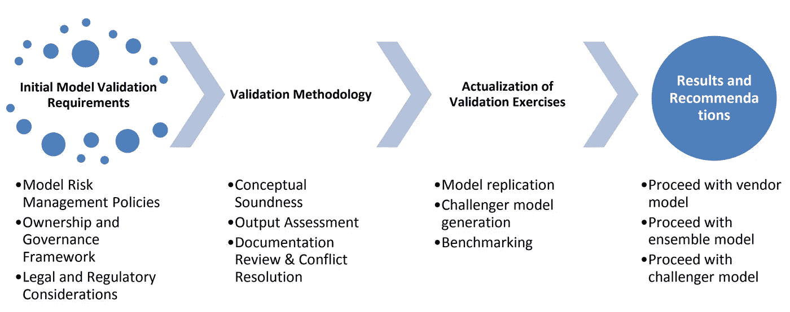

# 面向数字营销分析师的供应商模型验证方法

> 原文：<https://towardsdatascience.com/vendor-model-validation-approaches-for-digital-marketing-analysts-bb5c74c75274?source=collection_archive---------37----------------------->

## **数字营销中的模型风险管理和验证介绍**

由[卢克·切瑟](https://unsplash.com/@lukechesser?utm_source=medium&utm_medium=referral)在 [Unsplash](https://unsplash.com?utm_source=medium&utm_medium=referral) 上拍摄的照片

随着机器学习环境的扩散，现在适合于数据科学家和 ML 从业者视野之外的应用，现代数字营销分析师现在发现自己处于这样的情况下，他们被要求谈论新发现技术的潜在实现。数字营销分析师几乎从未被要求就此事发表完全权威的意见，但面对客户的情况往往会要求围绕预测分析中可以打破的假设基础进行讨论。为了向客户提供价值，数字营销分析师使用他们自己的专业知识、供应商建议和内部团队的经验，为许多组织的促销活动的机器学习实施提供输入。

今天的数字营销分析师不仅需要熟悉基本的机器学习概念，他们还必须意识到在实现客户营销计划的过程中实现模型的责任。这些责任包括全面考虑**模型风险**及其管理，由金融机构监管办公室定义为:

> **模型风险—** 由模型的设计、开发、实施和/或使用引起的不利财务(如资本、损失、收入)和声誉后果的风险。除其他因素外，它可能源于不适当的规范；不正确的参数估计；有缺陷的假设和/或设想；数学计算误差；不准确、不适当或不完整的数据；不适当、不当或无意的使用；和/或控制不足。

模型风险固有地带有必须减轻风险的假设，为了讨论本文的目的，我们把验证作为数字营销中减轻风险的第一种形式。为此，我们建议遵循货币监理署(美国财政部)规定的**模型验证**的定义:

> **模型验证:**过程和活动的集合，旨在验证模型按照预期执行，符合它们的设计目标和业务用途。它还确定“潜在的限制和假设，并评估其可能的影响”。"

本文档旨在为数字营销分析师提供一份指南，帮助他们在复杂的供应商模型验证讨论中为客户和其他利益相关者导航。正如许多行业从业者可以证明的那样，供应商通常是数据的持有者，客户围绕这些数据制定营销策略。即使内部数据科学团队有足够的能力来构建定制的客户端解决方案，供应商在模型构建讨论中也有很大的影响力，因为他们是模型构建所基于的数据的所有者。

在本文结束时，读者将对模型验证技术有一个基本的了解，这些技术可以管理客户对主要依赖于专有供应商模型的数字营销计划的期望。我们将首先分析数字营销分析师在验证供应商模型时面临的多种限制，然后为没有 ML 和数据科学广泛背景的读者列出一系列可行的解决方案。本文最后探讨了模块化验证框架，并对 2021 年及以后的模型验证趋势进行了讨论。

# 主要考虑事项

当开始验证外部模型的工作时，由于不能直接访问生成模型的第三方所采用的逐步过程，会产生一些复杂性。特别是，数字营销分析师应警惕其方法的局限性，并提出以下问题:

1.  我有能力联系模型创建者吗？

*   a)开发人员仍然在生成模型的组织中吗？
*   b)如果对 a)的回答是否定的，谁负责当前模型的维护？

2.我有能力审查构成模型的代码吗？

*   a)该准则是否可供公众审查？
*   b)代码是开源的吗？
*   c)我的组织可以从第三方购买代码吗？

3.任何模型记录中是否有任何缺口？

*   a)与模型一起提供的文档是否足够和透明？

4.是否有用于生成模型的数据集的全面记录？

*   a)模型考虑了哪些输入和输出？
*   b)模型承诺进行哪些转换来得出预测性结论？

从数字营销分析师的角度来看，普通从业者可能不具备所需的技能(与数据科学家具备的技能相同)，无法驾驭围绕模型构建和维护的讨论。也就是说，对于上述每个问题，都有一些方法可以探究，最终有助于为后续步骤提供信息。上述问题的潜在解决方案如下:

1.  **我有能力联系模型创建者吗？** —如果可能的话，这里的分析师应该将模型提供给特定的个人。对于由第三方创建的模型，理解模型构建和维护的过程和细节是至关重要的。在数字营销行业的许多情况下，模型通常通过浏览器内平台近乎实时地交付。诸如 Google Search Ads 360、Google Ads 和 Bing Ads 之类的平台在几秒钟内就能提供预测结果，而对其背后的代码或过程却没有任何透明度。分析师可以利用组织支持团队与构建这些模型的工程团队取得联系，以获得预测结果的进一步透明度。
2.  **我有能力审查构成模型的代码吗？** —在这种情况下，分析师可能需要在基本水平上解释供应商模型，或者进行额外的研究以扩展自己的知识。这一步可能需要分析师组织内的数据科学团队的帮助，以理解模型的结构和构造。
3.  **在任何一个模型记录中有任何缺口吗？** —对于来自第三方的定制解决方案，供应商应完整提供模型文档，以确保透明度。这通常很难获得，因为供应商试图保护他们的 ML 解决方案免受竞争对手和其他从业者的攻击。麦肯锡公司最近进行的一项研究得出结论，交付给客户的所有供应商模型中，近 76%的模型文档不完整或质量差。如果没有手动提供的完整文档，分析师可以参考在线文档，这些文档通常可以在支持论坛和供应商网站上的讨论板上找到。这种格式的文档和讨论的一个很好的例子可以在[关于预测的 Google 支持部分](https://support.google.com/searchads/answer/4552409?hl=en)中找到。⁴:如果没有提供任何文档，就需要联系前面提到的模型开发人员，以深入了解它的创建和维护。
4.  是否有用于生成模型的数据集的全面记录？ —在这种情况下，分析师必须专注于准确地确定模型的输入和输出。考虑到大多数第三方解决方案需要内部团队的策略指导来完成特定的任务，分析师应该至少熟悉模型所需的输入。如果这是未知的，监督供应商参与模型创建的各个项目经理应该熟悉模型的输入和预期输出。然后，这些输入将作为将模型转换链接到预期输出的主要参数。除了输入和输出之外，监督模型的供应商或项目经理将能够准确地阐明哪些数据集用于训练模型，以及所采用的任何外部数据摄取技术。

如果不全面理解本节中讨论的问题，数字营销分析师很难理解哪些工具、人员和数据集是模型创建和验证的一部分。从某种意义上说，大部分前期工作本质上是管理性的，但是在委托供应商提供模型建议时，为客户提供答案和透明度是必不可少的。这些初始步骤也被证明可以作为分析师和内部团队的内部审计，让客户与供应商取得联系。如果供应商不能以一种彻底的方式提供这些问题的答案，很可能他们的模型不能代表客户正在寻求洞察的现实。

# 可用的解决方案

在验证为实现营销目标而创建的模型的过程中，协调项目的分析师在处理手头的任务时有一些选择。数字营销分析师可用的部分工具集包括“软”和“硬”解决方案。在下一节中，我们将讨论验证供应商模型的每个解决方案的含义和部署。

照片由[迪伦·吉利斯](https://unsplash.com/@dylandgillis?utm_source=medium&utm_medium=referral)在 [Unsplash](https://unsplash.com?utm_source=medium&utm_medium=referral) 上拍摄

## “软”形式的验证

我们将验证技术细分为“软”和“硬”类别，因为许多行业从业者无法真正获得进行适当审计所需的模型细节。特别是，供应商解决方案比内部解决方案受到更多的监管，使得 ML 后端很难以透明的方式获得。软形式的验证固有地面临限制，因为它们依赖于定期的模型监控和概念合理性审查、对模型定制文档的严格评估、开发证据以及供应商解决方案对客户营销计划的一般应用。⁵

*   **概念合理性:**这里的分析师的任务是确定模型是否符合数据集和测量的现实。从概念的角度来看，这源于围绕该模型在理论上是否适合回答客户的倡议而提出的问题。分析师还会质疑模型的设计及其长期和短期的可行性。更具体地说，模型拟合技术(r 平方、均方误差等。)用于标准测试。当不采用更直接的技术并且需要计算强度时，建议分析师对模型进行敏感性 analysis⁶，以验证 ML 后端。对于数字营销分析师来说，还建议将结果与行业基准进行对比，并计算类似时间段内模型与历史现实的偏差。应将模型输出与行业和同行结果进行详细比较，考虑在较长时间框架内测试模型稳定性的多种现实状态。
*   **模型文档的评估:**这已经在前面的章节中进行了简要的探讨，但是对于执行验证工作的分析师来说，前提仍然是相同的。在一个理想的场景中，文档应该为客户提供完全复制供应商模型设计的能力。这可能是最不可靠的软验证方法，因为在 ML/AI 应用中，正确评估(以及复制)的标准非常低，其中所涉及的维度和变量的数量受开发人员设置的影响。不仅初始设置存在文档无法帮助的限制，而且起始值生成的输出也可能因计算周期的不同而不同。
*   **开发证据和应用:**分析师可以应用于审计的最后一种软验证方法是，根据供应商规定的预期结果和模型实施产生的实际结果进行逻辑检查。模型是否朝着供应商预测的方向移动了指针？这种方法当然在理论上比在实践中更容易，但是这个前提将概念合理性的审计结合到了一个更简单的层次——我们希望拒绝 Ho。

> **Hₒ:** 供应商模式在部署后不提供增量营销优势。
> 
> **Hₐ:** 供应商模式在部署后确实提供了增量营销优势。

## “硬”形式的验证

此处涵盖的验证形式是面向实践的技术，供数字营销分析师在已知关键考虑因素阶段的某些(或全部)方面时日常使用。从模型复制的角度来看，这些技术旨在使分析师更接近供应商生产的模型。

应该注意的是，模型复制并不总是生成与原始模型 1:1 相同的模型——在创建模型的过程中，可能会有一些发现，这些发现会得出与被审核的原始供应商生成的模型相同或更好的结论。使用不同方法、输入和假设复制并得出与原始模型相同结论的模型被称为**挑战者模型**。如果挑战者模型取代了正在审核的现有模型(称为**冠军模型**)的性能，那么冠军模型就会受到挑战者模型的质疑，并有可能被取代。⁷

**假设验证:**这个过程类似于前面讨论的概念合理性的想法，在量化模型本身中做出的假设时进行迭代。在这种情况下，分析师将验证整个模型中概述的假设定义。一旦确定，在对现实的解释中所做的每一个假设都将被量化，或者是数字的(离散的或连续的)，或者是分类的(高、中、低等等)。).

例如，供应商建议对搜索引擎中的关键字的广告数据集使用以下形式的线性回归，该数据集具有 3 个变量:关键字的相应点击、平均每次点击成本和相应点进率:

> f(x)=β₀+β₁x

交付数据集后，供应商回来提供一个模型，该模型仅根据点击率以 95%的置信区间正确预测用户对网站的点击量:

> f(x)=7.21+0.0901x

**最小二乘回归(梯度下降):**梯度下降是一种优化算法，用于通过在梯度负值定义的最陡下降方向上迭代移动来最小化某个函数。⁸这里被最小化的值是回归线(β1)相对于搜索营销数据集规定的输出的斜率。

**正则化:**正则化方法通过惩罚具有极大值的特征的系数来工作，从而试图减少误差。它不仅导致错误率的增加，而且降低了模型的复杂性。⁹在我们的例子中，我们使用从初始数据集已知的给定输出值来生成分配给模型递归测试系数的惩罚项。

假设在这种情况下，我们的验证练习试图使用给定的所有变量对我们数据集中的输出进行建模。

> f(xᵢ)=7.25+0.0991x₁+9.21x₂

如果我们生成的输出与我们已知的输出相比相差甚远，则正则化练习会惩罚违规系数，并将模型简化为以下形式:

> f(xi)=7.25+0.0991x₁̶+̶9̶.̶2̶1̶x̶₂̶
> 
> f(xi)=7.25+0.0991x₁

重复该过程，直到模型中的误差减小，并且完全消除了系数的极大值。

**平行模型测试:**为了通过我们的 challenger vs. champion 框架验证模型，数字营销分析师可能会发现利用供应商文档来尝试全面复制所提供的模型非常有用。这个复制将具有相同的模型结构、相同的模型输入和相同的模型假设。使用这种方法，最终有两种情况需要研究:

*   **Hₒ:** 完全复制，m 供应商的结果≠m 复制
*   **Hₐ:** 完全复制，Mvendor= Mreplicated 的结果

经过多个周期的计算后，每个假设的结果描述了两个独立的结论:

*   **Hₒ:** 完全复制，Mvendor 的结果≠ Mreplicated。当计算相同的数据集时，这些模型无法得出相同的结论——相同实现的常数保持不变，这表明存在计算差异。每个模型的底层代码的处理有明显的不同。
*   **Hₐ:** 完全复制，Mvendor= Mreplicated 的结果。当计算相同的数据集时，这些模型能够得出相同的结论——相同实现的常数保持不变，表明没有计算差异。更重要的是，复制的模型可靠地处理在供应商模型中发现的相同偏差和错误，以获得高百分比的结果。

**挑战者模型测试:**与前面提到的并行模型测试类似，分析师也应该考虑将挑战者模型与供应商模型进行比较。分析师不是运行通过文档提供的内容的副本，而是使用指南来制作与供应商模型相似的模型，不同之处在于模型配置和假设。挑战者模型的结构、模型输入和模型假设是变化的，而不是导入与供应商模型完全相同的参数。这反过来允许分析员利用相似的模型将结果与供应商提供的模型进行比较，这超出了计算验证的范围。

分析师可能会发现挑战者模型中的预测变量得到了更好的处理，从而可能生成更准确、一致或稳定的模型。此外，数字营销分析师应该与内部数据科学团队协调，以生成 challenger 模型的多个迭代，每个迭代都稍作修改，以确定性能最佳的版本。这些可以单独与供应商提供的冠军模型进行比较，以进行基准测试，并提供挑战者模型优越性的经验证据。在针对特定于供应商的模型进行全面部署之前，challenger 模型本身需要针对测试数据集进行全面验证。

作者图片

此时，分析师可能还会想到，如果挑战者模型的寿命不能在合理的时间内得到证明，那么挑战者模型和供应商模型的合并形式将被视为未来实现的可行混合。当供应商模型在大型历史数据集上运行并证明了其稳定性时，通常会出现这种情况，而挑战者模型尽管在短期内表现出色，但在更长的时间范围内却无法做到这一点。该流程可以是模型更新的一种形式，这一主题超出了本文档的范围，但有助于与客户讨论如何展示该流程的附加值。

# 框架和研究设计

在讨论了验证问题的一些潜在解决方案之后，分析人员可以设计项目并提供实现的概念框架。这通常是一个多步骤的过程，涉及内部和供应商的合作。高效模型验证的建议方法需要开发人员、业务经理、数据架构师(特别是那些涉及数据摄取和 ETL 的人员)的支持，当然，还需要向客户销售模型的供应商团队的支持。

## **确定初始模型验证要求**

这第一步的目的是澄清为什么模型验证被要求开始行动，以及它如何影响验证活动中涉及的其他组织实体。

> **模型风险管理策略:** *请求是否来自过去与供应商有过不愉快经历的客户？根据聘用合同持有客户的组织是否希望提供附加值？模型的结果乍一看是否令人怀疑，历史数据是否使供应商的预测无效？供应商是否表现出逆境和对供应商模型错误的低容忍度？这些都是分析师应该问的问题，以决定验证活动的范围，以及从业务的角度来看验证发生的范围。*
> 
> **所有权和治理框架:** *分析师可能会与组织的 CIO 协调，以确定模型验证的影响。分析师需要确定验证活动如何影响上述风险策略，以及合规性和安全性、信息质量、架构和最终的集成。*
> 
> **法律和法规考虑事项:** *由于供应商模型的验证可能涉及访问作为供应商知识产权的技术的请求，分析师需要确保法律和法规预期得到管理，并在整个验证过程中完全符合。*

## **确定验证方法**

框架中的这一步可以被认为是规划阶段，在此期间，分析师可以就前面讨论的许多关键考虑事项提供输入。

**概念合理性考虑**

*   确定将被纳入模型的关键数据集和辅助信息源。
*   确定模型的长期和短期用途。
*   审查模型的设计；它的变量、维度和其他计算参数。

**厂商模型的输出评估**:

*   确定数据质量是否保留在供应商模型中。
*   对供应商模型的性能进行全面评估。
*   准备因变量和自变量的敏感性分析。

**文件审查和冲突解决**

*   对供应商提供的文件进行全面评估(哪些可以使用，哪些不可以使用)。
*   已知问题和错误识别(这可能包括模型稳定性、性能和解释不同数据集的能力的预期问题)。

## 验证练习的实施

这是验证活动的最终执行，其中尝试模型复制并形成挑战者模型。随着供应商模型的性能受到质疑，任何行业和同行基准测试也可能在这个最后阶段出现。在此阶段，模型风险管理人员或控制人员可能会与内部数据科学团队协调，以完成实施。对于生成的所有 challenger 模型，将测试它们自身的有效性，以确保稳定性、完整性和满足规定的置信度计算。

## 结果解释和更新建议

验证工作完成后，组织现在可以选择继续实施供应商模型，或者根据结果向客户提供新的建议。在供应商模型被认为适合客户营销目标的情况下，分析师可以简单地直接向各自的客户团队提出解决方案。如果供应商模型无效，并且与挑战者模型相比表现不佳，保留客户的组织可以继续使用合并挑战者和供应商模型的整体模型，或者提出一个内部模型解决方案。

作者图片

# 结论和今后的审议

机器学习在专业应用中的出现也推动了倾向于 ML 的组织将该技术带给大众。在撰写本文时，几乎每个大型金融机构、广告公司、消费品集团和技术巨头都在日常运营中使用某种形式的建模。随着这些实体的供应商提供建模解决方案，他们的工作验证现在是数据科学社区的一个蓬勃发展的子部门。

展望未来，我们已经注意到在 21 世纪 20 年代早期模型验证将如何发展的几个进步。一些最有趣的工作来自美国国防高级研究计划局(DARPA)，以其在人工智能和机器人方面的工作而闻名。他们组织中对模型验证的增强围绕着可解释的人工智能(XAI)的概念——即机器学习可以为另一个人工智能或人工智能模型生成的结果提供解释。XAI 旨在通过尝试模型复制来解析另一个人工智能的代码，解释复制的结果，并最终在没有人类干预的情况下自动生成挑战者模型。在流程的每一步，XAI 都会以易读的格式生成文档，以实现流程的完全透明。这一过程目前处于研究和开发阶段，但近 7000 万美元已经资助了该项目，以便在未来十年将该技术带给公众。⁰

展望未来，预计模型验证和计算验证的增长将达到与当今全球许多现代审计公司相同的显著水平。随着企业解决方案催生了 AWS 等自助服务平台，不出多久，外行的小企业主就会开始模拟他们的独资企业的销售。当对所有者在云中生成的模型产生信心的时候，以当今解决方案的一小部分成本迎合他的验证服务可能会广泛传播。基于今天在最大似然验证方面取得的进步，未来可能会有机器简单地验证机器。

弗兰基·查马基在 [Unsplash](https://unsplash.com?utm_source=medium&utm_medium=referral) 上拍摄的照片

# 参考

1“接受存款机构的全面风险管理模式”金融机构监管办公室金融机构监管办公室 2017 年 9 月【www.osfi-bsif.gc.ca/Eng/Docs/e23.pdf. 

2“模型风险管理的良好实践”货币监理署，金融机构监管局，2011 年 4 月，[www . OCC . gov/news-issues/bulletins/2011/bulletin-2011-12 . html .](http://www.occ.gov/news-issuances/bulletins/2011/bulletin-2011-12.html.)

3 Crespo，Ignacio，等,“模型风险管理的演变”麦肯锡公司，2017 年 2 月，[www . McKinsey . com/business-functions/risk/our-insights/the-evolution-of-model-risk-management。](http://www.mckinsey.com/business-functions/risk/our-insights/the-evolution-of-model-risk-management.)

4 该示例的超链接 URL 是[https://support.google.com/searchads/answer/4552409?hl=en](https://support.google.com/searchads/answer/4552409?hl=en)

5 Regan，Samantha，等人，“在金融服务中验证机器学习和人工智能模型”埃森哲金融与风险，埃森哲，2017 年，[www . Accenture . com/_ ACN media/Accenture/conversion assets/main pages/Documents/Global/Accenture-Emerging-Trends-in-the-Validation-of-ML-and-AI-models . pdf .](http://www.accenture.com/_acnmedia/Accenture/ConversionAssets/MainPages/Documents/Global/Accenture-Emerging-Trends-in-the-Validation-of-ML-and-AI-Models.pdf.)

6 布朗，贝弗利。"如何用 SAS 市场优化软件进行敏感性分析."SAS 社区图书馆，SAS，2017 年 9 月 11 日，[www . Communities . SAS . com/t5/SAS-Communities-Library/How-to-Perform-Sensitivity-Analysis-with-SAS marketing/ta-p/311069。](http://www.communities.sas.com/t5/SAS-Communities-Library/How-to-Perform-Sensitivity-Analysis-with-SASMarketing/ta-p/311069.)

7 哈利迪，伊莲。"各种模型验证技术的实际考虑."，FMS，2017 年 6 月，[www . FMS Inc . org/documents/forum 17/slides/InternalAuditRisk-model validations-Halliday-Zheng-McGuire-tues 400 p . pdf？FB clid = iwar 2 CRB 4 ha 8 gttmhdlh 7 othm 7 kzziqac 3 tbcd _ f 98 kpmxdwcmyn 8 LX 9 utqsm。](http://www.fmsinc.org/documents/forum17/slides/InternalAuditRisk-ModelValidations-Halliday-Zheng-McGuire-tues400p.pdf?fbclid=IwAR2crb4Ha8gtTMhdlh7OthM7kZZiQac3tbCd_f98kPmxDwCmYn8LX9uTQsM.)

8 鲁德，塞巴斯蒂安。"梯度下降优化算法概述."，更粗鲁。木卫一，2016 年 1 月，ruder.io/optimizinggradient-descent/.

9 保罗，萨亚克。" Python 中线性回归的基本原理."DataCamp 社区教程，datacamp.com，2018 年 10 月 31 日，[www . data camp . com/Community/Tutorials/essentials-linear-regression-python。](http://www.datacamp.com/community/tutorials/essentials-linear-regression-python.)

10 Arel，Itamar，等《深度机器学习——人工智能研究的新前沿[研究前沿]》。IEEE 计算智能杂志，pdfs.semanticscholar.org/ea58/ af907495e97c93997119db4a59fab5cd3683.pdf。