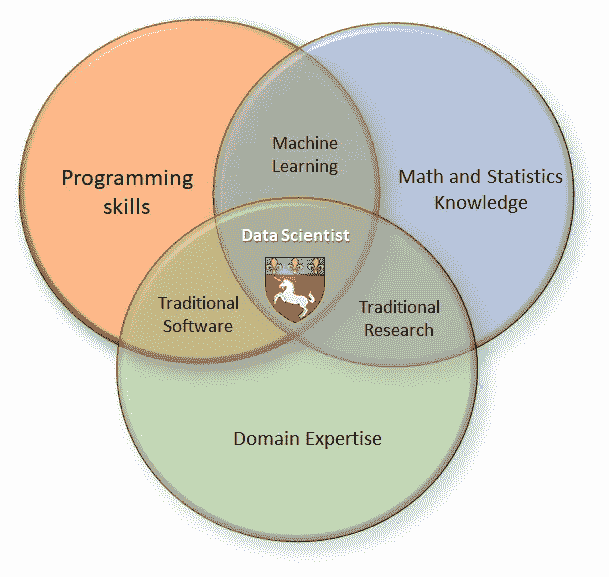
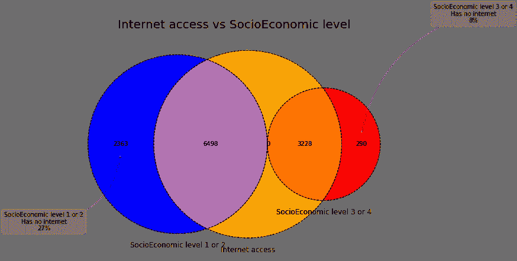
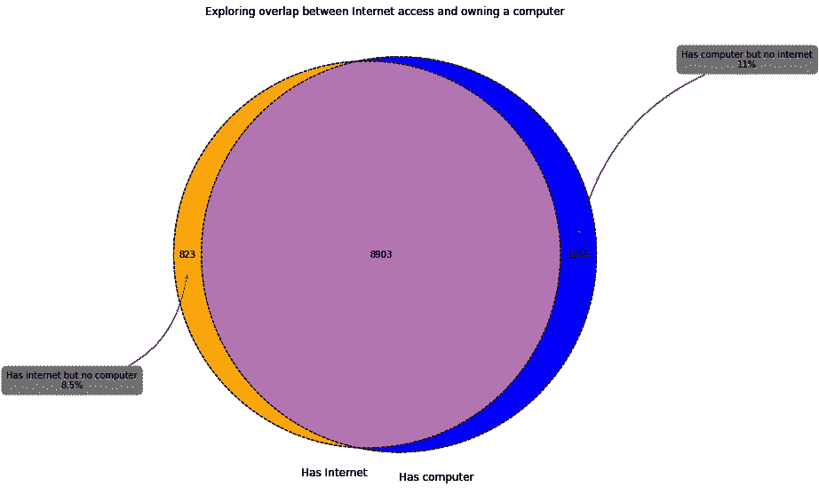
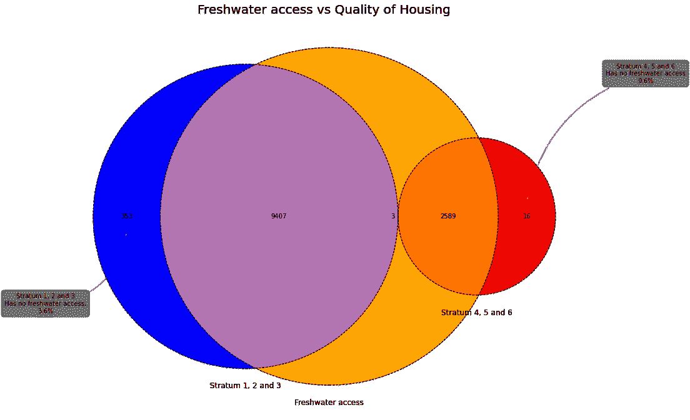
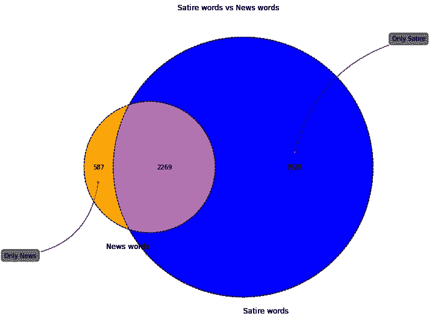

# 维恩图:一个不常见的可视化工具

> 原文：<https://towardsdatascience.com/venn-diagram-a-not-so-common-visualization-tool-b2bcd5e8c91?source=collection_archive---------38----------------------->


## 使用文氏图辅助 EDA 过程的例子

## 介绍

维恩图是一个通用集合的几个子集的所有可能关系(并、交、差、对称差)的示意图。

至少从 19 世纪 80 年代开始，文氏图(有时称为欧拉-文氏图)就已经作为解决逻辑问题的工具出现了。这个概念是由约翰·维恩在他的符号逻辑第五章“图解表示”中引入的 Leonard Euler(你好，Euler 教授，我们爱你)和 Christian Weise 在他们更早的工作中使用了类似的方法。然而，与一个流行的信念相反(或者不那么流行，不是每个人都生活和呼吸逻辑集合论)，欧拉版本的图表与维恩的不一样。欧拉图有时被称为欧拉圈(不，它们并不总是圆形的)，它们最初是为了解决亚里士多德三段论而创建的，而维恩用他的来解决数学逻辑问题。

这里有一个数据科学维恩图的简单示例。它有许多版本，但我最喜欢这个:



数据科学维恩图，图片作者

我还会添加“心理学知识”和“艺术技巧”，但让我们保持简单。脚注:没错，数据科学家是独角兽；让我们拥抱它。

那大概就是足够的[维基级内容](https://en.wikipedia.org/wiki/Venn_diagram)。现在，我们去探索维恩图更实际的一面；它们在数据可视化中的应用。

## 用例

**例 1:**

最近，我面临着理解分类问题中的某些特征如何相互关联的问题。数据集中的要素与哥伦比亚工程专业学生的社会经济地位相关联。该项目的最终目标是模拟学生在专业测试中的表现。数据集中的大多数要素都是分类的，包括住房质量、家庭收入和社会经济水平等。其他被探究的类别包括某人是否拥有电脑、手机、淡水，甚至他们是否拥有微波炉。常识让我相信，一个人是否拥有洗衣机，在很大程度上与学生家庭的社会经济水平重叠。同样，获得淡水也与住房质量密切相关。然而，我不能确定我关于特征相互复制的假设是否正确。当然，我可以使用相关矩阵，但我发现[色差比尺寸差](/the-psychology-behind-data-visualization-techniques-68ef12865720)更难评估。此外，我希望有一种直观的方式来可视化整个记录池中具有特定特征的一部分记录。维恩图似乎是我所需要的一个很好的工具。事情是这样的。

我从安装 matplotlib-venn 包开始。我更喜欢通过康达进行安装:

```
conda install -c conda-forge matplotlib-venn
```

或者 pip 安装也可以

```
!pip install matplotlib-venn
```

接着是导入:

```
import pandas as pd
import numpy as np
import matplotlib.pyplot as plt
import matplotlib_venn as venn
from matplotlib_venn import venn2, venn2_circles, venn3, venn3_circles
```

最后是神奇的一个

```
%matplotlib inline
```

下一步是导入数据集。我已经对它进行了部分预处理；删除了一些有错误的记录，清除了值，并将数据类型从数值更改为对象。最终的数据集可以在我的 [github repo](https://github.com/sealaurel/venn_diagram) ，data_for_venn_clean.csv 中找到

我继续根据 venn2 和 venn3 使用的条件创建集合。完整的代码片段可以在 Jupyter 笔记本或 PDF Venn _ diagram _ examples . ipynb/Venn _ diagram _ examples . PDF 所在的目录中访问。以下是其中一些数据集的示例:

```
TV_set=set(df_venn.loc[df_venn.TV=='Yes']['COD_S11'])
Internet_set=set(df_venn.loc[df_venn.INTERNET=='Yes']['COD_S11'])
...
SEL1_set=set(df_venn.loc[df_venn.SEL==1]['COD_S11'])
SEL2_set=set(df_venn.loc[df_venn.SEL==2]['COD_S11'])
SEL3_set=set(df_venn.loc[df_venn.SEL==3]['COD_S11'])
SEL4_set=set(df_venn.loc[df_venn.SEL==4]['COD_S11'])
```

我还构建了几个联合集:

```
SEL1_and_SEL2_set=SEL_IHE1_set.union(SEL_IHE2_set)
SEL3_and_SEL4_set=SEL_IHE3_set.union(SEL_IHE4_set)
```

为了节省空间和时间，我会让任何对数据变量的完整描述感兴趣的人参考同一个[报告](https://github.com/sealaurel/venn_diagram)中的 README.md 文件。

可视化、互联网接入与社会经济水平:

```
plt.figure(figsize=(10, 10))SEL1_and_SEL2_set=SEL_IHE1_set.union(SEL_IHE2_set)
SEL3_and_SEL4_set=SEL_IHE3_set.union(SEL_IHE4_set)ax=plt.gca()sets=[Internet_set, SEL1_and_SEL2_set, SEL3_and_SEL4_set]
labels=('Internet access', 'SocioEconomic level 1 or 2', 'SocioEconomic level 3 or 4')v=venn3(subsets=sets, set_labels = labels, ax=ax, set_colors=("orange", "blue", "red"))v.get_patch_by_id('100').set_alpha(0.3)venn3_circles(subsets=sets,
              linestyle="dashed", linewidth=1)plt.annotate('SocioEconomic level 1 or 2\nHas no internet\n36%',
             xy=v.get_label_by_id('010').get_position() - np.array([0, 0.05]), xytext=(-130,-130),
             ha='center', textcoords='offset points', bbox=dict(boxstyle='round, pad=0.5', fc='gray', alpha=0.1),
             arrowprops=dict(arrowstyle='->', connectionstyle='arc3,rad=0.4',color='gray'))plt.annotate('SocioEconomic level 3 or 4\nHas no internet\n9%',
             xy=v.get_label_by_id('001').get_position() - np.array([0, -0.05]), xytext=(190,190),
             ha='center', textcoords='offset points', bbox=dict(boxstyle='round, pad=0.5', fc='gray', alpha=0.1),
             arrowprops=dict(arrowstyle='->', connectionstyle='arc3,rad=0.3',color='gray'))plt.title('Internet access vs SocioEconomic level', fontsize='20')
plt.show()
```



作者图片

从上图中可以明显看出，来自低社会经济水平家庭的学生无法上网的比例几乎是来自富裕家庭的学生的 3.5 倍。当涉及到计算机的所有权时，同样的模式会重复出现。事实上，互联网接入和计算机所有权本质上是重叠的:



作者图片

这些图表让我得出结论，在社会经济水平和上网/使用电脑之间确实有很强的相关性。此外，我了解到拥有一台电脑与互联网接入的可用性相关。

我用同样的方法形象化了获得淡水和住房质量之间的关系。哥伦比亚使用 strata ( *estrato* )根据几个标准对社区和区域进行分类。这些数字旨在对房产和其他建筑进行分类，而不一定是居住在那里的人的社会地位，因此收入不在评估范围内。生成的图表得出的结论是，住房质量与获得淡水密切相关。来自较高阶层家庭的学生获得淡水的可能性是来自较低阶层家庭的学生的六倍。



作者图片

上面的可视化帮助我回答了这个问题“我是应该保留数据集中的所有要素来构建模型，还是应该放弃其中的一些？”

**例 2**

我还发现文氏图有助于理解矢量化之前的 NLP 处理。

我不会在这里展示代码，但任何感兴趣的人都可以在[同一个 github repo](https://github.com/sealaurel/venn_diagram) 中找到它以及 csv 文件，[satisratio _ no satire . CSV](http://localhost:8890/edit/venn_diagram/satire_nosatire.csv)。这是一个包括讽刺文章(The Onion)和真实新闻(Reuters)的数据集。整套文章被称为**文集**。它经过预处理，分为两组，讽刺和新闻。下面是一个维恩图，显示了训练数据集中讽刺和新闻单词的集合。



作者图片

## 结论

这篇文章的目的是展示在建立模型之前，如何使用维恩图来帮助理解两个不同领域的数据——大分类数据集和非结构化 NLP 数据。我真诚地希望这将对您未来的数据分析项目有所帮助。