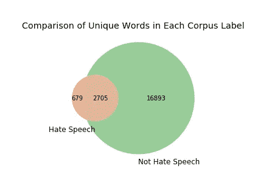

# 维恩图——被低估的数据可视化

> 原文：<https://towardsdatascience.com/venn-diagrams-an-underrated-data-visualization-6eb6c123eb4a?source=collection_archive---------28----------------------->

## 有时候，简单更好。


[麦斯威尔·尼尔森](https://unsplash.com/@maxcodes)上 [Unsplash](https://unsplash.com/photos/taiuG8CPKAQ)

一个**数据** **可视化**的主要目标是**以一种清晰、引人注目的方式**表示一个点。作为数据科学家，我们一直致力于创建最酷、最具创新性的数据可视化类型。以至于实际的信息丢失了。**为什么要把事情复杂化**？有时，一个简单的信息只需要一个简单的可视化来传达。在这篇博客中，我将分享一个简短的教程，教你如何用 Matplotlib 和任何类型的数据轻松地创建维恩图。

## **项目背景**

在我最近的项目“Twitter 仇恨言论检测”中，我面临着一个重大挑战，即数据的类别不平衡。整个数据集是 24802 条文本推文，其中只有 6%被标记为仇恨言论。最后，这种阶级不平衡对我最终模型的结果产生了影响。你可以在这里查看最终项目的资源库[以了解更多细节。](https://github.com/sidneykung/twitter_hate_speech_detection)

当我为这个项目做演示的时候，**我需要一种方法来可视化这个问题。另外，我想找到**专有**到**仇恨言论标签**的字数，并且不与简单的攻击性语言重叠。然后我突然想到，维恩图可以完美地展示这个概念。这是最终产品。**



在我开始学习教程之前，让我们先回顾一下基础知识。我们在小学都学过这个简单的视觉化。维恩图是由两个或两个以上的圆圈重叠而成的图，用来显示集合之间的逻辑关系。众所周知，集合包含了数据集中的唯一值。因此，这个维恩图**显示了来自每个标签**的唯一单词，以及那些重叠的单词。

## **教程**

用 Python 创建维恩图非常简单。没有多少人知道这一点，但流行的数据可视化包`matplotlib`有一个扩展，可以创建可定制的维恩图。你可以点击查看**文档**和[。第一步总是将软件包安装到您的本地机器上。](https://pypi.org/project/matplotlib-venn/)

```
pip install matplotlib-venn
```

因为它是基于`matplotlib`的，所以你也需要导入 matplotlib 的**依赖项**，比如`numpy`和`scipy`。

一旦软件包被安装，你将需要输入你的数据作为一个**集合**。我不打算深入我的代码的细节，但是我可以在这个笔记本中查看所有的细节。首先，我将每个标签中的 tweets 分开，然后使用 map 函数将**标记化的单词**变成两个单独的**列表**。从那以后，我使用列表理解将它们转换成嵌套列表进行查询。

在您的数据采用合适的格式后，我们可以**将包**导入笔记本电脑本身。

```
import matplotlib_venn as vennfrom matplotlib_venn import venn2, venn2_circles, venn3, venn3_circlesimport matplotlib.pyplot as plt%matplotlib inline
```

从这里开始，创建文氏图的代码就像**一行代码**一样简单。

```
venn2([set(label_1), set(label_2)])
```

然而，这个包的美妙之处在于它非常**可定制**。您可以通过将此代码添加到原始行来添加标题和标签。

```
venn2([set(label_1), set(label_2)], set_labels = ('Hate Speech', 'Not Hate Speech'))plt.title('Comparison of Unique Words in Each Corpus Label')
```

最后一步是**保存图片并在演示中使用它！**

```
plt.savefig('venn_diagram.png', bbox_inches = "tight", pad_inches=.5)
```

除了标题和标签，你还可以**添加更多的圆**、**改变圆的颜色**、**添加轮廓**、**改变尺寸**等等。还有其他博客详细介绍了如何做到这一点，我将在下面链接这些博客。

*   [如何用 Python 创建和定制维恩图](/how-to-create-and-customize-venn-diagrams-in-python-263555527305)
*   [如何用 Python 设计专业的维恩图](/how-to-design-professional-venn-diagrams-in-python-693c9ed2c288)

在探索性数据分析阶段，我们不断地**询问关于数据的问题**和**利用隐藏的洞察力**。下一次你发现自己在创建一个复杂的可视化并且**在努力传达这些见解**，解决方案可能是**简化它**。我们不应该忽视基本的可视化，如维恩图！