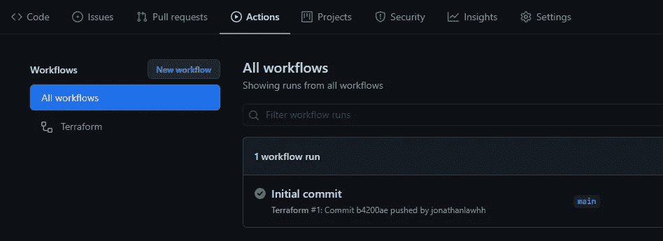

# 使用 Terraform 的版本控制大查询(也使用 CI/CD)

> 原文：<https://towardsdatascience.com/version-control-big-query-with-terraform-with-ci-cd-too-a4bbffb25ad9?source=collection_archive---------5----------------------->

## 确保大查询中的所有更改都是负责任的

# 介绍

当人们在没有通知团队其他成员的情况下开始改变视图时，使用大查询和创建视图的团队工作可能会变得混乱。


该片段取自作者大查询视图

一些团队习惯于在视图顶部使用注释，甚至是电子表格来记录变更。显然，从长远来看，这会导致一个问题，因为人们可能会忘记评论或没有正确地做。

事不宜迟，我如何对我的大查询进行版本控制，以确保我可以跟踪并在需要时回滚更改，并与我的团队一起更好地管理项目。

为了实现这一点，我们将研究两种技术，即 [Terraform](https://www.terraform.io/) (基础设施即代码)，以及您选择的版本控制系统(Github、Gitlab 等)。我们今天将使用 Github！如果你从未听说过 Terraform，不要太担心，这篇文章也可以算是“GCP terra form 的快速介绍”!

# 快速跳跃

1.  [入门](#f197)
2.  [初始化地形环境](#a26d)
3.  [在 Terraform 中创建数据集和视图](#a26d)
4.  [版本控制和设置](#faba)
5.  [git 提交，git 推送](#1d7a)
6.  [做出改变并测试我们是否达到了目标](#78d8)
7.  [结论](#9675)

# 入门指南

这一部分将用于尚未设置的环境。
入门不多！你只需要安装:
1。[地形](https://www.terraform.io/downloads.html)。他们提供了一个很好的指南，所以只要确保你跟着做，你应该能够在你的终端/命令提示符
2 中调用`terraform`。饭桶。请为您的操作系统安装 git，这样我们就可以执行基本命令，如`git push`

**TL；步骤的 DR**

1.  在 GCP 项目上创建服务帐户
2.  为服务帐户创建并下载 JSON 密钥
3.  设置 Google 云存储(GCS)来存储地形状态
4.  授予服务帐户在该存储桶中读取、写入和创建对象的权限
5.  设置 Terraform 以连接到 GCS

**首次创建服务账户和密钥的详细信息
和**

Terraform 将代表我们使用一个叫做服务账户的东西与我们的谷歌云平台(GCP)项目进行互动。


该片段摘自授予 IAM 角色的作者 GCP 项目

继续用谷歌提供的[教程](https://cloud.google.com/iam/docs/creating-managing-service-accounts)创建你的 GCP 项目。当您到达选择 IAM 角色的提示时(截至 2021 年 6 月的教程中的步骤 7)，出于本教程的原因，您需要授予 ***大查询数据编辑器*** 角色，如上面的代码片段所示。随着您的进步，请随意将权限缩小到仅需要的内容。单击下一步和完成。


该片段摘自作者 GCP 创建新密钥的项目

创建服务帐户后，单击服务帐户，您将看到一个类似于上面代码片段的屏幕。选择*键- >添加键- >创建新键。*接下来会出现一个弹出窗口，选择 JSON，点击 create。它将下载一个 JSON 文件。保管好它！

**创建一个 Google 云存储(GCS)来存储地形状态**

Terraform state 基本上记住并告诉 Terraform 你的基础设施现在是什么样子。我建议阅读 [Terraform 文档](https://www.terraform.io/docs/language/state/index.html)来更好地理解它。我们将使用 GCS 来存储状态，主要有两个原因:
-在 Github 上共享状态通常不是一个好的做法，因为它可能包含敏感信息
-您不需要担心丢失它和重建基础设施

因此，让我们开始按照这里的教程[创建一个 GCS bucket](https://cloud.google.com/storage/docs/creating-buckets)。记住您创建的存储桶名称，因为我们稍后将使用它。在该存储桶上，选择 permission 并添加之前创建的具有 Storage Admin 权限的服务帐户。你可以按照这个[教程](https://cloud.google.com/storage/docs/access-control/using-iam-permissions)去做。

# 初始化地形环境

创建一个工作文件夹，在这个文件夹中，我们将创建一个名为`providers.tf`的文件。我通常使用 Visual Studio 代码来管理我的 Terraform 配置。tf 是一个 Terraform 配置文件，我们所有的 Terraform 内容都将存放在其中。平台提供商基本上是你将要与之合作的平台，无论是微软 Azure、GCP、AWS 还是其他。我将这个文件命名为`providers.tf,`,因为这是我保存所有提供者配置的地方，你可以随意命名，但是提供者会是一个更好的标准。

将以上内容粘贴到您的`providers.tf`中。在名为 terraform {…}的第一个“块”中，我们告诉 terraform 将我们的状态存储在 GCS 中。将 *YOUR_BUCKET_NAME* 更改为您之前创建的 BUCKET 名称。前缀基本上只是桶内的文件夹。
下一个称为 provider 的块表示我们正在使用 [Terraform Google Provider](https://registry.terraform.io/providers/hashicorp/google/latest/docs/guides/getting_started) 配置，并用您的 *YOUR_PROJECT_NAME* 对其进行初始化。

现在，Terraform 还不能读取您的 GCS 存储，这就是我们的服务帐户发挥作用的地方。将有一些方法向 Terraform 声明您的服务帐户，但是我们将使用的方法将在稍后在 Github 上设置 CI/CD 时有用。我们将把环境变量设置为我们先前下载的 JSON 文件，所以把那个 JSON 文件也移到您的项目文件夹中。在同一文件夹中，打开终端/命令提示符，并将环境设置为:

Windows 用户:

```
set GOOGLE_CREDENTIALS=JSON_FILE_NAME.json
```

Linux/macOS:

```
export GOOGLE_CREDENTIALS=JSON_FILE_NAME.json
```

Terraform 上的 Google provider 将自动从环境变量中检测服务帐户密钥。现在您的第一个 Terraform 命令来初始化环境了！

```
terraform init
```

如果一切顺利，您应该会在控制台上看到许多绿色文本。GCS 现在应该显示一个名为 state 的文件夹和该文件夹中一个以. tfstate 结尾的文件。

然而，如果你遇到了错误，不要担心，仔细阅读是什么错误。如果是关于 NewClient()失败的问题，请确保您的环境变量被正确地设置到 JSON 文件中。如果是关于拒绝访问，请确保您在 Google IAM 页面上为您的服务帐户提供了适当的访问权限。

# 创建我们的第一个数据集和视图

太好了！现在我们已经初始化了我们的环境，我们可以开始使用 Terraform 管理大型查询。

就像我们如何用`providers.tf`来管理我们的提供商一样，我们将创建`bigquery.tf`来管理我们的大查询。您甚至可以深入到数据集、表和视图的 3 个独立文件，但目前，我们将只创建`bigquery.tf`。我们将在`bigquery/views/vw_aggregrated.sql`创建另一个文件夹来存储我们的视图 SQL。

```
# Some demo content in vw_aggregrated.sqlSELECT 
   LoadDate, Origin, Destination, COUNT(ID) AS counts
FROM
   `terraform-testing-gcp.demoset.DemoTable`
GROUP BY
   1, 2, 3
```

将上面的代码复制粘贴到`bigquery.tf`中。为了理解发生了什么，第一个资源包含两个参数，第一个是资源类型*(Google _ big query _ dataset)*，第二个是 ID *(views)* 您可以自己定义。你可以在这里找到谷歌提供商可用的资源。我们正在美国使用 ID 为*“views”*的*“Google _ big query _ dataset”*块创建数据集。我已经给了它一个描述和一些标签。标签是完全可选的，你可以删除它们。

接下来，我们创建一个资源*“Google _ big query _ table”*，ID 为*“VW _ aggregated”*。对于 dataset_id，它引用我们之前创建的*视图* dataset_id。这一次，由于我们正在创建一个视图，我们将不得不打开一个视图块，如教程[这里](https://registry.terraform.io/providers/hashicorp/google/latest/docs/resources/bigquery_table#view)所述。我们将传入的第一个参数是我们想要使用的 SQL。有两种方法可以做到这一点，一种是直接将 SQL 键入 bigquery.tf 本身，例如:`query = "SELECT * FROM ... WHERE 1 = 1`。然而，我们正在研究可维护性，所以我们已经在`bigquery/views/vw_aggregated.sql`的一个文件夹中定义了我们的 SQL。

好吧！让我们运行一个命令来标准化我们的 Terraform 代码格式，然后试运行我们的配置。Terraform plan 将基本上“计划”并让我们知道什么资源将被创建/删除/修改等。

```
terraform fmt
terraform plan
```

如果你看到`x resource to be created`，x 是一个数字，你就可以走了！如果您正在获取`x resource to be deleted`，请检查并验证这是否是有意的。一旦确认这是预期的操作，运行`terraform apply`应用配置。


Terraform 创建的 author 大查询数据集的片段

如果操作正确，检查您的大查询 UI，您应该看到您在 Terraform 配置中定义的资源已创建！在我们的例子中，创建了一个名为*视图*和 *vw_aggregated* 的数据集。

# 版本控制设置

在我们验证了我们的 Terraform 配置按预期工作后，是时候对配置的变更进行版本控制了。第一步是创建一个 Github 项目，并将其设置为私有 repo，因为您不希望您的基础设施设置公开:)。


作者 Github 秘密创作画面片段

按照 Github 的指南创建一个名为`GOOGLE_CREDENTIALS`的秘密。这个秘密的值将是我们刚才用来设置环境变量的 JSON 密钥文件的内容。只需用文本编辑器打开 JSON 文件，并将内容复制粘贴到秘密值字段中。它应该类似于上面的代码片段。

我们将保持的“秘密”是服务帐户密钥，以允许 Github 动作在每次我们提交更改时帮助应用我们的 Terraform 配置。
Github secret 在我们的场景中非常棒，原因有两个:
-我们不需要提交我们的 JSON 密钥文件，其他贡献者/成员可以下载和滥用
- Github 操作将应用配置，并且您不需要向贡献者分发具有写权限的服务帐户。这迫使贡献者/成员总是提交他们的工作和变更，以便将其应用到生产中

接下来，我们需要告诉 Github Actions，一旦提交发生，需要做什么。创建一个名为`.github/workflows`的文件夹，并将以下内容粘贴到新创建的名为`terraform.yml`的目录中的一个文件中。

在推送至 Github 之前，我们需要排除一些文件或文件夹。在根文件夹上，创建一个名为`.gitignore`的文件，并粘贴以下内容。这将排除我们之前复制到目录中的 JSON 键，以及任何状态文件(如果有的话)。也可以随意添加自己的文件！

```
*.json
*.tfstate
```


作者项目目录的一个片段

对于那些仍然对我们之前创建的许多文件感到困惑的人来说，如果你完全按照这个教程来做(忽略`vw_origin_KUL.sql`)，你的目录应该是这样的。

# git 提交，git 推送

黄金时刻来了。以下命令将初始化 git 并将您的配置推送到 Github。理想情况下，如果运行良好，Github Actions 将在您的代码被推送的那一刻开始运行。

```
terraform fmt
git add .
git remote add origin LINK_TO_YOUR_GIT_REPO
git branch -M main
git commit -m "Initial commit"
git push -u origin main
```

*git add* 将在该目录中添加新的和已更改的文件和文件夹，除了那些在`.gitignore`中定义的。
*git remote add originhttps://github.com/…*会定义你当前目录应该属于的库。
*git branch -M main* 将创建一个名为 main
*git commit-M " YOUR _ MESSAGE _ HERE "*将创建一个“changelog”，一个好的消息将帮助你自己和你团队中的其他人识别出什么被更改了，而无需阅读太多代码
*git push-u origin main*将把你的代码推送到主分支。



作者 Github 操作工作流页面的片段

现在检查你的 Github 库，你应该在那里看到你的代码。单击 Actions 选项卡，您将看到我们之前在`.github/workflows/terraform.yml`创建的工作流。


作者 Github 操作工作流详细信息的片段

如果你看到一个绿色或橙色的勾号在跑，你就可以走了！如果出现错误，只需点击进入工作流程并阅读每个步骤的日志，因为错误很容易缩小范围。如你所见，这些步骤是我们在`.github/workflows/terraform.yml`中定义的。

# 做出改变并测试我们是否达到了目标

我们几乎完成了整个管道！接下来是测试我们计划实现的目标是否已经实现。让我们对`bigquery/views/vw_aggregated.sql`做一些改变。我已将我的查询更改为

```
# Some demo content in vw_aggregrated.sqlSELECT 
   CAST(LoadDate AS DATE) AS LoadDate, 
   Origin, Destination, COUNT(ID) AS counts
FROM
   `terraform-testing-gcp.demoset.DemoTable`
GROUP BY
   1, 2, 3
```

现在，我们将需要添加任何已更改的内容，创建一个 changelog 消息，然后将其推送到我们的存储库，以便 Github Actions 可以为我们应用它。总是`terraform fmt`保证代码标准化。

```
terraform fmt
git add .
git commit -m "Updated vw_aggregated to CAST LoadDate"
git push origin main
```


作者 Github commit 的一个片段

检查回购，我们可以看到我所做的更改( *jonathanlawhh* )，如上面的片段所示。


更新后的作者 Github 操作工作流片段

检查“Actions”选项卡，我们可以看到该提交的工作流已成功完成！


更新后的作者大查询视图片段

最后，我们可以看到大查询中的视图已经按照预期进行了更新。

# 结论

总之，我们首先建立一个 Github 存储库，初始化一个 Terraform 环境，并将 Terraform 配置推送到 Github 存储库。与此同时，我们还准备了一个 CI/CD 配置`terraform.yml`，以便在我们推出变更时帮助部署我们的配置。至此，可以有把握地说，我们已经实现了使用 Terraform 对大查询进行版本控制的目标，并实现了对我们项目的持续集成和部署。

希望这篇文章足以启动您的实现，并帮助您更多地了解 Terraform 可以实现什么！当然，实现可以根据您的环境进行改进。

如果您有任何问题，请随时联系我，甚至通过
Messenger widget 向我问好:[https://jonathanlawhh.com](https://jonathanlawhh.com)
电子邮件:jon_law98@hotmail.com