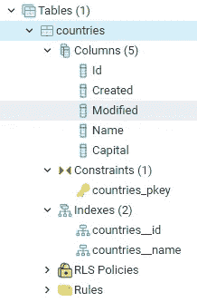

# 版本控制您的数据库第 1 部分:创建迁移和播种

> 原文：<https://towardsdatascience.com/version-control-your-database-part-1-creating-migrations-and-seeding-992d86c90170?source=collection_archive---------7----------------------->

## 轻松规划、验证和安全地应用对数据库的更改


想象一下，这些盒子里塞满了模式和表格(图片由[赖爷·苏比扬托](https://www.pexels.com/@ketut-subiyanto)在[像素](https://www.pexels.com/photo/crop-man-packing-box-with-duct-tape-4246106/)上拍摄)

如果您没有在数据库中处理迁移，那么您就错过了。就像 Git 管理对源代码的更改一样，您可以使用迁移来跟踪对数据库的更改。执行和恢复更改，并将数据库恢复到以前的状态。

设置迁移比您想象的要简单，而且优势巨大。迁移是独立于数据库的，提供一个真实的来源，跟踪变化，甚至可以用一些数据播种您的数据库。当您阅读完本文后，您将能够:

*   创建带有索引和外键的表
*   在开发数据库中轻松规划、验证和安全应用更改，然后将所有更改同步到生产数据库
*   重置开发数据库(全部撤消，再次迁移)
*   在数据库中创建所有指定的表，包括索引和关联
*   为数据库设定种子(插入数据)
*   执行到任何数据库的迁移(例如 PostgreSQL 和 SQL Server)

我将试着用实例展示所有这些特性，这些实例使用您可以重用的真实代码。我将这个过程分为 4 个步骤:设置、创建迁移、执行和撤销，最后是播种。不要因为这篇文章的长度而气馁，你可以使用简单的步骤轻松完成。我们走吧！


我们的计划已经制定，让我们开始吧(照片由[斯科特·格雷厄姆](https://unsplash.com/@homajob)在 [Unsplash](https://unsplash.com/photos/5fNmWej4tAA) 上拍摄)

# 步骤 1:设置

在这一步的最后，Sequelize 安装完毕，可以使用了。如果你是一个有经验的程序员，那么跳过“解释”部分。在这一部分的底部，您可以找到所有命令的摘要。

## 1.1 安装 NPM

[安装 NPM](https://nodejs.org/en/download/) 。用`npm -v`验证

说明:
对于这个项目，你需要安装[NPM](https://www.w3schools.com/whatis/whatis_npm.asp)JavaScript 包管理系统。它类似于 Python 中的 pip，您可以使用它来安装软件包。在此下载 NPM [并遵循安装说明。一旦安装完成，你应该能够打开一个终端(如命令提示符)并运行`nmp -v`。如果您的是阿瑟版本(如 *v14.15.4* ),则节点安装正确。](https://nodejs.org/en/download/)

## 1.2 设置您的项目

打开终端，导航到您的项目文件夹并执行`npm init`

解释:
创建一个你想要创建这个项目的文件夹，例如`c:/migrationtool`。
打开一个终端，导航到这个文件夹:`cd c:/migrationtool`
调用`npm init`新建一个项目。NPM 会问你一些关于项目名称、版本、描述和作者姓名的问题。这些都不是必填项，可以跳过，也可以以后填写。完成后，项目文件夹中会出现一个名为“package.json”的文件。在这里，我们所有的项目元数据都将被注册。

## 1.3 安装软件包

在根文件夹中执行

```
# installing packages
npm install --save sequelize sequelize-cli
npm install --save pg pg-hstore   # for PostgreSQL
npm install --save tedious        # for SQL Server
```

说明:
我们的项目准备好了，让我们安装我们的包吧！首先我们需要 Sequelize 和 Sequelize-cli。这些包允许我们开始进行和执行迁移:`npm install --save sequelize sequelize-cli`。这是允许我们创建迁移的主包。
为了实际执行这些迁移(例如创建数据库、表或新列), Sequelize 需要了解更多关于数据库的信息。出于演示目的，我们将在项目中使用两种数据库:PostgreSQL 和 SQL Server。为了让 Sequelize 与这些数据库一起工作，我们需要安装一些额外的包:`npm install — save pg pgh-store tedious`。如果你使用另一个数据库，如 mysql sqllite 或许多其他数据库，你可以在这里选择使用哪个包。你会注意到出现了一个新文件夹；节点 _ 模块。我们所有的软件包都安装在这里。我们的 package.json 文件也扩展了，跟踪我们所有已安装的包。

## 1.4 初始化序列

在你的根文件夹中执行`npx sequelize-cli init` 并运行所有步骤

说明:
我们所有的包都安装好了。初始化序列:`npx sequelize-cli init`。请注意，我们在这里使用的是 NPX，而不是 NPM。NPX 用来执行我们和 NPM 一起安装的包。
命令完成后，您会注意到又出现了三个文件夹:

*   config:保存数据库凭证之类的文件
*   模型:保存将数据库表表示为模型的文件
*   seeders:在表格中插入和删除数据的文件

## 1.5 配置序列

Sequelize 已经可以使用了。在我们深入研究之前，我们将让 Sequelize 的工作变得更简单一些
我们将让配置的工作变得更简单一些。根据我的经验，JS 文件比 JSON 更容易使用。转到 config 文件夹，将 *config.json* 改为 *config.js* 。然后调整内容从

```
{
  "development": {
```

到

```
module.exports: {
    "development": {
```

我们对“我们需要告诉 Sequelize 如何处理新情况”进行了更改。转到项目的根目录(`c:/migrationtool/`)并创建一个新文件。将这个文件命名为`.sequelizerc`。请注意，这个文件没有名称，只有扩展名。打开文件并添加下面的内容。这告诉 Sequelize 我们现在使用 config.js 而不是 config.json。

```
const path = require('path');
 module.exports = {
   "config": path.resolve('./config', 'config.js'),
    "models-path": path.resolve('./models'),
    "migrations-path": path.resolve('./migrations'),
    "seeders-path": path.resolve('./seeders')
 }
```

乐趣开始前的最后一步:转到 models 文件夹(`c://migrationtool/models`)并打开 index.js 文件。在第 8 行，将 config.json 替换为 config.js。

## 摘要

我们准备好出发了！在我们进入下一步之前，检查一下我们使用的命令。

```
#Creating folder
cd c:/
mkdir migrationtool
cd migrationtool#Setting up project
npm init# installing packages
npm install --save sequelize sequelize-cli
npm install --save pg pg-hstore   # for PostgreSQL
npm install --save tedious        # for SQL Server# Initialize Sequelize
npx sequelize-cli init
```


续集到了，我们开始吧。(照片由 [Handiwork NYC](https://unsplash.com/@handiworknyc) 在 [Unsplash](https://unsplash.com/photos/x6pnKtPZ-8s) 上拍摄)

# 步骤 2:创建迁移

在 Sequelize 中，迁移是一个 JavaScript 文件。它的内容描述了在执行和撤销时应该发生什么，例如“创建一个名为‘person data’的模式。让我们创建一个！

## 2.1 创建我们的首次迁移

在您的根文件夹中执行以下命令。
`npx sequelize-cli migration:create -- name create_schemas`。这将告诉 sequelize 创建一个新的迁移。执行这个命令将在我们的 migrations-folder 中生成一个文件，名称如下:“20210519183705-create _ schemas . js”。在里面你会发现下面的代码。

我们的第一次迁徙

如您所见，迁移包含两个功能“向上”和“向下”。第一个函数将包含实现我们想要做的事情的所有代码；创建模式。第二个功能将取消“向上”功能；它是它的对立面。让我们完成第一次迁移:

为我们的迁移采取一些行动

这段代码告诉 queryInterface 创建一个名为“app”的模式。

## 2.2 创建表迁移

让我们加快一点速度；我们将使用`npx sequelize-cli migration:create -- name create_country_table`创建新的迁移。为新创建的迁移提供以下内容:

这在我们的模式中创建了一个新表

这种迁移有点奇特。首先，它创建了一个事务，在该事务中定义了一个包含几列的表。然后，它将 we 索引添加到表中，然后提交它。事务是为了确保要么一切成功，要么什么都没有。如果创建其中一个索引失败，它将回滚到创建表。down 函数只是删除新创建的表。

还要注意，创建和修改的列都有默认值。


我们的迁移已经确定，让我们构建数据库模型吧！(图[jeshoots.com](https://www.pexels.com/@jeshoots-com-147458)在[像素](https://www.pexels.com/photo/floor-plan-on-table-834892/)上)

# 3.执行和撤销我们的迁移

我们的数据库中还没有发生任何事情。我们刚刚生成了一些现在必须执行的指令。我们希望将指令迁移到数据库中。首先，我们将定义我们的数据库连接，然后我们将使用该连接告诉数据库如何执行迁移

## 3.1 设置数据库连接

编辑 config.js 文件的内容(在 root/config 文件夹中)。我已经创建了两个数据库连接:

```
module.exports = {
  development: {
    username: "mike",
    password: "my_secret_password",
    database: "country_db_dev",
    host: "localhost",
    port: "5432",
    dialect: "postgres"
  },
  production: {
    username: "mike",
    password: "my_secret_password",
    database: "country_db",
    host: "localhost",
    port: "1433",
    dialect: "mssql"
  }
}
```

解释:
我做了两个连接:开发和生产。这些文件允许我们的迁移工具连接到数据库来执行迁移。

当我们告诉 Sequelize 执行迁移时，它需要知道要连接到哪个数据库。为此，我们将 NODE_ENV 设置为我们的一个数据库连接的名称。我们有“开发”和“生产”。让我们与“发展”联系起来。在您的根文件夹中打开一个终端，执行下面的一行(与您的操作系统匹配):

```
# On windows
SET NODE_ENV=development
# On OSX
export NODE_ENV=development
#On powershell
$env:NODE_ENV="development"
```

## 3.2 执行迁移

既然 Sequelize 知道向何处写入，我们就可以执行迁移了。请注意，在上一步中，我们已经定义了数据库。我们可以执行到任何数据库的迁移，在本文的步骤 1.3 中我们已经为这些数据库下载了包。这样，我们可以在 PostgreSQL 中测试我们的迁移，然后将所有内容迁移到我们的 SQL Server 生产数据库中！
让我们执行:

```
npx sequelize-cli db:migrate
```

这段代码将执行所有的迁移，在其中创建我们的模式和一个表，请看:



我们漂亮的表，有列、主键和索引

## 3.3 撤消迁移

等等，回去！调用下面的代码删除表和模式。`npx sequelize-cli db:migrate:undo:all`。看看你的数据库里面，都是干净的！您也可以通过在下面的命令
`npx sequelize-cli db:migrate:undo:all — to XXXXXXXXXXXXXX-create_country_table.js`中指定文件名来撤销直到一个特定的迁移


我们已经成功执行了！(图 byu [SpaceX](https://unsplash.com/@spacex) 上 [Unsplash](https://unsplash.com/photos/-p-KCm6xB9I)

# 4.播种

为数据库设定种子非常类似于创建迁移。让我们快速浏览一下代码。

## 4.1 创建种子

第一步:生成种子文件
`npx sequelize-cli seed:generate --name seed_country_table`
，内容:

这将在我们之前创建的表中插入两条记录。向下删除它们

## 4.2 执行种子

用`npx sequelize-cli db:seed:all`执行

## 4.3 撤销种子

比如用
撤销种子用`npx sequelize-cli db:seed:undo` `
或者直到一个特定的种子像


很难相信这些小种子会成长为一个漂亮的关系数据库模型

# 结论

我们今天完成了相当多的工作！我们已经完成了以下工作:

*   安装的节点
*   已安装的序列和所有必要的软件包
*   配置序列
*   创造了一些迁移
*   执行和撤消迁移
*   创造了一些种子
*   已执行和未执行的种子

点击 [**此处**](https://mikehuls.medium.com/version-control-your-database-part-2-migrations-and-seeds-for-table-relations-d4fb185d95d8) 进入下一部分，我们将关注更高级的内容；我们将开始创建表和策略之间的关联，一旦它所依赖的记录被删除，记录应该如何操作。[关注我](https://mikehuls.medium.com/membership)敬请期待！

—迈克


这是一篇很长的文章，所以这里有一只小猫，如果你还和我在一起！(照片由[乔·克利里](https://unsplash.com/@joecleary)在 [Unsplash](https://unsplash.com/photos/klH-f7mw2Ws) 上拍摄)