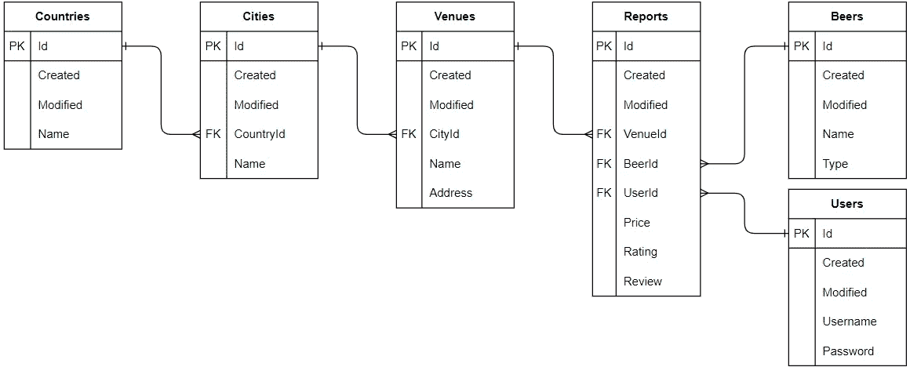
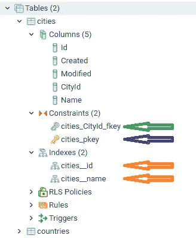
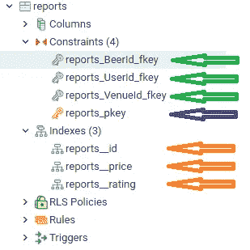

# 数据库的版本控制第 2 部分:表关系的迁移和种子

> 原文：<https://towardsdatascience.com/version-control-your-database-part-2-migrations-and-seeds-for-table-relations-d4fb185d95d8?source=collection_archive---------29----------------------->

## 如果你喜欢啤酒、效率或建模高性能数据库，请阅读本文


我们数据库中的所有表格都整齐地链接在一起，并植入了数据(图片由[克林特·王茂林](https://unsplash.com/@clintadair)在 [Unsplash](https://unsplash.com/photos/BW0vK-FA3eg) 上提供)

在[的上一部分](https://mikehuls.medium.com/version-control-your-database-part-1-creating-migrations-and-seeding-992d86c90170)中，我们已经设置了迁移工具，对其进行了配置，创建了一些迁移，甚至在新迁移的表中植入了一些数据。如果你不知道我在说什么，请查看这篇文章。在这一部分中，我们将着重于向表中添加更多的功能。您可以在这里找到我们将在本文[中构建的库。当您阅读完这一部分后，您将能够:](https://github.com/mike-huls/beersnobv2)

*   在事务内迁移
*   创建表之间的关联
*   设置具有类型和约束的列
*   在新创建的数据库中植入数据
*   只需按一下按钮，就能建立一个功能齐全的专业数据库，给别人留下深刻印象

# 0.目标和准备

我们的目标是为一个名为 BeerSnob 的网站创建一个数据库结构；一个专门为喝优质啤酒的人建立的网站。它允许用户分享关于他们在特定场所喝的啤酒的评论；在提供价格和口味信息的同时，对场地和啤酒进行评级。为了实现我们的目标，我们必须有一个可以存储以下信息的数据库:

*   用户(撰写评论的人)
*   啤酒(名称、类型)
*   国家、城市和比赛场地(出售啤酒的地方)
*   报告:一个用户在某个地方写一些关于啤酒的信息(比如价格、评级和评论)

报告是我们设计中最重要的部分。查看下面的概述，在一个漂亮的数据库模型中捕获这些需求:



BeerSnobs 数据库模型图

如你所见，我们将国家、城市和地点分别放在不同的表格中，这可能有点过分。目前我们并不真的需要它，但如果说这些年来我学到了什么，那就是需求很少保持不变。在未来，我们希望增加可能需要这样设置的功能。以这种方式构建我们的表，我们保证了未来发展的灵活性。

从这个结构来看，报告似乎是最重要的表；它指定了由用户给出的某个地点的啤酒的价格、等级和评论。这是用户在网站上将寻找的东西！

# 1.设置

我们将在前面的[部分](https://mikehuls.medium.com/version-control-your-database-part-1-creating-migrations-and-seeding-992d86c90170)中编写的代码的基础上进一步构建。如您所知，我们已经创建了 2 个迁移:

1.  创建一个名为“app”的模式
2.  在“app”模式中创建一个名为“countries”的表

如果你想继续编码，从[这里](https://github.com/Muls/beersnob)拉出代码。

# 2.添加用户和啤酒表

我们将以创建国家表的相同方式创建用户和啤酒。为了防止这篇文章变得太长，我将跳过重复。检查这个库中[的代码。](https://github.com/mike-huls/BeerSnobV3)

# 3.为具有外键的表创建到另一个表的迁移

我们已经定义了相当多的表。现在让我们开始将表连接在一起。首先我们将讨论为什么我们应该使用外键，然后我们将创建一个实现外键的迁移。


让我们将这些表格链接在一起(图片由 [Travis Saylor](https://www.pexels.com/@travis-saylor-271738) 在[像素](https://www.pexels.com/photo/cyclone-fence-in-shallow-photography-951408/)上拍摄)

## 为什么要使用外键？

外键子表中的列到父表中的主键。在我们的例子中，我们将把城市表中的 CountryId 列连接到国家表中的 Id 列。外键对于保持数据库的整洁和快速非常方便。他们通过防止不正确的输入来做到这一点(不能输入不存在 countryId 的城市)。它还使您能够控制当父表中的引用值被更新或删除时将采取的操作。如果一个国家被删除，外键可以确保属于被删除国家的所有城市也被删除。

## 创建迁移

现在让我们开始创建一个通过外键将两个表链接在一起的迁移；城市餐桌。首先，我们将使用 `npx sequelize-cli migration:create --name create_city`生成一个新的迁移。我们将如下定义迁移:

这段代码中有几件有趣的事情:

1.  我们用引用创建 CityId。我们将在第 1 部分中定义的 tableModel_countries 表中的 Id 列作为目标。这将创建一个外键。
2.  我们设置了一些列默认值(新日期()用于创建和修改)。当你没有传递一个值时，它默认为这里设置的值。
3.  我们在 Id 和 Name 列上创建 come 索引
4.  我们在一个事务中完成所有这些。例如，如果添加索引失败，它也会回滚到创建表。这样我们保证要么一切都失败，要么一切都成功。点击了解更多交易信息[。](https://mikehuls.medium.com/sql-rolling-back-statements-with-transactions-81937811e7a7)



我们新做的 PK，FK 和指数

在这次迁移中，我们创建了包含 5 列的城市表，一个主键(蓝色箭头)，一个外键(绿色箭头)和两个索引(橙色箭头)。记住，迁移是独立于数据库的；这是非常强大的东西！

# 4.添加场馆表

这与城市表非常相似。查看[库](https://github.com/mike-huls/BeerSnobV3)中的代码以了解细节。

# 5.添加报告表

这是一切汇集的地方；我们必须真正注意这里！我们必须创建一个表，其中的外键指向另外 3 个表。让我们开始吧:



更有 PK，FK 和指数

如您所见，我们已经成功地创建了带有**绿色**外键、**蓝色**主键和**橙色索引的表。**

# 6.删除/添加列

迁移不仅在设置表时很重要；它们也可以在数据库生产时使用。在 BeerSnob 中，我们希望进行迁移，从“countries”表中删除“Capital”列。这无关紧要。在下面的迁移中，我们定义了如何进行和撤消:

```
'use strict';
let tableModel = { schema: 'app', tableName: 'countries' };
module.exports = {
  up: async (queryInterface, Sequelize) => {
    await queryInterface.removeColumn(tableModel, 'Capital')
},
down: async (queryInterface, Sequelize) => {
    await queryInterface.addColumn(tableModel, 'Capital', {
     allowNull: true, type: Sequelize.STRING });
 }
};
```

在迁移中，您可以看到 queryInterface 是如何删除和添加列的。

# 7.使用我们的模型→播种一些数据

我们创建了表，设置了外键，完成了索引；我们的数据库模型创建完成了！让我们插入一些数据，这样我们就可以检查是否一切正常。


播种会将一些默认数据放入我们的数据库中，如管理帐户(图片由 [Binyamin Mellish](https://www.pexels.com/@binyaminmellish) 在 [Pexels](https://www.pexels.com/photo/man-planting-plant-169523/) 上提供)

## 处理用户数据

用户将向我们发送一个包，其中包含一个或多个(或很多，如果他有一个良好的夜晚)报告。每个报告都链接到用户配置文件(用户表)、啤酒表中的特定记录和地点。在网站和数据库之间将有一个 API 来处理数据包。如果用户报告一种尚不存在的啤酒，那么 API 应该首先在 Beers 表中创建一条记录，并在将记录写入报告时使用新创建的啤酒的 Id 列。在[这篇文章](https://mikehuls.medium.com/build-a-real-life-professional-api-with-an-orm-part-1-8fce4d480d59)中，我们将研究 API 是如何做到这一点的。现在我们用种子来模拟它。

## 插入种子数据

首先，我们将为所有的表插入一条记录。我不会在本文中详细讨论每一个种子，但是你可以在这里的库[中查看它们。我将在下面提供一个例子，说明我是如何植入报表的，这是我们最重要的表。首次运行`npx sequelize-cli seed:create --name seed_reports`。迁移编码如下:](https://github.com/mike-huls/beersnobv2/tree/main/seeders)

相当简单！唯一困难的是获得正确的 VenueId、BeerId 和 UserID，但这是 API 的工作。在这篇文章中我们不要担心它。

## 实践中的外键

查看`app.reports`表；您将看到我们在种子文件中定义的三条记录。想象一下当一个场馆关闭时。我们不能对不存在的场馆进行报道！这就是外键的用武之地。请记住，父表中的记录链接到子表中的相关记录。因为我们已经删除了[onDelete: CASCADE]，所以删除 Venues 表中的记录会导致删除 reports 表中的相关记录。通过执行`DELETE FROM app.venues WHERE “Id” = 2;`来尝试一下，然后再次检查报告表！

# 结论

在本文中，我们在第一部分的基础上构建。我们对它进行了大量升级，增加了一组完美的链接表，包括索引、主键、默认值和其他约束。我们已经走了很长的路，但更多的升级等待着我们。查看[这篇文章](https://mikehuls.medium.com/build-a-real-life-professional-api-with-an-orm-part-1-8fce4d480d59)，了解我们如何通过构建一个与数据库通信的 API 来允许访问数据库数据，而无需编写一行 SQL！[关注我](http://mikehuls.medium.com)了解更多改进。

—迈克

附注:在 https://github.com/mike-huls/beersnobv2 查看完整的项目

页（page 的缩写）又及:比如我正在做的事？[跟我来](https://mikehuls.medium.com/)！