# 使用 Google Drive 对大型数据集进行版本控制

> 原文：<https://towardsdatascience.com/version-control-your-large-datasets-using-google-drive-dd42211ab740?source=collection_archive---------24----------------------->

## 使可再现的数据集成为可能


照片由[大卫·普帕扎](https://unsplash.com/@dav420?utm_source=medium&utm_medium=referral)在 [Unsplash](https://unsplash.com?utm_source=medium&utm_medium=referral) 上拍摄

MLOps 最近在机器学习社区获得了一些关注。有了这么多的实验，跟踪、管理和协调它们与其他组件已经成为最近讨论的一个重要主题。特别是，当你尝试你的实验时，数据集一直在变化。您可能正在进行缩放、创建新要素、消除要素或只是对整个数据集进行采样。像`data_feat1.csv`、`data_scaling.csv`、 `data_v2.csv`等命名约定。对于最初的几个实验来说是可以的，但是当你扩大实验规模的时候就很痛苦了。

所以，我想我们可以使用 git 来控制数据集的版本。但是 git 不允许存储大于 100 MB 的数据或者对数据进行版本控制。例如，这里我只是将一个非常著名的`MNIST`数据集用于版本控制。

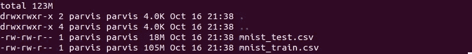

图片来自作者

```
git add *
git commit -m "Adding files"
git push -u origin master
```

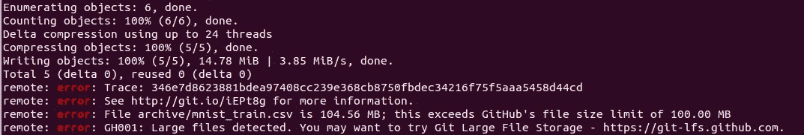

从上面的截图可以看出，git 不接受大于 100 MB 的文件直接推送。我遇到了两个可供尝试的选择:

1.  使用 Git 大文件存储(建议在输出终端使用)
2.  使用 DVC 进行数据集的版本控制。

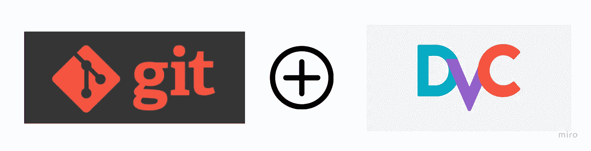

作者创建的图像

我没有使用 Git LFS(大文件存储),因为当使用版本控制系统如 DVC 来跟踪你的模型、度量等时。把所有东西都放在一个系统下会变得更容易。DVC 提供了几个选项来存储数据集，如亚马逊 S3、Azure Blob 存储，但我最喜欢的是 Google Drive。DVC 设计的系统，整个过程是无缝集成，一旦你开始使用 DVC。以下是说明如何做到这一点的步骤:

## 步骤 1:初始化存储库:

在您当前拥有数据集的本地目录/位置中初始化 git 和 DVC。转到终端，键入以下内容:

```
$ git init
$ dvc init
```

注意:`dvc init`需要输入准确的位置。git 文件已定位。请确保这一点，否则您的`dvc`将无法识别 git 文件。这里我们将尝试初始化大约 105 MB 的训练数据。

## 步骤 2:暂存要提交的文件:

```
$ dvc add *
$ ls -alh
```

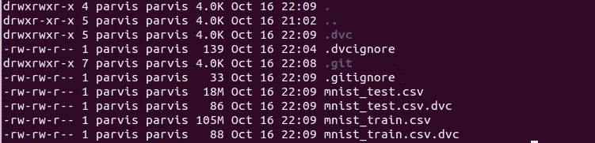

您将看到创建了一个名为`train.csv.dvc`的新文件，使用以下代码将新文件提交给 git:

```
$ git add .gitignore train.csv.dvc
$ git commit -m "Adding training data"
```

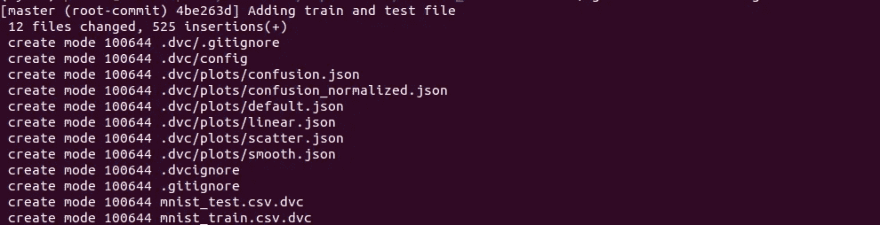

如果您看到这个`.dvc`文件的内容，您会看到 md5 和 path，这是一个链接到数据的元文件，可用于跟踪数据。

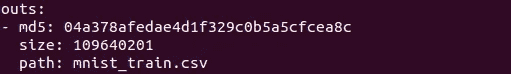

在这里，提交是在本地完成的。然而，这些文件还没有被推送或存储到任何地方(这里是 google drive)。

## 第三步:将文件推送到谷歌硬盘:

下一步是定义要存储文件的存储位置。您可以使用以下代码来完成该操作:

```
$ dvc remote add -d storage gdrive://auth_code_folder_location
```

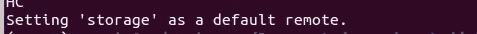

接下来是 git 提交，使用:

```
git commit .dvc/config -m "Config remote storage"
```

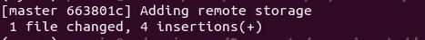

您可以使用以下方式将数据推送到存储位置:

```
dvc push
```

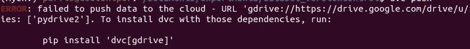

作者形象

如果您没有安装软件包`pydrive2`，可能会出现上述错误。

```
pip install pydrive2
```


点击链接并验证它是否提供了访问 DVC 的权限，以将文件推送到谷歌存储。一旦您允许，它将提供一个需要输入终端的验证码，如下所示:


一旦你输入代码，你会看到文件被推送到谷歌驱动器。

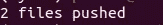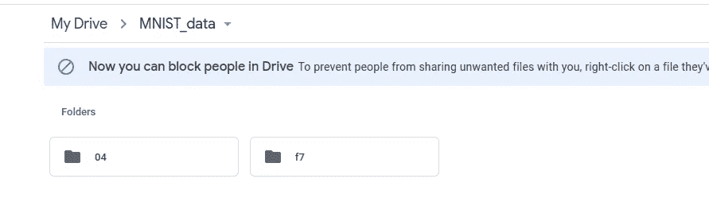

作者创造的形象

## 第 4 步:将您的元信息推送到 Github:

现在所有的跟踪信息都在本地 git repo 中进行版本控制。你可以把这些都推给你的 Github 回购计划。您可以在终端中执行以下步骤:

```
$ git remote add origin <your repo>
$ git push -f origin master
```

您应该可以在 github 上看到所有的变化:

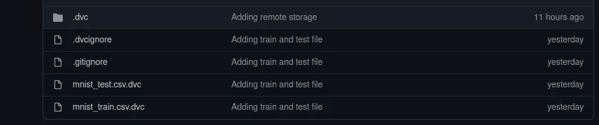

现在让我们说，如果你想从其他地方/电脑访问数据，你需要安装 DVC，你可以按照下面的步骤在本地下载数据。

首先要检查数据是否存在，您只需输入以下内容:

```
dvc list <your repo>
```

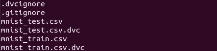

作者的形象

但是在下载数据之前，您需要克隆存储库。您可以执行以下操作:

```
git clone <your repo>
```

克隆回购后，可以进行`git pull`。它将提示一个 url，需要像以前一样进行验证。请参见下面的截图:

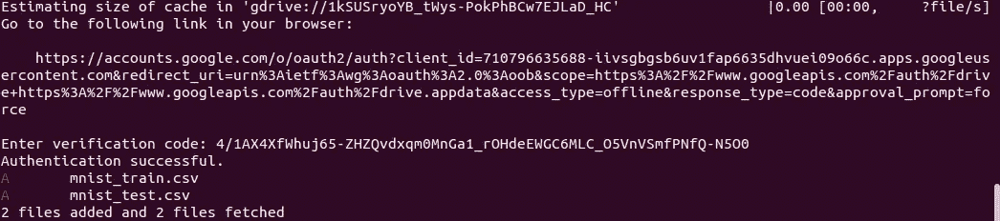

最后，您会看到文件被下载到您的本地计算机上！瞧。！

感谢您抽出时间阅读本文。我希望你喜欢这个内容，并对你有所帮助。请随意发表评论，提出任何建议/想法。

> *跟我上* [*Twitter*](https://twitter.com/pratikkgandhi) 或*[*LinkedIn*](https://www.linkedin.com/in/pratikkgandhi/)*。你也可以通过 pratikkgandhi@gmail.com 联系我**

**如您想成为* [*中型会员*](https://pratikkgandhi.medium.com/membership) *并无限享受阅读文章的乐趣，请注册会员。Medium 将与我分享使用上述链接注册的任何成员的一部分！谢谢。**