# 振动数据及其分析技巧

> 原文：<https://towardsdatascience.com/vibration-data-and-a-few-techniques-to-analyze-it-549f311cd1e9?source=collection_archive---------17----------------------->

## **振动信号和几种有前途的时频分析技术**

# 什么是振动信号？

振动是一种机械事件，其中围绕一个平衡点发生振荡，携带这些振荡信息的时间序列称为振动信号。这些来自平衡点的振荡需要以高采样率获得。振动信号通常可以用正弦波来表示，如下图所示，正弦波有几个重要的特性，在分析时应该记住(如下所述)。

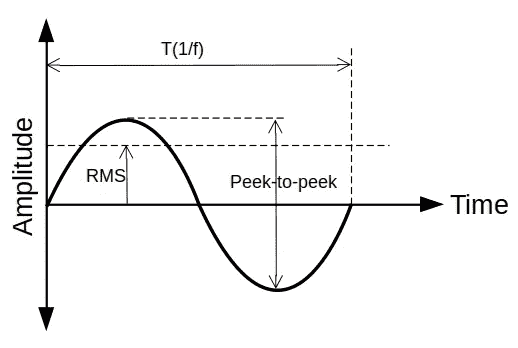

“作者提供的图像”

*   ***振幅或峰值:*** 提供了冲击事件的细节，但它不考虑持续时间，因而也不考虑事件中的能量。
*   ***峰峰值:*** 提供波的最大偏移，这在查看位移信息时很有用
*   ***RMS* (均方根)**:最有用，因为它与振动信号的能量含量直接相关，并因此与振动的破坏能力相关，因为它考虑了波形的时间历程。

振动信号大多是非线性、非平稳的，对非平稳信号进行分析是一项具有挑战性的任务。

# 什么是平稳和非平稳信号？

**稳定的**信号可以由具有恒定时间周期的正弦波表示，而**非稳定的**信号将具有具有变化时间周期的正弦波。或者换句话说，如果信号的频率或频谱内容不随时间变化，我们可以称之为平稳信号，因为非平稳信号的频率随时间变化。下图给出了平稳和非平稳信号的一个例子，以及它们的频率分布。

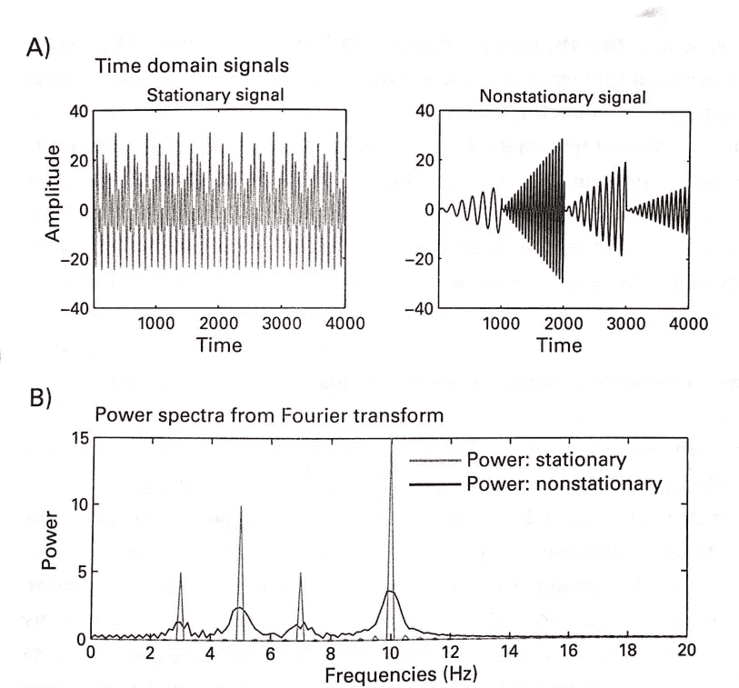

平稳和非平稳信号及其功率谱示例[ref-1]

# 分析振动信号的技巧有哪些？

# 经验模式分解

EMD 是一种自适应方法，它将非线性和非平稳信号分解成几个固有模态函数(IMF)和一个残差。EMD 算法基于筛选过程，当残差保持为常数、单调斜率或只有一个极值的函数时，筛选过程结束。

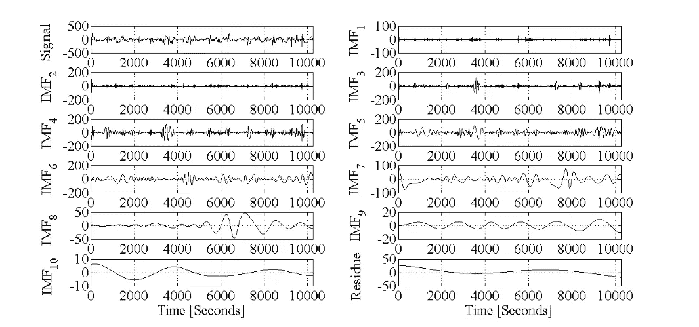

一个“信号”分解成 10 个“IMF”和“残余”。[参考文献 2](“作者研究论文图片”)

# 基于希尔伯特-黄变换和经验模态分解的特定频带分离

经验模态分解(EMD)可以将振动信号 S[n]分解成窄带 IMF。每个 IMF 都满足两个基本条件:

*   数据中极值的计数和零交叉的计数必须相同，或者允许相差最大一个，以及
*   根据它们的定义，从局部最大值和局部最小值获得的包络的平均值在瞬间为零。

将振动信号分解成窄带后，对 IMFs 进行希尔伯特变换，提取瞬时频率。例如，下图显示了振动信号的五个基于频率范围的频带，它们是在瞬时频率的帮助下从 EMD 分解的振动信号中分离出来的，瞬时频率是使用 HT 从每个 IMF 中提取的，HT 为每个样本确定一个频率值。

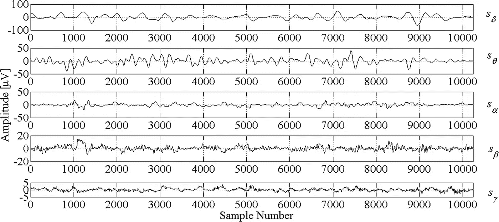

频率范围内振动信号的五个频段，(I)delta:0–4Hz，(II)theta:4–8Hz，(III)alpha:8–13Hz，(IV)beta:13–30Hz 和(V)gamma:30–60Hz[参考文献 3](“作者研究论文的图像”)

利用上述方法，可以提取振动信号的多种节律，这对各个方面都有帮助。

对振动信号进行时频分析的几种常用方法如下:

1.  短时傅立叶变换(STFT)
2.  小波变换(连续/离散小波变换)
3.  斯托克韦尔变换
4.  维格纳-维尔分布(WVD)
5.  平滑伪维格纳-维尔分布

我们将通过一个非常简单的振动信号(包含低频和高频)示例来理解它们的时频表示，如下图所示。

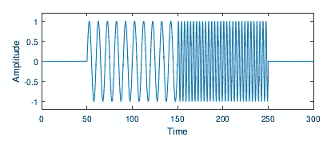

具有两种不同频率的人工振动信号【参考文献 4】。

现在，让我们用各种方法来看看给定信号的时频表示(TFR)。

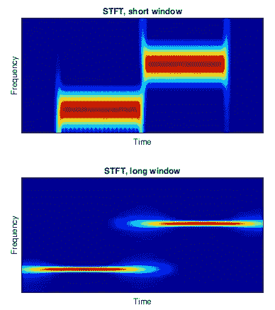

给定信号在短窗和长窗下的短时傅里叶变换[ref-4]。

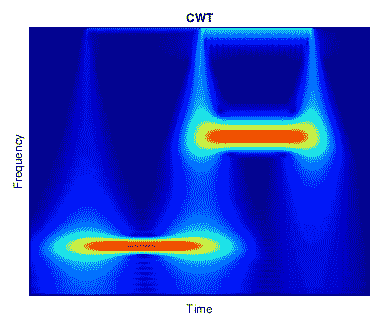

给定信号的连续小波变换[ref-4]。

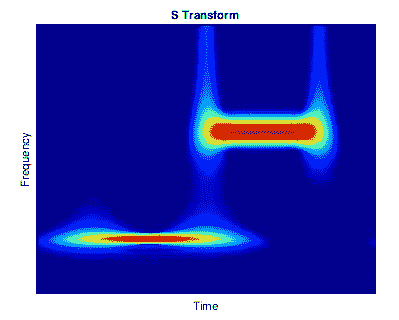

给定信号的 ST[ref-4]。

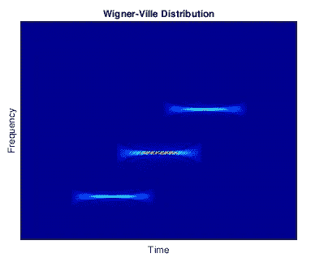

使用 WVD 对给定信号进行 TFR，我们可以注意到交叉项伪像以高幅度出现【参考文献 4】。

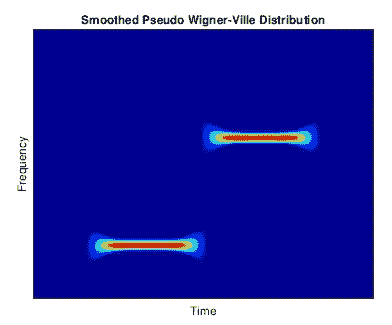

使用 SPWVD 计算给定信号的 TFR，我们在这里看不到交叉项伪像[ref-4]。

这里，变换的目的是可视地呈现有区别的时间和频率特征；因此，只显示了幅度。通过这个博客，人们可以了解如何从各种方法计算的频谱有区别地提出一个振动信号。技术的选择取决于信号特性和/或结果的进一步使用或后续处理。重要的方面是期望的时间和频率分辨率以及伪影的耐受性。例如，如果我们想要检测交叉项伪像，我们应该考虑 WVD，而忽略伪像 SPWVD 是更好的选择。

选择方法的另一个例子是上图(具有短窗口和长窗口的 STFT)包含短窗口和长窗口的频谱图，其中我们分别看到频率的高分辨率和低分辨率。根据应用，我们可以选择窗口大小。然而，随着高分辨率频率的增加，时间分辨率降低。同时，我们不能同时具有高分辨率，但是窗口大小允许我们在时间和频率分辨率之间进行权衡，并且可以根据要求优化窗口大小。

关于本博客中包含的方法，有以下几点，可能有助于根据需求选择合适的方法。

*   STFT——易于解读；使用快速傅立叶变换的快速实现:但是有限且固定的分辨率
*   WT —分辨率不固定；分辨率取决于频率(多尺度属性)；通常，较低频率分量具有更令人满意的频率分辨率和更粗糙的时间分辨率，而较高频率则相反
*   ST —倾向于强调更高频率的内容。
*   WVD——克服了分辨率有限(计算每个时间步长的频率内容)、强伪像、实施速度慢的问题

下面给出了变换分辨率的示意图，包括用于比较的时域表示和标准傅立叶频谱。

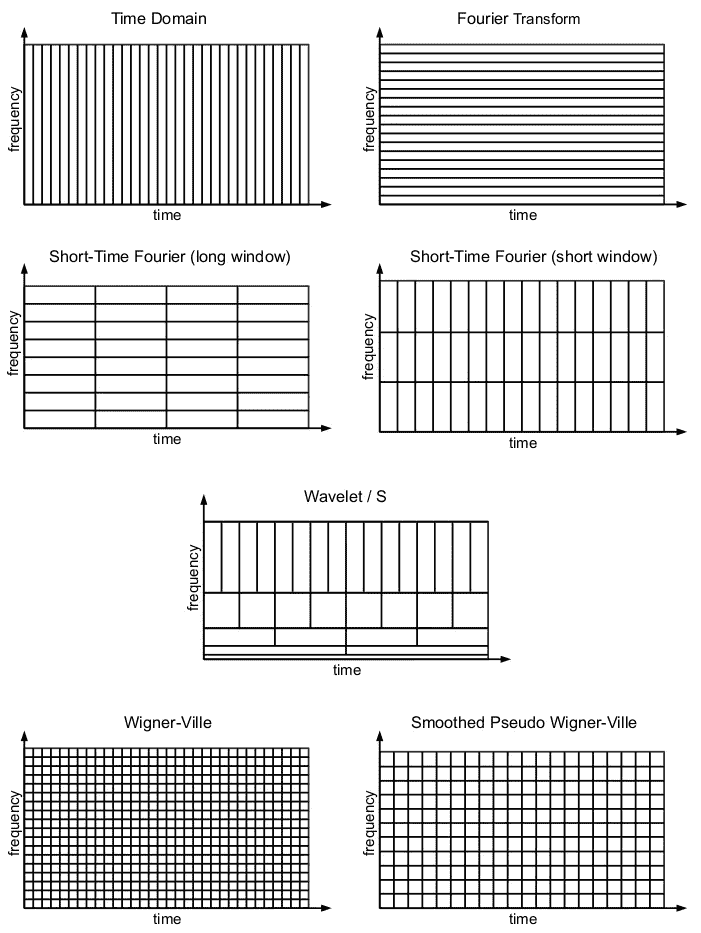

[参考文献 4]

本博客简要介绍了振动信号及其重要特征。在博客的后面，我们将讨论时间序列的平稳和非平稳属性。我们还讨论了几种流行的用于振动信号分析的时频分析技术。在博客的最后，我们将讨论这些技术的优缺点，以及如何选择振动信号分析技术。

**参考文献**

1.  普恩特·吉伦出版社，2016 年。*根据驾驶行为预测困倦*(利兹大学博士论文)。
2.  Rai，k .，Bajaj，v .和 Kumar，a .，2015 年。用于病灶和非病灶脑电信号分类的特征提取。在*信息科学与应用*(第 599–605 页)。斯普林格，柏林，海德堡。
3.  Bajaj，v .，Rai，k .，Kumar，a .，Sharma，d .，Singh，G.K .，2017 年。基于节律特征的局灶性和非局灶性脑电信号分类。 *IET 信号处理*， *11* (6)，第 743–748 页。
4.  学校，s . 2021。傅立叶、Gabor、Morlet 或 Wigner:时频变换的比较。 *arXiv 预印本 arXiv:2101.06707* 。