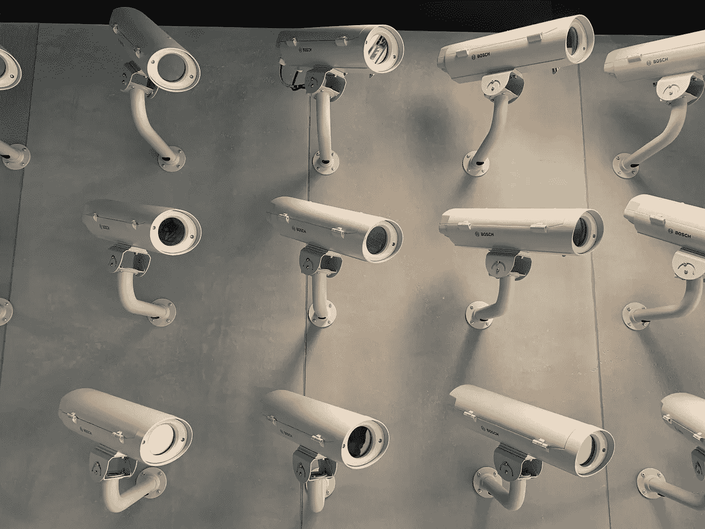
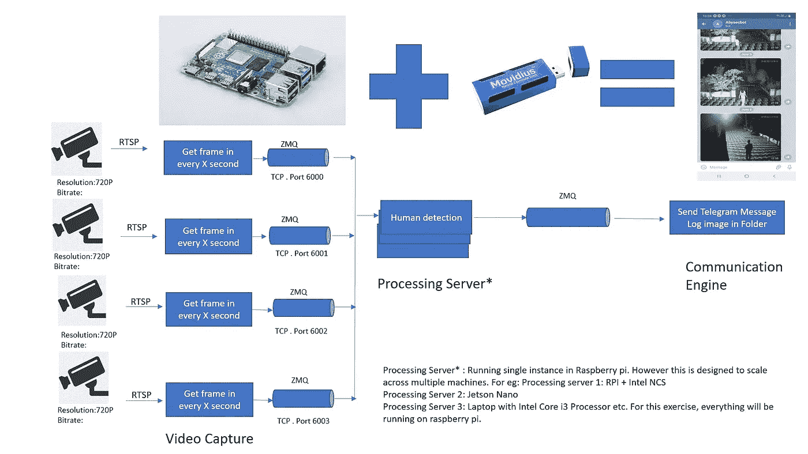
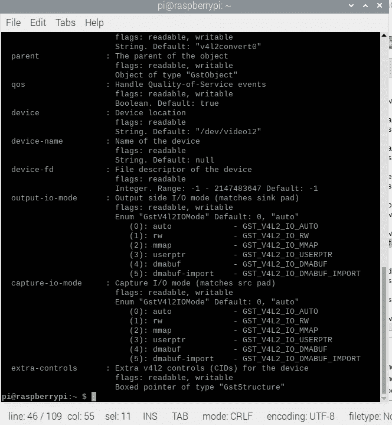
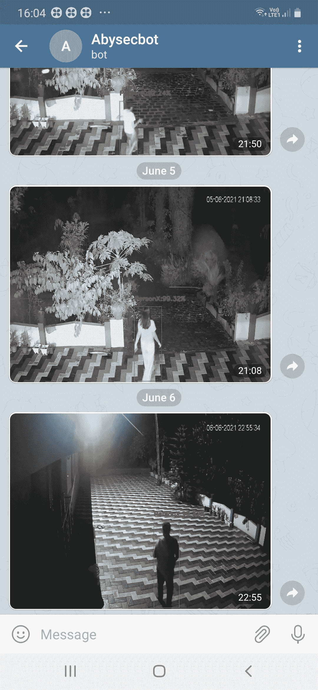
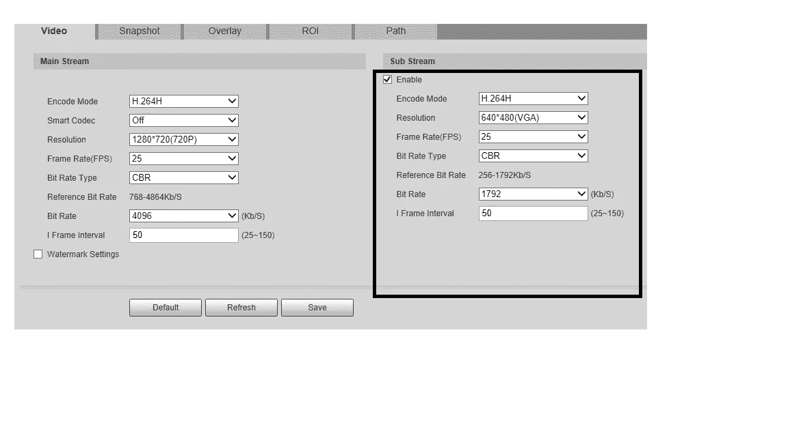
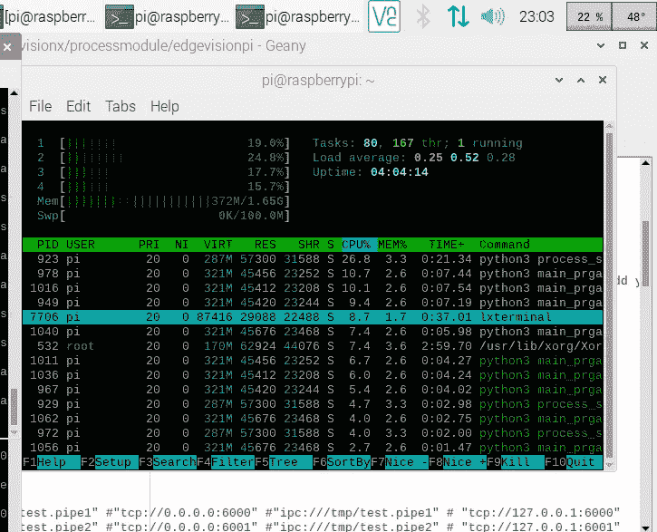

# 边缘视频分析

> 原文：<https://towardsdatascience.com/video-analytics-at-the-edge-1c1e05c5fd5a?source=collection_archive---------20----------------------->

## 使用 Raspberry PI 和英特尔 NCS 从 CCTV IP 摄像机中检测人体



尼克·洛格在 [Unsplash](https://unsplash.com/s/photos/cctv-camera?utm_source=unsplash&utm_medium=referral&utm_content=creditCopyText) 上的照片

我最近在家里安装了闭路电视系统。它由 4 台 IP 摄像机组成。我希望他们更聪明一点。不要总是看闭路电视录像，如果任何一个摄像机检测到有人，最好能得到通知。这真是一个很酷的东西。我想，如果任何一台摄像机检测到运动，我能在电报中得到一个警报，那就太好了。虽然我开始只是为了好玩，但我学到了很多。从根本上说，它无需云就能在边缘实现视频分析。我在这里分享我的学习，并渴望向你学习，如果有优化的方法。

# 目标

我有 4 个不同的 IP 摄像头，可以以 25FPS 的速度播放 720P 的视频。我有一个闲置的树莓派，还有一个英特尔 Movidius 神经计算棒(即第一代 NCS)。我希望 Raspberry PI 和 NCS 执行人体检测，并在摄像头检测到人体时向我发送电报通知。在构建过程中，我认为有几件事非常重要，它们是

1.我应该能够几乎 24/7 运行应用程序，这意味着代码应该是高效的。CPU 利用率必须尽可能低，以便 PI 的温度得到控制。

2.我应该会立刻收到通知。最优先考虑的是，一旦发生，人的检测应该尽快完成。

3.通知应该包含一个图像，以便我可以理解警报的上下文(是谁的人)。

让我提前告诉你，第 1、2 项比我想象的要难多了。

# 项目开始:

我认为这是一个简单的任务，假设 Raspberry pi 可以从每个摄像机获得视频帧，NCS 可以执行人体检测。然而，这并不容易。

像往常一样，我从普通的 OpenCV 代码开始，在一台摄像机上读取视频 RTSP 流，看看它是如何工作的。

```
cap = cv2.VideoCapture(“RTSP URL of the IP Camera”)

while(True):

    ret, frame = cap.read()

    cv2.imshow('frame',frame)

    if cv2.waitKey(1) & 0xFF == ord('q'):

        break

cap.release()

cv2.destroyAllWindows()
```

然而，很少有事情不像我预期的那样。首先也是最重要的，在实时获取帧时有巨大的延迟。也就是说，即使没有处理(人工检测),也会有大约 5 到 10 秒的延迟，在某些情况下，在运行应用程序的几分钟内，延迟会达到 40 秒。CPU 利用率立即达到 100%。在这一点上，我意识到这比我想象的要复杂得多。所以，我不得不从头开始，看看解决这个问题的最好方法是什么。

在我的分析过程中，我观察到这种解决方案不需要处理来自相机的每一帧。我们绝对不需要分析一秒钟内产生的 25 帧。这是我在设计中使用的主要原则之一，我提出了以下设计。什么参数将帮助我们定义系统可以处理的帧数将在后面讨论。

# 设计



作者图片

正如你可能注意到的，这个想法是在每 X 秒钟内从每个摄像机捕捉 N 个帧。这并不是使系统有效运行的唯一原因。该解决方案利用了 Raspberry pi 中可用的硬件加速，因此 CPU 使用率非常低。这将在我描述 GStreamer 时详细介绍。帧数和持续时间可变的原因是，它完全基于用于处理帧的硬件的处理能力。据我所知，第一版英特尔 NCS 能够执行的推理数量较少。正如您所想象的，该图清楚地显示了处理引擎中的瓶颈，因为它必须处理所有的帧。由于我计划利用现有的英特尔 NCS，我必须根据 NCS 的能力调整这些参数。

作为一个起点，我决定在每一秒钟内从每一台摄像机中捕捉一帧。这在我看来是有道理的。因为对于一个人来说，在不到一秒的时间内通过摄像机的观察区域实际上是不可能的。然而，处理引擎有可能无法检测到对象，但这是一个单独的主题，我们将在后面讨论。

我意识到，当我使用 OpenCV 时，很难指定我想要捕捉的帧数/秒。因此，探索并发现可能有两种方法来解决这个问题。一个是 GStreamer，另一个是 FFMPG。所以我决定进一步探索第一个选项 GStreamer。

我发现 GStreamer 非常强大，但由于缺乏文档/示例，它非常复杂。所以我开始在 youtube 上探索一些教程，我发现它们非常有用。我在参考资料部分提到了帮助我学习 GStreamer 的链接。我相信这对你也会有帮助。

# 安装和设置

这个实验的源代码可以在这里找到:

[](https://github.com/abypaulvarghese56/Edgevisionpi) [## abypaulvarghese56/Edgevisionpi

### 在 Raspberry PI 4 中从 4 个不同的 IP 摄像机捕获 RTSP 流，并使用英特尔 NCS 执行人体检测。它…

github.com](https://github.com/abypaulvarghese56/Edgevisionpi) 

我的第一步是在 Raspberry PI 中安装 GStreamer。这是相当直接的。

```
sudo apt-get install gstreamer1.0-tools
```

下一步是为 raspberry PI 安装英特尔 OpenVino toolkit。这是必要的，因为处理引擎是英特尔 NCS。我必须安装一个支持英特尔 NCS 的 OpenVINO 版本，因为最新版本的 OpenVINO 只支持英特尔 NCS 2。请点击下面的链接，并根据您拥有的 NCS 安装 OpenVINO。

 [## 为 Raspbian* OS 安装 OpenVINO 工具包- OpenVINO 工具包

### 注意:这些步骤适用于 32 位 Raspbian*操作系统，这是 Raspberry Pi*主板的官方操作系统。这些步骤已经…

docs.openvinotoolkit.org](https://docs.openvinotoolkit.org/latest/openvino_docs_install_guides_installing_openvino_raspbian.html) 

其他库包括:

```
pip install telepot
pip install viztracer

sudo apt-get install pkg-config libcairo2-dev gcc python3-dev libgirepository1.0-dev
sudo apt-get install python3-gi

pip install gobject PyGObject
```

下一步是创建 GStreamer 管道。正如我前面提到的，它是非常强大的工具。Gstreamer 通过使用管道来配置，管道是一系列命令，指定从哪里获取视频，如何处理和编码视频，然后将视频发送到哪里。

让我们看看我创建的管道。

```
pipelinestring = "rtspsrc location={0} name=m_rtspsrc ! rtph264depay ! h264parse ! v4l2h264dec capture-io-mode=4 ! video/x-raw ! v4l2convert output-io-mode=5 capture-io-mode=4    ! video/x-raw, format=(string)BGR, width=(int)640, height=(int)480 ! videorate ! video/x-raw,framerate=1/1 ! appsink name=m_appsink sync=false"
```

让我们看看每个元素的用途。

RTSP src location = { 0 }-该位置是摄像机流的 RTSP url。

**rtph264depay** —从 RTP 包中提取 H264 视频。

**v4l 2h 264 dec**——这个很有意思。这告诉 Raspberry PI 使用 GPU 解码 H264。请记住，有一个替代方案是使用 CPU 来解码。是 avdec_h264。如果我们试图只从一个摄像头解码，使用 avdec_h264 可能会有效。然而，因为我们的目标是从 4 个摄像头捕捉，所以将它卸载到 GPU 是非常必要的。

让我们看看参数，



> 将视频解码卸载到 GPU 是我们实现最小化 CPU 使用的目标的关键一步。

**v4l2convert** —这是让系统知道使用 GPU 而不是 CPU 来转换帧。有一个相当于视频转换 CPU。这又是一个 CPU 密集型过程，所以我们应该使用 v4l2convert 来利用 Raspberry PI 提供的硬件加速。我们在这里做一些转换，他们是

将源格式转换为 BGR 格式。帧尺寸缩小到 640x480(从原来的 720P)。v4l2convert 的文档显示，有一个选项可以使用 v4l2convert 本身来控制帧速率。然而，我不能让它工作。请让我知道，如果你们中的任何人让它工作，我会很高兴听到。我不得不使用另一个 videorate 来控制帧速率，因为我无法让 v4l2convert 控制帧速率。

这将帮助我们控制我们想要在应用程序中捕获的帧速率。在我们的例子中，我们希望从摄像机中每秒只捕捉一帧。所以会是 framerate="1/1 "。假设我们只想在两秒钟内捕捉一帧，那么帧速率将是“1/2”。如果我们想在一秒钟内捕捉 5 帧，帧速率将是“5/1”

现在的想法是使用多重处理运行视频捕获应用程序，以利用 Raspberry PI 的不同内核。主程序将为每个摄像机启动一个单独的进程。

其余的事情相当简单。一旦帧被捕获，它就被转换成 OpenCV 格式并被推入队列。目前这种转换是使用 python 代码完成的，请让我知道是否有办法在 GStreamer 管道中处理它。我假设会有，但我没有调查。据我所知，如果我们能够在 GStreamer 管道中处理它，它可以进一步减少 CPU 的使用。因为我们有 4 个不同的摄像机，所以会有 4 个不同的队列。队列使用 TCP 协议，因为如果我们希望这个系统在多个硬件上工作，这将有助于我们将来分配负载。也就是说，我们可以根据我们的需求扩展处理服务器，提高帧速率或捕捉间隔，或者添加更多的摄像头。也许我们会在下一个版本中针对分布式环境进行优化。

在 main_prgall.py(第 27 行)中，您需要输入您的流的 RTSP URL

```
self.camlink1 = 'rtsp://<username>:<password>@192.168.1.2:554/cam/realmonitor?channel=1&subtype=0&unicast=true&proto=Onvif' #Add your RTSP cam link
```

并根据您的环境添加其余的流 URL。

> 您可以从 OpenCV 使用 GStreamer 管道。Opencv 需要在 GStreamer 支持下构建。

**处理服务器**

这个想法非常简单，从队列(4 个队列)中抓取帧，并将其推送到英特尔 NCS。这里的队列使用发布/订阅模型工作。摄像机是酒馆，流程服务器是 SUB。如果 NCS 在一个帧中检测到一个人，我们将把这个帧移到另一个队列中。我使用的是英特尔型号 zoom 的个人检测零售 013 型号。该模型的详细信息可在此处找到:

[](https://docs.openvinotoolkit.org/2021.2/omz_models_intel_person_detection_retail_0013_description_person_detection_retail_0013.html) [## 人员检测零售-0013 - OpenVINO 工具包

### 这是一个用于零售场景的行人检测器。它基于类似 MobileNetV2 的主干网，包括…

docs.openvinotoolkit.org](https://docs.openvinotoolkit.org/2021.2/omz_models_intel_person_detection_retail_0013_description_person_detection_retail_0013.html) 

您应该使用与您的设备兼容的型号，这一点非常重要。如果您有 NCS2，那么您应该使用支持 NCS 2 的型号。这是一个可以在视频帧中检测出人的模型。它接受高度为 320、宽度为 544 的输入帧

**通信引擎**

这是一个非常简单的组件。它从队列中获取已处理的数据，并将图像存储到本地目录中。它还与电报机器人连接，并发送附有图像的通知。

> Bot 密钥和用户 ID 从源代码中删除。你必须插入你自己的电报机器人密钥和用户 ID

# **结果**



> 从图像中可以看出，这些帧几乎是实时处理的。在我的测试中，我发现所有的帧都能在不到 2 秒的时间内处理。(在不到 2 秒的时间内检测到运动)。电报机器人发送图像时可能会有轻微的延迟，但这是基于你的互联网连接。然而，我发现它在几乎所有的情况下都可以忽略不计。

**CPU 消耗**

CPU 消耗大约为 30–35 %,考虑到它每秒钟处理 4 个不同流的视频，这是可以接受的。下图显示了 raspberry pi 报告的 CPU 消耗和温度。

我发现了另一种降低 CPU 占用率的方法。这不在 python 脚本中，而是在 CCTV 本身中。大多数 IP 摄像机支持多个流。即一个主流(具有高质量分辨率和帧速率)和一个分辨率降低的子流(在我的例子中是 640x480)。以下截图显示了我的相机网络界面中的设置



下图显示了连接到子流时的 CPU 利用率和温度



> 您可能会注意到，整体 cpu 利用率在 16–22%之间，这似乎非常合理。由于繁重的工作是由 GPU 完成的，因此系统能够在不到 2 秒的时间内处理多个流，同时占用较少的 CPU 资源

# 结论

树莓派是一个很棒的平台。您将能够找到大量的库和支持。相对便宜又高效。英特尔 NCS 1 尽职尽责。很可能英特尔 NCS2 将能够执行更多的推理，因为它被宣传为在性能方面更好。我没有机会在 NCS 2 中测试这个应用程序，因为我没有机会。我真的很想听听你们中是否有人愿意在 NCS2 中测试脚本并报告性能。话虽如此，只是碰巧我的实验用到了 NCS1 和 Raspberry PI。从成本角度来看，如果你从零开始，这可能不是最好的平台。RPI 将花费大约 4K 印度卢比，NCS 花费我大约 8K 印度卢比。很好奇想知道 Nvidia 的 Jetson Nano 2GB 怎么样？它比 NCS2 有更好的性能，不需要像 PI 那样的另一个 SBC。费用在 5000 印度卢比左右。也许我会在下一次更新中提到它。

**参考文献**

https://github.com/sahilparekh/GStreamer-Python[——这是一个很棒的报告，展示了如何在 OpenCV 中获取 RTSP 流。我在我的项目中扩展了这个样本，这归功于各自的所有者。](https://github.com/sahilparekh/GStreamer-Python)

https://www.youtube.com/watch?v=HDY8pf-b1nA[—这是开始学习 GStreamer 的好地方。这真的帮助我了解了 GStreamer。](https://www.youtube.com/watch?v=HDY8pf-b1nA)

[http://life style transfer . com/how-to-use-gstreamer-app src-in-python/](http://lifestyletransfer.com/how-to-use-gstreamer-appsrc-in-python/)—这是学习高级 Gstreamer 概念的好地方。一组很好的工作示例和很好的解释。