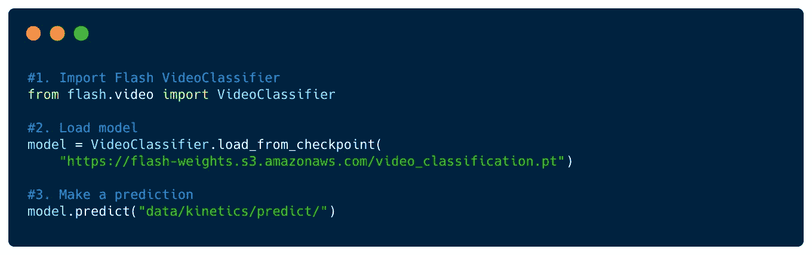

# 使用 PyTorch 理解视频

> 原文：<https://towardsdatascience.com/video-understanding-made-simple-with-pytorch-video-and-lightning-flash-c7d65583c37e?source=collection_archive---------28----------------------->

## 了解如何使用 PyTorch 视频和 Lightning Flash 通过 3 个简单的步骤推断自定义视频理解模型

沃尔玛最近开发了一个视频理解系统，可以检测新鲜食品的缺陷和腐败迹象。照片由来自 [Pexels](https://www.pexels.com/photo/booth-branding-business-buy-264636/?utm_content=attributionCopyText&utm_medium=referral&utm_source=pexels) 的 [Pixabay](https://www.pexels.com/@pixabay?utm_content=attributionCopyText&utm_medium=referral&utm_source=pexels) 拍摄

视频理解，自动化[广泛的商业用例](https://www.cio.com/article/3431138/ai-gets-the-picture-streamlining-business-processes-with-image-and-video-classification.html)，从零售到医疗保健到农业，它使计算机能够识别视频中的行为、对象和活动。

在其最新发布的版本中，[**Lightning Flash**](https://github.com/PyTorchLightning/lightning-flash)**使用[脸书 AI Research](https://ai.facebook.com/) 的新 [PyTorchVideo](https://pytorchvideo.org/) 由 Lightning 提供动力的库，为视频理解提供支持。**

** [## 手电筒光/闪电

### 阅读我们的发布博客 Pip/conda Pip install lightning-flash-U 其他安装 Pip from source pip 安装…

github.com](https://github.com/PyTorchLightning/lightning-flash) 

Flash 是一个用于快速原型制作、基线和微调可扩展深度学习任务的库。使用 Flash 进行视频理解使您能够根据自己的数据训练、微调和推断 PyTorch 视频模型，而不会被所有细节淹没。

一旦您获得了基线模型，您就可以无缝覆盖默认配置，并体验 PyTorch Lightning 的全部灵活性，从而在您的数据集上获得最先进的结果。

在这篇文章中，你将学习如何通过三个简单的步骤推断一个定制的视频分类模型。

# 3 个简单步骤中的视频理解

## 先决条件从 Github Main 安装 Flash

## 导入 Flash

首先，我们简单地从 flash.video 导入 VideoClassifer 任务。

## 步骤 2 加载预训练模型

然后我们加载我们想要推断的模型。

Flash 使训练自定义模型变得容易，要了解更多信息，请查看 Lightning 开发人员教程，了解如何通过 5 个简单步骤轻松微调视频理解模型。

 [## 快速训练第一个视频分类器的 5 个步骤

devblog.pytorchlightning.ai](https://devblog.pytorchlightning.ai/5-steps-to-training-your-first-video-classifier-in-a-flash-dd11d472fded) 

## 根据视频数据进行推断

然后，我们可以通过传递一个有效的路径来推断单个视频或视频目录的模型，如下所示。

## 把所有的放在一起

这样你就有了根据自己的数据推断视频理解模型所需的所有信息。为了方便起见，所有代码都在这里。

# 后续步骤

现在你知道了如何用 Flash 的三行代码推断出一个视频理解模型，你可以看看 Flash 使其他 7 个计算机视觉任务变得和视频理解一样简单。

1.  [多标签图像分类](https://lightning-flash.readthedocs.io/en/latest/reference/multi_label_classification.html)
2.  [图像嵌入](https://lightning-flash.readthedocs.io/en/latest/reference/image_embedder.html)
3.  [物体检测](https://lightning-flash.readthedocs.io/en/latest/reference/object_detection.html)
4.  [语义分割](https://lightning-flash.readthedocs.io/en/latest/reference/semantic_segmentation.html)
5.  [风格转移](https://lightning-flash.readthedocs.io/en/latest/reference/style_transfer.html)

新的任务一直在贡献，所以请留意更新。如果您有任何问题，欢迎在下面评论或通过 [Slack](https://join.slack.com/t/pytorch-lightning/shared_invite/zt-f6bl2l0l-JYMK3tbAgAmGRrlNr00f1A) 或 [Twitter](https://twitter.com/PyTorchLightnin) 与我们联系。

# 关于作者

[**亚伦(阿里)博恩施泰因**](https://www.linkedin.com/in/aaron-ari-bornstein-22aa7a77/) 是一名人工智能研究员，对历史充满热情，致力于新技术和计算医学。作为 Grid.ai 的开发者宣传负责人，他与机器学习社区合作，用改变游戏规则的技术解决现实世界的问题，然后将这些技术记录在案，开源，并与世界其他地方共享。**