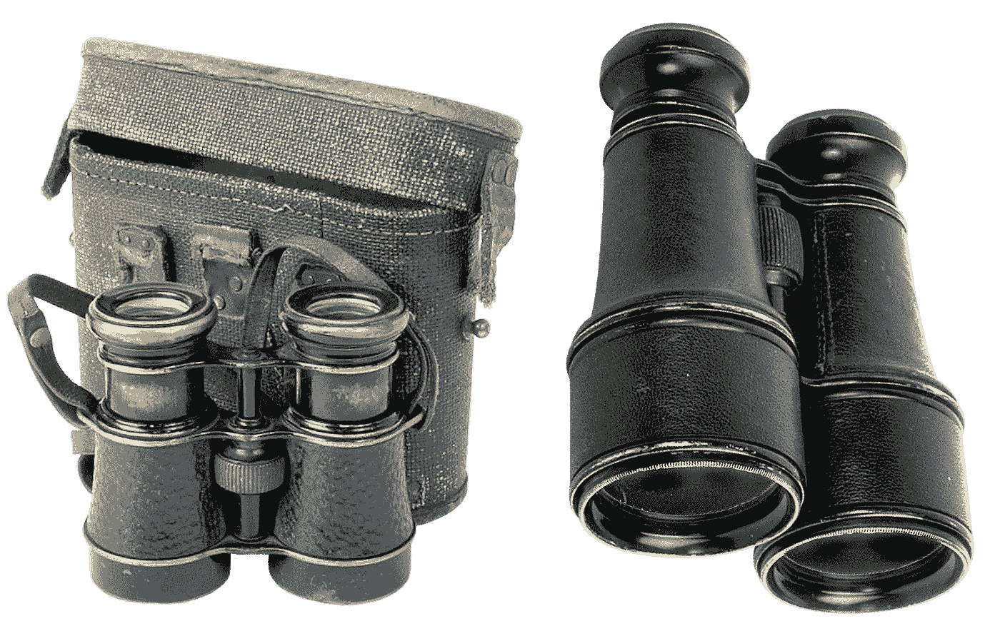

# SQL 中的视图:未充分利用，但非常有用

> 原文：<https://towardsdatascience.com/views-in-sql-underutilised-yet-very-useful-6895cf607456?source=collection_archive---------18----------------------->

## 视图如何帮助跨 SQL 数据库的分析



来源:图片来自 [Pixabay](https://pixabay.com/photos/binoculars-field-military-optics-1741047/)

**视图**是 SQL 中的虚拟表，其功能类似于标准表，但不需要物理存储，即它只存储在内存中，不占用实际存储空间。

例如，经常会有人希望看到表中数据的子集，或者以某种方式组织的数据。

但是，如果只是为了便于理解数据，那么将数据存储在一个表中可能效率很低，因为这意味着额外的存储空间将被用来有效地从另一个表中创建重复的数据。

让我们来看一些例子。

# 使用 ORDER BY 和 LIMIT 查询创建视图

考虑下面这个名为**衣服**(所有条目都是作者虚构的)的假设表，它描述了一家商店出售的一系列衣服。

```
item               | price   | size 
-------------------+---------+--------
Sky Blue Jeans     |  79.99  | 31
Fire Red Jeans     |  89.99  | 36
Sky Blue Shirt     |  59.99  | 38
Grass Green Shirt  |  69.99  | 34
...
Peach Purple Hat   |  79.99  | 40
Sun Yellow Jeans   |  109.99 | 42
Olive Green Hat    |  89.99  | 37
```

想象一下，一个表中有数千个这样的条目。但是，商店的所有者想要创建一个视图，其中 1)只显示商品和价格，2)只显示按价格排列的前三个条目。让我们创建一个视图，并将其命名为 **condensedclothes** :

```
create view condensedclothes as select item, price from clothes order by price desc limit 3;
```

结果输出如下:

```
>>> select view condensedclothes from database;
item               | price   
-------------------+---------
Black Sunglasses   |  149.99
Blue Sneakers      |  129.99
Red Polo Shirt     |  129.99
```

在这个假设的场景中，我们可以看到下面的视图让所有者快速查看哪些商品的零售价格最高。然而，使用视图具有以下优点:1)它允许所有者快速查看相关信息，而不必每次都输入单独的查询；以及 2)视图不使用存储空间来显示，因为它存储在存储器中。

# 创建具有内部连接的视图

除了上表之外，假设还存在另一个提供所列项目说明的表:

```
>>> select * from clothes limit 1;
item               | price   | size 
-------------------+---------+--------
Sky Blue Jeans     |  79.99  | 31>>> select * from clothes2 limit 1;
item                | colour   | type 
--------------------+----------+----------
Grass Green T-Shirt | Green    | T-Shirt
```

现在，让我们假设所有者希望将两个表连接在一起，并按价格查看前三个销售商品——但这次是从**衣服 2** 表中添加信息。

```
>>> create view orderedclothes as select t1.item, t1.price, t2.colour, t2.type from clothes as t1 inner join clothes2 as t2 on t1.item=t2.item order by t1.price desc limit 3;
CREATE VIEW>>> select * from orderedclothes;
           item           | price   | colour  | type
--------------------------+---------+---------+-------
Black Sunglasses          |  149.99 | Black   | Sunglasses
Blue Sneakers             |  129.99 | Blue    | Sneakers
Red Polo Shirt            |  129.99 | Red     | Polo Shirt
(3 rows)
```

正如我们所看到的，选择新创建的视图(在本例中命名为**ordered waters**)，允许我们按降序查看价格最高的三个项目，但是添加了来自第二个表的信息。

同样，视图存储在内存中，没有使用数据库本身的存储。

# 视图的缺点

正如我们所看到的，从能够快速方便地查看表的重要部分的角度来看，视图非常有用。它们还具有不占用存储空间的优点。

然而，使用视图也有一些缺点——主要是在数据操作方面。

例如，虽然更新视图中包含的数据是可能的，但在许多情况下都不可能做到。这包括在更新视图时使用联接，使用 GROUP BY 子句，以及在使用视图时 DISTINCT 子句不可用。

在这方面，如果需要定期更新视图中的数据，视图并不总是最佳选择。

但是，值得记住的是，视图中的数据本身可以存储为一个单独的表。

例如，假设我们希望获取 **condensedclothes** 视图，并将数据存储在一个表中(我们称这个表为 **condensedtable** )。我们可以这样做:

```
>>> create table condensedtable as select * from condensedclothes;
SELECT 3>>> select * from condensedtable;
item               | price   
-------------------+---------
Black Sunglasses   |  149.99
Blue Sneakers      |  129.99
Red Polo Shirt     |  129.99
(3 rows)
```

一旦来自一个视图的数据现在被存储在一个表中，用户就可以更加灵活地利用更大范围的查询，而这在使用视图本身时是不可能的。

# 结论

本文介绍了 SQL 中的视图以及如何使用它们。特别是，我们看了看:

*   视图的优势和使用它们的原因
*   如何在一系列 SQL 查询中实现视图
*   视图的缺点以及何时以表格格式存储更有意义

同样，使用视图的主要优点之一是，它允许查看表的精简版本，而不必使用存储空间——因为视图存储在内存中。

事实上，视图可以提供两方面的优势，1)在视图中快速分析数据，2)当希望执行更高级的查询时，将数据存储在表中。

非常感谢阅读，任何问题或反馈都非常感谢！您还可以在这里找到原始文章，以及有用的 SQL 实践的更多例子。

# 参考

*   斯蒂芬斯、琼斯和普勒(2016):24 小时内的 SamsTechYourself

*免责声明:本文是在“原样”的基础上编写的，没有任何担保。它旨在提供数据科学概念的概述，不应被解释为专业建议。本文中的发现和解释是作者的发现和解释，不被本文中提到的任何第三方认可或隶属于任何第三方。作者与本文提及的任何第三方无任何关系。*