# Viola Jones 算法和 Haar 级联分类器

> 原文：<https://towardsdatascience.com/viola-jones-algorithm-and-haar-cascade-classifier-ee3bfb19f7d8?source=collection_archive---------4----------------------->

## 初学者完全解释和数学

Viola Jones 是一种快速检测物体的新方法，具有每秒 15 帧的运行能力。这是第一个实现实时目标检测。

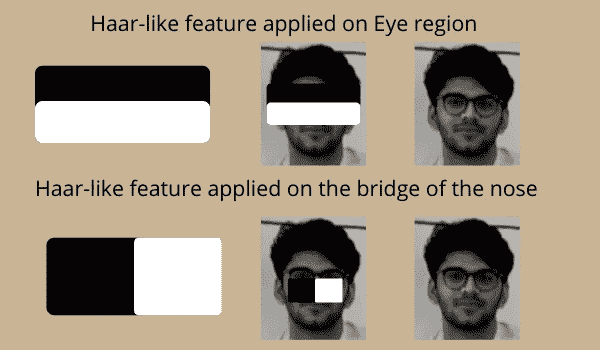

(图片由作者提供)

在本文中，我将讨论“Viola Jones 算法”,它包括以下子主题:

1.  维奥拉·琼斯探测器
2.  Haar like 特征是什么？
3.  什么是整体形象？
4.  用积分图像计算类哈尔特征
5.  升压和 AdaBoost 算法
6.  深入研究 AdaBoost 算法数学
7.  级联过滤器
8.  使用 OpenCV 库实现

# **维奥拉·琼斯探测器**

一种中提琴琼斯检测器，包括以下步骤:

1.  计算积分图像
2.  计算类哈尔特征
3.  AdaBoost 学习算法
4.  级联过滤器

# **哈尔有什么样的特征？**

哈尔特征是人脸检测的相关特征。它是由阿尔弗雷德·哈尔在 1909 年提出的。它们就像卷积核。有各种类型的 haar 类特征，但最常用的特征是:

1.  2 个矩形哈尔特征
2.  3 个矩形哈尔特征
3.  4 个矩形哈尔特征

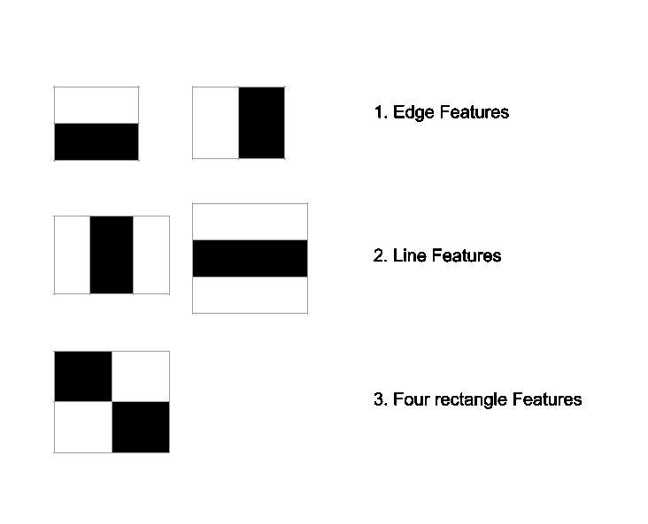

(图片作者)灵感([https://docs . opencv . org/3.4/D2/d99/tutorial _ js _ face _ detection . html](https://docs.opencv.org/3.4/d2/d99/tutorial_js_face_detection.html))

2 矩形特征的值是 2 个矩形区域内的像素之和的差。这些区域具有相同的形状和大小，并且水平和垂直相邻。三矩形特征计算中心矩形的总和。最后，四矩形特征计算矩形对角线对之间的差异。这些不同大小的区域的各种变化在图像中进行卷积，以获得将被输入到 AdaBoost 训练算法的多个滤波器。使用标准技术计算这些特征将需要很长的计算时间。为了缩短这一时间，作者提出了一种称为积分图像的新方法。

# **什么是积分图？**

因为我们必须在所有可能的大小和位置使用 haar-like 特征，这最终导致大约 200k 个特征来计算哪个是真正大的数字。haar 特征的新颖计算的问题在于，我们必须多次计算给定区域的平均值，并且这些操作的时间复杂度是 O(n*n)。我们可以使用积分图像方法来实现 O(1)运行时间。积分图像中的给定像素是左边所有像素和它上面所有像素的总和。

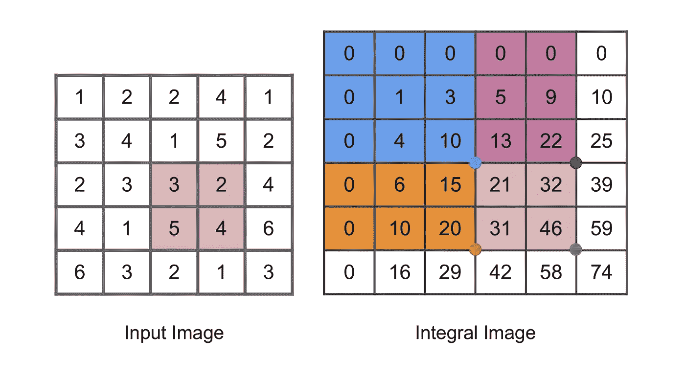

(图片由作者提供)灵感([https://www.mathworks.com/help/images/integral-image.html](https://www.mathworks.com/help/images/integral-image.html))

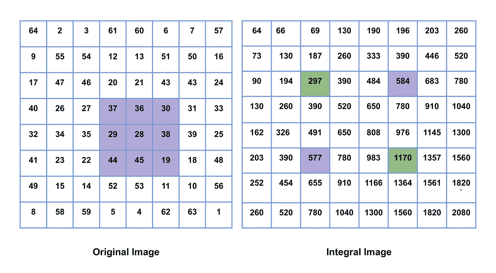

(图片由作者提供)灵感(**)**

*原始图像中所有紫色框的总和等于积分图像中绿色框的总和减去积分图像中的紫色框。*

# ***利用积分图像计算类哈尔特征***

*使用积分图像，我们可以实现哈尔特征的恒定时间评估。*

1.  *边缘特征或 2 个矩形特征仅需要 6 次存储器查找*
2.  *线特征或 3 个矩形特征仅需要 8 次存储器查找。*
3.  *对角线特征或 4 个矩形特征只需要 9 次存储器查找。*

> ***2 矩形** = A-2B+C-D+2E-F*
> 
> ***3 矩形** = A-B-2C+2D+2E-2F-G+H*
> 
> ***4 矩形** = A-2B+C-2D+4E-2F+H-2I+J*

*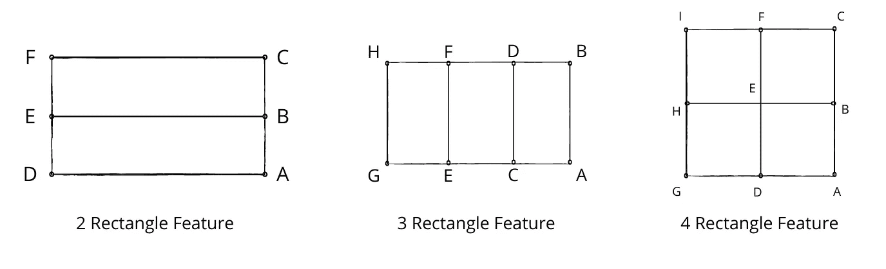*

*计算区域和的技术，用于在恒定时间量内计算 haar 类特征。(图片由作者提供)*

# ***升压和 AdaBoost 算法***

*Boosting 是指任何可以将几个弱学习者组合成一个强学习者的集成方法。大多数 boosting 方法的一般思想是顺序训练预测器，每个预测器都试图纠正其前任。AdaBoost 也称为自适应增强，是最常用的增强技术之一。*

***AdaBoost** :新预测器校正其前任的一种方法是多注意前任欠拟合的训练实例。这导致新的预测者越来越关注疑难病例。这被称为适应性增强。例如，为了构建自适应提升分类器，第一基本分类器(例如决策树或 SVM 分类器)被训练并用于对训练集进行预测。改变和增加误分类预测的相对权重，以便在进行下一个预测时更加重视这些预测。使用更新的权重训练第二分类器，并且再次对训练集进行预测，权重被更新，等等。一旦训练了所有的预测，集成方法使得预测非常类似于增强，除了预测器具有不同的权重，这取决于它们在加权训练集上的整体准确度。这种算法的缺点是它不能并行化，从而增加了所需的时间。因此，在所有特征上成功运行 AdaBoost 之后，我们剩下的是检测所需的最相关的特征。因此，这减少了计算时间，因为我们不必遍历所有的特征，并且效率更高。*

*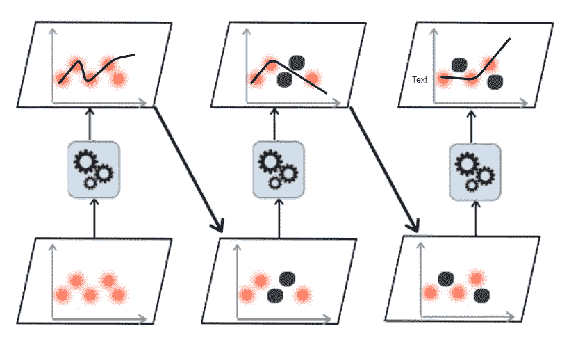*

*(图片由作者提供)受启发(使用 Scikit-Learn、Keras 和 TensorFlow 进行动手机器学习:构建智能系统的概念、工具和技术)*

# ***深入研究 AdaBoost 算法***

*让我们仔细看看 AdaBoost 算法。每个实例权重 w(i)最初被设置为 1/m。训练第一预测器，并在训练集上计算其加权误差率 r1*

*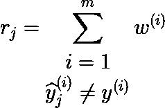*

*这里，我们只取错误分类的实例，将这些实例的权重相加，得到加权错误率(图片由作者提供)*

*然后使用下面给出的公式计算预测器的权重 j。预测器越精确，其权重就越高。如果只是随机猜测，那么它的权重将接近于零。然而，大多数情况下，它是错误的，其权重将是负的。*

*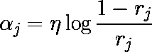*

*(图片由作者提供)*

*接下来，使用下面提供的公式更新实例权重，以提升错误分类的实例*

*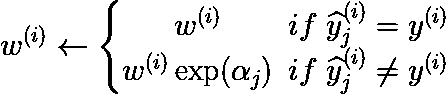*

*(图片由作者提供)*

*然后，使用下面提供的公式对所有预测值进行归一化。*

*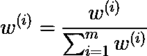*

*(图片由作者提供)*

*最后，使用更新的权重来训练新的预测器，并且重复整个过程，直到达到用户指定的预测器的期望数量。*

*在推理过程中，AdaBoost 简单地计算所有预测器的预测值和权重，然后使用预测器权重αj。预测类是获得大多数加权投票的类。*

# ***级联过滤器***

*   *强特征形成二元分类器。:正匹配将被发送到下一个特征。否定匹配被拒绝并退出计算。*
*   *减少花费在错误窗口上的计算时间。*
*   *可以调整阈值来调整精度。阈值越低，检测率越高，假阳性越多。*

*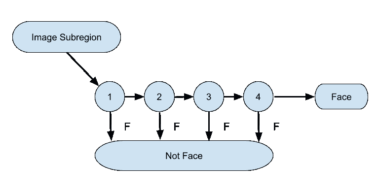*

*(图片由作者提供)灵感([https://www . research gate . net/figure/Cascade-classifier-illustration-2 _ fig 2 _ 323057610](https://www.researchgate.net/figure/Cascade-classifier-illustration-2_fig2_323057610))*

*简而言之，每个特征都充当级联过滤器中的二元分类器。如果从图像中提取的特征通过分类器，并且它预测图像由该特征组成，则它被传递到下一个分类器，用于下一个特征存在检查，否则它被丢弃，并且检查下一个图像。这因此减少了计算时间，因为我们必须只检查对象不存在的窗口中的一些特征，而不是检查所有特征。这是算法的主要部分，允许它以大约每秒 15 帧的速率处理视频，并实现实时实施。*

# ***使用 OpenCV 库实现***

# ***参考文献***

1.  *使用简单特征的增强级联的快速对象检测:[https://web.iitd.ac.in/~sumeet/viola-cvpr-01.pdf](https://web.iitd.ac.in/~sumeet/viola-cvpr-01.pdf)*
2.  *[检测人脸(Viola Jones 算法)——电脑爱好者](https://www.youtube.com/watch?v=uEJ71VlUmMQ):【https://www.youtube.com/watch?v=uEJ71VlUmMQ】T2*
3.  *使用 Scikit-Learn、Keras 和 TensorFlow 进行机器实践学习:构建智能系统的概念、工具和技术*

*敬请关注新的研究论文这样的解释！*

*请随时联系并给出你的建议:【https://www.linkedin.com/in/mrinal-tyagi-02a1351b1/ *

*[https://github.com/MrinalTyagi](https://github.com/MrinalTyagi)*