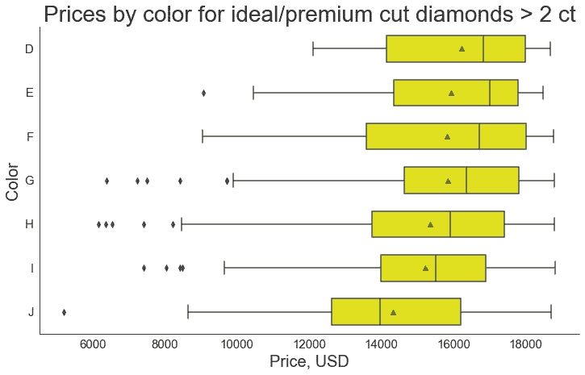
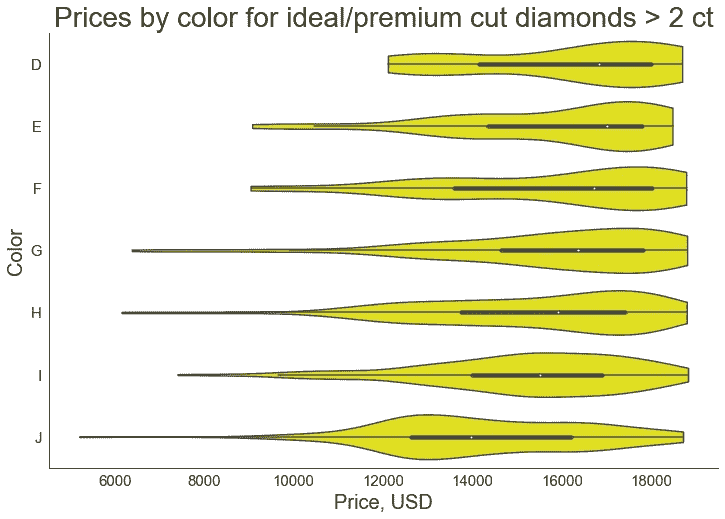
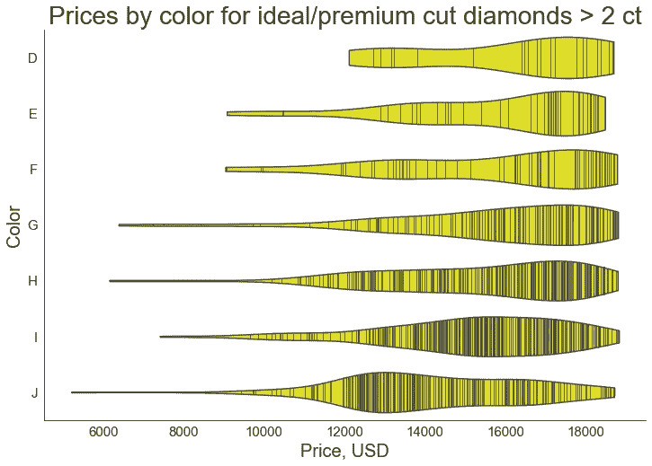
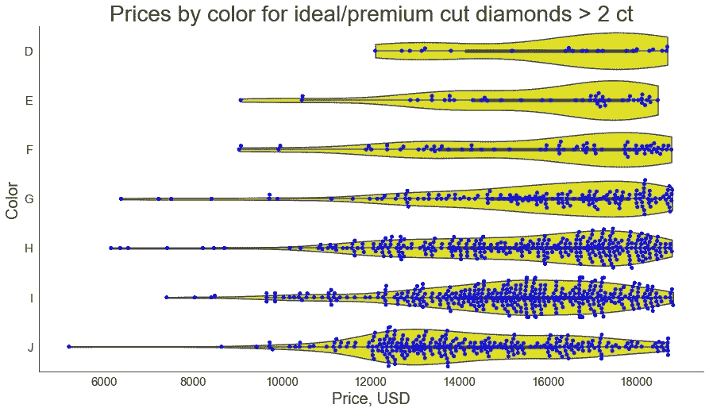
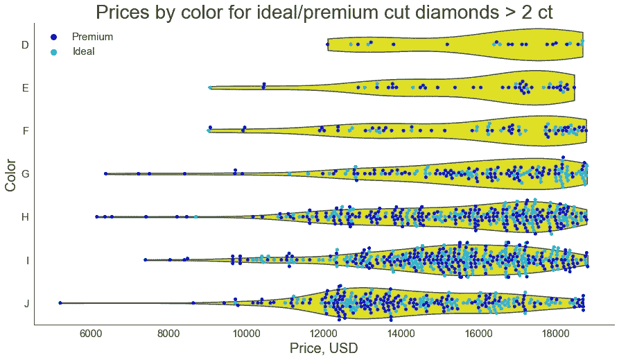
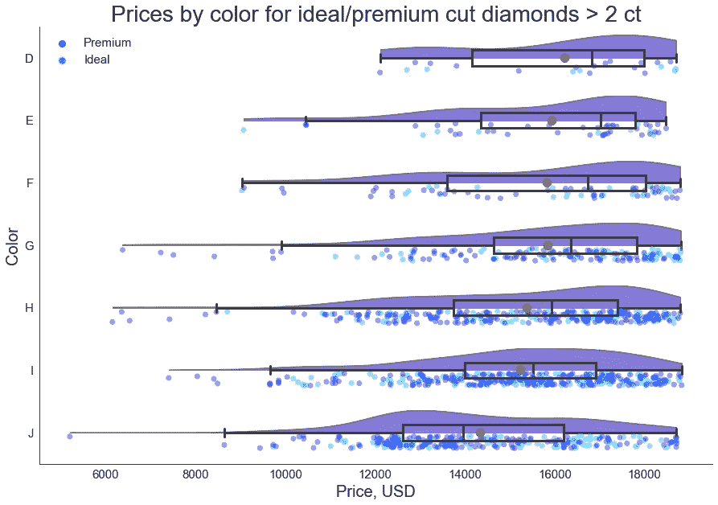
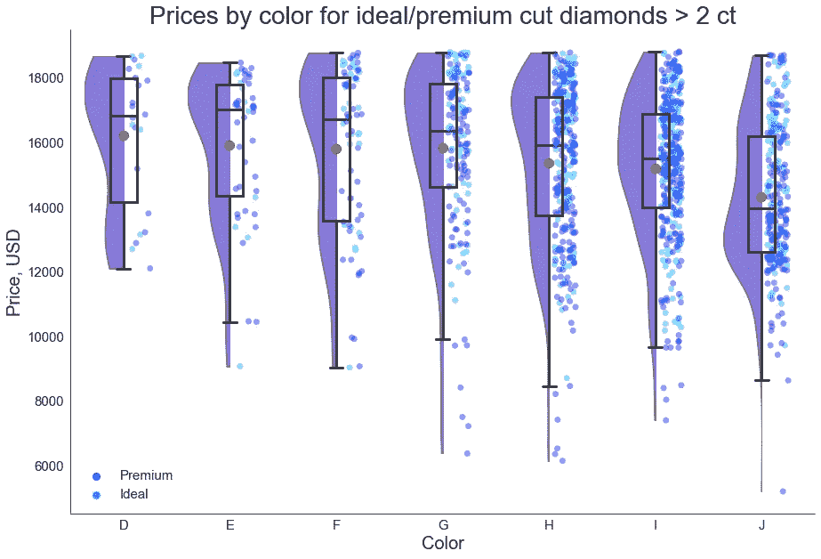

# Python 中的 Violin、Strip、Swarm 和 Raincloud 图是箱线图的更好(有时)替代方案

> 原文：<https://towardsdatascience.com/violin-strip-swarm-and-raincloud-plots-in-python-as-better-sometimes-alternatives-to-a-boxplot-15019bdff8f8?source=collection_archive---------8----------------------->

## 何时使用它们，如何在 seaborn 库中创建、调整和组合这些类型的可视化


[来自 Pixabay](https://pixabay.com/photos/question-mark-choice-decision-3839456/)

创建箱线图是显示数据集统计摘要的最常用方式。然而，有时，我们可能需要可视化额外的统计信息，并对我们的数据进行更细致的查看。这就是其他类型的图表发挥作用的地方:小提琴图、带状图和虫群图，以及它们的混合图，其中最有趣的是雨云图。在本文中，我们将探索 Python 的 seaborn 库中箱线图的这些替代方案，并找出它们中的每一种在哪些情况下最适用。

对于我们进一步的实验，我们将使用 seaborn 的一个示例数据集— `diamonds`。让我们下载并快速浏览一下:

```
import matplotlib.pyplot as plt
import seaborn as sns
%matplotlib inlinediamonds = sns.load_dataset('diamonds')
print(f'Number of diamonds: {diamonds.shape[0]:,}\n'
      f"Diamond cut types: {diamonds['cut'].unique().tolist()}\n"
      f"Diamond colors:     {sorted(diamonds['color'].unique().tolist())}\n\n"
      f'{diamonds.head(3)}\n')**Output:**Number of diamonds: 53,940
Diamond cut types: ['Ideal', 'Premium', 'Good', 'Very Good', 'Fair']
Diamond colors:     ['D', 'E', 'F', 'G', 'H', 'I', 'J']

   carat      cut color clarity  depth  table  price     x     y     z
0   0.23    Ideal     E     SI2   61.5   55.0    326  3.95  3.98  2.43
1   0.21  Premium     E     SI1   59.8   61.0    326  3.89  3.84  2.31
2   0.23     Good     E     VS1   56.9   65.0    327  4.05  4.07  2.31
```

数据集相当大。让我们将我们的关注点缩小到超过 2 克拉的理想切割或优质切割的钻石，并且只处理这个较小的数据集。我们只对最好的钻石感兴趣！😀

```
df = diamonds[((diamonds['cut']=='Ideal')|(diamonds['cut']=='Premium')) & (diamonds['carat']>2)]
print(f'Number of diamonds in "df": {df.shape[0]:,}')**Output:** 
Number of diamonds in "df": 1,216
```

# 箱线图

现在，我们可以为每个钻石颜色类别的价格范围创建一个箱线图。颜色用大写字母表示，我们可以在这篇[维基百科文章](https://en.wikipedia.org/wiki/Diamond_color)中找到更多关于钻石颜色分级的信息。根据外延，我们数据集中的钻石都是无色或接近无色的。

箱线图的主要作用是显示数据集的五位数描述性统计数据:最小值和最大值、中值、第一(Q1)和第三(第三季度)四分位数。此外，它还显示了较高和较低的异常值(如果有)，我们还可以选择在图表上添加第六个维度—平均值:

```
sns.set_style('white')plt.figure(figsize=(12, 7))
sns.boxplot(x='price', y='color', data=df, color='yellow', width=0.6, showmeans=True)# Create a function to customize the axes of all the subsequent graphs in a uniform way.
def add_cosmetics(title='Prices by color for ideal/premium cut diamonds > 2 ct', 
                  xlabel='Price, USD', ylabel='Color'):
    plt.title(title, fontsize=28)
    plt.xlabel(xlabel, fontsize=20)
    plt.ylabel(ylabel, fontsize=20)
    plt.xticks(fontsize=15)
    plt.yticks(fontsize=15)
    sns.despine()add_cosmetics()
```



作者图片

除了定制图形和轴，我们实际上用 seaborn 编写了一行代码来创建上面的箱线图。我们只调整了图的颜色和宽度，并在每个框上添加了平均值。

上面的方框图清楚地显示了每个颜色类别的价格范围的总体统计数据。此外，从它们的形式来看，存在较低的异常值，平均值几乎在所有情况下都低于中值，我们可以假设每种情况下的价格分布是左偏的，这意味着钻石价格往往相当高。然而，仅仅看这些图，我们无法理解底层数据分布的实际形状和结构。例如，特定颜色类别的分布是单峰的还是多峰的？每个类别包含多少个观察值？不同类别的样本大小有可比性吗？各个观测值在每个分布中的确切位置。

让我们看看创造一个小提琴情节是否有助于我们回答这些问题。

# 小提琴情节

violin 图类似于 box 图，显示了数据集的相同统计摘要，只是它还显示了底层数据的内核密度图:

```
plt.figure(figsize=(12, 8))
sns.violinplot(x='price', y='color', data=df, color='yellow', cut=0)
add_cosmetics()
```



作者图片

我们只调整了`cut`参数，将其设置为 0。这将每个小提琴限制在实际数据的范围内，而不是向外扩展。

回到我们上面的问题，我们可以说，除了从每把小提琴中间的“迷你箱线图”中获得的每个类别的总体统计数据，我们现在可以看到每个分布的形状。是的，我们关于左偏分布的假设现在被完全证实了。

按类别划分的底层数据的结构呢？我们可以调整`inner`参数来可视化每把小提琴内部的观察位置和密度:

```
plt.figure(figsize=(12, 8))
sns.violinplot(x='price', y='color', data=df, color='yellow', cut=0,
               inner='stick')
add_cosmetics()
```



作者图片

现在，我们可以看到每个类别范围内的观察密度。显然，D 和 E 色的钻石比 H 和 I 色的钻石少得多，尽管相应的分布形状看起来非常相似。

然而，调整参数后，我们再也看不到每把小提琴内部的微型盒图了。此外，我们还看不到*每个*的底层数据点。

# 带状和群体图

这两种类型的图代表了分类变量的散点图的实现，即它们都精确地显示了分布的内部结构，特别是其样本大小和单个观察值的位置。主要区别在于，在群集图中，数据点不会重叠，而是沿着分类轴进行调整。另一方面，带状图中点重叠的问题可以通过设置调节点透明度的`alpha`参数得到部分解决。

让我们比较一下这些图:

```
plt.figure(figsize=(16, 11))plt.subplot(2, 1, 1)
sns.stripplot(x='price', y='color', data=df, color='blue',
              alpha=0.3, size=4)
add_cosmetics(xlabel=None)plt.subplot(2, 1, 2)
sns.swarmplot(x='price', y='color', data=df, color='blue', size=4)
add_cosmetics(title=None)plt.tight_layout()
```


作者图片

带状图和群集图的主要缺点是，它们只能在相对较小的数据集上运行良好。此外，它们不像箱线图和小提琴图那样显示五位数的描述性统计数据。

# 杂交地块

为了避免丢失有价值的信息并结合不同图表类型的优势，我们可以考虑创建混合图。例如，让我们结合每个类别的 violin 和 swarm 图:

```
plt.figure(figsize=(15, 8))
sns.violinplot(x='price', y='color', data=df, color='yellow', cut=0)
sns.swarmplot(x='price', y='color', data=df, color='blue')
add_cosmetics()
```



作者图片

我们现在清楚地看到，小提琴的内部结构在不同的类别中有很大的不同，尽管它们的外部形状相当相似。实际上，对于具有很少数据点的 D 和 E 颜色类别，创建小提琴图实际上没有意义，甚至会导致错误的估计。然而，对于有许多数据点的类别，swarm 和 violin 图的结合有助于理解更大的画面。

值得注意的是，在上图中，我们几乎看不到被点覆盖的迷你盒图(除非我们决定引入`alpha`参数)，所以我们将移除盒子。此外，让我们为群体图添加另一个维度:区分理想和优质钻石切工的数据点:

```
plt.figure(figsize=(15, 8))
sns.violinplot(x='price', y='color', data=df, color='yellow',
               cut=0, inner=None)
sns.swarmplot(x='price', y='color', hue='cut', data=df,
              palette=['blue', 'deepskyblue'])plt.legend(frameon=False, fontsize=15, loc='upper left')
add_cosmetics()
```



作者图片

我们可以观察到，相对“便宜”的钻石大多是溢价切割，而不是更高等级的理想切割。

如果组的数量不超过三个，带状图和群集图有助于区分不同组的单个数据点。出于同样的目的，我们可以尝试另一种方法:根据颜色类别分别为理想和优质切割创建分组的小提琴图。然而，考虑到我们的一些颜色类别已经非常小，将它们分开以创建分组的 violin 图将导致每个部分的样本大小和数据密度的进一步减少，使得这样的图更不具有代表性。因此，在这种情况下，带状和群集图看起来是一个更好的选择。

有一种类型的混合地块值得特别关注，所以让我们更详细地讨论它。

# 雨云图

雨云图本质上是半小提琴图、箱形图和带状图的组合。从上到下连续放置，这些地块共同提醒雨云，因此命名为混合地块。不幸的是，无论是在 seaborn 中还是在 Python 中，都没有针对这类情节的预定义代码解决方案(至少目前是这样，而且至少是以易于使用和理解的形式)。因此，我们将从零开始创建它，结合并调整可用的工具。代码注释中解释了每个步骤的技术细节:

```
plt.figure(figsize=(15, 10))# Create violin plots without mini-boxplots inside.
ax = sns.violinplot(x='price', y='color', data=df,
                    color='mediumslateblue', 
                    cut=0, inner=None)# Clip the lower half of each violin.
for item in ax.collections:
    x0, y0, width, height = item.get_paths()[0].get_extents().bounds
    item.set_clip_path(plt.Rectangle((x0, y0), width, height/2,
                       transform=ax.transData))# Create strip plots with partially transparent points of different colors depending on the group.
num_items = len(ax.collections)
sns.stripplot(x='price', y='color', hue='cut', data=df, 
              palette=['blue', 'deepskyblue'], alpha=0.4, size=7)# Shift each strip plot strictly below the correponding volin.
for item in ax.collections[num_items:]:
    item.set_offsets(item.get_offsets() + 0.15)# Create narrow boxplots on top of the corresponding violin and strip plots, with thick lines, the mean values, without the outliers.
sns.boxplot(x='price', y='color', data=df, width=0.25,
            showfliers=False, showmeans=True, 
            meanprops=dict(marker='o', markerfacecolor='darkorange',
                           markersize=10, zorder=3),
            boxprops=dict(facecolor=(0,0,0,0), 
                          linewidth=3, zorder=3),
            whiskerprops=dict(linewidth=3),
            capprops=dict(linewidth=3),
            medianprops=dict(linewidth=3))plt.legend(frameon=False, fontsize=15, loc='upper left')
add_cosmetics()
```



作者图片

从上面的 raincloud 图中，我们可以提取每个颜色类别的价格范围的完整统计信息:整体五位数统计、平均值、分布形状、样本大小、基础数据的内部结构，包括各个数据点的位置，以及每个类别中两个不同组之间的区别。然后，我们可以比较颜色类别，了解它们之间的关系和大致趋势。

为了创建一个垂直的雨云图，我们必须对上面的代码做一些小的改动。特别是，在创建每种类型的内部图时，我们必须用 y 替换 x，反之亦然，并剪切每把小提琴的右半部分(即，宽度除以 2，高度保持不变)。至于装饰调整，我们必须交换 x 轴和 y 轴标签，并将图例放在左下角:

```
plt.figure(figsize=(15, 10))# Create violin plots without mini-boxplots inside.
ax = sns.violinplot(y='price', x='color', data=df,
                    color='mediumslateblue', 
                    cut=0, inner=None)# Clip the right half of each violin.
for item in ax.collections:
    x0, y0, width, height = item.get_paths()[0].get_extents().bounds
    item.set_clip_path(plt.Rectangle((x0, y0), width/2, height,
                       transform=ax.transData))# Create strip plots with partially transparent points of different colors depending on the group.
num_items = len(ax.collections)
sns.stripplot(y='price', x='color', hue='cut', data=df,
              palette=['blue', 'deepskyblue'], alpha=0.4, size=7)# Shift each strip plot strictly below the correponding volin.
for item in ax.collections[num_items:]:
    item.set_offsets(item.get_offsets() + 0.15)# Create narrow boxplots on top of the corresponding violin and strip plots, with thick lines, the mean values, without the outliers.
sns.boxplot(y='price', x='color', data=df, width=0.25,
            showfliers=False, showmeans=True, 
            meanprops=dict(marker='o', markerfacecolor='darkorange',
                           markersize=10, zorder=3),
            boxprops=dict(facecolor=(0,0,0,0), 
                          linewidth=3, zorder=3),
            whiskerprops=dict(linewidth=3),
            capprops=dict(linewidth=3),
            medianprops=dict(linewidth=3))plt.legend(frameon=False, fontsize=15, loc='lower left')
add_cosmetics(xlabel='Color', ylabel='Price, USD')
```



作者图片

当然，我们也可以很容易地将前面的所有图形垂直化，用 y 替换 x，反之亦然，交换 x 轴和 y 轴标签，并移动图例(如果适用)。

# 结论

在本文中，我们探索了 Python 的 seaborn 库中箱形图的各种替代方案，即 violin、strip 和 swarm 图，以及它们的混合图，包括作为特例的 raincloud 图。我们讨论了每种类型的可视化的优势和局限性，如何对它们进行调整，以及它们可以揭示什么样的信息。最后，我们考虑了适用于垂直旋转图的修改。

为现实世界的任务选择正确类型的图表并不一定意味着试图显示数据中所有可能的信息。相反，它取决于任务本身和可用的数据。有时，仅仅创建一个箱线图就足够了，而在其他情况下，我们必须更深入地挖掘数据，以获得有意义的见解并发现隐藏的趋势。

感谢阅读！

**你会发现这些文章也很有趣:**

</how-to-fetch-the-exact-values-from-a-boxplot-python-8b8a648fc813>  <https://medium.com/geekculture/creating-a-waterfall-chart-in-python-dc7bcddecb45>  </how-to-fill-plots-with-patterns-in-matplotlib-58ad41ea8cf8> 