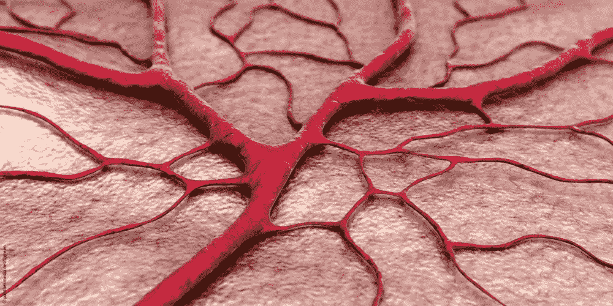
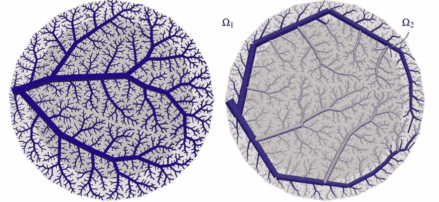
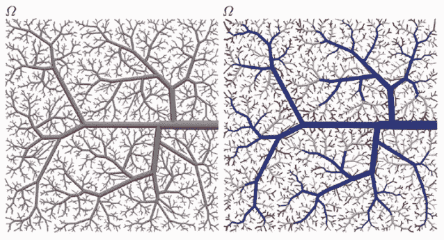
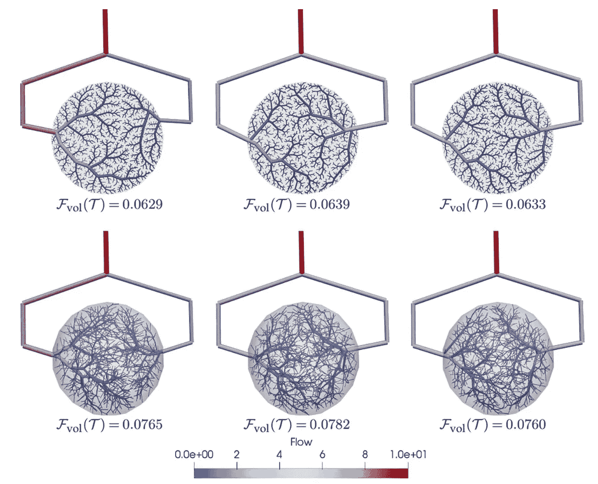
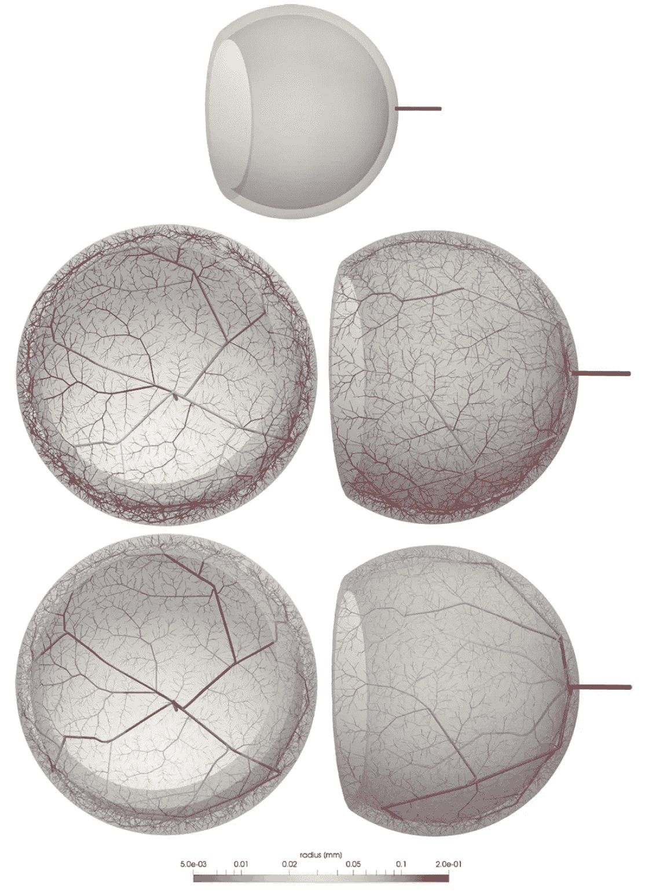
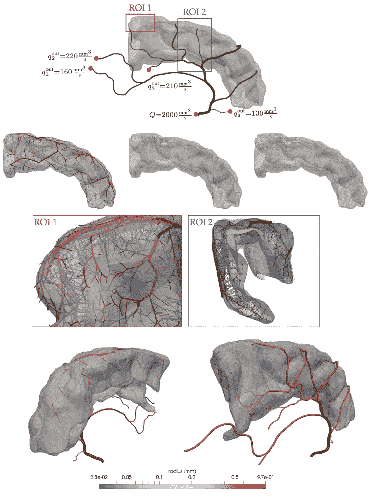

# 虚拟血管生成:一套新的计算机血管生成工具

> 原文：<https://towardsdatascience.com/virtual-angiogenesis-a-new-set-of-tools-for-creating-in-silico-blood-vessels-96301d5b477d?source=collection_archive---------46----------------------->

版权所有:Panthermedia.net/Ugreen

## [思想和理论](https://towardsdatascience.com/tagged/thoughts-and-theory)

在心血管研究领域，在全球或区域循环中发现的许多循环系统疾病始于控制外周(小动脉和毛细血管)血流和细胞功能之间相互作用的功能失调的化学-机械配对。循环的数学模型和计算机模拟及其与细胞功能的耦合为拓展心血管研究的边界提供了强有力的工具。

顺序血管生长(图片由作者提供)。

然而，血流模型和细胞耦合需要在微血管水平实现定义域。这可以通过成像技术来实现，这种技术能够提供动物模型中小血管的高分辨率图像。但是，即使有了这些工具的力量，它们对不同血管区域的适用性还是相当有限，对人类的翻译也是如此。通过开发旨在以自动方式生成血管网络的方法，找到了避免缺乏关于周围床的血管结构的信息的解决方案，该方法由生理标准驱动并符合一组形态测量约束和经验法则。如此生成的血管网络可以在统计学上与解剖学描述一致，因为它们可以再现在血管网络中观察到的主要拓扑特征和功能反应。

分级血管生长:(左)用标准 CCO 算法获得的血管化；(右)使用 DCCO 算法的血管化(图片由作者提供)。

尺度特异性血管生长:(左)用标准 CCO 算法获得的血管形成；(右)使用 DCCO 算法的血管化(图片由作者提供)。

自动生成血管床有两类算法:分形算法和空间填充算法。第一类算法可以容易地遵循主要形态测量(血管半径、长度、纵横比和分叉角)的统计模型，而不考虑血管区域的形状。第二类算法允许在(2D 或 3D)空间中定义的脉管区域内生成脉管网络。这种空间填充算法的一个特殊类别被称为约束构造优化(CCO ),因为血管网络的顺序生成是由成本函数的约束最小化来驱动的。

具有等径血管入口的圆形和球形区域的同时血管化(图片由作者提供)。

我们在具有简单领域的学术场景和涉及多阶段血管生长的现实场景中测试了用于血管网络生成的自适应 CCO (DCCO)算法，从从人体解剖代表性区域中的详细人体模型中获取的现有血管网络开始。

**视网膜内血管形成**

除了无血管的视网膜中央凹区之外，作为眼睛血管层之一的视网膜内血管层是均匀血管化的。有趣的是，DCCO 血管化在视网膜动脉的插入点附近产生了四个分支，以与体内观察到的*相同的方式形成了基于象限的排列。在更远的位置，通过与解剖描述一致的算法来传递均匀的血管模式。这个简单的例子显示了 DCCO 从一小组约束和阶段中复制体内*血管模式的能力。**

**

*由两阶段生长过程产生的内部视网膜脉管系统:(第一行)初始化 S0；(第二行)作为初始条件(蓝色)给出的、在 S1 阶段(浅蓝色)和 S2 阶段(红色)生成的生成树鉴别容器；(第三行)血管半径沿生成网络的变化(图片由作者提供)。*

***大脑皮层血管化***

*在第二个例子中，我们在原型人脑的左额回中血管化了灰质组织。作为初始条件 S0，使用以左大脑前动脉(l.ACA)为根的动脉树。*

*生成的脉管树再现了在实验研究中观察到的几个结构特征。灌注脑回的所有主要分支都发育良好，为组织提供大量血流。观察到不同分支的分布在性质上相似，但在数量上有一些差异，这是由每个分支所供应的相应脉管区域的大小造成的。此外，皮质血管在脑回表面呈现均匀的覆盖，其主要的软脑膜血管在此分支为穿入血管，穿入血管向内延伸，几乎与脑回表面垂直。这导致了到达灰质的第一代血管。反过来，这些穿入的血管引起深部血管的局部分支。最终的血管树均匀地灌注灰质体积，正如在 S3 和 S4 生成的血管的分散所证明的。*

**

*由四阶段生长过程产生的额上回中的灰质脉管系统:(第一行)初始树 S0，示出了流入和流出约束；(第二行)从左到右，对应于软脑膜网络(S1 和 S2)、穿透小动脉(S3)和深小动脉(S4)的血管；(第三行)上-后部(左)和头-尾轴(右)中间部分的冠状切片，描述了软脑膜(红色)、贯穿(绿色)和深(蓝色)血管穿过组织的结构组织；以及(第四行)描绘血管半径的最终血管树(图片由作者提供)。*

***胃血管化***

*作为最后一个案例，我们根据文献中的解剖描述为胃建立了血管化。*

*得到的血管树与文献中报道的血管结构定性一致，其中浆膜下丛向浆膜层输送均匀的灌注，而来自该浆膜下网络的穿支供应粘膜下层丛。最后，肌肉层的血液由这种浆膜穿支和粘膜下层丛同时提供。由于在所有区域(浆膜下丛血管化粘膜下层、血管化粘膜下层肌层、血管化粘膜下层肌层)存在将血液输送到邻近区域的血管，该器官的复杂结构在所有阶段呈现更复杂的血管半径分布。*

**

*由五阶段生长过程产生的胃脉管系统:(第一行)初始树 S0，包括流入和流出约束；(第二和第三排)从左到右和从上到下，对应于浆膜层(S1 和 S2)、穿支肌层(S3)、粘膜层(S4)和肌层(S5)的血管；(底部一行)最终的血管树描绘了胃的前视图和后视图中的血管半径(图片由作者提供)。*

*我们介绍了 DCCO 作为一种方法，用于生成具有一系列功能和结构特征的血管网络。这项工作描述了实现 DCCO 的算法，以及为实现不同的和不同的解剖现实的脉管系统的表示所必需的阶段建模的基本原理。*

*此外，进行了进一步的扩展，以将自动血管形成过程与可用数据相结合，例如从医学图像或心血管系统的详细模型中获得的数据。这些特征使我们能够在患者特定的几何结构中使用 DCCO，为探索小尺度血管的作用及其在不同临床场景中的生理特征提供了新的研究机会。*

*本文由 DProf 的 Maso Talou 博士、Safaei 博士撰写。亨特、布兰科和 https://www.nature.com/articles/s41598-021-85434-9 最初发表于<https://www.nature.com/articles/s41598-021-85434-9>**。***