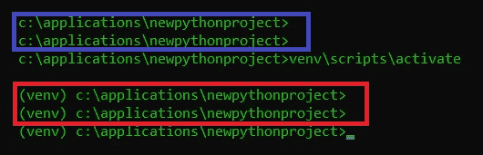

# 绝对初学者的虚拟环境——什么是虚拟环境，如何创建虚拟环境(+例子)

> 原文：<https://towardsdatascience.com/virtual-environments-for-absolute-beginners-what-is-it-and-how-to-create-one-examples-a48da8982d4b?source=collection_archive---------1----------------------->

## 深入探究 Python 虚拟环境、pip 和避免纠缠依赖


🎵你必须把我分开🎵(图片由[凯利·莱西](https://www.pexels.com/@kelly-lacy-1179532)在[派克斯](https://www.pexels.com/photo/parakeets-in-cage-2888319/)拍摄)

如果你从事许多不同的项目，那么你会认识到[依赖——多个项目需要多个版本，多个包。你不能全局安装所有的软件包，你如何保持跟踪？同样，当项目 a 需要 PackageX_version1，而项目 b 需要 PackageX_version2 时会发生什么？当一切都是相互依赖的一团乱麻时，你如何保持理智？](https://imgs.xkcd.com/comics/python_environment.png)

在这篇文章中，我将试图说服使用 venv(虚拟环境)是保持依赖关系与其他项目分离的方法。我们将从定义什么是 venv 开始，它有什么作用，为什么你需要它。然后我们将创建一个并看到它的所有好处。最后，我们将有一些基本的规则来保持我们项目中的依赖关系尽可能的干净。

# 1.什么是 venv，我为什么需要它？

当您的一个项目需要一个与另一个项目版本不同的包时，会发生什么呢？当你为一个项目更新一个包时会发生什么:它会破坏依赖于那个包的另一个项目中的代码吗？你如何与他人分享你的代码？


让我们不要让我们的项目的依赖性纠缠在一起(图片由 [Vika Aleksandrove](https://unsplash.com/@vicaleksa) 在 [Unsplash](https://unsplash.com/photos/n56ZKeW9bVM) 上提供)

为了了解 venv 是什么，我们将把它分成两部分:*和 ***环境*** 。*

*</applying-python-multiprocessing-in-2-lines-of-code-3ced521bac8f> * 

## *环境*

*一个你已经熟悉的环境。例如，当你安装 Python3.10 时，你不仅安装了 Python 引擎，还安装了 pip。当您使用 pip 来安装一个包时，它最终会出现在 Python 安装目录下的 Scripts 文件夹中。这是您的环境:Python 3.10 以及所有已安装的包。*

*如果你像`python main.py`一样运行你的程序，就会发生这种情况:*

1.  *你的系统通过系统路径变量查找你安装 python 的地方，这样它就把你的命令翻译成类似于`C:\Program Files\Python39\python.exe main.py`的东西。*
2.  *接下来，脚本 main.py 被传递给 Python 引擎。例如，如果你在脚本中的某个地方使用了`import requests`，它将在 python 的安装目录中查找这个包，在`Lib`文件夹中(在我的例子中是`C:\Program Files\Python39\Lib`)。*
3.  *如果你已经安装了这个包，python 可以在这个文件夹中找到它并导入代码，这样你就可以使用它了，否则它会返回一个错误，说你试图导入的包没有安装*

*如果不使用虚拟环境，Python 的这种全局安装是您唯一的环境。您可以看到，将所有项目的依赖关系捆绑在一个大盒子里是很危险的。是时候将它划分到虚拟环境中了。*

*</sqlalchemy-for-absolute-beginners-22227a287ef3> * 

## *虚拟的*

*我喜欢把 venv 想成是专门为这个项目创造一个全新的、稍微轻松一点的环境。我们将在接下来的部分中看到，当您为项目创建 venv 时，您实际上为这个特定的项目重新安装了 Python、pip 和 dependencies-folder。这段代码不在你的默认 Python 路径中(例如`C:\Program Files\Python39`)，而是可以安装在任何地方，例如在你的项目文件夹中(例如`C:\myProject\weatherApp\venv`)。*

*</python-logging-for-absolute-beginners-8e89032b1b4c> * 

## *共享和构建环境*

*一旦你有了一个虚拟环境，你可以告诉它为你创建一个包含所有包的列表。然后，当其他人想要使用你的代码时，他们可以创建自己的 venv，并使用这个列表来安装所有的软件包，同时安装正确的版本。这使得与他人分享你的代码变得非常容易(通过 git、邮件或 u 盘)。*

**

*构建我们的新环境(图片由 Rodolfo Quirós 在 [Pexels](https://www.pexels.com/photo/selective-focus-photography-cement-2219024/) 上拍摄)*

# *2.创建虚拟环境*

*让我们创建我们的虚拟环境吧！在下面的步骤中，我们将确保可以创建虚拟环境。对于这一部分，如果您对使用终端没有经验或不熟悉，建议阅读本文。我们将使用名为 virtualenv 的 Python 包来创建我们的 venvs。*

*</terminals-consoles-command-line-for-absolute-beginners-de7853c7f5e8>  

## 2.1 安装 Python

1.  检查您的系统架构；不是 32 位就是 64 位。
2.  从[**Python 网站**](https://www.python.org/downloads/) 下载并安装 Python。确保与您的系统匹配(32 位或 64 位。
3.  如果您在终端中执行`python --version`后看到您已经安装的版本，那么 Python 安装正确。

## 2.2 安装 virtualenv

Virtualenv 是一个 Python 包，它允许我们创建 venvs。我们将在我们的机器上全局安装它。

1.  使用 pip 安装 virtualenv 包:我们简单地通过调用`pip install virtualenv`来安装它
2.  如果你能执行
    `python -m virtualenv -h`，说明 Virtualenv 安装正确。
    这个命令告诉 python 加载它的一个(-m)模块，即 virtualenv 模块。h 标志要求 virtualenv 显示“帮助”选项。它会显示一些提示，然后你就知道它安装正确。

## 2.3 创建我们的第一个虚拟环境

既然我们有了创建虚拟环境的软件，我们就可以创建一个了。

1.  导航到要创建项目的文件夹。我们称之为**根文件夹**。我的情况是`cd c:/applications/newpythonproject`。
2.  告诉 python 使用 venv 创建一个新的虚拟环境
    `python -m venv c:/applications/newpythonproject/venv` `
    这将在你的**根文件夹**中创建一个名为 venv 的新目录，包含 Python 和 pip 的新版本。我们将在这里安装我们的软件包。

</cython-for-absolute-beginners-30x-faster-code-in-two-simple-steps-bbb6c10d06ad>  

# 3.使用我们的虚拟环境

让我们开始使用我们的虚拟环境。在这一部分，我们将激活它，安装一些软件包，并再次停用它。


我们的食材准备好了；我们做饭吧！(图片由 [Ella Olson](https://www.pexels.com/@ella-olsson-572949) 在 [Pexels](https://www.pexels.com/photo/top-view-photo-of-vegetables-3026802/) 上拍摄)

## 3.1 激活我们的虚拟环境

当我们现在运行`pip install requests`时，它仍然会全局安装它们，这不是我们想要的。为了在我们的 venv 中安装软件包，我们必须激活我们的 venv 以便在那里安装它们。在你的**根文件夹**中，我们执行这个命令:`venv\scripts\activate`。(注意斜线是\，其他的(/)不起作用。



蓝色:激活前；红色:激活 venv 后

如果你的环境被激活，你会在你的终端上看到(venv)在你的路径之前，如上图所示。你将要安装的每个包都将被安装到你的虚拟环境中。

## 3.2 使用我们的虚拟环境

例如，现在打电话`pip install requests`会将它安装到您的 venv 中。你可以在你激活的环境中调用`pip list`来看到这一点；您将在那里看到请求。另一方面，如果您在另一个终端(没有激活 venv)调用`pip list`，您将看到一个不同的已安装包列表。

## 3.3 停用我们的虚拟环境

你可以通过在你的终端执行`deactivate`来关闭你的 venv。

</image-analysis-for-beginners-destroying-duck-hunt-with-opencv-e19a27fd8b6>  

# 4.出口和建造 venv

您已经创建了一个应用程序，它可以处理一些依赖项。假设您已经安装了 requests 和 pandas 来从 API 请求数据，在 pandas 中进行一些清理，然后将其保存到一个文件中。现在你想让其他人使用你的程序，但问题是:他们需要安装完全相同的依赖项和正确的版本。让我们给他们一个清单。


很像一本烹饪书，我们为其他用户创建了一些说明(图片来自[rod nae productions](https://www.pexels.com/@rodnae-prod)on[Pexels](https://www.pexels.com/photo/person-holding-white-printer-paper-5737454/)

## 4.1 在 requirements.txt 中列出您的依赖项

图像你有一个你的程序依赖的包的列表。Pip 可以读取这个列表并安装所有的包。

这正是 requirements.txt 所做的。它使用下面的命令`pip freeze > requirements.txt`冻结文本文件中`pip list`的内容。非常简单！唯一需要注意的是，上面的命令会在您当前所在的文件夹中创建 requirements.txt 文件，例如您的**根文件夹**。你也可以在其他地方或者用不同的名字`pip freeze > c:/some/other/path/mylist.txt`冻结文件，但是不推荐这样做。

</advanced-multi-tasking-in-python-applying-and-benchmarking-threadpools-and-processpools-90452e0f7d40>  

## 4.2 加载您的依赖项

如果你有 requirements.txt，你可以简单地调用`pip install -r requirements.txt`让 pip 安装所有列出的包。r 标志代表 read，因此 pip 会将它读取的所有包安装到您指定的文件中。

再次注意，它在您当前所在的文件夹中搜索 requirements.txt。也可以像`pip install -r c:/some/other/location/requirements.txt`一样从另一个位置加载。

</create-and-publish-your-own-python-package-ea45bee41cdc>  

## 4.3 忽略 git 中的虚拟环境

如果你想把你的项目添加到一个像 Github 这样的[版本控制](https://mikehuls.medium.com/version-control-your-database-part-1-creating-migrations-and-seeding-992d86c90170)系统中，建议不要包含你的整个虚拟环境。这要占用大量的空间和时间来上传和下载。

建议告诉 git 忽略包含虚拟环境的文件夹。为了做到这一点，你可以简单地在你的**根文件夹**中创建一个名为`.gitignore`的文件(注意 gitignore 是扩展名，这个文件没有名字)，并给它以下内容`venv/`。这告诉 git 忽略你的 venv 文件夹。如果你保存 venv 的文件夹是别的名字，显然你必须在这里写下正确的文件夹名。

</python-database-migrations-for-beginners-getting-started-with-alembic-84e4a73a2cca>  

## 4.4 使用排除的 venv 从 git 项目安装包

现在，当 Bob 从 Github 获取您的代码并想要使用您的程序时，会发生什么呢？如果你聪明的话，你可以把你的包冻结在 requirements.txt 中。Bob 可以简单地`pip install -r requirements.txt`并开始使用你的程序！

</create-your-custom-python-package-that-you-can-pip-install-from-your-git-repository-f90465867893>  

## 4.5 虚拟环境，requirements.txt 和 docker

Docker 需要一个构建容器的指令列表，requirements.txt 非常适合。docker 文件可能如下所示:

```
FROM python:3.9-slim-buster# 1\. Copy application code to a folder in container
COPY . /usr/src/downloadService# 2\. Cd to the folder
WORKDIR /usr/src/downloadService# 3\. Tell pip to install all required packages
RUN pip install -r requirements.txt# 4\. Execute app
EXPOSE 5000
WORKDIR /usr/src/downloadService/src
CMD ["python", "-i", "app.py"]
```

</keep-your-code-secure-by-using-environment-variables-and-env-files-4688a70ea286>  

如果你对 Docker 没有经验，不要担心，只要知道我们可以自动将我们所有的源代码转移到一个容器中，安装所有的包(# 3)，然后启动我们的应用程序。

# 5.最佳实践:防止依赖地狱

依赖地狱是指我们所有的项目都被它们的依赖关系纠缠在一起。这很难避免独自工作，尤其是当你在团队中工作的时候。这一部分试图为如何使用 Python 项目制定一些基本规则。

*   每个 python 项目都有自己的虚拟环境
*   用 `pip freeze`冻结依赖地狱！每次安装或卸载时更新 requirements.txt
*   在根目录下包含一个名为`pythonversion.txt`的文件，其中记录了您的 python 版本(`python --version`)。

</docker-for-absolute-beginners-what-is-docker-and-how-to-use-it-examples-3d3b11efd830>  

*   不总是需要的:在 Docker 容器中构建应用程序，这样你也可以跟踪操作系统

遵循这些规则，对于操作系统、python 及其所有依赖项的类型和版本应该没有问题。

# 结论

我希望我能阐明虚拟环境和 Python 安装依赖项的方式，以及如何让依赖项在项目间纠缠在一起。

如果你有建议/澄清，请评论，以便我可以改进这篇文章。同时，看看我的[其他文章](https://mikehuls.medium.com/)关于各种编程相关的主题，比如:

*   [Python 为什么慢，如何加速](https://mikehuls.medium.com/why-is-python-so-slow-and-how-to-speed-it-up-485b5a84154e)
*   [Python 中的高级多任务处理:应用线程池和进程池并进行基准测试](https://mikehuls.medium.com/advanced-multi-tasking-in-python-applying-and-benchmarking-threadpools-and-processpools-90452e0f7d40)
*   编写你自己的 C 扩展来加速 Python x100
*   【Cython 入门:如何在 Python 中执行>每秒 17 亿次计算
*   [用 FastAPI 用 5 行代码创建一个快速自动归档、可维护且易于使用的 Python API](https://mikehuls.medium.com/create-a-fast-auto-documented-maintainable-and-easy-to-use-python-api-in-5-lines-of-code-with-4e574c00f70e)
*   [创建并发布自己的 Python 包](https://mikehuls.medium.com/create-and-publish-your-own-python-package-ea45bee41cdc)
*   [创建您的定制私有 Python 包，您可以从您的 Git 库 PIP 安装该包](https://mikehuls.medium.com/create-your-custom-python-package-that-you-can-pip-install-from-your-git-repository-f90465867893)
*   [面向绝对初学者的虚拟环境——什么是虚拟环境以及如何创建虚拟环境(+示例)](https://mikehuls.medium.com/virtual-environments-for-absolute-beginners-what-is-it-and-how-to-create-one-examples-a48da8982d4b)
*   [通过简单的升级大大提高您的数据库插入速度](https://mikehuls.medium.com/dramatically-improve-your-database-inserts-with-a-simple-upgrade-6dfa672f1424)

编码快乐！

—迈克

页（page 的缩写）学生:比如我正在做的事情？[跟我来！](https://mikehuls.medium.com/membership)

<https://mikehuls.medium.com/membership> *