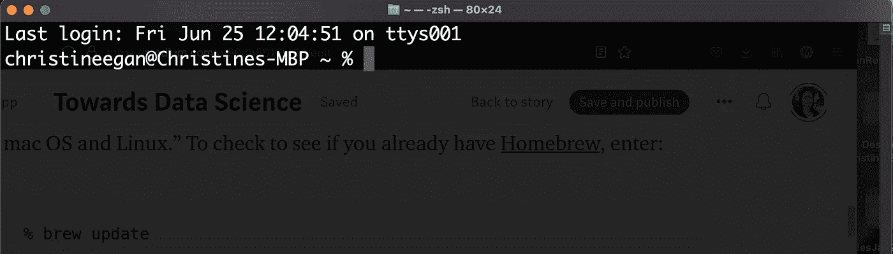
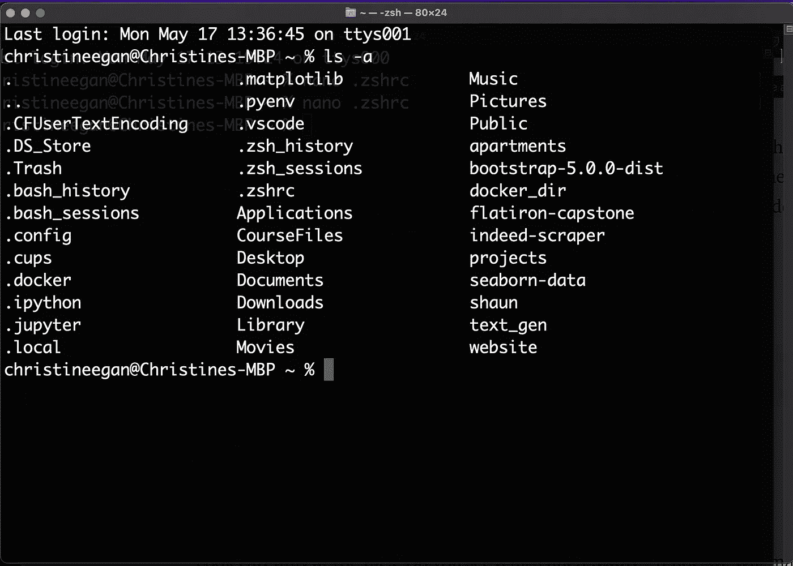
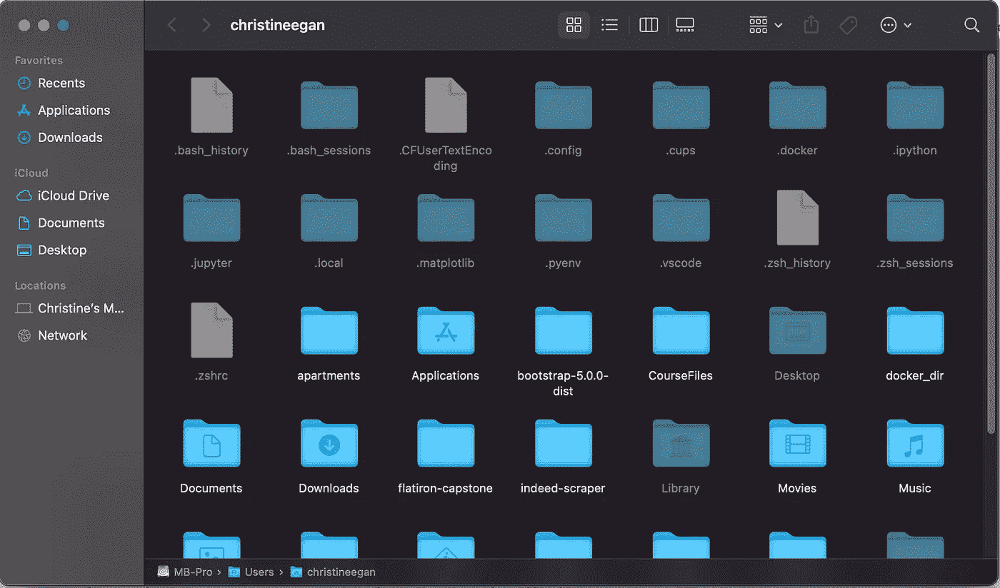
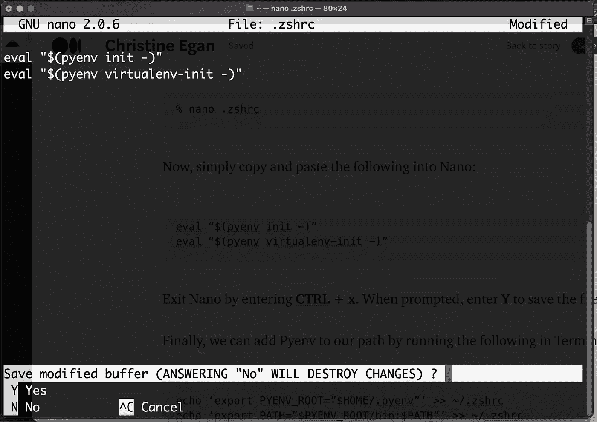

# 为 Python 数据科学项目创建虚拟环境

> 原文：<https://towardsdatascience.com/virtual-environments-for-python-data-science-projects-on-mac-os-big-sur-with-pyenv-and-virtualenv-60db5516bf06?source=collection_archive---------15----------------------->

## 了解如何在 Mac OS Big Sur 上使用 Pyenv、Virtualenv 和 Pip 为 Python 数据科学项目创建虚拟环境


图片由 [www_slon_pics](https://pixabay.com/users/www_slon_pics-5203613/?utm_source=link-attribution&utm_medium=referral&utm_campaign=image&utm_content=2261021) 来自 [Pixabay](https://pixabay.com/?utm_source=link-attribution&utm_medium=referral&utm_campaign=image&utm_content=2261021)

如果你以前使用过 Python，你可能会遇到一种被称为“依赖地狱”的情况。有些包依赖于其他包才能工作。有时候，另一个包所依赖的包必须是某个版本。稍后，您可能需要使用该包的不同版本，因为还有另一个包依赖于该包是另一个版本。避免依赖地狱和创建专业项目的有效方法是使用虚拟环境。

虚拟环境就像是你的项目的一个小胶囊，在一个地方包含了所有合适的包，合适的版本。这使得您可以轻松地从一个项目切换到另一个项目。它还能让其他人在以后复制它。有不同的虚拟环境包，但我喜欢用 [Pyenv](https://github.com/pyenv/pyenv) 。

在本教程中，我将解释如何结合使用 Pyenv、Virtualenv 和 Pip 来管理 mac OS Big Sur 上的虚拟环境。对于 Linux，这些指令可能也是类似的。如果你有 Windows，你可以在这里了解更多关于如何使用 Pyenv 和 Windows [的信息。](https://github.com/pyenv-win/pyenv-win)

*注:这款 tutoria* *l 有一个* [*存档版本供卡特琳娜用户使用。主要区别在于，对于 Catalina 用户，基于我的个人偏好，我建议使用 Bash。然而，Zsh 现在是 Big Sur 的默认 shell，使用 Bash 完成这种设置的典型过程在 Big Sur 上是无效的。*](https://christineegan42.medium.com/creating-a-virtual-environment-for-python-projects-with-homebrew-pip-and-pyenv-i-9f423d16ddb)

# 一、用自制软件安装 Pyenv

根据他们的口号，家酿是“mac OS 和 Linux 缺失的软件包管理器。”要查看您是否已经有了[自制软件](https://brew.sh/)，请输入:

```
% brew update
```

**新手注意:** *在跟随这些教程时，不需要输入百分号(%)。它应该已经为你准备好了。当您在教程的代码片段中看到* ***百分号(%)*** *或* ***美元符号($)*** *时，这通常表示该代码片段应该在命令行中输入(在终端中)。百分号表示终端使用的语言是 Zsh，美元符号表示语言是 Bash。* [*查看这篇文章，了解更多关于*](https://www.educba.com/zsh-vs-bash/) *的差异。*



准备好接受命令的终端窗口示例。

如果显示您没有自制软件，我建议您阅读本[教程](https://christineegan42.medium.com/general-setup-for-data-science-projects-in-python-with-macos-big-sur-65784fc20231)以确保您正确设置完成这些说明。

现在，我们可以用自制软件安装 Pyenv。

```
% brew install pyenv
```

我知道这看起来有点太容易了，所以这就是问题所在。有一个特殊的文件，你需要访问，使这实际工作。作为一个初学者，我总是发现这部分很难，所以我把它分成了几个小部分。对于一个更高级的用户来说，这种解释可能有点过于具体，但是为了初学者的缘故，我尽量做得具体一些。

# 二。创造。zshrc

您需要访问的文件称为**。zshrc** 。注意**点**(。)在最前面。当您在文件名前面看到一个点时，这意味着该文件是一个隐藏文件。

当我们启动终端时，我们是从我们的主目录开始的。您的主目录通常被命名为您的用户名。要查看主目录中的文件，您可以键入命令 **ls** 。然而，如果你想看到隐藏的文件，你需要添加参数 **-a** 。

输入以下内容:

```
% ls -a
```

将出现所有文件的列表，包括隐藏文件。



显示机密文件的 Mac OS 个人目录

仔细看文件。你看到一个叫**的文件了吗？zshrc** ？如果不行，我们一起努力。选择下面两种方法之一来创建此文件。

## 选项 1:创建。带文本编辑(或任何文本编辑器)的 zshrc

去创造。zshrc 使用任何文本编辑器应用程序，只需在 Finder 中打开您的主目录。

接下来，输入**命令+ Shift +。**显示秘密文件。



显示秘密文件的 Mac OS Big Sur 个人文件夹。

如果你看不见。zshrc，打开文本编辑器，将下面几行粘贴到一个新文档中。

```
eval “$(pyenv init -)”
eval “$(pyenv virtualenv-init -)”
```

在您的主目录中将文件保存为. zshrc。

## 选项 2:创建。末端为纳米的 zshrc

MAC 电脑装有一个轻型文本编辑器，你可以在名为 **Nano** 的终端中访问它。要打开 Nano，只需输入:

```
% nano .zshrc
```

该命令表示您希望运行程序 Nano。zshrc 是我们将要创建的文件的名称。如果已经创建了该文件或任何文件，Nano 将打开具有该名称的现有文件，而不是创建新文件。

现在，只需将以下内容复制并粘贴到 Nano 中:

```
eval “$(pyenv init -)”
eval “$(pyenv virtualenv-init -)”
```

输入 **CTRL + x.** 退出 Nano，出现提示时，输入 **Y** 保存文件。



Mac OS Big Sur 终端中的纳米文本编辑器

# 三。将 Pyenv 添加到路径

最后，我们可以通过在主目录的终端中运行以下命令，将 Pyenv 添加到我们的路径中

```
echo ‘export PYENV_ROOT=”$HOME/.pyenv”’ >> ~/.zshrc
echo ‘export PATH=”$PYENV_ROOT/bin:$PATH”’ >> ~/.zshrc
```

这会将 Pyenv 添加到您的路径中，以便您可以在命令行中使用 Pyenv 命令。

# 四。使用 Pip 安装 Virtualenv

下一步是安装 [Virtualenv](https://pypi.org/project/virtualenv/) 与 Pyenv 一起使用来管理我们的虚拟环境和后续依赖项。

使用以下命令调用 Pip 来安装 Virtualenv。

```
% pip3 install virtualenv
% pip3 install virtualenvwrapper
% brew install pyenv-virtualenv
```

# 四。我们做了什么？

1.更新了家酿并安装了 Pyenv
2。在我们的主文件夹中显示秘密文件。
3。使用 nano 找到和/或创建了. zshrc 文件。
4。将 Pyenv 添加到我们的路径中，这样我们就可以在命令行中使用它。
5。已安装 virtualenv、virtualenvwrapper 和 pyenv-virtualenv。
6。将 pyenv 和 virtualenv 正确配置到我们的 shell 中。

# 动词 （verb 的缩写）下一步是什么？

在下一篇教程[Jupyter 笔记本入门](https://christineegan42.medium.com/jupyter-notebooks-i-getting-started-with-jupyter-notebooks-f529449797d2)中，我将向您展示如何为您的项目创建一个独特的虚拟环境，并安装一些最流行的数据科学包，如 Jupyter 笔记本和 Pandas。